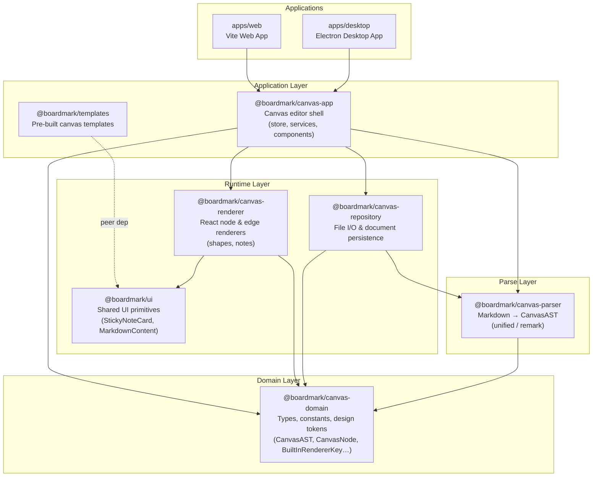
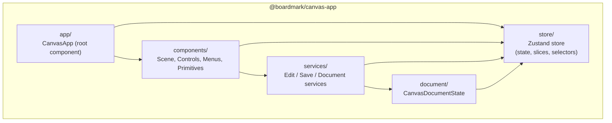
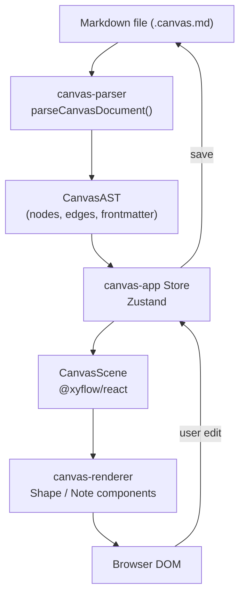

# Boardmark Architecture

## Package Dependency Layers

## Internal Structure: `canvas-app`

## Data Flow

## Package Summary

| Package | Role | Key Exports |
|---|---|---|
| `canvas-domain` | Types & design tokens — no runtime deps | `CanvasAST`, `CanvasNode`, `CanvasEdge`, `BuiltInRendererKey` |
| `canvas-parser` | Markdown → AST | `parseCanvasDocument()` |
| `canvas-renderer` | AST → React components | Shape & Note renderers |
| `canvas-repository` | File persistence bridge | `createCanvasMarkdownDocumentRepository()`, `BoardmarkDocumentBridge` |
| `ui` | Shared UI components | `StickyNoteCard`, `MarkdownContent` |
| `canvas-app` | Editor shell (store + services + UI) | `CanvasApp`, `createCanvasStore` |
| `templates` | Pre-built canvas content | `CalendarTemplate`, template registry |
| `apps/web` | Web entry point (Vite) | — |
| `apps/desktop` | Desktop entry point (Electron) | — |
