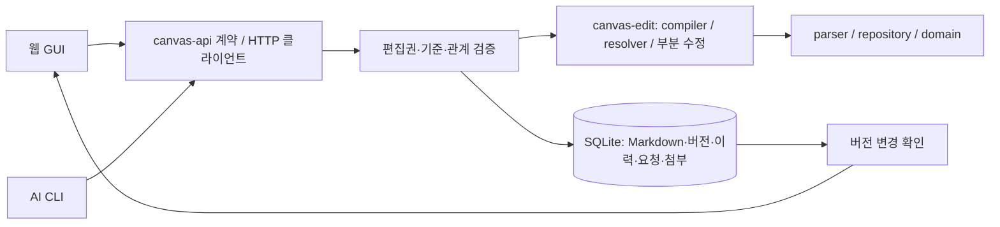

# Boardmark Architecture

기본 제품은 DB 관리 웹 모드다. 기존 파일 모드와 저장 소유권을 분리한다. 이유와 보존 범위는 [DB Markdown API 설계](db-markdown-api.md), 실행·복구는 [운영 안내](../operations/db-workspace.md)를 따른다.

```mermaid
flowchart LR
  Web[웹 GUI] --> API[canvas-api 계약 / HTTP 클라이언트]
  CLI[AI CLI] --> API
  API --> Server[편집권·기준·관계 검증]
  Server --> Edit[canvas-edit: compiler / resolver / 부분 수정]
  Edit --> Parser[parser / repository / domain]
  Server --> DB[(SQLite: Markdown·버전·이력·요청·첨부)]
  DB --> Changes[버전 변경 확인]
  Changes --> Web
```

서버의 짧은 SQLite 트랜잭션 안에서 최신 원문 조회, 대상·관계 검증, 부분 수정, 원문·버전·이력·요청 결과 저장을 끝낸다. 그 뒤 성공을 응답한다. 장시간 편집은 DB 트랜잭션이 아니라 만료 가능한 편집권으로 보호한다.

## 모듈 경계

| 경로 | 책임 |
|---|---|
| packages/canvas-domain | 도메인 타입과 기본 포맷 계약 |
| packages/canvas-parser | 원문에서 AST와 source range 파생 |
| packages/canvas-repository | 원문 레코드와 파일 호환 어댑터 |
| packages/canvas-edit | GUI/store 없는 편집 명령·compiler·resolver·부분 수정 |
| packages/canvas-api | 공통 API 계약·런타임 검증·HTTP 클라이언트 |
| apps/server | SQLite의 유일한 작성자, 편집권·기준·요청 중복 검증, 첨부 |
| apps/cli | API 호출·파일 입출력·요청 기록·JSON 결과 |
| apps/web/src/managed-session.ts | 웹 저장·초안·자동 편집권·재동기화 |
| packages/canvas-app | store·편집기·React Flow·공통 주변 UI |
| packages/canvas-renderer, packages/ui | 파생 객체와 콘텐츠 렌더링 |
| apps/desktop, apps/vscode | 독립 파일 문서의 호환 셸 |

기존 canvas-app/services/edit-* 경로는 이동한 편집 계약의 호환 export를 유지한다. 서버와 CLI는 GUI/store를 import하지 않는다. 웹은 주입한 편집 서비스로 서버 명령을 호출하며 연결 실패를 파일 저장으로 우회하지 않는다.

## 상태와 변경 전달

서버 Markdown과 버전만 확정 상태다. selection·viewport·드래그/리사이즈 미리보기·편집 초안은 로컬 상태다. 활성 편집기를 유지한 채 다른 객체의 확정 변경을 파생 모델에 반영한다.

1.5초마다 작은 버전·편집 중 상태를 조회하고 버전이 높아졌을 때 원문을 읽는다. 같은 버전·자신의 저장 응답·늦은 응답은 중복 적용하지 않는다. 중간 알림 유실은 다음 조회로 복구된다. 초기에는 변경 때 전체 원문을 받으며 객체별 delta 전송은 후속 최적화다.

## 파일 호환 모드

desktop bridge와 VS Code extension host의 TextDocument는 자신이 연 파일만 저장한다. 서버 DB 문서 ID에 대한 파일 locator를 만들지 않는다. DB에서 내보낸 .md를 VS Code로 수정하면 사본이 바뀔 뿐 DB는 바뀌지 않는다. 다시 가져오기는 새 DB 문서를 만든다.
