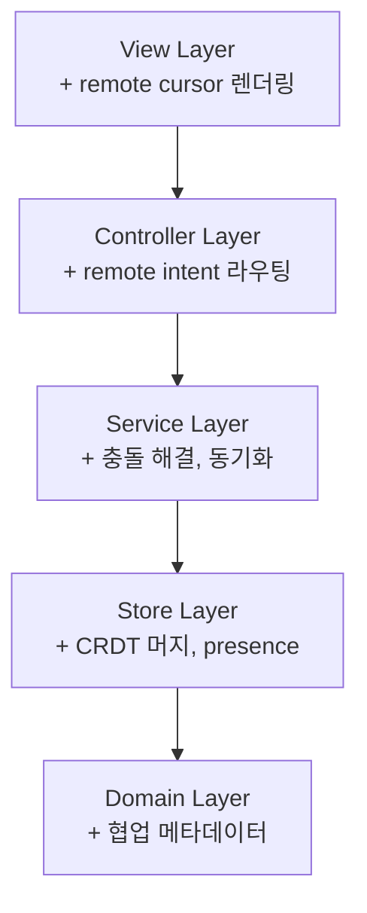
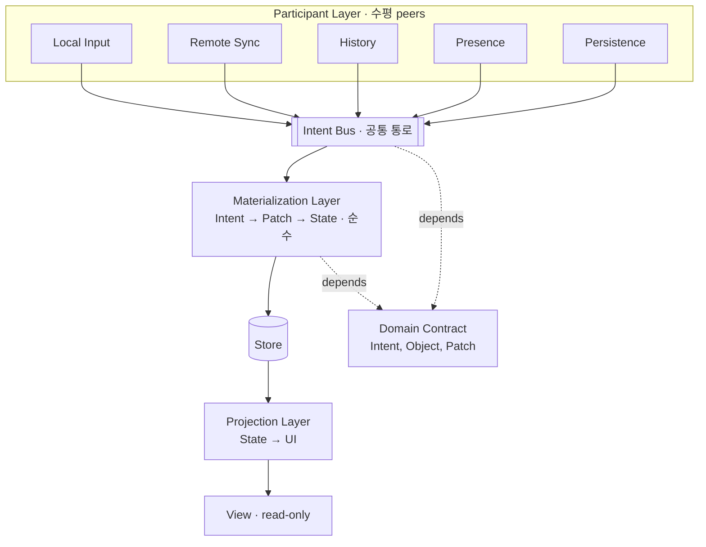
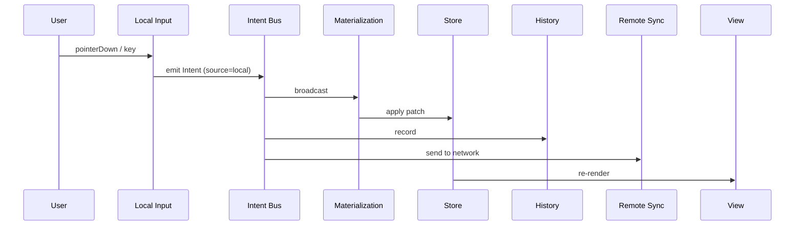
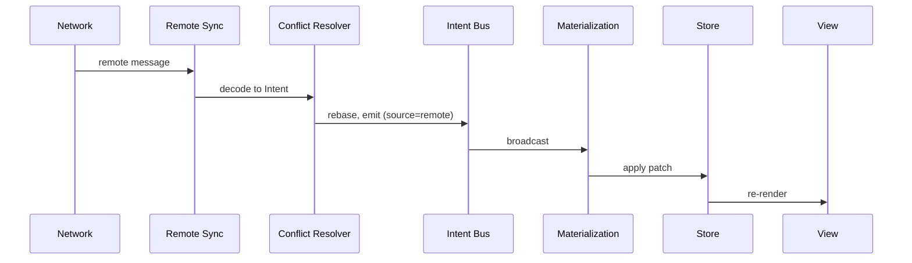
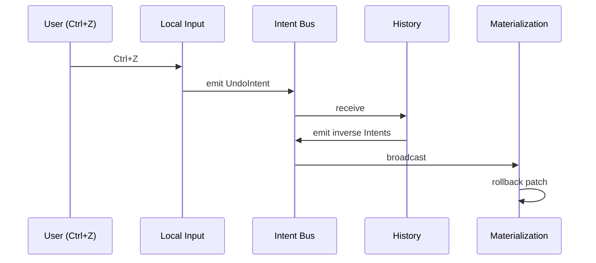
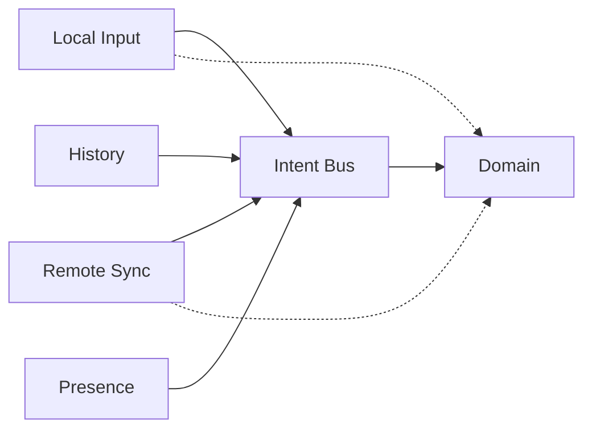
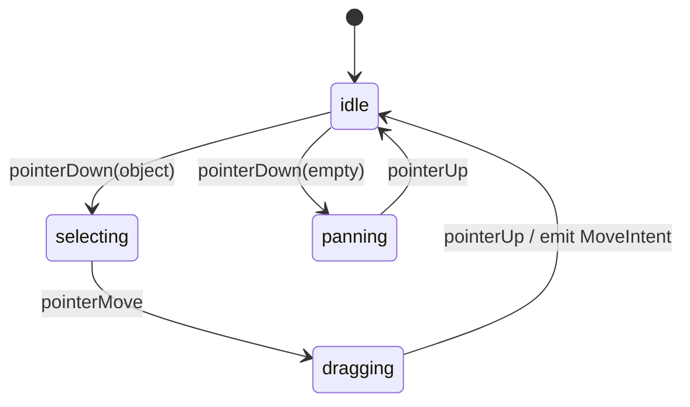
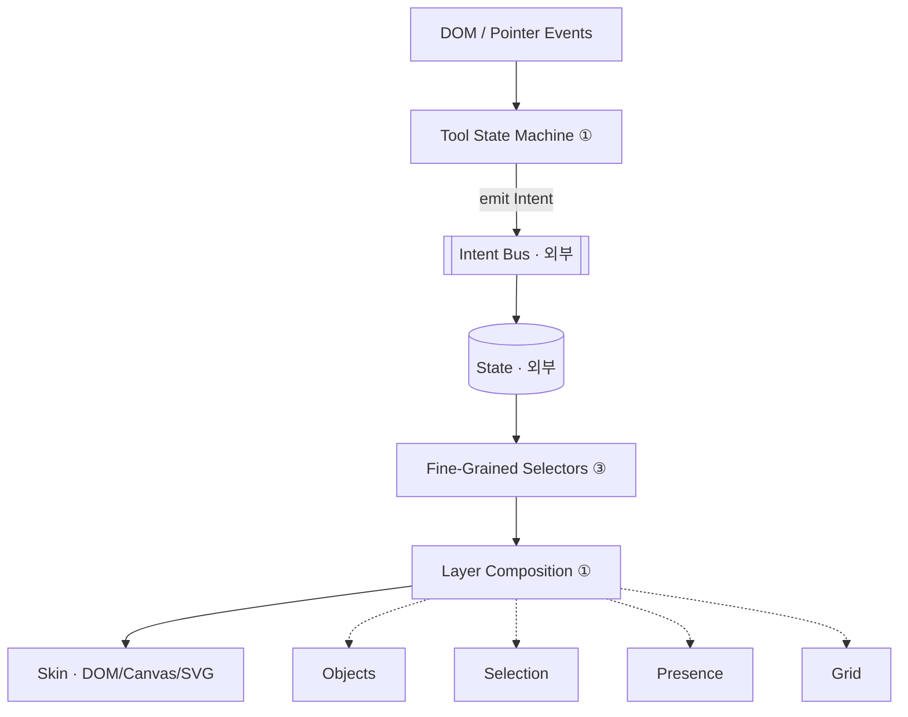

# 캔버스 앱 수평 협업 아키텍처

Intent Bus를 수평 축으로 삼아, 협업(로컬/원격/히스토리/프레즌스/AI)이 서로를 간섭하지 않도록 프론트엔드를 설계하는 방법과, 이 아키텍처와 맞물리는 프레젠테이션 디자인 패턴을 정리한 문서.

---

## 1. 문제: 수직 레이어가 협업을 관통할 때

전형적인 수직 구조에서 협업 기능을 추가하면 **모든 레이어를 관통하는 cross-cutting concern**이 됩니다.



협업 기능 하나가 **5개 레이어를 동시에** 건드립니다. 팀은 레이어 경계로 나뉘는데 기능은 레이어를 가로지르니, 협업 팀과 편집 팀이 같은 파일을 놓고 충돌합니다. 이게 수직 구조의 근본 한계입니다.

---

## 2. 해법: Intent를 수평 협업 계약으로

협업을 "레이어 위에 얹는 층"이 아니라 **"같은 층의 동료"**로 취급합니다. 모든 협업자는 `EditIntent`라는 공통 언어로만 소통하고, 서로를 직접 알지 못합니다.



**핵심**: Participant들은 서로를 모릅니다. Bus와 Domain Contract만 바라봅니다.

---

## 3. 레이어 모델

### 3.1 레이어별 역할과 경계

| Layer | 역할 | 의존 | source 인지 |
|---|---|---|---|
| **Domain Contract** | `EditIntent`, `Object`, `Patch` 타입 | 없음 | — |
| **Intent Bus** | Intent 전달 + source 태깅 (`local`/`remote`) | Domain | source만 태그, 의미는 모름 |
| **Materialization** | Intent → Patch → State (순수, 결정론적) | Domain | 모름 |
| **Participant** | 각 슬라이스의 책임 실행 | Bus, Domain | 자신만 |
| **Projection** | State → UI 모델 | Store (read) | 모름 |
| **View** | UI 모델 → DOM/Canvas | Projection | 모름 |

### 3.2 Participant별 책임

| Participant | 역할 | Bus와의 관계 |
|---|---|---|
| **Local Input** | 사용자 입력 → Intent | Publish |
| **Remote Sync** | 네트워크 ↔ Intent | Publish + Subscribe |
| **History** | Intent 기록, undo/redo | Subscribe + Publish(역 Intent) |
| **Presence** | 커서/선택 broadcast | Subscribe (state 읽기) |
| **Persistence** | Intent/State 저장 | Subscribe |
| **Conflict Resolver** | Remote Intent 정규화 | Bus 앞단에 위치 |

---

## 4. 레이어 간 흐름

### 4.1 로컬 편집



### 4.2 원격 편집



**핵심 관찰**: 로컬이든 원격이든 Materialization은 **같은 경로**를 밟습니다. 차이는 Bus의 `source` 태그뿐.

### 4.3 Undo



History는 Store를 직접 수정하지 않습니다. **역 Intent를 Bus에 emit**할 뿐입니다.

---

## 5. 수평성 보장 메커니즘

### 5.1 의존성 차원



Participant 간 엣지가 **없습니다**. 방사형 의존 그래프.

### 5.2 팀 차원

- 협업 팀 → `Remote Sync` Participant만 작업
- 히스토리 팀 → `History` Participant만 작업
- 입력 팀 → `Local Input` Participant만 작업

각 팀은 Intent 계약만 지키면 **독립 릴리즈** 가능.

### 5.3 기능 확장 차원

새 기능(실시간 주석, AI 제안, 녹화 재생, 자동화 봇)은 **새 Participant 추가**로 끝납니다. 기존 레이어 수정 없음.

### 5.4 수직 vs 수평 비교

| 기준 | 수직 레이어 | 수평 레이어 |
|---|---|---|
| 협업 추가 비용 | 5개 레이어 수정 | Participant 1개 추가 |
| 팀 경계 | 레이어별 (기능은 교차) | Participant별 (기능별 분할) |
| 원격/로컬 분기 | 곳곳에 산재 | Bus source 태그 1곳 |
| 테스트 경계 | Store + Service 전체 mock | Intent 입출력만 검증 |
| 오프라인 전환 | 협업 코드 제거 난이도 높음 | Remote Sync 분리 해제 |
| 새 Intent 소스 (AI 등) | 여러 층 확장 | Participant 추가 |

---

## 6. 프레젠테이션 디자인 패턴

수평 협업 아키텍처와 맞물리는 프레젠테이션 패턴.

### 6.1 프레젠테이션의 고유 과제

폼 기반 앱과 본질적으로 다릅니다:

- **이질적 객체 수백 개** (텍스트/도형/이미지/노트/표)
- **z-ordering과 오버레이 합성** (그리드·선택 핸들·원격 커서가 겹침)
- **도구 모드**에 따라 같은 포인터 이벤트의 의미가 달라짐
- **드래그 중 60fps** 요구
- **다중 렌더 타깃** (DOM/SVG/Canvas/WebGL)

일반적인 MVC/MVVM으로는 이 과제들이 깔끔하게 분리되지 않습니다.

### 6.2 필수 패턴 4가지

#### ① Layer Composition (레이어 합성)

캔버스를 **z-ordered 독립 레이어의 합성**으로 봅니다.

```
┌─ UI Chrome          (메뉴, 플로팅 툴바)
├─ Remote Presence    (타인 커서/선택)
├─ Local Selection    (선택 핸들, 바운딩 박스)
├─ Interaction Guide  (스냅, 드래그 미리보기)
├─ Objects            (문서 본체)
└─ Grid / Background
```

각 레이어는 **독립 state slice 구독**, **독립 재렌더 사이클**, **상호 의존 없음**.

→ 원격 커서가 움직여도 Objects 레이어는 한 프레임도 재렌더되지 않습니다.

#### ② Tool State Machine (도구 상태 기계)

도구는 상태이고, 포인터 이벤트의 의미는 상태마다 달라집니다.



State Machine은 **Intent만 emit**합니다. Store를 직접 수정하지 않음.

→ 중첩된 `if (isDragging && isSelecting && !isPanning)` 분기가 상태 전이로 명시화.

#### ③ Fine-Grained Observer (슬라이스 구독)

```
ObjectNode(id)    ─ subscribe → state.objects[id]
SelectionOverlay  ─ subscribe → state.selection
RemoteCursor(u)   ─ subscribe → state.presence[u]
Viewport          ─ subscribe → state.viewport
```

구독 단위 = 렌더 단위. 한 객체의 이동이 다른 객체의 재렌더를 유발하지 않음.

#### ④ Intent Emitter (View는 write 금지)

프레젠테이션의 **근본 규칙**: View는 state를 수정하지 않습니다. Intent만 emit.

```
ObjectNode.onDrag(Δ) → emit MoveIntent(id, Δ) → Bus
```

→ 로컬/원격/undo/AI가 모두 같은 경로. Section 2의 Bus와 자연스럽게 결합.

### 6.3 상황별 패턴

| 패턴 | 언제 쓰나 | 쓰지 말아야 할 때 |
|---|---|---|
| **Visitor / Type Dispatch** | 10+ 객체 타입 × 여러 연산 | 타입 3~5개면 switch로 충분 |
| **Viewport Culling** (spatial index) | 객체 1000+, 프레임 드랍 | 100개 미만 |
| **Flyweight** | 폰트/아이콘/스타일 공유 | 자원 소수거나 객체당 고유 |
| **Headless + Skin 분리** | 테스트/export/다중 렌더러 | 단일 DOM 렌더러로 끝낼 때 |
| **Decorator (Selection Overlay)** | 선택/호버/포커스 오버레이 | 스타일만이면 CSS 조건부 |

`RULE.md` 원칙: **현재 비용을 줄일 때만 도입.** 미래 확장성만을 이유로 넣지 말 것.

### 6.4 안티패턴

| 안티패턴 | 증상 | 대안 |
|---|---|---|
| **Fat Controller** | 이벤트 → 분기 → Store 직접 수정이 한 파일 | Tool State Machine + Intent Emitter |
| **God ViewModel** | Domain 전체를 한 곳에서 변환 | Fine-Grained Selector |
| **Imperative + Declarative 혼재** | `canvas.drawRect()` 호출과 state-driven 렌더가 섞임 | Skin 레이어로 imperative 격리 |
| **Singleton Store Import in View** | 테스트/재사용 붕괴 | 주입 (prop, context boundary) |
| **View 간 EventBus 통신** | 숨은 의존성 그래프 | 모든 소통은 Intent Bus 경유 |

### 6.5 조합 다이어그램



Write path(TSM → Bus)와 Read path(State → Selector → Layer)가 완전히 분리. **순환 없음**.

---

## 7. 이 프로젝트에 매핑

### 7.1 아키텍처 레이어

| 레이어 | 현 상태 | 필요 조치 |
|---|---|---|
| Domain Contract | `EditIntent`, `CanvasObject*` 존재 | ✅ 그대로 사용 |
| Materialization | `edit-transaction-resolver` 분리됨 | ✅ 순수성 유지 |
| Projection | `canvas-store-projection` 존재 | ✅ 그대로 |
| Conflict Resolver | `canvas-conflict-service` 존재 | ✅ Bus 앞단 배치 |
| **Intent Bus** | 명시적 레이어 없음 | ⚠️ 추가 필요 |
| History Participant | `canvas-history-service` | ⚠️ Bus 구독자로 재배치 |
| Remote Sync Participant | 없음 | ⚠️ 신규 |
| Presence Participant | 없음 | ⚠️ 신규 |

### 7.2 프레젠테이션 패턴

| 패턴 | 현 위치 | 상태 |
|---|---|---|
| Intent Emitter | `input/` | ✅ |
| Selector | `store/canvas-selectors.ts` | ✅ |
| Projection | `canvas-store-projection.ts` | ✅ |
| Scene Graph (Skin) | `components/` | ✅ |
| **Tool State Machine** | 명시적 분리 없음 | ⚠️ |
| **Layer Composition** | 명시적 분리 없음 | ⚠️ |

### 7.3 가장 효과 큰 개선 지점

1. **Intent Bus를 명시적 레이어로 승격** — 나머지 서비스가 자연스럽게 Participant로 재배치됨
2. **Tool State Machine 분리** — 입력 처리의 중첩 분기 제거
3. **Layer Composition 명시화** — 원격 커서/선택 오버레이가 문서 본체 재렌더를 유발하지 않게

---

## 한 줄 요약

> **협업을 레이어 위에 얹지 말고, Intent 축을 중심으로 레이어를 평탄화하라.**
>
> 프레젠테이션은 `Layer Composition + Tool State Machine + Slice Subscription + Intent Emit` 4개 기둥으로 이 축에 결합된다.

Intent 계약만 지키면 원격 사용자, AI, 자동화 봇, 녹화 재생 등 어떤 새 협업자도 **기존 레이어를 건드리지 않고** 수평으로 추가됩니다.
