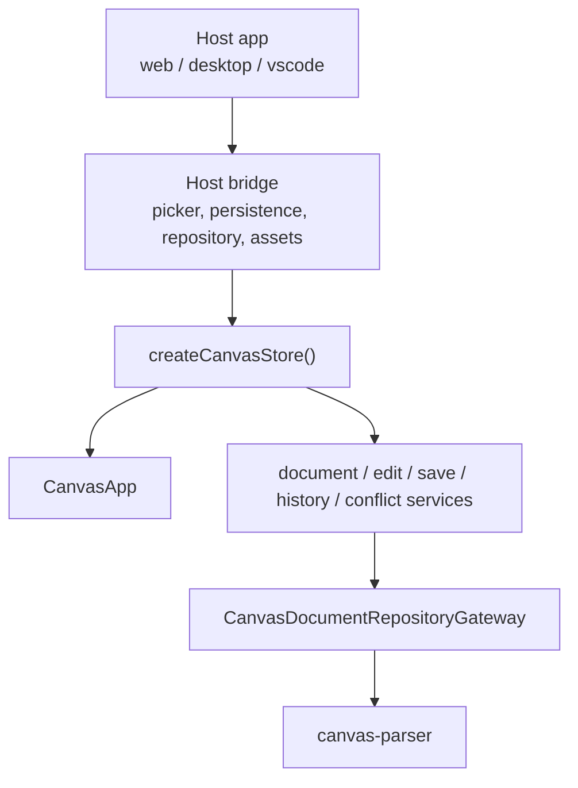
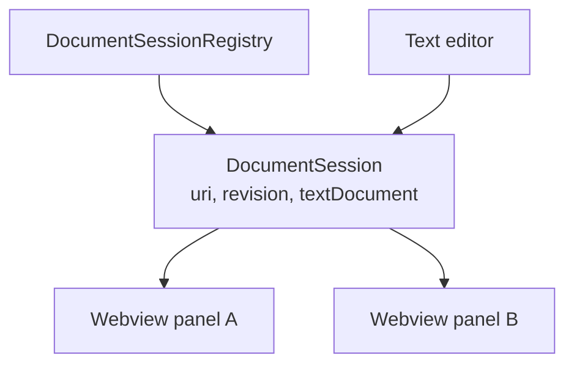

# VS Code Extension Host Integration

| 항목 | 내용 |
|---|---|
| 상태 | Draft |
| 작성일 | 2026-05-19 |
| 대체 문서 | `docs/architecture/vscode-extension/README.md`, `docs/features/extension/vscode-extension-implementation-plan.md` |
| 관련 코드 | `apps/vscode`, `packages/canvas-app`, `packages/canvas-repository`, `packages/canvas-parser` |

이 문서는 현재 코드베이스 기준으로 VS Code extension을 다시 설계한다.

과거 문서는 `.canvas.md` 전용 viewer MVP를 전제로 했다. 현재 코드는 그 단계를 넘어섰다. `canvas-app`은 이미 shared editor shell, source patch 기반 편집, 저장 서비스, conflict state, history, WYSIWYG body editing, image asset bridge, export bridge를 가진다.

따라서 VS Code extension의 목표는 새 editor를 만드는 것이 아니다.

목표는 **VS Code가 선택한 Boardmark markdown 문서를 기존 `CanvasApp`으로 편집하게 하는 host integration**이다.

---

## 1. 현재 전제

### 1.1 파일 전제

Boardmark 문서는 이제 전용 확장자에 묶지 않는다.

- 기본 저장 이름은 `untitled.md`다.
- web/desktop shell은 `.md`를 Boardmark 문서 후보로 받아들인다.
- 파서는 파일 확장자가 아니라 frontmatter로 Boardmark 문서를 판별한다.

Boardmark 문서의 최소 판별 조건은 source가 아래 frontmatter 계약을 만족하는 것이다.

```md
---
type: canvas
version: 2
---
```

`.canvas.md`는 레거시 호환 이름으로 읽을 수 있지만, VS Code extension의 1차 제품 전제는 `.md` 기반 Boardmark 문서다.

### 1.2 앱 전제

현재 `CanvasApp`은 host-neutral editor shell이다.



VS Code extension은 이 구조에서 `Host`와 `Bridge`만 담당한다. `canvas-app`, parser, renderer, edit service를 extension 전용으로 복제하지 않는다.

---

## 2. 핵심 결정

### 2.1 CustomTextEditorProvider는 유지한다

VS Code 안에서 한 문서를 텍스트와 캔버스로 함께 다루려면 `CustomTextEditorProvider`가 여전히 맞다.

이유:

- VS Code `TextDocument`와 직접 연결된다.
- undo/redo, dirty state, save lifecycle을 VS Code가 소유한다.
- 같은 `.md` 파일을 text editor와 Boardmark canvas로 동시에 열 수 있다.
- canvas edit 결과를 `WorkspaceEdit`으로 반영할 수 있다.

단, custom editor selector를 모든 markdown의 기본 editor처럼 쓰면 안 된다.

VS Code extension은 `.md` 전체를 가로채지 않고, 사용자가 명시적으로 선택한 문서를 Boardmark canvas로 연다.

### 2.2 Source of Truth는 VS Code TextDocument다

VS Code extension 환경의 단일 진실 원천은 `TextDocument`다.


webview는 파일에 직접 쓰지 않는다. canvas edit이 source를 바꾸면 extension host가 `WorkspaceEdit`으로 `TextDocument`를 갱신한다. 이후 실제 disk write는 VS Code save lifecycle이 수행한다.

### 2.3 Save는 "파일 write"가 아니라 "TextDocument save"다

web/desktop shell의 save bridge는 파일 시스템에 직접 쓴다. VS Code shell에서는 다르다.

- canvas commit: `WorkspaceEdit`으로 `TextDocument` 수정
- dirty 표시: VS Code가 관리
- Save 버튼: 현재 문서에 대해 VS Code save command 실행
- disk write: VS Code save lifecycle이 처리

즉 VS Code bridge의 persistence는 `fs.writeFile` 래퍼가 아니라 `TextDocument`와 VS Code command lifecycle 어댑터다.

---

## 3. 진입 UX

### 3.1 기본 진입

첫 구현은 명시 진입을 기준으로 한다.

- command: `Boardmark: Open as Canvas`
- 대상: 현재 active editor의 markdown 문서
- 조건: source가 Boardmark frontmatter를 만족해야 함
- 실패: Boardmark 문서가 아니면 명확한 오류 메시지 표시

이 방식은 일반 `.md` 문서와 충돌하지 않는다.

### 3.2 Custom editor selector

`*.md` 전체를 default custom editor로 등록하지 않는다.

권장 방향:

- activation: `onCommand:boardmark.openAsCanvas`, `onCustomEditor:boardmark.canvasEditor`
- selector: markdown에 대해 option 수준으로 노출하거나, command 기반 openWith를 우선한다.
- 기존 `*.canvas.md` selector는 레거시 호환으로만 남길 수 있다.

핵심은 “확장자가 아니라 사용자의 명시 선택과 frontmatter validation”이다.

---

## 4. VS Code Bridge 책임

VS Code bridge는 `CanvasStoreOptions`가 요구하는 host 기능을 구현한다.

| CanvasApp 계약 | VS Code 구현 책임 |
|---|---|
| `documentRepository.readSource` | `TextDocument.getText()` 또는 전달받은 source를 repository로 정규화 |
| `documentRepository.save` | 직접 disk write 금지. 필요하면 `WorkspaceEdit` 후 VS Code save로 연결 |
| `documentPicker` | VS Code open dialog 또는 active editor URI 선택 |
| `documentPersistenceBridge.openDocument` | 명시 open command와 연결. webview 내부 file picker UX는 초기에는 비활성화 가능 |
| `documentPersistenceBridge.saveDocument` | `WorkspaceEdit`으로 TextDocument를 갱신하고 VS Code save를 호출 |
| `subscribeExternalChanges` | `workspace.onDidChangeTextDocument`를 source sync로 변환 |
| `imageAssetBridge` | workspace URI 기준 asset import/resolve/open/reveal 처리 |
| `imageExportBridge` | VS Code save dialog와 `workspace.fs.writeFile`로 이미지 export |

bridge 구현은 `apps/web/src/document-bridge.ts`나 `apps/desktop/src/preload/index.ts`를 복사하지 않는다. 같은 계약을 만족하는 VS Code 전용 adapter를 둔다.

---

## 5. 메시지 프로토콜

현재 `apps/vscode/src/shared/protocol.ts`의 `document/sync`, `document/edit`, `document/saved`는 방향은 맞지만 현재 앱 수준에는 부족하다.

필요한 메시지는 세 층으로 나눈다.

### 5.1 문서 세션 메시지

- host -> webview: `document/session`
- host -> webview: `document/sync`
- host -> webview: `document/saved`
- webview -> host: `document/edit`
- webview -> host: `document/save`

`document/edit`은 commit된 next source를 보낸다. host는 stale revision이면 적용하지 않고 최신 sync를 다시 보낸다.

### 5.2 Request/response 메시지

CanvasApp bridge 메서드는 promise 기반이다. postMessage 위에는 correlation id가 필요하다.

- webview -> host: `request`
- host -> webview: `response`
- 필드: `id`, `method`, `payload`, `ok`, `value | error`

대상 메서드:

- image import / resolve / open / reveal
- image export save
- save-as target selection
- optional document open picker

### 5.3 Host event 메시지

- host -> webview: `theme/changed`
- host -> webview: `document/external-change`
- host -> webview: `workspace/folder-changed`

모든 inbound message는 `shared/protocol.ts`에서 검증한다. webview는 신뢰 경계 밖이다.

---

## 6. Revision과 충돌

revision은 per document session monotonic counter다.

- host는 `TextDocument` change를 볼 때마다 revision을 증가시킨다.
- webview는 마지막으로 hydrate한 revision을 edit 메시지에 싣는다.
- host는 stale revision edit을 거절하고 최신 source를 다시 보낸다.
- webview는 최신 source를 repository로 다시 정규화한다.

dirty draft와 외부 raw edit이 동시에 존재하는 상황은 `canvas-app`의 conflict state로 올린다. VS Code host는 conflict를 삼키거나 성공처럼 처리하지 않는다.

---

## 7. 다중 에디터

같은 URI를 여러 canvas editor 또는 text editor로 열 수 있다.

VS Code extension host에는 URI 단위 session registry가 필요하다.



원칙:

- revision은 URI session이 소유한다.
- 모든 panel은 같은 session source를 fan-out 받는다.
- 한 panel의 edit도 `WorkspaceEdit`을 거쳐 session 전체에 다시 sync된다.
- panel-local selection/viewport는 각 webview가 소유한다.

---

## 8. 이미지와 로컬 자산

webview는 workspace 파일을 직접 읽을 수 없다.

VS Code image asset bridge는 아래를 담당한다.

- markdown relative image path를 workspace/document URI 기준으로 resolve
- webview 표시용 URI는 `webview.asWebviewUri`로 변환
- paste/drop 이미지 import는 문서 기준 asset directory에 저장
- reveal/open은 VS Code command 또는 env API로 위임

asset directory 이름은 현재 desktop 규칙처럼 문서 basename 기반으로 둘 수 있다. 단, `.canvas.md` 제거 규칙이 primary가 되어서는 안 된다. `.md` 문서를 기준으로 동작해야 한다.

---

## 9. 현재 코드와의 차이

`apps/vscode`는 아직 과거 scaffold 상태다.

수정이 필요한 지점:

- `apps/vscode/package.json`
  - description, activation event, selector가 `.canvas.md` 전용이다.
- `apps/vscode/README.md`
  - Phase 1 placeholder 설명이 현재 제품 단계와 맞지 않는다.
- `apps/vscode/src/webview/main.tsx`
  - raw markdown `<pre>` placeholder만 렌더한다.
- `apps/vscode/src/webview/host-bridge.ts`
  - `CanvasApp` store bridge가 아니라 단순 source snapshot bridge다.
- `apps/vscode/src/extension/canvas-editor-provider.ts`
  - 전체 source replace만 다루며, 현재 `canvas-app` save/edit 계약과 아직 연결되지 않았다.
- `apps/vscode/src/extension/webview-html.ts`
  - Vite manifest 기반 asset resolution이 실제로 구현되어야 한다.

이 차이는 구현 버그라기보다 문서와 코드가 서로 다른 시점에 멈춘 결과다.

---

## 10. 구현 순서

### Step 1. 진입점 정리

- `.canvas.md` 중심 문구 제거
- `Open as Canvas` 명령을 `.md` Boardmark frontmatter 문서 기준으로 정리
- custom editor가 일반 markdown 기본 editor를 가로채지 않게 조정

### Step 2. Webview에서 CanvasApp mount

- `CanvasApp`과 `createCanvasStore`를 webview entry에 mount
- VS Code 전용 bridge skeleton을 만든다.
- capabilities는 VS Code host에 맞게 주입한다.

초기 권장 capabilities:

```ts
{
  canOpen: false,
  canSave: true,
  canPersist: true,
  canDropDocumentImport: false,
  canDropImageInsertion: true,
  supportsMultiSelect: true,
  newDocumentMode: 'reset-template'
}
```

### Step 3. TextDocument sync 연결

- host `TextDocument` -> webview `document/sync`
- webview source -> repository `readSource`
- parsed record -> store hydrate
- parse failure는 `invalidState`나 load error로 표시

### Step 4. Canvas edit -> WorkspaceEdit

- canvas commit이 만든 next source를 host로 보낸다.
- host는 revision을 확인한다.
- host는 `WorkspaceEdit`으로 현재 `TextDocument` 전체 또는 대상 range를 갱신한다.
- VS Code dirty/save lifecycle을 따른다.

초기 구현은 whole document replace여도 된다. 현재 `canvas-app`은 source patch 기반이므로, extension-host boundary에서만 전체 replace를 선택하는 것은 허용된다.

### Step 5. Asset/export bridge

- image resolve/import/open/reveal 구현
- fenced block image export save 구현
- `webview.asWebviewUri` 변환을 host에서 수행

#### 2026-05-26 slice: 이미지 resolve/open/reveal

우선순위는 상대 이미지 표시를 가장 앞에 둔다. 이유는 이 작업이 VS Code host integration 고유 책임이 크고, shared `CanvasApp`은 이미 `imageAssetBridge` 계약과 이미지 렌더링 호출 경로를 제공하기 때문이다.

이번 slice의 포함 범위:

- markdown 상대 이미지 경로를 문서 디렉터리 기준으로 resolve한다.
- `/assets/example.png`처럼 leading slash를 가진 경로는 workspace folder 기준으로 resolve한다.
- webview 표시 URI는 extension host에서 `webview.asWebviewUri`로 변환한다.
- 선택 이미지 `open` / `reveal`은 VS Code command/env API로 위임한다.
- webview `request` 응답 payload는 문자열 `src`를 명시적으로 검증한다.

이번 slice의 제외 범위:

- paste/drop image import는 문서 기준 asset directory 정책이 필요하므로 다음 slice로 둔다.
- fenced block/image export 저장은 VS Code save dialog와 workspace fs 정책을 별도 slice로 둔다.
- 다중 editor session registry와 conflict UX는 이미지 bridge와 독립된 lifecycle slice로 둔다.

### Step 6. 다중 panel/session 정리

- URI 단위 session registry
- panel fan-out
- dispose 시 session cleanup

---

## 11. 검증 기준

최소 검증:

- `.md` Boardmark 문서를 command로 canvas editor에서 열 수 있다.
- 일반 markdown 문서는 명확한 validation error를 보여주고 canvas로 열지 않는다.
- text editor에서 수정한 source가 열린 canvas에 반영된다.
- canvas에서 note body 또는 geometry를 수정하면 `TextDocument`가 dirty 상태가 된다.
- VS Code Save로 disk에 반영된다.
- undo/redo가 VS Code text lifecycle과 충돌하지 않는다.
- 같은 문서를 text editor와 canvas editor로 동시에 열어도 revision loop가 생기지 않는다.
- relative image가 webview에서 표시된다.
- image source가 workspace/document boundary 밖으로 벗어나면 성공처럼 처리하지 않고 resolve error를 표시한다.

코드 검증:

- `pnpm --filter @boardmark/vscode build`
- `pnpm vitest run apps/vscode/src/extension/markdown-image-source.test.ts`
- `pnpm typecheck`
- VS Code extension host 단위 테스트
- webview bridge 단위 테스트
- 수동 `.vsix` 설치 smoke

---

## 12. 보류

이번 문서가 바로 결정하지 않는 것:

- marketplace packaging 정책
- AI command integration
- Boardmark 문서 자동 discovery/index
- cross-file backlink UI
- live collaboration
- incremental parse fast path
- `.canvas.md` 완전 제거 시점

이 문서의 범위는 현재 `canvas-app`을 VS Code의 파일 lifecycle에 정확히 연결하는 것이다.
