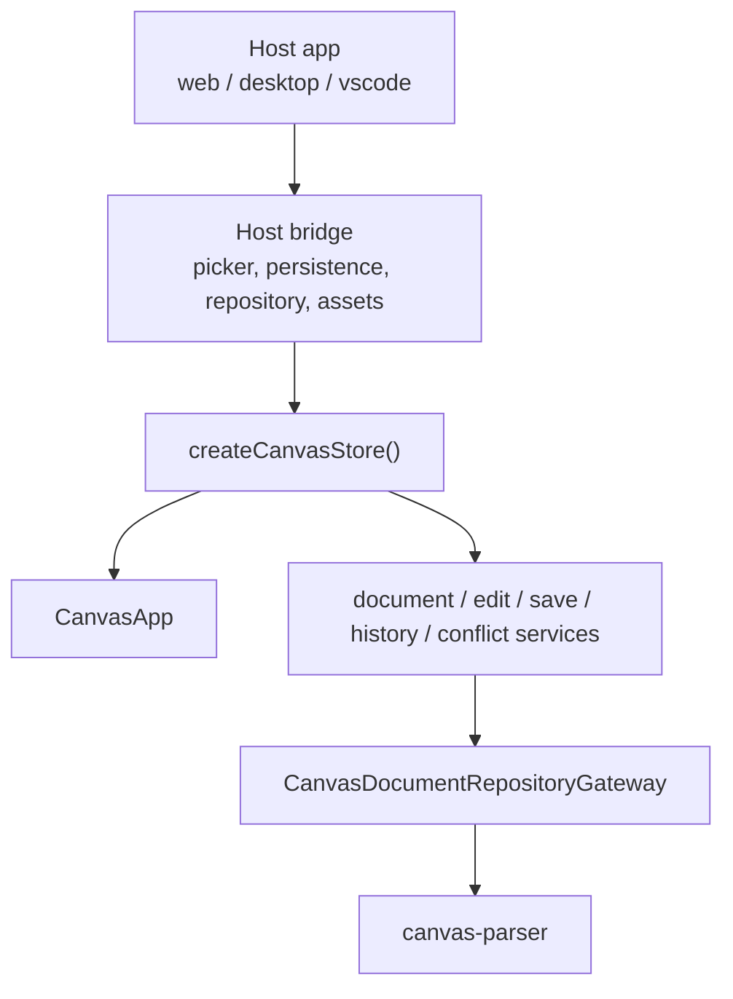
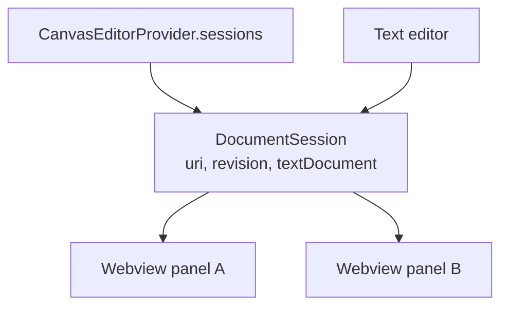

# VS Code Extension Host Integration

| 항목 | 내용 |
|---|---|
| 상태 | Draft |
| 작성일 | 2026-05-19 |
| 대체 문서 | `docs/architecture/vscode-extension/README.md`, `docs/features/extension/vscode-extension-implementation-plan.md` |
| 관련 코드 | `apps/vscode`, `packages/canvas-app`, `packages/canvas-repository`, `packages/canvas-parser` |

이 문서는 현재 코드베이스 기준으로 VS Code extension을 다시 설계한다.

과거 문서는 `.canvas.md` 전용 viewer MVP를 전제로 했다. 현재 코드는 그 단계를 넘어섰다. `canvas-app`은 이미 shared editor shell, source patch 기반 편집, 저장 서비스, conflict state, history, WYSIWYG body editing, image asset bridge, export bridge를 가진다.

따라서 VS Code extension의 목표는 새 editor를 만드는 것이 아니다.

목표는 **VS Code가 선택한 Boardmark markdown 문서를 기존 `CanvasApp`으로 편집하게 하는 host integration**이다.

---

## 1. 현재 전제

### 1.1 파일 전제

Boardmark 문서는 이제 전용 확장자에 묶지 않는다.

- 기본 저장 이름은 `untitled.md`다.
- web/desktop shell은 `.md`를 Boardmark 문서 후보로 받아들인다.
- 파서는 파일 확장자가 아니라 frontmatter로 Boardmark 문서를 판별한다.

Boardmark 문서의 최소 판별 조건은 source가 아래 frontmatter 계약을 만족하는 것이다.

```md
---
type: canvas
version: 2
---
```

`.canvas.md`는 레거시 호환 이름으로 읽을 수 있지만, VS Code extension의 1차 제품 전제는 `.md` 기반 Boardmark 문서다.

### 1.2 앱 전제

현재 `CanvasApp`은 host-neutral editor shell이다.



VS Code extension은 이 구조에서 `Host`와 `Bridge`만 담당한다. `canvas-app`, parser, renderer, edit service를 extension 전용으로 복제하지 않는다.

---

## 2. 핵심 결정

### 2.1 CustomTextEditorProvider는 유지한다

VS Code 안에서 한 문서를 텍스트와 캔버스로 함께 다루려면 `CustomTextEditorProvider`가 여전히 맞다.

이유:

- VS Code `TextDocument`와 직접 연결된다.
- undo/redo, dirty state, save lifecycle을 VS Code가 소유한다.
- 같은 `.md` 파일을 text editor와 Boardmark canvas로 동시에 열 수 있다.
- canvas edit 결과를 `WorkspaceEdit`으로 반영할 수 있다.

단, custom editor selector를 모든 markdown의 기본 editor처럼 쓰면 안 된다.

VS Code extension은 `.md` 전체를 가로채지 않고, 사용자가 명시적으로 선택한 문서를 Boardmark canvas로 연다.

### 2.2 Source of Truth는 VS Code TextDocument다

VS Code extension 환경의 단일 진실 원천은 `TextDocument`다.


webview는 파일에 직접 쓰지 않는다. canvas edit이 source를 바꾸면 extension host가 `WorkspaceEdit`으로 `TextDocument`를 갱신한다. 이후 실제 disk write는 VS Code save lifecycle이 수행한다.

### 2.3 Save는 "파일 write"가 아니라 "TextDocument save"다

web/desktop shell의 save bridge는 파일 시스템에 직접 쓴다. VS Code shell에서는 다르다.

- canvas commit: `WorkspaceEdit`으로 `TextDocument` 수정
- dirty 표시: VS Code가 관리
- Save 버튼: 현재 문서에 대해 VS Code save command 실행
- disk write: VS Code save lifecycle이 처리

즉 VS Code bridge의 persistence는 `fs.writeFile` 래퍼가 아니라 `TextDocument`와 VS Code command lifecycle 어댑터다.

---

## 3. 진입 UX

### 3.1 기본 진입

첫 구현은 명시 진입을 기준으로 한다.

- command: `Boardmark: Open as Canvas`
- 대상: 현재 active editor의 markdown 문서
- 조건: source가 Boardmark frontmatter를 만족해야 함
- 실패: Boardmark 문서가 아니면 명확한 오류 메시지 표시

이 방식은 일반 `.md` 문서와 충돌하지 않는다.

### 3.2 Custom editor selector

`*.md` 전체를 default custom editor로 등록하지 않는다.

권장 방향:

- activation: `onCommand:boardmark.openAsCanvas`, `onCustomEditor:boardmark.canvasEditor`
- selector: markdown에 대해 option 수준으로 노출하거나, command 기반 openWith를 우선한다.
- 기존 `*.canvas.md` selector는 레거시 호환으로만 남길 수 있다.

핵심은 “확장자가 아니라 사용자의 명시 선택과 frontmatter validation”이다.

---

## 4. VS Code Bridge 책임

VS Code bridge는 `CanvasStoreOptions`가 요구하는 host 기능을 구현한다.

| CanvasApp 계약 | VS Code 구현 책임 |
|---|---|
| `documentRepository.readSource` | `TextDocument.getText()` 또는 전달받은 source를 repository로 정규화 |
| `documentRepository.save` | 직접 disk write 금지. 필요하면 `WorkspaceEdit` 후 VS Code save로 연결 |
| `documentPicker` | VS Code open dialog 또는 active editor URI 선택 |
| `documentPersistenceBridge.openDocument` | 명시 open command와 연결. webview 내부 file picker UX는 초기에는 비활성화 가능 |
| `documentPersistenceBridge.saveDocument` | `WorkspaceEdit`으로 TextDocument를 갱신하고 VS Code save를 호출 |
| `subscribeExternalChanges` | `workspace.onDidChangeTextDocument`를 source sync로 변환 |
| `imageAssetBridge` | workspace URI 기준 asset import/resolve/open/reveal 처리 |
| `imageExportBridge` | VS Code save dialog와 `workspace.fs.writeFile`로 이미지 export |

bridge 구현은 `apps/web/src/document-bridge.ts`나 `apps/desktop/src/preload/index.ts`를 복사하지 않는다. 같은 계약을 만족하는 VS Code 전용 adapter를 둔다.

---

## 5. 메시지 프로토콜

`apps/vscode/src/shared/protocol.ts`가 extension host와 webview 사이의 유일한 메시지 계약이다.

메시지는 세 층으로 나눈다.

### 5.1 문서 세션 메시지

- host -> webview: `document/sync`
- host -> webview: `document/error`
- host -> webview: `document/saved`
- webview -> host: `document/edit`
- webview -> host: `document/save`
- webview -> host: `document/ready`

`document/edit`은 commit된 next source를 보낸다. host는 stale revision이면 적용하지 않고 최신 sync를 다시 보낸다.

### 5.2 Request/response 메시지

CanvasApp bridge 메서드는 promise 기반이다. postMessage 위에는 correlation id가 필요하다.

- webview -> host: `request`
- host -> webview: `response`
- 필드: `id`, `method`, `payload`, `ok`, `value | error`

대상 메서드:

- `image/import`
- `image/resolve`
- `image/open`
- `image/reveal`
- `image-export/save`
- `document/pick-open`은 protocol에 예약되어 있지만 현재 VS Code shell에서는 `canOpen: false`라 호출하지 않는다.

모든 inbound message는 `shared/protocol.ts`에서 검증한다. webview는 신뢰 경계 밖이며, request payload의 구체 검증은 해당 host request handler에서 다시 수행한다.

---

## 6. Revision과 충돌

revision은 per document session monotonic counter다.

- host는 `TextDocument` change를 볼 때마다 revision을 증가시킨다.
- webview는 마지막으로 hydrate한 revision을 edit 메시지에 싣는다.
- host는 stale revision edit을 거절하고 최신 source를 다시 보낸다.
- webview는 최신 source를 repository로 다시 정규화한다.

dirty draft와 외부 raw edit이 동시에 존재하는 상황은 `canvas-app`의 external-change 구독과 conflict state가 담당한다. VS Code host의 책임은 더 좁다.

- stale revision edit은 실패 response로 거절한다.
- 거절 직후 최신 `document/sync`를 다시 보낸다.
- `WorkspaceEdit` 실패와 save 실패는 성공처럼 보이지 않게 response error로 돌려준다.
- raw markdown parse 실패는 `document/error`로 표시한다.

---

## 7. 다중 에디터

같은 URI를 여러 canvas editor 또는 text editor로 열 수 있다.

VS Code extension host는 URI 단위 session registry를 가진다.



원칙:

- revision은 URI session이 소유한다.
- 모든 panel은 같은 session source를 fan-out 받는다.
- 한 panel의 edit도 `WorkspaceEdit`을 거쳐 session 전체에 다시 sync된다.
- panel-local selection/viewport는 각 webview가 소유한다.
- 마지막 panel이 dispose되면 session의 `TextDocument` change/save subscription도 정리한다.

---

## 8. 이미지와 로컬 자산

webview는 workspace 파일을 직접 읽을 수 없다.

VS Code image asset bridge는 아래를 담당한다.

- markdown relative image path를 workspace/document URI 기준으로 resolve
- webview 표시용 URI는 `webview.asWebviewUri`로 변환
- paste/drop 이미지 import는 문서 기준 asset directory에 저장
- reveal/open은 VS Code command 또는 env API로 위임

asset directory 이름은 현재 desktop 규칙처럼 문서 basename 기반으로 둘 수 있다. 단, `.canvas.md` 제거 규칙이 primary가 되어서는 안 된다. `.md` 문서를 기준으로 동작해야 한다.

현재 정책:

- 표시용 resolve는 document-relative, workspace-root-leading-slash, file URI, remote/data/blob source를 구분한다.
- paste/drop import는 file-backed `TextDocument`에서만 지원한다.
- import 대상은 `<document-basename>.assets/`이며 결과 `src`는 문서 상대 markdown path다.
- 같은 이름이 있으면 `name-1.ext`, `name-2.ext`처럼 충돌을 피한다.
- export save는 VS Code save dialog로 대상을 고르고 `workspace.fs.writeFile`로 쓴다.
- export cancel은 `CanvasImageExportError`의 `cancelled`로, write 실패는 `save-failed`로 돌아간다.

---

## 9. 현재 구현 상태

완료된 host integration:

- 명시적 `Boardmark: Open as Canvas` command와 markdown frontmatter validation
- shared `CanvasApp` mount와 `createCanvasStore` bridge 연결
- `TextDocument` sync, `WorkspaceEdit` edit, `TextDocument.save()` save
- URI 단위 `DocumentSession` registry, revision fan-out, stale edit reject
- image resolve/import/open/reveal bridge
- canvas/fenced-block image export save bridge
- `apps/vscode/fixtures/smoke.md`, `.vscode/launch.json`, `.vscode/tasks.json` 기반 dev host smoke

의도적으로 남긴 제약:

- remote/non-file `TextDocument`의 image import는 아직 지원하지 않는다.
- marketplace icon/gallery/publish workflow는 아직 정리하지 않았다.
- automated Extension Development Host E2E는 없다. VS Code UI 동작은 수동 smoke로 검증한다.
- webview bundle chunk size tuning은 별도 성능 작업이다.

---

## 10. Extension 전용 책임 경계

VS Code extension에 둘 수 있는 코드는 아래에 한정한다.

- VS Code command, custom editor, activation, package metadata
- `TextDocument`, `WorkspaceEdit`, `workspace.fs`, `window.showSaveDialog`, `webview.asWebviewUri`
- webview postMessage protocol adapter
- dev host launch/smoke ergonomics

아래는 extension에 복제하지 않는다.

- canvas editing semantics
- markdown parser/renderer
- WYSIWYG, selection, undo/redo, history
- fenced block rasterization/export rendering
- image node insertion logic

---

## 11. 검증 기준

최소 검증:

- `.md` Boardmark 문서를 command로 canvas editor에서 열 수 있다.
- 일반 markdown 문서는 명확한 validation error를 보여주고 canvas로 열지 않는다.
- text editor에서 수정한 source가 열린 canvas에 반영된다.
- canvas에서 note body 또는 geometry를 수정하면 `TextDocument`가 dirty 상태가 된다.
- VS Code Save로 disk에 반영된다.
- undo/redo가 VS Code text lifecycle과 충돌하지 않는다.
- 같은 문서를 text editor와 canvas editor로 동시에 열어도 revision loop가 생기지 않는다.
- relative image가 webview에서 표시된다.
- image source가 workspace/document boundary 밖으로 벗어나면 성공처럼 처리하지 않고 resolve error를 표시한다.

코드 검증:

- `pnpm --filter @boardmark/vscode build`
- `pnpm vitest run apps/vscode/src/extension/boardmark-document-validation.test.ts apps/vscode/src/shared/protocol.test.ts apps/vscode/src/extension/markdown-image-source.test.ts`
- 수동 `.vsix` 설치 smoke
- Extension Development Host smoke:
  - `pnpm --filter @boardmark/vscode watch`
  - `Boardmark VS Code Extension` launch config 실행 또는 `code --extensionDevelopmentPath="$(pwd)/apps/vscode" "$(pwd)/apps/vscode/fixtures/smoke.md"`
  - `Developer: Reload Window`
  - `Boardmark: Open as Canvas`
  - 상대 이미지 표시, export save dialog, paste/drop import, text/canvas 동시 open revision reject 확인

---

## 12. 보류

이번 문서가 바로 결정하지 않는 것:

- marketplace packaging 정책
- AI command integration
- Boardmark 문서 자동 discovery/index
- cross-file backlink UI
- live collaboration
- incremental parse fast path
- `.canvas.md` 완전 제거 시점
- remote workspace image import 정책

이 문서의 범위는 현재 `canvas-app`을 VS Code의 파일 lifecycle에 정확히 연결하는 것이다.
