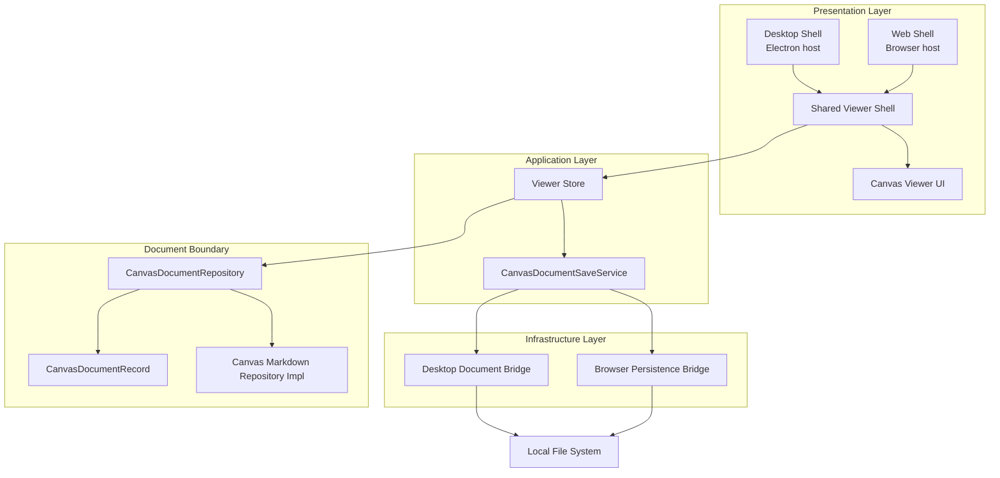
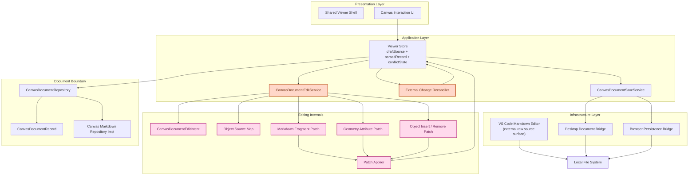

# Boardmark Bidirectional Editing PRD & Implementation Plan

## 1. 목적

이 문서는 `docs/features/browser-persistence-shell/README.md` 다음 단계인 양방향 편집을, PRD와 구현 계획을 한 파일에 함께 정리한 초안이다.

여기서 양방향 편집의 핵심은 편집 UI 기술이 아니다.  
핵심은 **canvas UI 조작을 어떻게 `.canvas.md` source patch로 바꾸고, 그 결과를 다시 repository를 통해 AST로 정규화할 것인가**다.

이 단계의 목표는 아래 세 가지다.

1. canvas에서 발생한 edit intent를 source patch로 변환한다.
2. patch된 source를 다시 `CanvasDocumentRepository`로 정규화해 다음 `CanvasDocumentRecord`를 만든다.
3. VS Code의 raw markdown 편집과 Boardmark의 canvas 조작이 같은 source-of-truth 위에서 공존하게 만든다.

---

## 2. 제품 요구사항

### 2.1 Canvas Content Editing

사용자는 canvas에서 note/edge 내용을 수정할 수 있어야 한다.

이번 단계에서 중요한 것은 편집 surface가 아니라 patch 경로다.

핵심 요구사항:

- note body를 수정할 수 있어야 한다.
- edge label body를 수정할 수 있어야 한다.
- content 변경은 AST-only 메모리 수정으로 끝나면 안 된다.
- content 변경 결과는 항상 다음 `.canvas.md` source snapshot을 만들어야 한다.
- 그 source는 다시 `CanvasDocumentRepository`를 통해 `CanvasDocumentRecord`로 정규화되어야 한다.

### 2.2 Canvas Object Geometry Editing

사용자는 canvas에서 오브젝트 위치와 크기를 조작할 수 있어야 한다.

초기 범위:

- note 이동
- note 크기 변경
- viewport 저장 대상이 아닌 interaction state와 문서 geometry를 구분

핵심 요구사항:

- drag / resize 중 preview state는 runtime interaction state로 다룬다.
- 문서 source patch는 drag end / resize end 같은 commit 시점에만 발생해야 한다.
- geometry 변경은 directive opening line의 attribute patch로 반영되어야 한다.

### 2.3 Structural Editing

추가로 아래 구조 편집을 지원해야 한다.

- note 생성 / 삭제
- edge 생성 / 삭제
- edge 연결 대상 변경

핵심 요구사항:

- 생성은 canonical directive template 삽입으로 반영한다.
- 삭제는 object source range 제거로 반영한다.
- 구조 변경도 최종적으로는 source patch 후 repository 재정규화로 반영한다.

### 2.4 VS Code Raw Editing과의 공존

raw markdown 편집은 VS Code 쪽 editing surface가 맡는다.

핵심 요구사항:

- Boardmark는 raw source panel을 따로 제공하지 않는다.
- VS Code에서 `.canvas.md`를 수정하면 Boardmark는 이를 외부 source 변경으로 받아들여야 한다.
- Boardmark의 local draft와 VS Code raw edit는 같은 file session / save pipeline 위에서 충돌 관리되어야 한다.

### 2.5 Save / Conflict Integration

양방향 편집은 저장 파이프라인과 분리될 수 없다.

핵심 요구사항:

- edit intent 결과는 기존 single-writer save service 경로를 그대로 사용해야 한다.
- dirty state는 draft source와 persisted snapshot source의 비교 결과여야 한다.
- 외부 source 변경이 들어왔는데 local draft도 dirty면 conflict 상태를 명시적으로 보여야 한다.
- canvas UI가 직접 파일 write를 수행하면 안 된다.

---

## 3. 범위

### 이번 문서에 포함

- canvas edit intent 정의
- object source map 확장
- content block patch strategy
- geometry attribute patch strategy
- create / delete patch strategy
- external source change reconcile 흐름
- save service 및 conflict 상태와의 연결

### 이번 문서에서 제외

- Boardmark 내부 raw source editor
- arbitrary markdown 전 기능 지원
- 협업 / multi-writer synchronization
- AI edit suggestion UX
- pack editor 자체
- full undo/redo history
- E2E 테스트

이 단계는 **patch pipeline foundation**을 만드는 단계다.

---

## 4. 구현 원칙

### 4.1 Source of Truth는 계속 `.canvas.md`다

- 최종 truth는 runtime UI state나 AST가 아니라 source 문자열이다.
- AST는 source에서 파생되는 validated view다.
- canvas edit도 최종적으로는 source patch 결과를 만들어야 한다.

### 4.2 최상위 아키텍처 패턴

이 단계의 최상위 패턴은 **Canonical Source + Projection**으로 고정한다.

- canonical state
  - `.canvas.md` source string
- projection
  - `CanvasDocumentRecord`
  - `CanvasStore`
  - canvas render state

핵심 읽기 경로:

`source -> Repository -> CanvasDocumentRecord -> CanvasStore -> Canvas`

핵심 쓰기 경로:

`UI -> Command -> EditService -> Patch Strategy -> Patch Applier -> Repository.readSource(...)`

충돌 처리 패턴:

- `Reconciler + State Machine`

저장 패턴:

- 기존 `Single Writer Save Service`

즉:

- 읽기는 항상 source에서 projection으로 흐른다.
- 쓰기는 항상 UI intent를 command로 만들고, patch를 거쳐 source를 다시 만든 다음 repository로 재정규화한다.
- conflict / dirty / external-changed 같은 상태는 state machine으로 명시적으로 관리한다.
- 실제 persisted write는 save service 한 곳만 통과한다.

### 4.3 Repository 경계를 유지한다

- canvas UI, store, edit service는 parser를 직접 호출하지 않는다.
- patch로 source가 바뀌면 항상 `documentRepository.readSource(...)`를 거쳐 다음 `CanvasDocumentRecord`를 만든다.
- parser / renderer / shell 경계를 다시 섞지 않는다.

### 4.4 UI Intent와 Patch 계산을 분리한다

- UI는 “무엇을 바꾸고 싶은지”만 표현한다.
- edit service는 intent를 source patch plan으로 바꾼다.
- patch applier는 실제 문자열 patch만 수행한다.
- store는 patch 결과 source를 repository에 넣고 재정규화만 담당한다.

### 4.5 Object-local Patch를 우선한다

- 작은 편집 때문에 문서 전체를 다시 stringify하지 않는다.
- 가능한 한 object 단위 local patch를 우선한다.
- whole-document rewrite는 create/delete나 source map 복구 불가 상황에서만 마지막 수단으로 둔다.

### 4.6 Runtime Interaction State와 Draft Source를 분리한다

- drag 중 좌표 preview는 runtime interaction state다.
- source patch는 commit 시점에만 발생한다.
- pointer move마다 source를 다시 쓰지 않는다.

### 4.7 실패는 숨기지 않는다

- content patch 실패는 조용히 무시하지 않는다.
- geometry patch 실패도 명시적으로 surface 한다.
- source range가 오래되어 patch를 계산할 수 없으면 오류 상태로 올린다.

---

## 5. 사용자 경험 정의

### 5.0 Interaction UX 원칙

이 단계에서는 별도의 inspector 패널을 만들지 않는다.

첫 버전의 편집 UX는 아래 원칙으로 고정한다.

- 편집은 canvas 위 직접 조작을 기본으로 한다.
- note/edge content 수정은 object 직접 진입 방식으로 한다.
- geometry 수정은 drag / resize / reconnect 같은 마우스 조작을 기본으로 한다.
- 구조 편집은 선택 상태 + 직접 연결 + 키보드 shortcut을 우선한다.
- conflict / 외부 변경 상태는 최소한의 status banner + action button으로 노출한다.

즉 첫 버전의 목표는 “풍부한 editing chrome”이 아니라  
**직관적인 마우스/키보드 중심 interaction이 실제 source patch pipeline과 일관되게 연결되는 것**이다.

### 5.1 Content Edit 흐름

사용자가 UI에서 note body나 edge label body를 수정하면:

1. UI는 content edit intent를 발생시킨다.
2. edit service가 현재 object의 body source range를 찾는다.
3. next markdown fragment를 만든다.
4. body range만 교체하는 source patch를 만든다.
5. patch된 source를 repository로 다시 정규화한다.
6. 성공하면 canvas는 새 record로 갱신된다.

첫 버전의 content editing 진입은 아래처럼 둔다.

- note 본문: note 더블클릭으로 inline editing 진입
- edge label 본문: label 더블클릭으로 inline editing 진입
- commit / cancel은 Enter, Escape, blur 같은 명확한 사용자 액션으로 처리한다

### 5.2 Geometry Edit 흐름

사용자가 note를 drag / resize 하면:

1. drag / resize 중에는 runtime preview state만 갱신한다.
2. drag end / resize end에서 geometry edit intent를 발생시킨다.
3. edit service가 opening directive line 안의 attribute 위치를 찾는다.
4. `x`, `y`, `w` 값만 최소 범위 patch로 바꾼다.
5. patch된 source를 repository로 다시 정규화한다.

첫 버전의 geometry interaction은 아래처럼 둔다.

- note move: drag end에서 commit
- note resize: resize end에서 commit
- edge reconnect: 연결 변경 commit 시 `from`, `to` patch
- drag 중에는 runtime preview만 갱신하고 source는 건드리지 않는다

### 5.3 External Raw Edit 흐름

사용자가 VS Code에서 raw `.canvas.md`를 수정하면:

1. Boardmark는 이를 외부 source 변경으로 감지한다.
2. local draft가 clean이면 즉시 reload 한다.
3. local draft가 dirty면 conflict 상태로 전환한다.
4. conflict 상태에서는 local draft 유지 또는 disk reload 중 하나를 명시적으로 선택하게 한다.

첫 버전의 conflict UX는 별도 패널이 아니라 status area의 간단한 배너/액션 버튼으로 처리한다.

- `Reload from disk`
- `Keep local draft`

---

## 6. 아키텍처

### 6.1 현재 코드베이스 레이어 구조

현재 기준의 핵심 축은 아래와 같다.



### 6.2 Bi-Editing 단계에서 추가되는 레이어와 컴포넌트

아래 다이어그램에서는 새로 추가되는 것만 색으로 강조한다.



요약:

- 색이 없는 노드는 현재 이미 존재하는 레이어와 컴포넌트다.
- 주황색은 새 application 레이어인 `CanvasDocumentEditService`, `External Change Reconciler`다.
- 분홍색은 새 editing internals인 `Object Source Map`, `Markdown Fragment Patch`, `Geometry Attribute Patch`, `Object Insert / Remove Patch`, `Patch Applier`다.

### 6.3 레이어 해설

양방향 편집에서 새로 생기는 핵심 경계는 다음과 같다.

- `Canonical Source + Projection`
  - source를 canonical state로 두고, record/store/canvas는 projection으로 다룬다
- `CanvasDocumentEditService`
  - canvas UI intent를 구체 patch 전략으로 분기하는 새 application 경계
- `External Change Reconciler`
  - VS Code raw edit와 Boardmark local draft 충돌을 정리하는 새 application 경계
- `Object Source Map`
  - object 단위 patch에 필요한 정밀 source 위치 정보
- `Markdown Fragment Patch`
  - note/edge body content 수정용 patch
- `Geometry Attribute Patch`
  - `x`, `y`, `w`, `from`, `to`, `kind` 같은 directive attribute 수정용 patch
- `Object Insert / Remove Patch`
  - create/delete 같은 구조 편집용 patch

### 6.4 Object Source Map 확장

현재 AST에는 object 전체 `position`만 있다.  
이것만으로는 body patch와 attribute patch를 안전하게 분리하기 어렵다.

따라서 bi-editing 단계에서는 node/edge에 아래 수준의 source map을 추가하는 것을 전제로 한다.

```ts
type CanvasDirectiveSourceMap = {
  objectRange: CanvasSourceRange
  openingLineRange: CanvasSourceRange
  bodyRange: CanvasSourceRange
  closingLineRange: CanvasSourceRange
  attributeRanges?: Partial<Record<string, CanvasSourceRange>>
}
```

예:

- note
  - `x`, `y`, `w`, `color`
- edge
  - `from`, `to`, `kind`

이 source map은 parser가 directive를 읽을 때 함께 계산해 record에 넣는다.

#### attributeRanges 구현 전략

`attributeRanges`는 optional로 둔다.

remark-directive는 개별 attribute key-value의 source position을 제공하지 않는다.
정확한 `attributeRanges`를 뽑으려면 opening line을 별도 tokenizer로 re-parse해야 하므로 parser 복잡도가 크게 올라간다.

따라서 첫 버전에서는 아래 전략을 택한다.

1. `openingLineRange`에서 opening line 텍스트를 가져온다.
2. 간단한 regex/tokenizer로 attribute를 파싱한다. (`::: note #id x=120 y=80 w=320` 형태가 고정적이므로 충분하다.)
3. 변경할 attribute만 교체한 새 opening line을 조립한다.
4. `openingLineRange` 전체를 교체한다.

이 방식의 trade-off:

- opening line의 원본 formatting이 완전히 보존되지 않을 수 있다.
- 그러나 body와 closing fence는 건드리지 않으므로 object-local patch 원칙은 유지된다.
- 문서 전체 구현 원칙(안정성 > formatting preservation)과 일관된다.

`attributeRanges`를 정밀하게 추출하는 것은 opening line 재구성 방식이 안정화된 이후의 최적화로 미룬다.

### 6.5 Content Block Patch Strategy

content block 수정은 “directive body fragment 교체” 전략으로 간다.

핵심 아이디어:

- note body와 edge label body는 directive 안쪽 markdown fragment다.
- UI가 block 단위 수정 intent를 만들더라도, v1 patch는 body 전체 fragment를 다시 직렬화해 `bodyRange`만 교체한다.
- 즉 block-level UI, object-level source patch 구조를 취한다.

작업 순서:

1. current object의 `bodyRange`를 찾는다.
2. 현재 content를 UI가 수정 가능한 block model로 해석한다.
3. 수정 결과를 next markdown fragment로 직렬화한다.
4. `bodyRange`를 next fragment로 교체한다.
5. patch된 전체 source를 repository로 다시 정규화한다.

이 방식을 택하는 이유:

- content block UI는 유연하게 바꿀 수 있다.
- source patch는 directive body 범위 교체만 하면 되어 단순하다.
- opening line attribute와 body content patch를 명확히 분리할 수 있다.

### 6.6 Geometry Attribute Patch Strategy

위치와 크기 수정은 “opening directive attribute 최소 교체” 전략으로 간다.

예:

```md
::: note #idea x=120 y=80 w=320 color=yellow
내용
:::
```

드래그 후 `x=180`, `y=116`으로 바뀌면:

- body는 건드리지 않는다.
- closing fence도 건드리지 않는다.
- opening line 안의 `x`, `y` 값 토큰만 교체한다.

resize 후 `w=420`가 되면:

- 기존 `w`가 있으면 값만 교체한다.
- `w`가 없으면 opening line 끝에 canonical ordering 규칙으로 `w=420`를 삽입한다.

작업 순서:

1. drag / resize end 시점에 geometry intent를 만든다.
2. `openingLineRange`에서 opening line 텍스트를 가져온다.
3. opening line을 regex/tokenizer로 attribute 파싱한다.
4. 대상 속성 값을 교체하거나 canonical ordering 규칙으로 새 attribute를 삽입한다.
5. 재조립한 opening line으로 `openingLineRange` 전체를 교체한다.
6. patch 후 repository로 전체 문서를 다시 정규화한다.

참고: `attributeRanges`가 제공되는 경우 3-4 단계에서 개별 attribute token 교체로 최적화할 수 있으나, 첫 버전에서는 opening line 전체 재구성을 기본으로 한다.

### 6.7 Create / Delete Patch Strategy

create/delete는 object range 단위 patch를 사용한다.

- create
  - 새 directive block을 canonical template로 만든다.
  - 삽입 위치는 선택된 object 뒤 또는 파일 끝을 기본으로 한다.
- delete
  - `objectRange` 전체를 제거한다.
  - 인접 blank line 정리는 patch 단계에서 함께 수행한다.

첫 버전에서는 create/delete가 formatting preservation보다 안정성을 우선한다.

### 6.8 새 public contract

필요한 새 계약 초안:

```ts
type CanvasDocumentEditIntent =
  | { kind: 'replace-object-body'; objectId: string; markdown: string }
  | { kind: 'move-node'; nodeId: string; x: number; y: number }
  | { kind: 'resize-node'; nodeId: string; width: number }
  | { kind: 'create-note'; anchorNodeId?: string }
  | { kind: 'delete-node'; nodeId: string }
  | { kind: 'update-edge-endpoints'; edgeId: string; from: string; to: string }
  | { kind: 'replace-edge-body'; edgeId: string; markdown: string }
  | { kind: 'create-edge'; from: string; to: string }
  | { kind: 'delete-edge'; edgeId: string }
```

```ts
type CanvasDocumentEditResult = {
  source: string
  dirty: boolean
}
```

```ts
type CanvasDocumentEditService = {
  apply: (
    source: string,
    record: CanvasDocumentRecord,
    intent: CanvasDocumentEditIntent
  ) => Result<CanvasDocumentEditResult, CanvasDocumentEditError>
}
```

중요한 점:

- edit service의 output은 항상 `next source`다.
- store는 그 source를 다시 repository로 정규화한다.
- edit service는 AST를 직접 store state로 덮어쓰지 않는다.

입력 범위에 대한 참고:

- `record`를 통째로 넘기지만, edit service가 실제로 의존하는 것은 object별 source map 정보다.
- geometry / content patch에서는 대상 object의 source map만 필요하다.
- structural intent(create-note 등)에서는 삽입 위치 결정을 위해 다른 object 정보가 필요할 수 있다.
- 구현 시 edit service 내부에서 intent별로 필요한 최소 context만 추출해야 하며, AST의 다른 부분에 암묵적으로 의존하는 것을 피해야 한다.

---

## 7. 세부 구현 방향

### 7.1 Edit Commit Policy

- drag / resize 중에는 runtime preview만 갱신한다.
- source patch는 pointer move마다 하지 않는다.
- geometry commit은 drag end / resize end에서만 수행한다.
- content edit commit은 explicit apply 또는 debounce apply로 수행할 수 있지만, save와는 분리한다.
- 모든 commit은 `UI -> Command -> EditService -> Patch Strategy -> Patch Applier -> Repository.readSource(...)` 경로를 유지한다.
- inspector는 도입하지 않는다.
- content edit는 object 더블클릭 기반 inline editing으로 시작한다.
- delete/create/selection 해제 같은 기본 조작은 keyboard interaction을 적극 활용한다.

### 7.1.1 Runtime Interaction Overlay State

drag / resize 중 preview를 위해 store의 derived state를 일시적으로 override해야 한다.

현재 store의 `nodes[]`는 `record.ast.nodes`에서 파생된다.
drag 중에는 이 derived position을 runtime interaction state로 덮어씌워야 한다.

이 overlay state의 위치와 생명주기:

- interaction overlay는 store 내부에 별도 슬롯으로 둔다. (예: `interactionOverrides: Map<nodeId, Partial<{x, y, w}>>`)
- canvas render는 `nodes[]` + `interactionOverrides`를 합성해서 최종 위치를 결정한다.
- drag end / resize end에서 overlay를 clear하고 source patch commit을 수행한다.
- commit 후 repository 재정규화로 `nodes[]`가 갱신되면 overlay 없이도 올바른 위치가 반영된다.

이 설계는 Phase 2 구현 시 구체화한다.

### 7.2 Content Block 수정 방식

이번 단계의 핵심 선택은 다음과 같다.

- UI는 block 단위 수정 intent를 가질 수 있다.
- 그러나 source patch는 body fragment 전체 교체로 한다.

즉:

- “paragraph 하나 수정”도 최종적으로는 해당 note body 전체 markdown fragment를 다시 만든 뒤 `bodyRange`를 교체한다.
- inline token 단위 미세 patch는 첫 버전의 목표가 아니다.

이 방식이 필요한 이유:

- source range 모델을 단순하게 유지할 수 있다.
- UI 구현과 patch engine을 분리할 수 있다.
- content block UI가 바뀌어도 body fragment serialization 계약만 유지하면 된다.

첫 버전의 UI surface는 아래를 기본으로 한다.

- note는 카드 내부 markdown view를 inline editor로 일시 전환한다.
- edge는 label 위치에서 inline editor를 연다.
- 편집 UI는 canvas 맥락을 벗어나지 않고 object-local하게 열린다.

### 7.3 위치와 크기 수정 방식

위치와 크기 수정은 source body가 아니라 directive opening line만 수정한다.

예를 들어:

- 이동
  - `x`, `y` 값만 patch
- 크기 변경
  - `w` 값만 patch
- edge endpoint 변경
  - `from`, `to` 값만 patch

이때 attribute ordering 정책은 다음처럼 둔다.

- 기존 속성이 있으면 기존 위치 유지
- 새 속성이 필요하면 canonical order로 삽입
- canonical order 예:
  - note: `id x y w color`
  - edge: `id from to kind`

### 7.4 Invalid Document Handling

- patch 결과나 외부 raw edit 때문에 문서가 invalid가 될 수 있다.
- repository 정규화 실패 시:
  - `draftSource`는 유지
  - `lastParsedDocument`는 유지
  - parse issue panel은 현재 오류를 표시
  - 추가 edit intent는 일시적으로 막거나 retry 전용 상태로 둔다

### 7.5 External Change Reconcile

- VS Code에서 raw markdown이 바뀌면 Boardmark는 이를 외부 source 변경으로 감지한다.
- local draft가 clean이면 즉시 reload 한다.
- local draft가 dirty면 `conflict` 상태로 전환한다.
- 첫 버전에서는 자동 merge를 하지 않고, local 유지 vs disk reload를 명시적으로 선택하게 한다.

#### 외부 변경 감지 메커니즘

플랫폼별로 감지 방식이 다르며, bridge 계층의 확장으로 다룬다.

- Desktop (Electron): `fs.watch` 또는 chokidar를 사용해 file change event를 감지한다.
- Web/Browser: File System Access API의 `FileSystemFileHandle`은 외부 변경 알림을 제공하지 않는다. focus 복귀 시점에 파일을 다시 읽어 `persistedSnapshotSource`와 비교하는 polling 방식이 필요하다.

bridge interface에 `onExternalChange` callback 또는 `checkExternalChange` polling method 추가를 Phase 5에서 구체화한다.

첫 버전 UX 원칙:

- conflict는 최소한의 상태 배너로 surface 한다.
- 선택지는 `reload` 대 `keep local` 두 개만 제공한다.
- 복잡한 diff viewer, merge UI, inspector 연계는 도입하지 않는다.

### 7.6 Save Integration

- 저장은 계속 save service만 수행한다.
- save service 입력은 항상 `draftSource`다.
- 저장 성공 시 `persistedSource = draftSource`
- 저장 실패 시 dirty는 유지하고 에러 상태만 갱신한다.

---

## 8. 구현 순서

### Phase 1. Object Source Map Foundation

- parser / domain에 object source map 추가
- `objectRange`, `openingLineRange`, `bodyRange`, `attributeRanges` 확보
- viewer store를 draft-aware 상태로 확장

완료 기준:

- object-local patch를 계산할 수 있는 source map이 존재한다.
- source map 계산이 기존 parse 경로에 유의미한 성능 퇴행을 만들지 않는다.

### Phase 2. Geometry Patch Pipeline

- `move-node`
- `resize-node`
- `update-edge-endpoints`
- opening line attribute patch 구현
- canvas 직접 drag/resize/reconnect interaction을 commit pipeline에 연결

완료 기준:

- 위치/크기/연결 대상 수정이 directive attribute patch로 반영된다.
- edit commit(patch + full reparse) 비용이 일반적인 문서 규모에서 사용자 체감 지연을 만들지 않는다. 성능 병목이 확인되면 incremental parse fast path 작업을 별도로 진행한다.

### Phase 3. Content Body Patch Pipeline

- `replace-object-body`
- `replace-edge-body`
- body fragment 전체 교체 patch 구현
- note/edge 더블클릭 inline edit와 keyboard commit/cancel 연결

완료 기준:

- content block 수정이 directive body range patch로 반영된다.

### Phase 4. Structural Patch Pipeline

- `create-note`
- `delete-node`
- `create-edge`
- `delete-edge`
- inspector 없이 선택/마우스/키보드만으로 구조 편집 진입

완료 기준:

- create/delete가 object insert/remove patch로 반영된다.

### Phase 5. External Reconcile + Save Integration

- 외부 raw source 변경 reconcile
- conflict UX 정리
- save service와 draft session 결합
- 배너 기반 `Reload from disk` / `Keep local draft` action 연결

완료 기준:

- VS Code raw edit와 Boardmark local patch가 같은 session 위에서 충돌 관리된다.

---

## 9. 테스트 계획

### Unit Tests

- parser가 object source map을 올바르게 계산하는지
- geometry intent가 opening line attribute patch를 만드는지
- content intent가 body fragment range patch를 만드는지
- create/delete가 object range insert/remove patch를 만드는지
- next source가 `documentRepository.readSource(...)`를 통해 재정규화되는지
- external raw source 변경 + local dirty 조합에서 conflict 상태가 설정되는지
- save 성공/실패 시 dirty / persisted snapshot 상태가 올바르게 갱신되는지

### Component Tests

- drag end 후 note 좌표가 새 source snapshot에 반영되는지
- resize end 후 `w` 값이 반영되는지
- content apply 후 note/edge 렌더가 갱신되는지
- invalid document 상태에서 patch commit이 막히는지
- conflict 상태 표시와 reload/local 유지 액션

### Parity / Contract Tests

- canvas edit와 external raw edit가 최종적으로 같은 repository 경계를 타는지
- shell/store가 parser 직접 의존을 새로 만들지 않았는지
- desktop / web / future extension shell이 같은 edit service 계약을 재사용할 수 있는지

---

## 10. 수용 기준

- canvas UI 조작 결과가 실제 `.canvas.md` source patch로 반영된다.
- content block 수정은 directive body fragment patch로 반영된다.
- 위치와 크기 수정은 directive opening line attribute patch로 반영된다.
- create/delete는 object range insert/remove patch로 반영된다.
- VS Code raw markdown 편집과 Boardmark canvas 조작이 같은 file session 위에서 공존한다.
- 저장은 계속 single-writer save service만을 통해 수행된다.
- conflict / dirty / parse issue 상태가 명시적으로 드러난다.

---

## 11. 현재 우선순위

실제 우선순위는 다음과 같다.

1. Object Source Map Foundation
2. Geometry Patch Pipeline
3. Content Body Patch Pipeline
4. Structural Patch Pipeline
5. External Reconcile + Save Integration

즉 첫 핵심은 편집 UI가 아니라,  
**canvas 조작을 어떤 source map과 patch 전략으로 `.canvas.md`에 반영할 것인지**를 먼저 고정하는 것이다.

---

## 12. 기본 가정

- browser persistence shell 또는 동등한 save service foundation이 먼저 존재한다고 가정한다.
- VS Code 또는 extension host가 raw markdown 편집면을 계속 제공한다고 가정한다.
- 첫 버전의 content editing은 object body fragment 전체 교체 patch를 사용한다고 가정한다.
- 첫 버전의 geometry editing은 attribute token 최소 교체 patch를 사용한다고 가정한다.
- 후속 확장 후보로는 event sourcing만 검토하며, 현재 단계에서는 command 처리와 save state 기록을 단순화한 구조를 유지한다.
- 매 edit commit마다 full reparse가 발생하는 구조를 전제한다. incremental parse 또는 source map 부분 갱신 fast path는 성능 병목이 확인된 이후의 별도 작업으로 분리한다. (`docs/features/incremental-parse/README.md` 참조)
