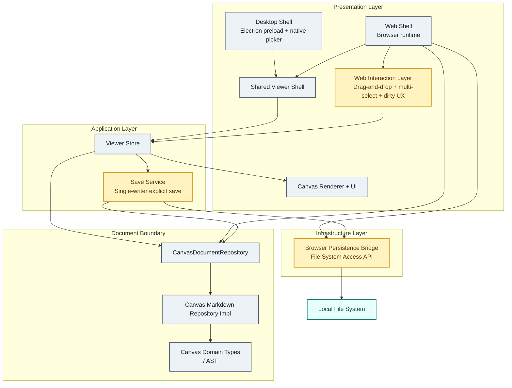

# Boardmark Post Web Shell PRD & Implementation Plan

## 1. 목적

이 문서는 `docs/features/web-shell/README.md` 다음 단계에서 진행할 작업을, PRD와 구현 계획을 한 파일에 함께 정리한 문서다.

web shell 단계의 목표는 browser에서도 공용 viewer shell과 `CanvasDocumentRepository` 경계를 검증하는 것이었다.  
그 다음 단계의 목표는 browser를 실제 작업 가능한 shell로 확장하고, 이후 편집과 shell 통합까지 자연스럽게 이어질 수 있는 기반을 만드는 것이다.

이 문서는 아래 세 가지를 하나의 연속된 구현 로드맵으로 다룬다.

1. Browser Persistence
2. Web Interaction
3. Editing & Shell Integration

---

## 2. 제품 요구사항

### 2.1 Browser Persistence

사용자는 browser에서도 `.canvas.md` 문서를 단순히 열어보는 것에 그치지 않고, 같은 문서를 다시 저장할 수 있어야 한다.

핵심 요구사항:

- browser에서 로컬 `.canvas.md` 파일을 열고 다시 같은 위치에 저장할 수 있어야 한다.
- browser shell은 upload-only viewer가 아니라 persisted document session을 가질 수 있어야 한다.
- persistence는 runtime state와 분리되어야 한다.
- repository 경계는 유지되어야 하며, shell은 parser를 직접 알면 안 된다.
- browser persistence는 우선 `File System Access API`만을 대상으로 구현한다.

### 2.2 Web Interaction

web shell은 viewer verification 수준을 넘어서 실제 탐색/작업 shell에 가까운 상호작용을 제공해야 한다.

핵심 요구사항:

- drag-and-drop으로 `.canvas.md`를 열 수 있어야 한다.
- multi-select를 지원해야 한다.
- dirty state를 명확히 드러내야 한다.
- load/save/error 상태가 browser 작업 흐름에 맞게 더 분명히 보여야 한다.
- 기존 desktop/web 공용 viewer shell 구조를 깨지 않고 확장되어야 한다.

### 2.3 Editing & Shell Integration

이 단계에서는 viewer-only 구조를, 저장 정책과 shell 통합이 가능한 editor-capable 구조로 확장할 준비를 한다.

핵심 요구사항:

- 저장 정책은 즉시 저장, 명시적 저장, debounce 저장, 다른 변경과 묶음 저장으로 분리 가능한 구조여야 한다.
- single-writer save service를 도입해 파일 write 실행 경로를 한곳으로 일원화해야 한다.
- 이후 양방향 편집이 붙더라도 현재 경계를 다시 뒤집지 않아야 한다.

---

## 3. 범위

### 이번 문서에 포함

- browser persistence shell
- File System Access API 기반 open/save 전략
- drag-and-drop import
- multi-select
- dirty state / save UX
- save service 경계

### 이번 문서에서 제외

- CodeMirror
- MagicString
- fully bidirectional editing 구현
- component pack runtime 구현 자체
- style pack runtime 구현 자체
- 협업/동기화
- E2E 테스트

pack system은 별도 feature로 유지하되, 이 문서의 저장/interaction 구조와 충돌하지 않아야 한다.

---

## 4. 구현 원칙

### 4.1 Repository 경계를 유지한다

- shell, store, UI는 parser를 직접 호출하지 않는다.
- 모든 문서 입력은 `CanvasDocumentRepository`를 거쳐 `CanvasDocumentRecord`로 정규화된다.
- browser persistence가 추가되어도 repository는 문서 경계만 담당하고, 저장 정책은 service가 담당한다.

### 4.2 Single Writer를 강제한다

- 실제 persisted write는 항상 한 경로에서만 수행한다.
- browser shell에서도 저장 요청은 save service를 거쳐 직렬화된다.

### 4.3 Capability 기반 shell을 유지한다

- desktop / web의 차이는 bridge와 capability에서만 표현한다.
- shell UI 컴포넌트를 환경마다 갈아엎지 않는다.
- persistence 가능 여부, drag-and-drop 가능 여부, save policy는 capability로 주입한다.

### 4.4 Runtime State와 Persisted State를 분리한다

- viewport, selection, drag-hover, dirty draft 같은 값은 runtime state다.
- 파일에 기록되는 값은 persisted snapshot이다.
- autosave나 묶음 저장이 붙더라도 이 두 층을 섞지 않는다.

### 4.5 사용할 유틸리티 / 라이브러리

이번 단계에서는 아래 도구를 명시적으로 사용한다.

- browser persistence
  - 브라우저 native `File System Access API`
- drag-and-drop import
  - `react-dropzone`
- multi-select interaction
  - 기존 `@xyflow/react` selection/event 기능
- save 직렬화
  - `p-queue`

추가로, dirty state 계산과 document session 비교는 별도 라이브러리를 쓰지 않고 store/service에서 직접 계산한다.

---

## 5. 코드베이스 레이어 위치

아래 다이어그램은 현재 코드베이스 레이어 위에 이번 단계의 구현 목표가 어디에 추가되는지를 보여준다.

요약하면:

- 현재 이미 있는 핵심 축은 `Shared Viewer Shell -> Viewer Store -> CanvasDocumentRepository`다.
- 이번 단계에서 추가되는 것은 presentation 쪽 `Web Interaction Layer`, application 쪽 `Save Service`, infrastructure 쪽 `Browser Persistence Bridge`다.
- 파일 읽기 결과는 bridge에서 직접 store로 가지 않는다. shell/store가 bridge에서 source를 받고, repository를 통해 정규화한 뒤 store에 반영한다.
- store는 repository를 통해 문서를 해석하고, persisted write는 save service가 browser bridge를 통해 수행한다.
- repository와 parser 경계 아래로는 이번 단계의 관심사가 내려가지 않는다.

---

## 6. 기능 설계

### 5.1 Browser Persistence

#### 목표

browser에서도 persisted document session을 가질 수 있게 한다.

#### 구현 방향

- browser bridge에 persistence capability를 추가한다.
- browser persistence는 `File System Access API`만을 사용한다.
- 저장된 파일 handle은 browser-local state에 유지한다.
- open/save는 아래 단계로 나눈다.
  1. file handle 획득
  2. source read/write
  3. repository 정규화
  4. save service 경유 persist

#### open 경로

- `Open File`
  - `showOpenFilePicker`로 `.canvas.md` 파일을 선택한다.
  - 선택된 handle은 현재 document session에 연결한다.

#### save 경로

- handle이 있는 document
  - `Save` 시 같은 handle에 overwrite
- handle이 없는 document
  - `Save` 시 `showSaveFilePicker`
  - 사용자가 위치를 정한 뒤 persisted document로 승격

#### locator / handle 정책

- repository 외부에서 browser file handle을 직접 흘리지 않는다.
- shell/service가 handle을 소유한다.
- repository에는 정규화된 locator와 source snapshot만 전달한다.

#### 완료 기준

- browser에서 열린 `.canvas.md`를 같은 위치에 다시 저장할 수 있다.
- `showSaveFilePicker`로 생성한 문서는 최초 save 이후 persisted session이 된다.
- 저장 성공 후 dirty state가 clear 된다.

### 5.2 Web Interaction

#### 목표

browser shell을 실제 작업용 탐색 shell에 가깝게 만든다.

#### drag-and-drop import

- drag-and-drop은 `react-dropzone`을 사용해 구현한다.
- shell 최상위 컨테이너에 dropzone을 두고, 파일 필터링과 drop 상태 관리를 일관되게 처리한다.
- `DataTransfer.files`에서 `.canvas.md` 또는 `.md` 파일만 허용한다.
- 선택된 파일은 `File.text()`로 읽고, `documentRepository.readSource(...)`로 정규화한다.
- drop 성공 시 현재 document session을 새 memory session 또는 persisted session 후보로 교체한다.
- drop zone은 canvas 내부 node interaction과 충돌하지 않도록 shell overlay 수준에서만 관리한다.
- drag 중에는 drop 가능 상태를 시각적으로 표시하고, 실제 정규화와 state 반영은 `onDrop` 시점에만 수행한다.

#### multi-select

- selection source of truth는 React Flow 내부 state가 아니라 viewer store가 가진 selection 집합이다.
- 구현은 기존 `@xyflow/react`의 node event / selection 동작을 입력 계층으로 사용한다.
- store selection을 단일 `selectedNodeId`에서 `selectedNodeIds` 또는 동등한 집합 상태로 확장한다.
- 기본 클릭은 단일 선택 유지, `Shift` 또는 `Meta/Ctrl` modifier가 있을 때만 다중 선택을 허용한다.
- node click, pane click, selection clear는 모두 store action을 통해 반영한다.
- React Flow node `selected` 상태는 store selection 집합에서 계산해 내려준다.
- group transform이나 일괄 편집은 이번 단계에서 다루지 않고, selection highlight와 상태 유지까지만 구현한다.

#### dirty state / save UX

- dirty state는 “현재 runtime source snapshot”과 “마지막 persisted source snapshot”의 비교 결과로 계산한다.
- runtime interaction state만 바뀐 경우에는 dirty로 보지 않는다.
- persisted write 성공 시 persisted snapshot을 갱신하고 dirty state를 clear 한다.
- web shell 상태 패널과 file menu에서 dirty / saving / saved / error 상태를 명확히 보여준다.
- save 가능 여부는 capability와 current document session 상태를 함께 보고 계산한다.
- dirty 계산과 save 상태 표현은 save service 결과를 기준으로 반영하고, UI 컴포넌트가 직접 write 성공 여부를 추론하지 않는다.

#### 완료 기준

- drag-and-drop으로 문서를 열 수 있다.
- 2개 이상의 노드를 선택 상태로 유지할 수 있다.
- 문서가 dirty면 UI에 명확히 표시된다.

### 5.3 Editing & Shell Integration

#### 목표

저장 정책과 shell 간 통합을 위한 중앙 실행 경로를 만든다.

#### 레이어 구조

이 단계는 아래 레이어 구조로 구현한다.

- `UI Layer`
  - 버튼, 패널, canvas interaction
  - 사용자 intent만 발생시킨다.
- `Viewer Store`
  - document session, selection, dirty, save state를 가진다.
  - 직접 파일 write를 수행하지 않는다.
- `Save Service`
  - 저장 흐름 제어와 single-writer 보장을 담당한다.
  - 내부 직렬화는 `p-queue`를 사용한다.
- `Browser Persistence Bridge`
  - File System Access API 호출과 handle read/write를 담당한다.
- `CanvasDocumentRepository`
  - source를 `CanvasDocumentRecord`로 정규화한다.

저장 실행 경로는 항상 아래와 같아야 한다.

`UI -> Viewer Store action -> Save Service -> Browser Persistence Bridge -> CanvasDocumentRepository`

#### save service

- 새 계층으로 `CanvasDocumentSaveService` 또는 동등한 모듈을 둔다.
- 직렬화 큐는 `p-queue`를 사용해 concurrency `1`로 고정한다.
- 입력:
  - current document session
  - persisted snapshot source
  - save mode
- 책임:
  - write 직렬화
  - pending save dedupe
  - dirty state clear timing
  - save failure surface
  - save 결과를 store가 소비할 수 있는 상태로 정규화

#### save modes

- `explicit`
  - 사용자가 Save를 눌렀을 때만 저장
- `debounced`
  - 일정 시간 idle 후 저장
- `batched`
  - 다른 변경과 함께 저장

이번 단계에서는 `explicit`을 구현하고, `debounced` / `batched`를 위한 인터페이스만 고정한다.

#### shell integration

- browser shell 내부에서도 저장 실행 경로는 `UI -> store action -> save service -> persistence bridge` 구조를 유지해야 한다.
- interaction layer와 persistence layer는 viewer shell 위에서 결합되되, repository 경계를 침범하지 않아야 한다.
- UI 컴포넌트는 service나 bridge를 직접 호출하지 않고 store action만 호출한다.
- save service는 React Flow나 DOM 이벤트를 직접 알지 않고, document session과 source snapshot만 입력으로 받는다.

#### 완료 기준

- 저장은 shell UI에서 직접 write하지 않고 save service를 거친다.
- 동시에 여러 save 요청이 와도 write 순서가 깨지지 않는다.

---

## 7. 구현 순서

### Phase 1. Browser Persistence Shell

- browser persistence bridge 추가
- File System Access API open/save 연결
- persisted handle 세션 상태 추가

완료 기준:

- browser에서 같은 파일에 다시 저장 가능

### Phase 2. Dirty State & Save UX

- document session과 persisted snapshot 비교
- dirty state 추가
- status panel / file menu에 dirty / saving / saved / error 표시

완료 기준:

- 사용자가 현재 문서가 저장되지 않았는지 바로 알 수 있음

### Phase 3. Drag-and-Drop + Multi-select

- drag-and-drop import 추가
- selection state 집합화
- React Flow selection sync 보강

완료 기준:

- drop import와 multi-select가 동작

### Phase 4. Save Service

- explicit save service 도입
- save 직렬화
- pending write dedupe
- browser persistence bridge와 결합

완료 기준:

- 저장 경로가 한곳으로 일원화됨

### Phase 5. Shell Integration Refinement

- shell capability 정리
- bridge/service 계약 정리
- browser shell 내부 경계 안정화

완료 기준:

- browser persistence / interaction / service 경계가 안정적으로 분리됨

---

## 8. Public Interfaces / Contracts

### browser persistence bridge

필요한 새 계약:

- browser document session
  - locator
  - file handle
  - persisted 여부
  - dirty 여부
- shell capability
  - `canOpen`
  - `canSave`
  - `canPersist`
  - `canDropImport`
  - `supportsMultiSelect`

### save service

필요한 계약:

- `save(documentSession, mode)`
- `flush()`
- current save state 조회

### store

필요한 확장:

- `selectedNodeIds`
- dirty state
- current persisted snapshot metadata
- current document session metadata

---

## 9. 테스트 계획

### Browser Persistence

- File System Access API 지원 환경에서 open/save flow 검증
- `showSaveFilePicker` 경로로 생성된 문서가 persisted session으로 승격되는지 검증
- save 후 dirty state clear 검증

### Web Interaction

- drag-and-drop import 후 문서 교체 검증
- multi-select state 유지 검증
- dirty indicator 표시 검증

### Save Service

- 동시에 여러 save 요청이 와도 write 순서가 보장되는지 검증
- save 실패 시 state와 error surface 검증
- explicit save 경로가 direct write 없이 save service만 타는지 검증

### Shell Parity

- desktop / web이 같은 viewer core 계약을 유지하는지 검증
- repository 직접 호출 경로가 shell/store 내부에 새로 생기지 않는지 검증

---

## 10. 수용 기준

- browser shell이 실제 persisted open/save를 지원한다.
- web shell은 dirty state와 save state를 명확히 보여준다.
- drag-and-drop import와 multi-select가 동작한다.
- 저장 실행 경로가 save service 한 곳으로 일원화된다.

---

## 11. 현재 우선순위

이 문서의 실제 구현 우선순위는 다음과 같다.

1. Browser Persistence Shell
2. Dirty State / Save UX
3. Drag-and-Drop + Multi-select
4. Save Service
5. Shell Integration Refinement

즉, post web shell 단계의 첫 핵심은 “browser에서도 실제 문서를 다시 저장할 수 있게 만드는 것”이다.  
그 다음에 interaction을 보강하고, 마지막으로 저장 정책과 shell integration을 고정한다.
