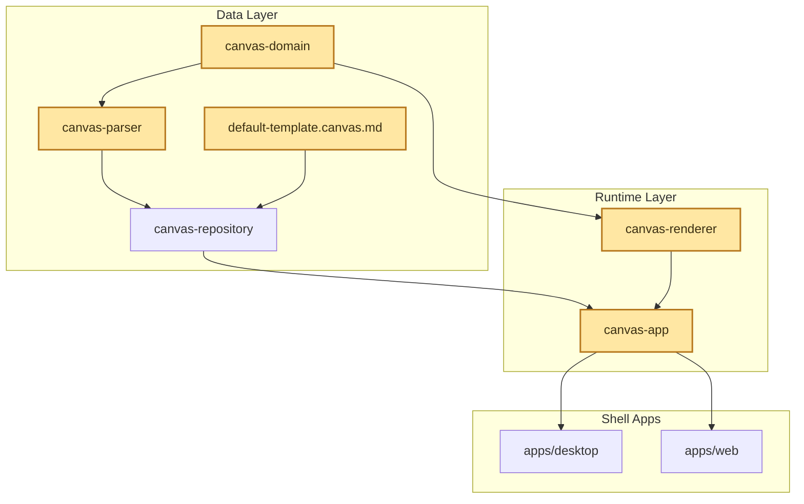
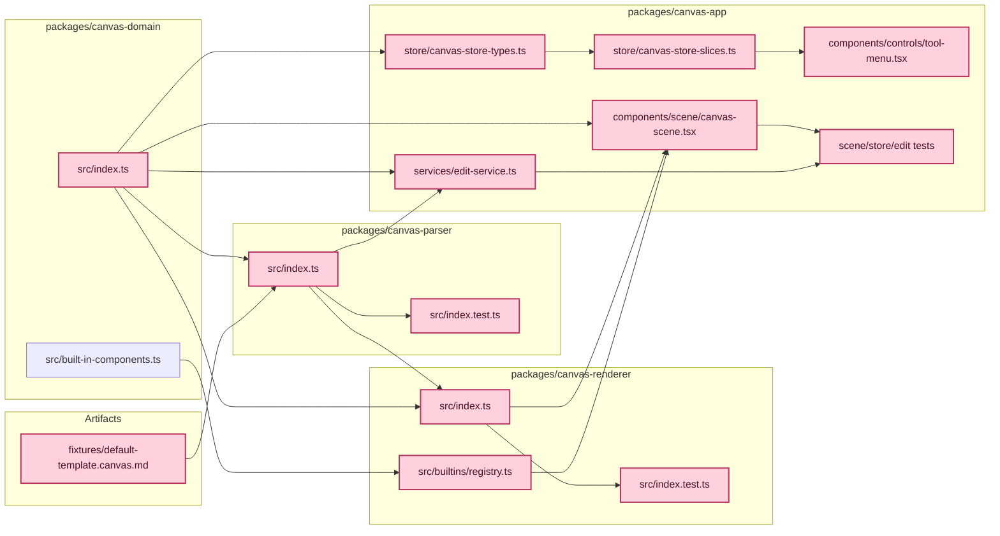

# Canvas Format v2 & Parser Redesign

## 1. 목적

이 문서는 `.canvas.md` 포맷과 `canvas-parser` 재설계 방향을 정리한다.

이번 문서에서 확정하는 핵심 결정은 아래와 같다.

- 오브젝트 정의는 Markdown 위에 얹힌 오브젝트 헤더 문법으로 표현한다.
- node-level `renderer` 필드는 제거한다.
- 노드 컴포넌트 선택은 directive 이름 자체로 표현한다.
- 오브젝트 공통 필드는 `id`, `at`, `style`로 정리한다.
- component-specific 설정과 데이터는 헤더가 아니라 body에서 표현한다.
- body는 Markdown으로 제한하지 않고 component-defined payload로 다룬다.
- 데이터성 body는 fenced code block으로 format을 명시하는 방식을 권장한다.
- `at`은 현재 절대 좌표를 표현하고, 이후 anchor 기반 확장 가능성을 열어 둔다.
- `parent`와 그룹 계층 구조는 이번 단계에서 보류한다.

Boardmark의 핵심 정체성은 **마크다운 파일이 곧 캔버스 데이터**라는 점이다.
이 포맷의 주요 독자는 두 가지다.

1. **AI 에이전트**: 로컬 파일을 읽고 텍스트를 생성해 캔버스를 만들고 편집한다.
2. **사람**: AI가 만든 구조 위에서 콘텐츠와 메타데이터를 직접 수정한다.

현재 포맷의 한계는 분명하다.

- 모든 attribute 값이 문자열 기반이다.
- 중첩 객체와 배열 표현이 어렵다.
- `renderer`, `palette`, `tone` 같은 표현 필드가 오브젝트 헤더에 섞여 있다.
- 오브젝트 헤더 attribute patch에 강하게 묶여 있어 장기적인 확장이 불편하다.

v2의 목표는 이 제약을 제거하면서도 Markdown다운 읽기 경험을 유지하는 것이다.
experimental 단계이므로 하위 호환은 이번 범위에서 고려하지 않는다.

---

## 2. 설계 원칙

### 2.1 용어

이 문서에서 쓰는 핵심 용어는 아래와 같다.

- `오브젝트 헤더`: `::: boardmark.calender { ... }` 같은 한 줄 선언 전체
- `컴포넌트 키`: `note`, `boardmark.calender`, `d3.bar`처럼 directive 이름 자리에 오는 식별자
- `헤더 메타데이터`: 오브젝트 헤더 안의 `{ ... }` 전체
- `헤더 필드`: `id`, `at`, `style`처럼 헤더 메타데이터 안의 각 key
- `코어 필드`: 포맷이 공통 의미를 부여하는 헤더 필드. 현재는 `id`, `at`, `style`
- `body`: 오브젝트 헤더 다음부터 closing `:::` 전까지의 본문 전체
- `payload block`: body 안의 fenced code block. 예: `yaml props`, `csv data`

문서 설명은 위 용어를 기준으로 통일한다.

### 2.2 Markdown-First, Human-Editable

- 오브젝트 body는 파일 안에 그대로 텍스트로 남아야 한다.
- 오브젝트 메타데이터는 오브젝트 헤더의 헤더 메타데이터로 제한한다.
- 파일은 사람이 읽고 diff할 수 있어야 한다.
- 한 오브젝트를 이해하기 위해 많은 줄의 설정 블록을 펼치지 않아도 되어야 한다.

### 2.3 예약 필드와 본문 payload를 분리한다

오브젝트 공통 계약은 작게 유지한다.

- `id`: 오브젝트 식별자
- `at`: 위치와 크기
- `style`: 스타일 theme 선택과 literal override

component-specific 정보는 공통 필드로 올리지 않는다.
대신 body에서 각 컴포넌트 계약에 따라 해석한다.

즉:

- 오브젝트 헤더는 코어 포맷 계약
- body는 컴포넌트 전용 payload

### 2.4 컴포넌트 선택은 directive 이름으로 표현한다

node-level `renderer` 필드는 제거한다.

노드 컴포넌트는 아래처럼 directive 이름 자체로 표현한다.

```md
::: note
:::

::: boardmark.calender
:::

::: d3.quadtree
:::
```

- `note`는 built-in 기본 노드 컴포넌트다.
- `boardmark.calender`, `d3.quadtree` 같은 namespaced key는 커스텀 컴포넌트다.
- `edge`는 관계 오브젝트를 위한 예약 이름이다.

즉, 파서는 `renderer` 속성을 읽지 않고 directive 이름을 그대로 노드의 `component` 값으로 저장한다.

### 2.5 기본 작성 방식은 오브젝트 헤더 한 줄 표현이다

메타데이터는 오브젝트 헤더 안의 헤더 메타데이터 한 줄 표현을 기본으로 한다.

```md
::: note { id: welcome, at: { x: 80, y: 72, w: 340, h: 220 }, style: { themeRef: boardmark.editorial.soft, overrides: { fill: "#123321" } } }
```

이 헤더 메타데이터는 YAML flow mapping과 같은 타입 규칙을 따른다.

- number, boolean, string을 직접 표현할 수 있다.
- 단순 식별자형 문자열은 따옴표 없이 쓸 수 있다.
- 공백이나 특수 문자가 필요한 문자열은 따옴표를 사용한다.

### 2.6 body는 component-defined payload다

body는 항상 Markdown prose일 필요가 없다.

- `note`는 body를 Markdown으로 해석한다.
- 차트나 데이터 컴포넌트는 body를 JSON, CSV, YAML 같은 payload로 해석할 수 있다.
- 파서는 body를 raw text로 보존하고, 해석은 component contract가 맡는다.

예시:

```md
::: note { id: welcome, at: { x: 80, y: 72, w: 340, h: 220 } }

# Boardmark Viewer

:::
```

~~~md
::: d3.bar { id: sales, at: { x: 80, y: 72, w: 520, h: 320 } }

```yaml props
xField: month
yField: revenue
showLegend: true
```

```csv data
month,revenue
Jan,120
Feb,98
Mar,143
```

:::
~~~

### 2.7 데이터성 body는 fenced block을 권장한다

component payload가 구조화 데이터라면 fenced code block을 권장한다.

- 첫 번째 토큰은 포맷이다. 예: `json`, `csv`, `yaml`
- 두 번째 토큰은 역할이다. 예: `props`, `data`, `schema`

예시:

~~~md
```yaml props
xField: month
yField: revenue
```

```json data
[
  { "month": "Jan", "revenue": 120 }
]
```
~~~

이 방식의 장점:

- 사람이 body format을 바로 읽을 수 있다.
- parser는 body를 raw text로만 다뤄도 된다.
- 각 component는 필요한 fenced block만 해석하면 된다.

### 2.8 `at`이라는 이름을 선택하는 이유

`layout` 대신 `at`을 쓴다.

- 현재는 `x`, `y`, `w`, `h` 기반 절대 좌표를 의미한다.
- 이름 자체가 "어디에 놓인다"는 뜻을 가져서 위치 표현에 더 직접적이다.
- 이후 상대 배치가 필요해지면 같은 필드 안에서 확장하기 쉽다.

예를 들어 future direction은 아래처럼 열 수 있다.

```md
at: { x: 120, y: 80, anchor: hero }
```

다만 이번 문서의 구현 범위는 절대 좌표만 다룬다.

### 2.9 `parent`는 보류한다

포함 관계와 상대 좌표계는 실제 편집 UX와 검증 규칙을 더 구체화한 뒤 다시 다룬다.

이번 문서 범위에는 아래를 포함하지 않는다.

- `parent`
- `group`
- 중첩 `:::` 문법

---

## 3. 포맷 명세

### 3.1 파일 구조

```text
[파일 레벨 frontmatter]
[오브젝트 블록 목록]
```

### 3.2 파일 레벨 frontmatter

파일 레벨 frontmatter는 기존처럼 YAML을 유지한다.
`style`, `components`, `preset`은 pack source 등록 용도고, `defaultStyle`은 선택적 문서 기본 스타일이다.

```md
---
type: canvas
version: 2
style:
  - https://styles.boardmark.dev/editorial@1.0.0
components:
  - https://components.boardmark.dev/core@1.0.0
preset: https://presets.boardmark.dev/editorial-soft@1.0.0
defaultStyle: boardmark.editorial.soft
viewport: { x: -180, y: -120, zoom: 0.92 }
---
```

### 3.3 오브젝트 블록 구조

모든 오브젝트는 아래 구조를 따른다.

```md
::: <component-key> { <header-metadata> }

<body>

:::
```

- `component-key`는 컴포넌트 키다.
- 같은 줄의 `{ ... }`는 헤더 메타데이터다.
- 오브젝트 헤더 다음부터 closing `:::` 전까지는 모두 body다.
- body는 Markdown일 수도 있고, component-defined payload일 수도 있다.
- body가 없으면 오브젝트 헤더 바로 다음 줄에 closing `:::`가 올 수 있다.

`component-key` 규칙:

- `edge`는 예약 이름이다.
- 그 외 모든 이름은 노드 컴포넌트 key로 처리한다.
- `.`와 `-`를 포함한 namespaced key를 허용한다.
- 파서는 이름을 정규화하지 않고 그대로 보존한다.

권장 오브젝트 헤더 형식:

```md
::: note { id: welcome, at: { x: 80, y: 72, w: 340, h: 220 } }
::: boardmark.calender { id: calendar-q2, at: { x: 480, y: 72, w: 520, h: 360 } }
::: d3.bar { id: sales, at: { x: 80, y: 72, w: 520, h: 320 } }
::: edge { id: welcome-flow, from: welcome, to: calendar-q2 }
```

### 3.4 헤더 메타데이터 문법

오브젝트 헤더의 메타데이터는 하나의 헤더 메타데이터 object로 해석한다.

```md
{ id: welcome, at: { x: 80, y: 72, w: 340, h: 220 }, style: { themeRef: boardmark.editorial.soft } }
```

규칙:

- 최상위는 mapping object 하나다.
- 중첩 object를 허용한다.
- 배열도 허용한다.
- 동일 key 중복은 허용하지 않는다.
- object 전체가 없으면 빈 헤더 메타데이터로 간주한다.

### 3.5 노드 오브젝트

#### built-in note

```md
::: note { id: welcome, at: { x: 80, y: 72, w: 340, h: 220 }, style: { themeRef: boardmark.editorial.soft, overrides: { fill: "#123321" } } }

# Boardmark Viewer

Open a `.canvas.md` file or start from this bundled example board.

:::
```

#### custom component: `boardmark.calender`

~~~md
::: boardmark.calender { id: calendar-q2, at: { x: 480, y: 72, w: 520, h: 360 }, style: { themeRef: boardmark.editorial.soft } }

```yaml props
range: "2026-Q2"
density: compact
```

:::
~~~

#### custom component: `d3.bar`

~~~md
::: d3.bar { id: sales, at: { x: 80, y: 72, w: 520, h: 320 }, style: { overrides: { fill: "#f4f0ff", stroke: "#6042d6" } } }

```yaml props
xField: month
yField: revenue
showLegend: true
```

```csv data
month,revenue
Jan,120
Feb,98
Mar,143
```

:::
~~~

노드 규칙:

- `id`는 필수다.
- `at`은 필수다.
- `style`은 선택이다.
- body는 선택이다.
- body의 해석은 component contract가 결정한다.

### 3.6 edge 오브젝트

`edge`는 관계를 표현하는 예약 오브젝트다.

~~~md
::: edge { id: welcome-flow, from: welcome, to: calendar-q2, style: { themeRef: boardmark.editorial.soft } }

```yaml props
line: curve
labelSide: center
```

:::
~~~

edge 규칙:

- `id`, `from`, `to`는 필수다.
- `style`은 선택이다.
- body는 선택이다.
- edge label이나 edge 옵션이 필요하면 body에서 component contract에 따라 해석할 수 있다.

### 3.7 `at` 필드

`at`은 공통 geometry 계약이다.

```md
at: { x: 80, y: 72, w: 340, h: 220 }
```

규칙:

- `x`, `y`는 필수 숫자다.
- `w`, `h`는 선택 숫자다.
- 현재는 루트 캔버스 기준 절대 좌표만 다룬다.

future direction:

```md
at: { x: 24, y: 16, anchor: hero }
```

이 확장 방향 때문에 필드 이름을 `layout` 대신 `at`으로 둔다.
다만 `anchor`는 현재 구현 범위에 포함하지 않는다.

### 3.8 `style` 필드

`style`은 스타일 팩 선택과 literal override를 담당한다.

```md
style: { themeRef: boardmark.editorial.soft }
style: { overrides: { fill: "#123321" } }
style: { themeRef: boardmark.editorial.soft, overrides: { fill: "#123321", text: "#1f2937" } }
```

규칙:

- `style.themeRef`는 style pack foundation selector다.
- `style.overrides`는 literal style slot override다.
- `themeRef`와 `overrides`는 둘 중 하나만 써도 되고 함께 써도 된다.
- direct color는 항상 문자열로 쓴다. 예: `"#123321"`
- `style.color`처럼 의미가 모호한 단일 키는 사용하지 않는다.
- override key는 `fill`, `text`, `stroke`처럼 역할이 드러나는 slot 이름을 사용한다.

적용 우선순위:

1. `object.style.themeRef`
2. `frontmatter.defaultStyle`
3. built-in default foundation

### 3.9 body payload 규칙

body는 component-defined payload다.

권장 규칙:

- note류는 일반 Markdown body를 사용한다.
- 데이터성 body는 fenced code block을 사용한다.
- fenced block info string은 `format role` 순서를 따른다.
- 예: `yaml props`, `json data`, `csv data`, `yaml schema`

파서는 body 내부를 공통 포맷 수준에서 해석하지 않는다.
component가 자기 계약에 따라 body를 읽는다.

예시:

~~~md
::: d3.bar { id: sales, at: { x: 80, y: 72, w: 520, h: 320 } }

```yaml props
xField: month
yField: revenue
```

```csv data
month,revenue
Jan,120
Feb,98
```

:::
~~~

### 3.10 body 없는 오브젝트

body가 없는 오브젝트는 오브젝트 헤더 뒤에 바로 closing `:::`가 올 수 있다.

```md
::: boardmark.calender { id: calendar-q2, at: { x: 480, y: 72, w: 520, h: 360 } }
:::
```

---

## 4. 도메인 모델 변경

v2의 핵심은 코어 포맷을 작게 유지하는 것이다.
기존의 `shape`, `rendererKey`, `palette`, `tone`, `color` 같은 built-in 표현 세부사항은 코어 도메인 타입에서 분리한다.

### 4.1 공통 타입

```ts
type CanvasObjectAt = {
  x: number
  y: number
  w?: number
  h?: number
}

type CanvasObjectStyle = {
  themeRef?: string
  overrides?: Record<string, string>
}
```

`CanvasObjectAt`은 현재 절대 좌표 계약만 담는다.
필드 이름은 이후 anchor 기반 확장을 수용하기 위해 `at`으로 둔다.

### 4.2 CanvasNode

```ts
type CanvasNode = {
  id: string
  component: string
  at: CanvasObjectAt
  style?: CanvasObjectStyle
  body?: string
  position: CanvasSourceRange
  sourceMap: CanvasDirectiveSourceMap
}
```

해석:

- `component`는 directive 이름 그대로다.
- `note`, `boardmark.calender`, `d3.bar` 모두 같은 구조를 따른다.
- built-in note의 Markdown도 `body`에 들어간다.
- chart의 설정과 데이터도 `body`에 들어간다.

### 4.3 CanvasEdge

```ts
type CanvasEdge = {
  id: string
  from: string
  to: string
  style?: CanvasObjectStyle
  body?: string
  position: CanvasSourceRange
  sourceMap: CanvasDirectiveSourceMap
}
```

edge의 line kind나 label 옵션 같은 세부 표현도 코어 필드로 두지 않는다.
필요하면 body에서 component contract에 따라 해석한다.

### 4.4 Source Map

v2 source map은 오브젝트 헤더와 body 범위를 직접 노출하는 방향이 맞다.

```ts
type CanvasDirectiveSourceMap = {
  objectRange: CanvasSourceRange
  headerLineRange: CanvasSourceRange
  metadataRange?: CanvasSourceRange
  bodyRange: CanvasSourceRange
  closingLineRange: CanvasSourceRange
}
```

---

## 5. 레이어 영향

현재 의존성 방향은 유지한다.

```text
canvas-domain
    ↑
canvas-parser
    ↑
canvas-repository
    ↑
canvas-app
    ↑
apps/desktop, apps/web
```

색이 들어간 박스만 이번 변경에서 직접 수정 대상인 레이어 또는 컴포넌트다.

### 5.1 영향 레이어



### parser / repository

`canvas-repository`는 계속 `parseCanvasDocument(source)`와 `CanvasAST`에만 의존한다.
파서 내부가 직접 파싱으로 바뀌어도 이 경계는 유지할 수 있다.

### renderer

`canvas-renderer`는 더 이상 `node.rendererKey`를 읽지 않는다.
대신 아래처럼 동작해야 한다.

- `node.component`를 component registry key로 사용한다.
- built-in `note`는 `note` key로 해석한다.
- custom component는 `boardmark.calender`, `d3.bar` 같은 key를 그대로 사용한다.
- `node.at`을 Flow position과 size로 변환한다.
- `node.body`는 component contract에 따라 해석한다.
- 예를 들어 note는 Markdown body로, chart는 fenced block payload로 해석한다.
- `edge`는 별도 edge renderer 경로로 유지한다.

즉, `renderer`는 데이터 필드가 아니라 **directive name + component registry resolution**으로 대체된다.

### 5.2 영향 컴포넌트



---

## 6. 구현 계획

### Phase 1: 도메인 타입 정리

**변경 파일: `packages/canvas-domain/src/index.ts`**

- `CanvasNode.type`, `CanvasShapeNode` 제거
- `CanvasNode.component` 추가
- `CanvasNode.at` 추가
- `CanvasObjectAt`, `CanvasObjectStyle` 추가
- `CanvasNode.body` 추가
- `CanvasEdge.body` 추가
- `CanvasDirectiveSourceMap.headerLineRange`, `metadataRange`, `bodyRange` 추가
- built-in 전용 표현 필드는 코어 포맷 타입에서 제거

### Phase 2: 파서 재작성

**변경 파일: `packages/canvas-parser/src/index.ts`**

remark/unified 의존성을 제거하고 직접 파싱한다.

새 파싱 파이프라인:

```text
parseCanvasDocument(source)
  │
  ├─ splitFrontmatter(source)
  │    └─ YAML frontmatter 추출 → CanvasFrontmatter
  │
  ├─ splitObjectBlocks(body)
  │    └─ ::: 경계 기준으로 블록 목록 추출
  │       각 블록은 { rawHeaderLine, componentKey, rawHeaderMetadata, rawBody, startLine, endLine } 보존
  │
  └─ parseObjectBlock(block) × N
       ├─ componentKey === 'edge' → parseEdgeBlock()
       └─ otherwise       → parseNodeBlock()
            ├─ parseHeaderMetadata(rawHeaderMetadata)
            ├─ validateReservedFields()
            ├─ preserveRawBody(rawBody)
            └─ buildSourceMap()
```

블록 분리 규칙:

- `^:::\s+([A-Za-z][\w.-]*)(?:\s+(.*))?$` → 블록 열림
- `^:::\s*$` → 블록 닫힘
- 코드 펜스 내부의 `:::`는 무시

헤더 메타데이터 규칙:

- 오브젝트 헤더에서 컴포넌트 키 뒤에 오는 나머지 문자열을 헤더 메타데이터 source로 본다.
- 값이 비어 있으면 빈 헤더 메타데이터 object로 처리한다.
- 값이 있으면 `{ ... }` 하나여야 한다.
- parser는 이 문자열을 YAML flow mapping 기반 헤더 메타데이터로 파싱한다.

body 규칙:

- parser는 body를 공통 포맷 수준에서 해석하지 않는다.
- fenced block의 의미는 component contract가 결정한다.
- parser는 raw text와 source range만 보존한다.

의존성 변경:

- `remark-directive`, `remark-parse`, `unified`, `mdast-util-to-markdown`, `unist-util-visit` 제거
- `js-yaml` 추가

### Phase 3: renderer / runtime 정리

**변경 파일: `packages/canvas-renderer/src/index.ts`**

- `node.component`를 기준으로 component registry를 조회한다.
- `rendererKey`, `palette`, `tone`를 코어 필드로 가정하는 로직을 제거한다.
- built-in note는 `note` key로 유지한다.
- custom component resolution은 namespaced key를 그대로 사용한다.
- `node.at.x`, `node.at.y`, `node.at.w`, `node.at.h`를 렌더러 좌표와 크기로 사용한다.
- `node.body`를 component별로 넘긴다.

이 단계의 목표는 `renderer` 필드 제거와 runtime component resolution을 일치시키는 것이다.

### Phase 4: edit-service / runtime body handling 정리

**변경 파일:**

- `packages/canvas-app/src/services/edit-service.ts`
- `packages/canvas-app/src/components/scene/canvas-scene.tsx`
- `packages/canvas-app/src/store/canvas-store-types.ts`
- `packages/canvas-app/src/store/canvas-store-slices.ts`
- `packages/canvas-app/src/components/controls/tool-menu.tsx`

핵심 변경:

- 오브젝트 헤더 attribute patch 전제를 제거한다.
- 헤더 메타데이터 rewrite와 body raw text replace 중심으로 수정한다.
- built-in 표현 설정을 공통 `props` 필드가 아니라 component body 계약으로 옮긴다.

### Phase 5: fixture 및 테스트 업데이트

**변경 파일:**

- `fixtures/default-template.canvas.md`
- `packages/canvas-parser/src/index.test.ts`
- `packages/canvas-renderer/src/index.test.ts`
- `packages/canvas-app/src/**/*.test.ts*`

테스트는 새 포맷 기준으로 전면 재작성한다.

---

## 7. 테스트 계획

### parser unit tests

- `::: note { ... }`가 `component: 'note'`로 파싱된다.
- `::: boardmark.calender { ... }`가 namespaced component key로 보존된다.
- `::: d3.bar { ... }`가 namespaced component key로 보존된다.
- `at: { x: 80, y: 72, w: 340, h: 220 }`가 숫자 타입으로 파싱된다.
- `style.themeRef`와 `style.overrides`가 올바르게 파싱된다.
- 헤더 메타데이터가 없는 `::: note`도 구문 에러 없이 처리된다.
- body가 fenced block을 포함해도 raw text로 보존된다.
- 코드 펜스 내부의 `:::`는 무시된다.
- 잘못된 헤더 메타데이터 object는 warning과 함께 해당 블록을 건너뛴다.

### source map tests

- `headerLineRange`가 실제 오브젝트 헤더 위치와 일치한다.
- `metadataRange`가 실제 헤더 메타데이터 위치와 일치한다.
- `bodyRange`가 실제 body 위치와 일치한다.
- 다중 오브젝트 문서에서 각 source map이 독립적으로 정확하다.

### renderer tests

- built-in `note`가 정상 해석된다.
- 커스텀 컴포넌트 키가 registry resolution에 그대로 전달된다.
- `node.at` 값이 Flow position과 size로 정확히 전달된다.
- `node.body`가 component에 그대로 전달된다.
- fenced block 기반 body를 읽는 component contract를 검증할 수 있다.

---

## 8. 범위 제외

- 기존 포맷과의 하위 호환
- `parent` / `group`
- nested container semantics
- 중첩 `:::` 문법
- `at.anchor`의 실제 런타임 의미 부여
- 공통 파서가 body fenced block semantics까지 해석하는 것
- arbitrary remote code 실행

---

## 9. 수용 기준

- 새 포맷이 inline header 기반 `id`, `at`, `style` 중심으로 파싱된다.
- 메타데이터 기본 작성 방식이 오브젝트 헤더의 한 줄 헤더 메타데이터로 정리된다.
- node-level `renderer` 필드가 제거된다.
- directive 이름이 node component key로 정확히 보존된다.
- `style.themeRef`와 `style.overrides`가 함께 동작할 수 있다.
- `at` 필드가 위치와 크기의 공통 계약으로 사용된다.
- body가 component-defined payload로 raw text 보존된다.
- 데이터성 body는 fenced block 기반 표현을 사용할 수 있다.
- `canvas-repository` 인터페이스는 유지된다.
- parser, renderer, app 관련 테스트가 새 계약 기준으로 통과한다.
