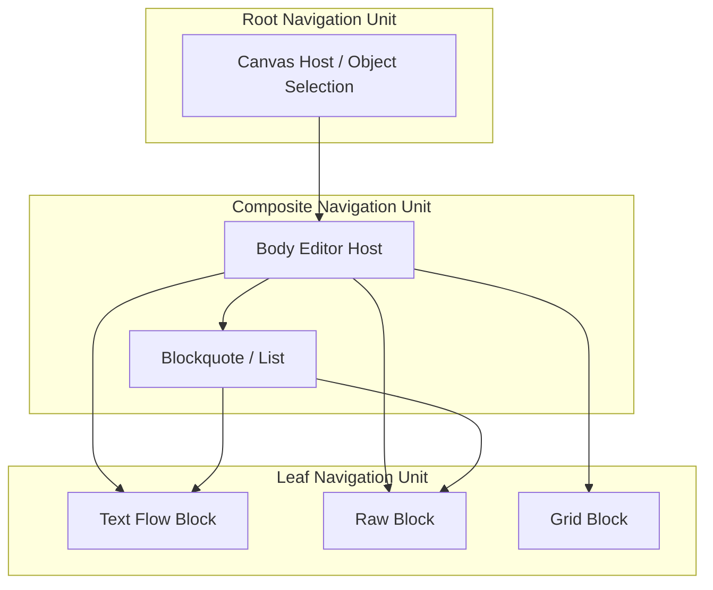
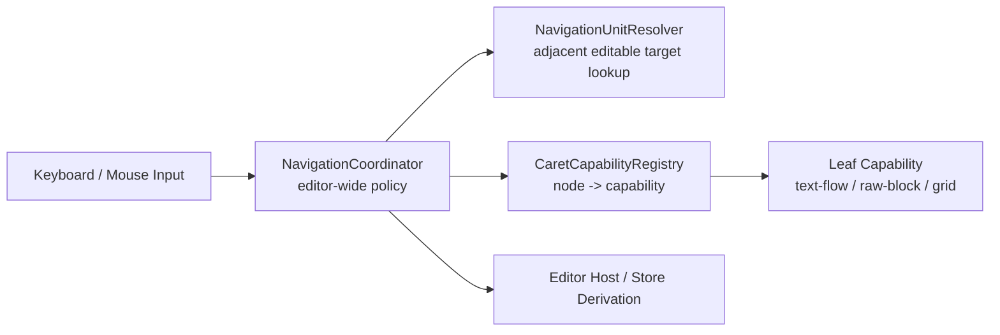
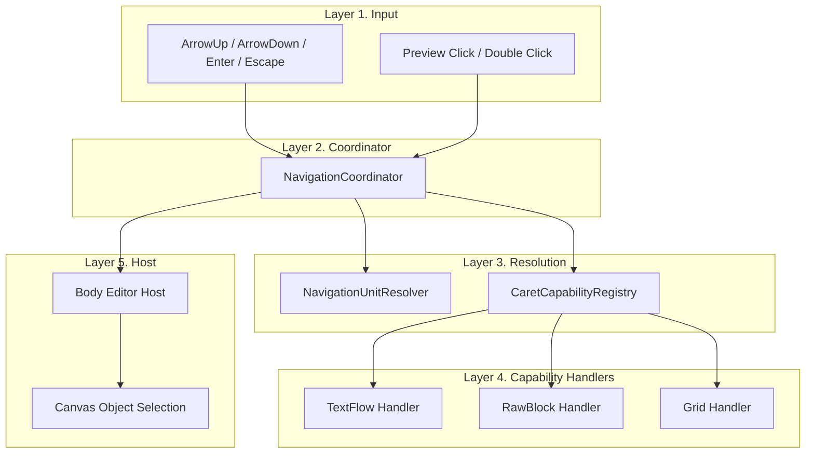

# Boardmark Caret Navigation Capability Refactor PRD

| 항목 | 내용 |
| --- | --- |
| 문서 버전 | v0.1 |
| 작성일 | 2026-04-07 |
| 상태 | Draft |
| 관련 ADR | `docs/adr/003-caret-navigation-capability-contract.md` |
| 범위 | WYSIWYG body editor caret navigation 구조 개선 |

---

## 1. 목적

이 문서는 Boardmark WYSIWYG body editor의 caret navigation 구조를
**capability contract + coordinator model**로 재정의하기 위한 제품 요구사항과 구현 계획을 정의한다.

이번 작업의 목적은 단순히 fenced code block 버그를 더 고치는 것이 아니다.

- caret 이동 규칙을 특정 markdown 문법 이름이나 top-level 구조에 하드코딩하지 않는다.
- preview / selection / edit 전환을 "실제 caret ownership" 기준으로 재정의한다.
- markdown block과 host-level object selection을 같은 navigation vocabulary 안에서 설명할 수 있게 만든다.

즉 이번 작업은
**문법별 예외 처리를 줄이고, caret를 받을 수 있는 unit 간 이동을 명시적 계약으로 고정하는 구조 개선 작업**이다.

---

## 2. 문제 정의

현재 caret navigation은 이전 작업으로 기능적으로 많이 안정화되었지만, 구조적으로는 아직 다음 문제가 남아 있다.

- 전역 plugin이 일부 문법 세부 사항을 직접 알고 있다.
- raw block 계열은 공통 편집 shell을 공유하지만, 진입/탈출 규칙은 plugin과 view 사이에 나뉘어 있다.
- nested blockquote/list 같은 구조가 추가되면 top-level block 사고방식이 다시 스며들기 쉽다.
- table 같은 다른 caret model을 가진 문법을 넣을수록 조건 분기와 임시 meta가 늘어날 위험이 있다.
- host-level selection 복귀와 editor 내부 caret 이동이 같은 모델 위에 있지 않아 설명 비용이 크다.

사용자에게 중요한 규칙은 훨씬 단순하다.

- caret가 text flow 안에 있으면 preview는 edit로 이어져야 한다.
- caret가 raw block 안에 있으면 block-local editing이 유지돼야 한다.
- caret가 없는 상태면 preview 또는 object selection 상태여야 한다.
- `ArrowUp` / `ArrowDown`은 다음 caret target으로 이동해야 한다.

즉 핵심 문제는 "문법별 예외 부족"이 아니라,
**caret를 누가 소유하고 어디로 넘기는지 설명하는 공통 계약이 없다는 점**이다.

---

## 3. 제품 목표

### 3.1 Goals

- markdown 문법별 caret model을 좁은 capability contract로 표현한다.
- editor-wide navigation 정책을 전역 coordinator 한 곳에서 유지한다.
- markdown block, editor host, object selection을 같은 navigation unit 계층으로 설명한다.
- `ArrowUp/Down`, `Enter`, `Escape`의 의미를 문법별 ad-hoc keydown 없이 연결한다.
- 새 문법 추가 시 전역 plugin 조건문을 늘리지 않고 capability 등록만으로 확장 가능하게 만든다.

### 3.2 Non-Goals

- 이번 단계에서 table navigation 전체를 완성하지 않는다.
- ProseMirror selection model을 별도 cursor graph로 대체하지 않는다.
- canvas 전체 interaction system을 한 번에 재작성하지 않는다.
- 모든 object type의 편집 모델을 동시에 일반화하지 않는다.

---

## 4. 핵심 원칙

### 4.1 Caret First

- preview 상태와 edit 상태는 저장된 boolean이 아니라 현재 caret ownership의 결과다.
- editor selection/focus가 source of truth다.
- store와 host state는 selection/focus에서 파생돼야 한다.

### 4.2 Interface는 소비자 경계에만 둔다

- `RULE.md` 원칙에 따라 interface는 전역 coordinator가 의존하는 좁은 경계에만 둔다.
- 내부 상태 표현은 discriminated union과 구체 타입으로 유지한다.
- interface는 1~3개의 메서드만 가진다.

### 4.3 문법별 차이는 capability로 표현한다

- fenced code block, special fenced block, html fallback은 같은 raw-block capability를 공유한다.
- paragraph, list item, blockquote paragraph는 text-flow capability를 공유한다.
- 이후 table은 grid capability로 분리할 수 있다.

### 4.4 전역과 로컬은 같은 축 위에 있다

- markdown block과 object-level block은 모두 navigation unit이다.
- 차이는 역할과 크기뿐이다.
- leaf/composite/root 계층으로 정리한다.

---

## 5. 사용자 가치

- 사용자는 문단, 리스트, 인용문, code block이 섞여 있어도 같은 caret 이동 규칙을 기대할 수 있다.
- 사용자는 preview와 edit가 임시 UI 상태가 아니라 실제 caret 위치에 따라 자연스럽게 바뀐다고 느낄 수 있다.
- 개발자는 새 문법을 추가할 때 기존 문법의 예외 처리 위치를 추적하지 않고, 그 문법의 caret capability만 구현하면 된다.
- host-level object selection 복귀도 editor 내부 이동과 같은 언어로 설명할 수 있다.

---

## 6. 개념 모델

### 6.1 한 줄 정의

`CaretNavigationCapability`는
**각 markdown 문법이 caret를 어떻게 받아들이고, 어떻게 내보내는지를 전역 navigation layer에 알려주는 최소 계약**이다.

`NavigationCoordinator`는
**현재 caret unit와 다음 caret unit를 어떻게 연결할지 결정하는 계약**이다.

### 6.2 Navigation Unit 계층



### 6.3 레이어 구조



---

## 7. 제안 인터페이스

이번 작업에서 새로 도입하는 public boundary는 작게 유지한다.

```ts
type CaretDirection = 'up' | 'down'
type CaretEntrySide = 'leading' | 'trailing'

type CaretCapability =
  | { kind: 'text-flow' }
  | { kind: 'raw-block'; entry: 'boundary-driven' }
  | { kind: 'grid'; entry: 'cell-driven' }

interface CaretCapabilityRegistry {
  get(nodeName: string): CaretCapability | null
}

interface NavigationCoordinator {
  moveVertically(direction: CaretDirection): boolean
  enterSelectedUnit(): boolean
  escapeCurrentUnit(): boolean
}
```

중요한 점은 아래와 같다.

- interface는 registry와 coordinator처럼 실제 소비자 경계에만 둔다.
- 개별 capability 데이터는 union으로 둔다.
- raw block의 세부 진입 위치 계산, boundary 판단, host 복귀 같은 내부 규칙은 capability kind별 구체 구현으로 숨긴다.

### 7.1 Raw Block 계열

- 대상: fenced code block, special fenced block, html fallback
- 진입:
  - 위에서 들어오면 opening fence 뒤
  - 아래에서 들어오면 closing fence 앞
- 탈출:
  - 첫 줄 첫 위치에서 `ArrowUp`
  - 마지막 줄 끝 위치에서 `ArrowDown`
- `Escape`:
  - block-local source edit 종료
  - 필요 시 host-level selection으로 위임

### 7.2 Text Flow 계열

- 대상: paragraph, heading, list item, blockquote paragraph
- 진입:
  - ProseMirror `TextSelection`
- 탈출:
  - `view.endOfTextblock('up' | 'down')`와 adjacent target resolver 기준

### 7.3 Grid 계열

- 대상: table
- 이번 단계 구현 범위:
  - table을 별도 capability kind로 예약
  - preview/edit 시각 정렬 유지
  - 전역 caret coordinator와 충돌하지 않도록 확장 포인트만 마련

---

## 8. 제품 요구사항

### 8.1 Navigation 규칙

- `ArrowUp` / `ArrowDown`은 현재 navigation unit 기준으로 이전/다음 unit를 찾는다.
- 현재 unit가 이동을 소비하지 못하면 상위 coordinator로 위임한다.
- `ArrowLeft` / `ArrowRight`는 전역 block 이동 정책에 사용하지 않는다.
- preview block이 caret를 받을 수 있는 문법이면, selection만이 아니라 실제 편집 caret 진입까지 연결할 수 있어야 한다.

### 8.2 Preview / Edit 전환

- preview와 edit 전환은 `isEditing` boolean을 직접 source of truth로 쓰지 않는다.
- 실제 selection/focus가 있는 unit가 edit 상태를 결정한다.
- block preview click, keyboard vertical entry, explicit `Enter`는 모두 같은 진입 규칙을 사용해야 한다.

### 8.3 Host-level 복귀

- `Escape`는 현재 unit가 먼저 처리한다.
- 현재 unit가 더 이상 처리할 것이 없으면 상위 navigation unit로 복귀한다.
- body editor host는 object-level selection 복귀를 한 단계 위 navigation transition으로 취급한다.

### 8.4 확장 규칙

- 새 문법은 전역 plugin switch를 늘리는 대신 capability registry에 등록해야 한다.
- 같은 caret model을 공유하는 문법은 같은 capability kind를 재사용해야 한다.
- 문법 내부 keydown은 block-local editing semantics에만 사용하고, 문서 전체 이동 정책을 다시 정의하면 안 된다.

---

## 9. 수용 기준

- paragraph, list item, blockquote paragraph에서 `ArrowUp/Down`이 nested fenced block까지 같은 방식으로 이동한다.
- fenced code block, special fenced block, html fallback은 같은 raw-block capability를 사용한다.
- `Escape`는 block-local 종료 후 host-level 복귀로 일관되게 이어진다.
- object-level selection 복귀를 editor 외부의 예외 처리가 아니라 상위 navigation transition으로 설명할 수 있다.
- 새 문법을 추가할 때 전역 coordinator의 문법별 분기를 늘리지 않고 registry/handler 조합으로 연결할 수 있다.

---

## 10. 구현 계획

### Phase 1. Capability Boundary 도입

- `packages/canvas-app/src/components/editor/caret-navigation/` 아래에 capability 관련 모듈을 분리한다.
- 전역 plugin에서 node type 이름 분기를 직접 하지 않고 registry lookup을 사용하도록 바꾼다.
- 기존 raw block 판정 로직은 raw-block capability handler로 이동한다.

### Phase 2. Navigation Unit Resolver 분리

- 현재 selection이 속한 editable leaf target을 찾는 로직을 별도 resolver 모듈로 뺀다.
- top-level block 기준 이동이 아니라 descendants 기반 adjacent editable target 이동으로 고정한다.
- nested list / blockquote / raw block 이동 테스트를 resolver 단위로 보강한다.

### Phase 3. Coordinator 정리

- 전역 plugin은 `NavigationCoordinator` 역할만 남긴다.
- 책임:
  - vertical move dispatch
  - selected unit entry
  - current unit escape
- pending source entry 같은 메타도 "entry placement request" 같은 명시적 타입으로 정리한다.

### Phase 4. Host 계층 연결

- body editor host를 composite navigation unit로 정리한다.
- object-level selection 복귀를 editor 바깥 예외 처리 대신 상위 transition으로 연결한다.
- store `blockMode` 파생은 계속 selection/focus에서 계산하되, capability kind를 활용할 수 있게 한다.

### Phase 5. Grid 확장 포인트 준비

- table용 grid capability 자리를 먼저 정의한다.
- 이번 단계에서는 table full navigation 구현 대신 interface wiring과 시각 정렬 보장을 우선한다.
- 이후 grid editing을 별도 feature 문서에서 이어갈 수 있도록 contract를 고정한다.

---

## 11. 구현 레이어 상세



---

## 12. 검증 계획

### 12.1 자동 테스트

- nested blockquote/list 내부에서 raw block으로 진입/탈출
- text-flow -> raw-block -> text-flow 왕복
- preview click / keyboard entry / `Enter` entry가 같은 capability path를 타는지
- `Escape`가 block-local 종료 후 host-level 복귀로 이어지는지
- registry에 없는 문법은 기존 text-flow 규칙 또는 명시적 no-capability 처리로 드러나는지

### 12.2 수동 검증

- paragraph 아래/위 fenced block 진입 시 caret placement 방향 확인
- blockquote 내부 fenced block과 바깥 paragraph 사이 이동 확인
- special fenced block source 편집 중 language 수정과 일반 code block 전환 확인
- object selection 복귀 시 blur/commit/cancel 충돌 여부 확인

---

## 13. 리스크와 대응

### 리스크 1. 추상화 과도화

- 대응:
  - interface는 registry와 coordinator 두 경계로 제한한다.
  - capability 데이터는 union으로 유지한다.

### 리스크 2. selection source of truth 분산

- 대응:
  - ProseMirror selection/focus를 계속 source of truth로 둔다.
  - 별도 cursor graph는 만들지 않는다.

### 리스크 3. table을 너무 일찍 일반화

- 대응:
  - grid capability는 예약만 하고, 이번 구현은 확장 포인트 정의까지로 제한한다.

---

## 14. 완료 정의

- capability registry와 navigation coordinator 경계가 코드에 명시적으로 존재한다.
- raw-block 계열이 공통 capability path를 사용한다.
- nested markdown 구조에서도 caret 이동을 "adjacent editable unit" 기준으로 설명할 수 있다.
- host-level selection 복귀가 navigation model 바깥 예외가 아니라 상위 transition으로 연결된다.
- 후속 문법 추가 시 "어느 파일에 예외 keydown을 넣어야 하지?"가 아니라 "어느 capability를 제공해야 하지?"로 질문이 바뀐다.
