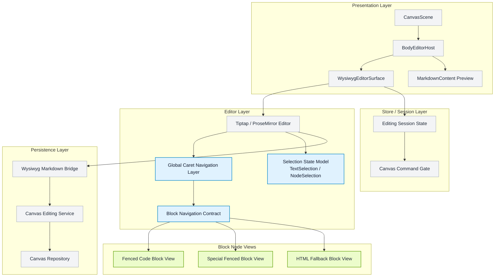

# PRD: Caret Navigation Model
**Product Requirements Document**

| 항목 | 내용 |
|------|------|
| 문서 버전 | v0.2 (Draft) |
| 작성일 | 2026-04-07 |
| 상태 | 초안 |
| 작성자 | Codex |

---

## 1. Overview

### 1.1 Problem Statement

현재 Boardmark WYSIWYG는 block-level rich editing을 점점 지원하고 있지만,  
caret 이동과 block selection 규칙은 아직 공통 모델로 정리되어 있지 않다.

- 일반 paragraph/list/blockquote는 ProseMirror의 기본 text selection 흐름을 따른다.
- fenced code block, special fenced block, html fallback 같은 block는 각자 별도의 node view와 local focus 규칙을 가진다.
- preview와 edit가 같은 surface 안에서 공존하기 시작했지만, keyboard-only 사용자 입장에서 "현재 커서가 텍스트 안에 있는지, 블록 자체가 선택된 상태인지, 블록 내부 편집에 들어간 상태인지"가 아직 완전히 예측 가능하지 않다.
- 이 상태에서 block마다 ad-hoc하게 `ArrowUp`, `ArrowDown`, `Escape`, `Enter`를 처리하면, 새로운 block type이 추가될수록 규칙이 쉽게 분산된다.

즉 지금 필요한 것은 개별 버그 수정이 아니라,  
**WYSIWYG 전체가 공통으로 따를 caret / selection / block navigation 모델**이다.

### 1.2 Why Ad-hoc Handling Is Not Enough

block node마다 방향키를 독자적으로 처리하면 아래 문제가 반복된다.

- 어떤 block는 `ArrowDown`으로 다음 문단으로 나가고, 어떤 block는 내부에서만 멈춘다.
- preview 상태와 edit 상태 사이의 전환 방식이 block마다 달라진다.
- `Escape`의 의미가 block마다 바뀌어 학습 비용이 커진다.
- code block, special fenced block, html fallback을 한 문서 안에서 연속으로 사용할 때 keyboard-only navigation이 끊긴다.
- 이후 block type이 늘어날수록 구현자가 다시 규칙을 결정하게 된다.

이 문서는 그 문제를 막기 위해  
**selection 상태 모델, 상태 전이, block별 방향키 규칙, host/editor 계약을 명시적으로 고정**한다.

### 1.3 Document Goal

이 문서의 목표는 preview-continuous editing 안에서 keyboard-only navigation을 예측 가능하게 만드는 것이다.

- 사용자는 mouse 없이도 paragraph, fenced block, special block, html fallback 사이를 이동할 수 있어야 한다.
- 사용자는 preview 상태의 block를 keyboard나 click으로 선택하고, 같은 자리에서 편집에 진입할 수 있어야 한다.
- 사용자는 block 내부 편집 중 경계에 도달하면 자연스럽게 바깥 문서 흐름으로 탈출할 수 있어야 한다.
- 후속 구현자는 이 문서를 기준으로 selection/caret/block-local focus 모델을 다시 결정하지 않아야 한다.

---

## 2. Product Goal

### 2.1 Primary Goal

Boardmark WYSIWYG의 caret navigation을 다음 원칙으로 통일한다.

- text editing은 일반 문서 편집기처럼 동작한다.
- preview 상태의 block는 선택 가능한 문서 블록처럼 동작한다.
- 선택된 block는 필요한 경우 내부 편집 상태로 진입할 수 있다.
- block 내부 편집 중 경계에서는 이전/다음 문서 흐름으로 탈출할 수 있다.
- 동일한 상호작용 모델이 note, edge label, body-bearing object 전반에 재사용된다.

### 2.2 Success Criteria

- `ArrowUp/ArrowDown`만으로 text block와 block node 사이를 오갈 수 있다.
- preview 상태의 fenced code block, special fenced block를 click 또는 keyboard로 선택할 수 있다.
- 선택된 fenced/special block는 별도 패널 없이 같은 surface에서 편집 상태로 진입한다.
- block 내부 첫/마지막 경계에서 문서 바깥으로 탈출할 수 있다.
- `Escape`는 block 내부 편집을 종료하고 오브젝트 선택 상태로 복귀시킨다.

---

## 3. Scope And Non-Goals

### 3.1 In Scope

- WYSIWYG body editing 전반의 caret navigation 모델
- `text selection`, `node selection`, `block-internal focus`, `preview state` 정의
- 일반 paragraph/list/blockquote와 block node 사이의 이동 규칙
- fenced code block
- special fenced block (`mermaid`, `sandpack`)
- html fallback block
- `Arrow*`, `Enter`, `Escape`, `Tab`, mouse click의 의미
- 이후 구현이 따라야 할 host/editor contract

### 3.2 Out Of Scope

- table navigation 전체
- gap cursor를 1차 기본 모델로 삼는 설계
- 모바일 touch-first navigation
- multi-cursor / collaboration
- block drag-and-drop reorder
- toolbar 세부 UX 설계
- preview renderer 자체의 visual redesign

---

## 4. Core Interaction Model

### 4.1 State Types

이 문서는 WYSIWYG 안의 caret 관련 상태를 아래 네 가지로 고정한다.

#### `text selection`

- 일반 paragraph/list/blockquote 내부의 text range 또는 collapsed caret
- ProseMirror의 일반 `TextSelection` 흐름을 따른다.

#### `node selection`

- fenced code block, special fenced block, html fallback 같은 block 자체가 선택된 상태
- 이 상태에서는 문서 흐름 안의 block 단위 선택으로 취급한다.

#### `block-internal focus`

- block 내부 raw editor 또는 specialized editable surface가 focus된 상태
- 예:
  - fenced code block raw markdown textarea
  - special fenced block source editor
  - html fallback textarea

#### `preview state`

- block가 렌더된 결과만 보이고 내부 text editor는 닫혀 있는 상태
- block는 문서 안에 존재하지만 내부 caret은 없다.

### 4.2 State Transition Model

기본 전이 규칙은 아래와 같다.

1. 일반 text 흐름 안에서는 `text selection`이 기본 상태다.
2. keyboard navigation으로 block에 도달하면 먼저 `node selection`이 된다.
3. block preview를 click하면 caret가 그 block 내부로 이동하고 곧바로 `block-internal focus`가 된다.
4. `block-internal focus`에서 `Escape`가 적용되면 caret가 사라지고 host-level 오브젝트 선택 상태로 돌아간다.
5. `node selection`이 해제되면 block는 다시 `preview state`로 본다.

### 4.3 Base Entry Model

기본 진입 모델은 **선택되면 편집**으로 고정한다.

- block가 선택되지 않았으면 preview
- block가 `node-selected`이거나 내부 editable에 focus가 있으면 사용자는 이미 그 block 편집 문맥에 들어온 것으로 본다
- preview click은 곧바로 caret 이동과 편집 시작을 의미한다
- keyboard로 `node selection`에 도달한 뒤에는 필요할 때 내부 caret 진입을 허용한다
- 별도 `Edit source` 버튼은 기본 모델이 아니다

이 규칙은 fenced code block과 special fenced block에 동일하게 적용한다.

---

## 5. Navigation Rules

### 5.1 Global Principles

전역 원칙은 아래처럼 고정한다.

- block는 화살표를 독점하지 않는다.
- 내부에서 더 이동할 수 있으면 내부 이동이 우선한다.
- 내부 경계에 도달했을 때만 문서 바깥 selection으로 전환한다.
- `TextSelection`과 `NodeSelection` 전환은 editor 전역 navigation layer가 책임진다.
- 개별 block node view는 "내부 첫 위치/마지막 위치 여부"를 기준으로 탈출 가능성만 제공하고, 문서 전체 navigation policy를 독자적으로 정의하지 않는다.
- block 간 이동은 `ArrowUp/ArrowDown`이 담당한다.
- `ArrowLeft/ArrowRight`는 block 간 이동에 사용하지 않고 caret의 좌우 이동만 담당한다.

### 5.2 `ArrowLeft` / `ArrowRight`

- 일반 text block에서는 일반 caret 이동만 수행한다
- block-internal focus 상태에서도 내부 caret 이동만 수행한다
- `ArrowLeft/Right`는 block 간 selection 전환에 사용하지 않는다

### 5.3 `ArrowUp` / `ArrowDown`

- 일반 text block에서는 일반 문서 편집기의 수직 caret 이동 우선
- node-selected block에서는 이전/다음 인접 editable 위치로 이동
- block-internal focus 상태에서는:
  - 내부에서 더 위/아래로 이동할 수 있으면 내부 이동
  - 첫 줄 첫 칼럼 또는 마지막 줄 끝에 도달했을 때만 이전/다음 블록으로 탈출

### 5.4 Paragraph / List / Blockquote

- 기본 ProseMirror text selection 규칙 유지
- 위/아래 이동 중 block boundary에 닿을 때만 `node selection`으로 넘어감
- list item, blockquote도 일반 text block처럼 취급한다

### 5.5 Fenced Code Block

- preview 상태: 렌더 결과 표시
- selected/focused 상태: raw fenced markdown 편집
- preview click은 곧바로 raw editor caret 진입으로 이어진다
- keyboard selection으로 도달했을 때는 먼저 `node selection`을 획득하고, 필요 시 내부 caret 진입을 허용한다
- 첫 줄 첫 칼럼의 `ArrowUp`은 이전 블록으로 탈출
- 마지막 줄 끝의 `ArrowDown`은 다음 블록으로 탈출
- `ArrowLeft/Right`는 raw text 안에서 일반 caret 이동만 수행한다
- `Enter`는 raw text 안에서 일반 개행
- `Tab`은 focus 이동보다 indentation 우선

### 5.6 Special Fenced Block

- preview 상태: renderer 유지
- selected/focused 상태: fenced code block와 동일한 raw source editor 표시
- 별도 `Edit source` 버튼은 기본 모델이 아니다
- preview click은 곧바로 source editor caret 진입으로 이어진다
- keyboard selection으로 도달한 경우에도 편집 경험은 fenced code block와 동일한 축을 따른다
- `Escape`는 block 내부 편집을 종료하고 host-level 오브젝트 선택 상태로 복귀시킨다
- `ArrowUp/Down` 탈출 규칙은 일반 fenced code block과 같은 축을 따른다
- special block 편집 상태는 렌더 preview가 아니라 fenced code block와 동일한 코드 편집 경험을 제공해야 한다

### 5.7 HTML Fallback

- raw editor를 가진 block-local fallback으로 취급한다
- code block와 같은 경계 탈출 규칙을 적용한다
- 내부 편집 중 `Escape`는 host-level 오브젝트 선택 상태로 복귀시킨다

---

## 6. Command Semantics

### 6.1 `Enter`

- 일반 text block에서는 문단 분리 또는 새 줄
- node-selected fenced/special block에서는 내부 caret 진입 허용 가능
- block-internal focus 상태에서는 block 종류에 맞는 일반 입력 동작 유지

### 6.2 `Escape`

- `block-internal focus`가 있으면 caret를 제거하고 host-level 오브젝트 선택 상태로 복귀한다
- 이미 block가 선택된 상태에서도 `Escape`는 같은 방향의 상위 선택 복귀로 해석한다
- 같은 key를 block마다 다르게 해석하지 않는다

### 6.3 `Tab`

- code block과 html fallback에서는 indentation 우선
- table traversal은 이번 문서 범위 밖
- 일반 text block에서는 editor 기본 동작을 유지하되, 이후 accessibility 기준과 충돌하지 않도록 후속 검토 가능

### 6.4 Mouse Click

- preview click은 caret 이동과 편집 시작
- 편집 가능한 내부 surface click은 caret/focus
- preview 상태와 edit 상태가 같은 layout box를 공유하더라도 click 의미는 명확해야 한다

---

## 7. Host And Editor Contract

### 7.1 Global Navigation Layer Responsibility

전역 editor navigation layer가 필요하다.

- block node view마다 완전히 제각각 Arrow key를 먹지 않는다
- 문서 전체의 selection 전환 규칙은 editor 전역 layer가 가진다
- block node는 내부 경계와 진입 가능성만 노출한다
- editor selection/focus가 편집 상태의 source of truth가 되고, host/store는 이를 관찰해 상위 interaction을 정렬한다

### 7.2 Block Node Minimum Contract

각 block node는 최소 아래 판단을 제공할 수 있어야 한다.

- 내부 첫 위치인가
- 내부 마지막 위치인가
- preview 상태인가
- internal focus 진입 가능 상태인가
- block-local exit가 가능한가

### 7.3 Host / Store Visibility

host/store는 아래 상태를 구분할 수 있어야 한다.

- `text selection`
- `node selection`
- `block-local source/editing`

기본 source of truth는 editor selection/focus다.

- store는 editor 상태를 파생해서 command gating과 host-level 오브젝트 selection에 사용한다
- store가 editor보다 먼저 독자적인 caret state를 정의하지 않는다

이 문서는 gap cursor를 1차 기본 모델로 삼지 않는다.

- 필요한 경우 후속 hardening 항목으로 기록한다
- 기본 구현은 `TextSelection`과 `NodeSelection` 전환으로 모델링한다

---

## 8. Acceptance Scenarios

후속 구현은 아래 시나리오를 모두 만족해야 한다.

- paragraph 끝에서 `ArrowDown`으로 fenced code block selection 진입
- fenced code block preview 상태에서 click으로 편집 진입
- fenced code block 첫 줄 첫 칼럼에서 `ArrowUp` 시 이전 문단으로 탈출
- fenced code block 마지막 줄 끝에서 `ArrowDown` 시 다음 문단으로 탈출
- special fenced block preview에서 click 시 source 편집 진입
- special fenced block source에서 `Escape` 시 오브젝트 선택 상태로 복귀
- special fenced block source 경계에서 `ArrowUp/Down` 탈출
- mouse focus와 keyboard navigation 혼합 시 selection이 깨지지 않음
- canvas pan/drag보다 text navigation이 우선되는 경계 유지

---

## 9. Open Follow-ups

이 문서는 아래를 의도적으로 후속으로 남긴다.

- table navigation 모델
- gap cursor 도입 필요성 검토
- mobile / touch-first caret navigation
- block handle, drag affordance와 keyboard navigation의 공존 방식
- toolbar와 block navigation의 focus management 세부 규칙

---

## 10. Assumptions

- 이 문서는 `docs/features/caret-navigation-model/README.md` 한 파일로 시작한다.
- 대상은 WYSIWYG body editing 전반이며, note / edge / object-body 공통 규칙으로 쓴다.
- 현재 fenced block의 "click 시 즉시 편집 진입" 모델을 baseline으로 반영한다.
- table은 이번 문서 범위에서 제외한다.
- 이 문서는 구현을 직접 하지 않고, 후속 구현과 테스트 계획의 source of truth 역할을 한다.

---

## 11. Implementation Plan

이 섹션은 위 interaction contract를 실제 코드 구조에 적용하기 위한 단계별 구현 계획이다.

핵심 원칙은 아래와 같다.

- caret navigation은 개별 block node view의 ad-hoc keydown 처리로 끝내지 않는다.
- 전역 editor navigation layer와 block-local capability를 분리한다.
- preview / node selection / block-internal focus 전환은 문서 수준 모델로 구현한다.
- 기존 source-of-truth와 persistence 경계는 바꾸지 않는다.

### 11.1 Layer / Component Diagram

아래 다이어그램은 caret navigation 구현 시 어떤 레이어와 컴포넌트가 관여하는지,  
그리고 이번 작업에서 새로 추가되거나 확장되는 책임이 어디인지 보여준다.

- 회색: 기존에 이미 존재하는 주요 경계
- 파란색: 이번 작업에서 새로 추가되거나 실질적으로 확장되는 경계
- 연두색: 현재 구조를 재사용하지만 navigation contract와 직접 연결되는 block UI 경계



### 11.2 Diagram Reading Notes

- `Global Caret Navigation Layer`
  - 이번 작업의 핵심 추가 축이다.
  - 문서 전체의 `Arrow*`, `Enter`, `Escape` 의미를 block별 구현 위에 덮는 상위 policy layer다.
- `Selection State Model`
  - `text selection`, `node selection`, `block-internal focus`, `preview state`를 코드 레벨에서 정리하는 기준 경계다.
- `Block Navigation Contract`
  - 각 block node view가 전역 navigation layer에 제공해야 하는 최소 capability 집합이다.
- `Fenced Code Block View`, `Special Fenced Block View`, `HTML Fallback Block View`
  - 기존 block UI를 재사용하되, preview/edit 전환과 경계 탈출 규칙 때문에 navigation contract에 맞게 확장된다.

### 11.3 Planned File Structure

구현 시 파일 구조는 아래처럼 가져가는 것을 기본안으로 삼는다.

- 목표:
  - 전역 navigation policy와 block-local logic를 분리한다.
  - 기존 editor/scene/store 책임을 크게 흔들지 않는다.
  - 새 block type이 추가되어도 navigation layer를 재사용할 수 있게 한다.

```text
packages/canvas-app/src/
  components/
    editor/
      body-editor-host.tsx                       # existing, host-level focus/blur/commit boundary
      wysiwyg-editor-surface.tsx                 # existing, editor mount + editor-wide event bridge
      wysiwyg-markdown-bridge.tsx                # existing, tiptap extensions + markdown round-trip
      caret-navigation/
        editor-navigation-plugin.ts              # new, global Arrow/Enter/Escape policy
        selection-state.ts                       # new, text/node/block-local state helpers
        block-navigation-contract.ts             # new, shared block capability types/helpers
        navigation-targets.ts                    # new, previous/next block target resolution helpers
      views/
        code-block-node-view.tsx                 # existing, fenced code block preview/edit shell
        special-fenced-block-view.tsx            # existing, mermaid/sandpack preview/edit shell
        html-fallback-block-view.tsx             # existing, raw fallback block editor
    scene/
      canvas-scene.tsx                           # existing, canvas interaction boundary
  store/
    canvas-store-types.ts                        # existing, editing state contract
    canvas-store-slices.ts                       # existing, command gating / flush / session transitions
```

파일별 기본 책임은 아래처럼 고정한다.

- `body-editor-host.tsx`
  - host-level blur/commit/cancel 경계
  - editor가 만든 selection 변화와 canvas host-level interaction의 연결
- `wysiwyg-editor-surface.tsx`
  - Tiptap editor mount
  - editor-wide key handling entrypoint
  - global navigation plugin 연결
- `wysiwyg-markdown-bridge.tsx`
  - markdown <-> editor state round-trip
  - block extension 등록
  - navigation plugin 주입
- `caret-navigation/editor-navigation-plugin.ts`
  - 전역 `Arrow*`, `Enter`, `Escape` 규칙
  - `TextSelection` / `NodeSelection` 전환
  - block-local handler가 탈출을 위임하는 상위 policy
- `caret-navigation/selection-state.ts`
  - 현재 selection이 text / node / block-local인지 판별
  - preview/edit 전환 판단 helper
- `caret-navigation/block-navigation-contract.ts`
  - block node가 제공해야 하는 공통 capability 정의
  - 내부 첫 위치 / 마지막 위치 / 진입 가능 여부 / 탈출 가능 여부 모델
- `caret-navigation/navigation-targets.ts`
  - 현재 selection 기준 이전/다음 logical target 계산
  - 문단과 block node 간 전환 보조
- `views/code-block-node-view.tsx`
  - raw fenced markdown block의 local behavior
  - internal boundary 판별을 contract 형태로 제공
- `views/special-fenced-block-view.tsx`
  - preview renderer와 source editor 전환
  - special block local exit / focus behavior
- `canvas-scene.tsx`
  - canvas drag/pan보다 editor navigation이 우선되어야 하는 host 경계 유지
- `canvas-store-types.ts`, `canvas-store-slices.ts`
  - selection model 전체를 재구현하지는 않지만, block-local focus / command gating / session transition을 editor contract와 정렬

이 구조의 핵심은 아래다.

- 전역 navigation policy는 `caret-navigation/` 아래로 모은다.
- block별 local behavior는 `views/` 아래에 둔다.
- scene/store는 editor 내부 caret 이동을 직접 구현하지 않고, host/session/canvas 경계만 담당한다.

### Phase 1. Selection State Grounding

목표:

- 현재 WYSIWYG surface 안에서 `text selection`, `node selection`, `block-internal focus`를 코드 레벨에서 구분 가능한 상태로 정리한다.

작업:

- ProseMirror selection 기준으로 text vs node selection 판별 helper를 추가한다.
- block node view가 현재 `preview state`인지 `edit state`인지 판단하는 공통 helper를 만든다.
- fenced code block, special fenced block, html fallback이 모두 같은 selection-state contract를 따르도록 정리한다.

완료 기준:

- 개별 block view는 더 이상 “자기만의 진입 모델”을 갖지 않는다.
- selection 상태를 기준으로 preview/edit 렌더 여부를 일관되게 판별할 수 있다.

### Phase 2. Global Navigation Layer 도입

목표:

- `ArrowUp`, `ArrowDown`, `ArrowLeft`, `ArrowRight`, `Enter`, `Escape`의 전역 의미를 editor 차원에서 고정한다.

작업:

- WYSIWYG editor extension 또는 ProseMirror plugin으로 global navigation keymap을 도입한다.
- 전역 keymap은 아래만 담당한다.
  - text block와 node block 사이의 `ArrowUp/Down` selection 전환
  - node-selected block에서 이전/다음 문서 위치로 이동
  - click/`Enter`에 의한 block-local editor 진입과 `Escape`에 의한 오브젝트 selection 복귀 정책
- 개별 block node view는 내부 경계 판단만 수행하고, 바깥 문서 selection 이동은 전역 layer로 넘긴다.

완료 기준:

- `Arrow*`가 block마다 따로 정의되지 않고 문서 수준에서 일관되게 동작한다.
- 새 block type이 추가되어도 전역 navigation policy를 재정의할 필요가 줄어든다.

### Phase 3. Block Capability Contract 정리

목표:

- fenced code block, special fenced block, html fallback이 공통 navigation contract를 노출하도록 정리한다.

작업:

- 각 block에 대해 최소 capability를 정의한다.
  - 내부 첫 위치 판별
  - 내부 마지막 위치 판별
  - preview -> edit 진입 가능 여부
  - block-local exit 가능 여부
- fenced code block
  - raw fenced markdown editor 내부 첫/마지막 경계 판별
- special fenced block
  - preview click 시 source editor caret 진입
  - 편집 상태에서 fenced code block와 동일한 source editing UX 유지
- html fallback
  - raw source 편집기 경계 판별

완료 기준:

- 전역 navigation layer는 block 내부 구현을 몰라도 공통 capability만으로 탈출/진입 결정을 할 수 있다.

### Phase 4. Fenced And Special Block Navigation 구현

목표:

- 현재 가장 사용 빈도가 높은 fenced block 계열에 keyboard navigation을 먼저 적용한다.

작업:

- fenced code block preview 상태에서:
  - click 시 즉시 편집 진입
  - `Enter`로 내부 caret 진입
- fenced code block 내부에서:
  - 첫 줄 첫 칼럼 `ArrowUp` 탈출
  - 마지막 줄 끝 `ArrowDown` 탈출
  - `ArrowLeft/Right`는 일반 caret 이동 유지
- special fenced block도 같은 축을 따르되:
  - preview renderer 유지
  - 편집 상태에서 fenced code block와 동일한 source editor 경험 제공
  - `Escape`는 오브젝트 selection 상태 복귀
  - 내부 경계에서 문서 흐름으로 탈출

완료 기준:

- code block과 special block 사이의 navigation 체감이 달라지지 않는다.
- keyboard-only로 block 진입/편집/탈출이 가능하다.

### Phase 5. Host / Store / Command 정렬

목표:

- editor 내부 selection 모델이 host/store/session state와 충돌하지 않도록 정리한다.

작업:

- store의 `editingState.blockMode`와 block-local focus 상태를 navigation contract와 정렬한다.
- canvas command gating이 `block-internal focus`와 `node selection`을 구분하도록 보강한다.
- blur/commit/cancel과 navigation에 의한 selection 이동이 충돌하지 않도록 host-level blur semantics를 재검토한다.

완료 기준:

- `Escape`, blur, selection 이동이 서로 다른 의미를 안정적으로 가진다.
- editor navigation 때문에 의도치 않은 flush/commit/cancel이 발생하지 않는다.

### Phase 6. 테스트와 검증

목표:

- PRD의 acceptance scenario가 실제 회귀 테스트로 대응되도록 한다.

자동 테스트 범위:

- paragraph 끝에서 `ArrowDown`으로 fenced block selection 진입
- fenced block preview 상태에서 click으로 edit 진입
- fenced block 첫/마지막 경계 탈출
- special fenced block preview -> source 진입
- special fenced block source -> 오브젝트 selection 복귀
- special fenced block 경계 탈출
- mouse selection과 keyboard navigation 혼합
- editor navigation 중 canvas command gating 유지

수동 검증 범위:

- note body
- edge label
- body-bearing object host
- mixed document 안에서 paragraph / code block / special block / html fallback 연속 배치

완료 기준:

- 본 문서의 acceptance checklist가 자동/수동 검증 항목으로 매핑된다.

### Phase 7. 후속 확장

후속 단계로 분리할 항목:

- table navigation 모델
- gap cursor 도입 여부
- mobile/touch caret navigation
- block handle / drag affordance와 keyboard navigation 공존
- richer block type 확장

---

## 12. Implementation Notes

후속 구현자는 아래를 기본값으로 사용한다.

- 첫 구현은 `NodeSelection`과 `TextSelection` 전환을 기본 메커니즘으로 사용한다.
- gap cursor는 도입 필요가 생기기 전까지 기본 모델이 아니다.
- block node view는 local keydown 로직을 최소화하고, 내부 경계 판단과 local editing behavior만 가진다.
- 전역 navigation policy는 editor extension/plugin 쪽에 둔다.
- editor selection/focus를 편집 상태의 source of truth로 사용한다.
- store와 scene은 editor selection 모델을 재구현하지 않고, host-level session state와 command gating만 담당한다.
