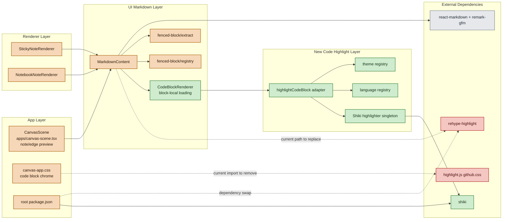

# Shiki Code Highlight PRD

## 1. 목적

이 문서는 Boardmark의 markdown code block 하이라이팅을 현재의 `highlight.js` 기반 구현에서 `Shiki` 기반 구현으로 전환하기 위한 제품 요구사항과 구현 계획을 하나의 문서로 고정한다.

이번 문서에서 확정하는 범위는 아래와 같다.

- fenced code block 하이라이터를 `rehype-highlight`에서 `Shiki`로 교체한다.
- `packages/ui` 안에 공용 `code-highlight` 경계를 도입한다.
- 내장 theme 세트와 language alias 정책을 명시적 registry로 고정한다.
- 이번 구현은 기본 theme `vscode-dark-modern` 적용에 집중한다.
- note preview와 edge preview는 같은 adapter와 같은 기본 theme를 사용한다.

이번 문서에서 제외하는 범위는 아래와 같다.

- theme picker UI
- 문서 frontmatter 기반 `codeTheme` 저장/복원
- rich code editing
- line number, copy button, folding, execution

목표는 단순히 “색이 바뀌는 것”이 아니다.  
목표는 **Boardmark 안에서 코드 예제, 설정 파일, 터미널 출력, diff를 읽기 좋고 일관된 품질로 보여 주는 렌더링 계약**을 확정하는 것이다.

---

## 2. 결정 요약

이번 문서의 결정은 아래로 고정한다.

- 하이라이트 엔진은 `Shiki`를 사용한다.
- 공용 경계는 `packages/ui/src/code-highlight/`에 둔다.
- `MarkdownContent`는 하이라이터 구현을 직접 알지 않고 `highlightCodeBlock()` 결과만 소비한다.
- 기본 theme는 `vscode-dark-modern`이다.
- 내장 theme는 아래 다섯 개만 v1에서 지원한다.
  - `vscode-dark-modern`
  - `vscode-light`
  - `one-dark`
  - `one-light`
  - `github-dark`
- 미지정 언어와 미지원 언어는 모두 plain code fallback으로 렌더한다.
- custom fenced renderer가 등록된 언어는 기존 registry 경로를 계속 우선한다.
- block chrome과 background는 app CSS가 담당하고, token color만 Shiki 결과가 담당한다.
- code block loading은 block 단위로만 지연되고, `MarkdownContent` 전체 렌더는 지연시키지 않는다.

---

## 3. 현재 상태

현재 구현은 아래 구조로 동작한다.

- `packages/ui/src/components/markdown-content.tsx`
  - `react-markdown`
  - `remark-gfm`
  - `rehype-highlight`
  조합으로 markdown를 렌더한다.
- 일반 fenced code block은 `rehype-highlight`가 처리한다.
- custom fenced renderer는 `extractFencedBlock()`와 `getFencedBlockRenderer()` 경로를 통해 분기된다.
- `packages/canvas-app/src/styles/canvas-app.css`는 `highlight.js/styles/github.css`를 전역 import 한다.
- code block 배경, padding, radius, overflow는 app CSS가 별도로 덮어쓴다.

preview surface 공유 현황은 아래와 같다.

- `packages/canvas-app/src/components/scene/canvas-scene.tsx`의 note preview는 `MarkdownContent`를 사용한다.
- 같은 파일의 edge label preview도 `MarkdownContent`를 사용한다.
- `packages/canvas-renderer/src/builtins/note/sticky-note-renderer.tsx`
  와 `packages/canvas-renderer/src/builtins/note/notebook-note-renderer.tsx`도 `MarkdownContent`를 사용한다.

즉 현재도 note/edge/code block 렌더링의 핵심 경계는 이미 `MarkdownContent` 하나로 모여 있다.  
문제는 이 경계 안에서 하이라이트 엔진, theme, language alias, fallback 정책이 제품 계약으로 드러나지 않는다는 점이다.

현재 구조의 한계는 아래와 같다.

- theme가 `highlight.js` CSS import 한 줄에 사실상 고정되어 있다.
- VS Code 계열 테마를 제품의 1급 개념으로 다루기 어렵다.
- language alias와 fallback 정책이 중앙 registry 없이 암묵적으로 흩어진다.
- note preview와 edge preview가 같은 컴포넌트를 써도, theme contract는 명시되어 있지 않다.
- `MarkdownContent`가 `rehype-highlight`에 직접 결합되어 있어 하이라이터 교체 경계가 없다.

---

## 4. 제품 목표

### 4.1 핵심 목표

- Boardmark는 fenced code block을 현재보다 더 읽기 좋은 품질로 렌더해야 한다.
- VS Code 계열의 익숙한 theme 품질을 기본 제공해야 한다.
- web과 desktop에서 같은 markdown source에 대해 실질적으로 같은 결과를 보여야 한다.
- 언어 alias, theme id, fallback 정책을 테스트 가능한 공용 계약으로 올려야 한다.
- custom fenced renderer와 일반 code highlight 경계를 명확히 분리해야 한다.

### 4.2 UX 목표

- 대부분의 fenced code block은 info string만으로 예상 가능한 highlighting을 얻는다.
- 언어가 없거나 틀려도 깨진 UI 대신 읽기 가능한 plain code block으로 보인다.
- 긴 코드 블럭은 가로 스크롤로 읽을 수 있어야 한다.
- inline code는 기존 typography 규칙을 유지하고 code theme의 영향을 받지 않는다.
- note와 edge label에서 같은 코드가 보이면 같은 theme와 같은 token 분류를 가져야 한다.

### 4.3 기술 목표

- 하이라이터는 하나의 module boundary 뒤에서 초기화되고 재사용되어야 한다.
- theme id 정규화와 language alias 정규화는 중앙 registry만 담당해야 한다.
- Shiki 초기화 비용은 반복 렌더마다 다시 발생하지 않아야 한다.
- block chrome과 token color의 책임을 분리해 이후 theme 확장에 막힘이 없어야 한다.

---

## 5. 비목표

- theme picker UI 추가
- app preference 저장
- 문서 frontmatter 기반 `codeTheme` 저장/복원
- note별 또는 block별 theme override
- editor 안에서 live syntax highlighting 제공
- line number, copy button, code folding
- remote theme 또는 arbitrary theme import 허용

v1은 **내부 renderer 계약과 기본 가독성 품질 확보**에만 집중한다.

---

## 6. 제품 요구사항

### 6.1 Theme 모델

v1의 canonical theme id는 아래 다섯 개다.

- `vscode-dark-modern`
- `vscode-light`
- `one-dark`
- `one-light`
- `github-dark`

정책은 아래와 같다.

- app 기본 theme는 `vscode-dark-modern`으로 고정한다.
- 사용자가 theme를 선택하는 UI는 없다.
- 문서 source에 theme를 저장하지 않는다.
- resolver는 미지원 theme 입력을 받아도 조용히 실패하지 않고 `vscode-dark-modern`으로 정규화한다.
- 이번 구현 범위는 기본 theme 적용에 집중하지만, 내부 registry는 light/dark theme 모두를 수용할 수 있게 설계한다.

### 6.2 Language 모델

v1 canonical language id는 아래 범위를 지원한다.

- 프로그래밍 언어
  - `typescript`
  - `tsx`
  - `javascript`
  - `jsx`
  - `python`
  - `go`
  - `rust`
  - `java`
  - `kotlin`
  - `swift`
  - `c`
  - `cpp`
- 웹/마크업 언어
  - `html`
  - `css`
  - `scss`
  - `markdown`
  - `xml`
- 설정/데이터 언어
  - `json`
  - `jsonc`
  - `yaml`
  - `toml`
  - `ini`
- 쉘/도구 언어
  - `bash`
  - `shellsession`
  - `powershell`
- 문서/변경 표현
  - `diff`
  - `sql`
  - `graphql`
  - `dockerfile`

v1 alias 정책은 아래로 고정한다.

- `ts` -> `typescript`
- `js` -> `javascript`
- `md` -> `markdown`
- `yml` -> `yaml`
- `sh` -> `bash`
- `zsh` -> `bash`
- `shell` -> `bash`
- `console` -> `shellsession`
- `terminal` -> `shellsession`
- `patch` -> `diff`

정책은 아래와 같다.

- language alias는 중앙 registry에서만 해석한다.
- 언어 미지정 fenced block은 plain code fallback으로 렌더한다.
- 미지원 언어 또는 오타는 plain code fallback으로 렌더한다.
- custom fenced renderer 등록 대상은 language resolver보다 renderer registry가 먼저 처리한다.

### 6.3 렌더링 계약

- note preview와 edge preview는 동일한 `highlightCodeBlock()` 결과를 사용해야 한다.
- `MarkdownContent`는 일반 fenced code block 렌더링에서만 code highlight adapter를 호출한다.
- inline code는 Shiki를 거치지 않는다.
- block container의 배경, radius, padding, overflow는 app CSS가 유지한다.
- code theme는 token color와 token-level markup만 담당하고, block background/chrome에는 관여하지 않는다.
- light theme를 포함한 모든 theme는 원본 token palette를 그대로 사용하며, Boardmark가 대비 보정을 추가하지 않는다.
- 각 code block은 독립적으로 loading state를 표시한 뒤 highlighted 결과로 전환된다.
- code block loading은 해당 block에만 영향을 주고, `MarkdownContent` 전체 렌더와 주변 markdown layout은 지연시키지 않는다.

### 6.4 성능과 일관성

- highlighter 인스턴스는 module-level lazy singleton으로 초기화한다.
- theme와 language는 v1 지원 집합만 선로딩한다.
- 같은 session에서 반복 렌더 시 highlighter를 재생성하지 않는다.
- web과 desktop은 동일 dependency 버전과 동일 registry를 사용한다.

---

## 7. 기술 설계

### 7.1 모듈 경계

새 경계는 `packages/ui/src/code-highlight/`에 둔다.

이 경계의 책임은 아래 네 가지로 제한한다.

- theme id 정규화
- language id 정규화
- Shiki highlighter 초기화/재사용
- plain fallback 또는 highlighted token 결과 생성

`MarkdownContent`는 markdown tree traversal과 fenced block 분기만 담당한다.  
하이라이트 엔진 선택, theme 선택, alias 해석, fallback 정책은 모두 새 경계 밖으로 이동한다.

### 7.2 공개 인터페이스

v1 public surface는 아래 형태로 고정한다.

```ts
export type CodeThemeId =
  | 'vscode-dark-modern'
  | 'vscode-light'
  | 'one-dark'
  | 'one-light'
  | 'github-dark'

export type CodeLanguageId =
  | 'typescript'
  | 'tsx'
  | 'javascript'
  | 'jsx'
  | 'python'
  | 'go'
  | 'rust'
  | 'java'
  | 'kotlin'
  | 'swift'
  | 'c'
  | 'cpp'
  | 'html'
  | 'css'
  | 'scss'
  | 'markdown'
  | 'xml'
  | 'json'
  | 'jsonc'
  | 'yaml'
  | 'toml'
  | 'ini'
  | 'bash'
  | 'shellsession'
  | 'powershell'
  | 'diff'
  | 'sql'
  | 'graphql'
  | 'dockerfile'

export type ResolvedCodeLanguage =
  | { kind: 'highlighted'; language: CodeLanguageId }
  | { kind: 'plain' }

export type HighlightedToken = {
  content: string
  color?: string
  fontStyle?: 'normal' | 'italic'
  fontWeight?: 'normal' | 'bold'
  textDecoration?: 'none' | 'underline'
}

export type HighlightedLine = {
  tokens: HighlightedToken[]
}

export type HighlightedCodeBlock =
  | {
      kind: 'highlighted'
      theme: CodeThemeId
      language: CodeLanguageId
      lines: HighlightedLine[]
    }
  | {
      kind: 'plain'
      theme: CodeThemeId
      lines: string[]
    }

export function resolveCodeTheme(input?: string): CodeThemeId
export function resolveCodeLanguage(input?: string): ResolvedCodeLanguage
export function highlightCodeBlock(input: {
  code: string
  language?: string
  theme?: string
}): Promise<HighlightedCodeBlock>
```

결정 이유는 아래와 같다.

- raw HTML을 `MarkdownContent`가 그대로 신뢰하지 않게 해 렌더링 제어권을 유지한다.
- block chrome과 token 스타일 책임을 분리하기 쉽다.
- plain fallback과 highlighted 결과를 같은 React 렌더 경로로 다룰 수 있다.

### 7.3 렌더링 흐름

일반 fenced code block 처리 흐름은 아래로 고정한다.

1. `MarkdownContent`가 `pre` renderer에서 fenced block을 추출한다.
2. custom renderer registry에 해당 language가 있으면 기존 경로를 사용한다.
3. 없으면 code block 전용 renderer가 loading state를 먼저 그린다.
4. 같은 renderer가 `highlightCodeBlock({ code, language, theme })`를 비동기로 호출한다.
5. 하이라이트 결과가 준비되면 해당 code block만 교체 렌더링한다.
6. 실패 시 해당 code block만 plain fallback으로 내려간다.
7. `MarkdownContent` 본문과 다른 markdown 요소는 이 비동기 작업 때문에 지연되지 않는다.
8. resolver는 theme를 `vscode-dark-modern` 중심의 canonical id로 정규화한다.
9. resolver는 language alias를 canonical id로 정규화하거나 plain fallback으로 내린다.
10. highlighter는 token line 구조를 반환한다.
11. code block renderer는 `<pre><code>`를 직접 렌더하고 token span만 결과에 맞게 만든다.

### 7.4 Shiki 초기화 정책

- `Shiki` highlighter는 `packages/ui/src/code-highlight/highlighter.ts`에서 lazy singleton promise로 관리한다.
- 초기화 시 v1 theme 5개와 language 지원 집합을 함께 등록한다.
- `highlightCodeBlock()`은 이미 생성된 highlighter를 재사용한다.
- highlighter 생성 실패는 삼키지 않고 호출자에게 에러로 전달한다.

### 7.5 CSS 책임 분리

CSS 정책은 아래로 고정한다.

- `packages/canvas-app/src/styles/canvas-app.css`에서 `highlight.js/styles/github.css` import를 제거한다.
- `.markdown-content pre`, `.markdown-content pre code`의 container 규칙은 유지한다.
- token 색상은 React inline style 또는 token class 기반 local render에서만 적용한다.
- Shiki theme는 token 색상만 제공하고, block background는 기존 app surface 규칙을 유지한다.
- light theme라도 block background는 별도로 밝게 맞추지 않으며, token palette 보정도 하지 않는다.

### 7.6 레이어와 의존관계 다이어그램

색상 기준은 아래와 같다.

- 주황: 이번 작업의 영향을 받는 기존 컴포넌트
- 초록: 이번 작업에서 새로 추가되는 컴포넌트/경계
- 빨강: 교체되거나 제거되는 기존 의존성
- 회색: 그대로 유지되는 외부/주변 요소



다이어그램 해석 포인트는 아래와 같다.

- `MarkdownContent`는 계속 핵심 진입점이지만, 일반 code block은 새 `CodeBlockRenderer`와 `code-highlight` 경계 뒤로 이동한다.
- `fenced-block/registry`는 유지되며 `mermaid` 같은 custom renderer는 계속 기존 우선순위를 가진다.
- `canvas-app.css`는 token 색이 아니라 code block chrome만 계속 소유한다.
- `rehype-highlight`와 `highlight.js` CSS import는 제거 대상이고, 새 외부 의존성은 `shiki` 하나로 수렴한다.

---

## 8. 구현 계획

### Phase 1. Dependency 교체와 경계 도입

- root `package.json`에서 `highlight.js`와 `rehype-highlight`를 제거하고 `shiki`를 추가한다.
- `packages/ui/src/code-highlight/`에 theme registry, language registry, highlighter 초기화, adapter를 추가한다.
- 일반 fenced code block 전용 비동기 renderer를 추가하고 block-local loading state를 정의한다.
- `packages/ui/src/index.ts`에서 필요한 public surface만 export 한다.
- `packages/ui/src/components/markdown-content.tsx`에서 `rehypePlugins={[rehypeHighlight]}`를 제거한다.

완료 기준:

- 일반 fenced code block이 더 이상 `rehype-highlight`에 의존하지 않는다.
- `MarkdownContent`는 새 adapter를 통해서만 code highlight를 수행한다.
- code block 하나의 loading이 전체 markdown 렌더를 막지 않는다.

### Phase 2. Theme registry와 기본 theme 연결

- canonical theme id 다섯 개를 registry로 고정한다.
- `resolveCodeTheme()`는 입력이 없거나 미지원 값이면 `vscode-dark-modern`을 반환한다.
- note preview와 edge preview가 모두 같은 기본 theme를 사용하도록 `MarkdownContent`의 기본 동작을 고정한다.
- 이번 구현은 기본 theme 적용에 집중하고, 사용자 선택 surface는 만들지 않는다.

완료 기준:

- theme 선택 로직이 중앙 registry 한 곳에만 존재한다.
- note/edge preview의 theme 기본값 차이가 생길 경로가 없다.

### Phase 3. Language alias와 fallback 정리

- canonical language 집합을 registry로 고정한다.
- alias map을 별도 모듈로 분리하고 `resolveCodeLanguage()`만 이를 읽게 한다.
- 미지원 언어와 미지정 언어를 plain fallback으로 고정한다.
- `mermaid` 같은 custom fenced renderer는 기존 registry 우선 정책을 유지한다.

완료 기준:

- alias와 fallback 정책이 테스트 가능한 함수로 분리된다.
- 일반 code highlight 경로와 custom fenced renderer 경로가 서로 침범하지 않는다.

### Phase 4. CSS 조정과 회귀 정리

- `highlight.js` 전역 CSS import 제거 후 code block container 스타일을 유지한다.
- token 렌더 구조에 맞게 `.markdown-content pre code` 스타일을 최소 조정한다.
- 가로 스크롤, 긴 코드 블럭, edge label 내 코드 블럭의 레이아웃을 회귀 확인한다.

완료 기준:

- 기존 block chrome은 유지되고 token color만 Shiki 결과로 바뀐다.
- edge label과 note preview에서 code block 레이아웃이 깨지지 않는다.

### Phase 5. 검증

- unit, component, integration 테스트를 추가 또는 갱신한다.
- web/desktop에서 동일 샘플 markdown이 실질적으로 같은 결과인지 확인한다.
- `json`, `yaml`, `bash`, `diff` 대표 샘플을 회귀 세트로 고정한다.

완료 기준:

- 기본 theme, alias, fallback, custom renderer 우선 정책이 모두 테스트로 잠긴다.

---

## 9. 테스트 계획

### 9.1 Unit

- `resolveCodeTheme()`
  - 지원 theme id를 그대로 반환한다.
  - 빈 값과 미지원 값은 `vscode-dark-modern`으로 정규화한다.
- `resolveCodeLanguage()`
  - `ts`, `js`, `yml`, `terminal`, `patch` 같은 alias를 canonical id로 정규화한다.
  - 언어 미지정과 미지원 언어는 `{ kind: 'plain' }`을 반환한다.
- `highlightCodeBlock()`
  - highlighted 입력은 line/token 구조를 반환한다.
  - plain fallback 입력은 원문 line 배열을 반환한다.

### 9.2 Component

- `packages/ui/src/components/markdown-content.test.tsx`
  - 일반 fenced code block이 Shiki adapter 결과로 렌더된다.
  - 일반 fenced code block은 초기 loading state를 거쳐 highlighted 결과로 전환된다.
  - custom fenced renderer 대상인 `mermaid`는 기존 registry 경로를 유지한다.
  - inline code는 기존 typography 규칙을 유지한다.

### 9.3 Integration

- note preview와 edge preview가 같은 기본 theme를 사용한다.
- note preview와 edge preview가 같은 fenced code 입력에서 같은 token 구조를 표시한다.
- web과 desktop build가 같은 sample markdown에서 시각적으로 큰 차이 없이 동작한다.

### 9.4 Regression

- code block loading 중에도 surrounding markdown는 즉시 렌더된다.
- 긴 코드 블럭에서 가로 스크롤이 유지된다.
- `json`, `yaml`, `bash`, `diff` 샘플이 읽기 좋게 렌더된다.
- `highlight.js` CSS import 제거 후 block container padding, radius, overflow가 유지된다.

---

## 10. 수용 기준

- 일반 fenced code block은 `Shiki` 경로를 통해 렌더된다.
- custom fenced renderer는 기존 registry 경로를 유지한다.
- 기본 theme는 `vscode-dark-modern`이다.
- 지원 theme와 language alias 정책은 중앙 registry로 고정된다.
- 언어 미지정 또는 미지원 code block은 plain fallback으로 렌더된다.
- note preview와 edge preview는 같은 adapter와 같은 기본 theme를 사용한다.
- block chrome은 유지되고 token 색상만 새 renderer 결과를 따른다.
- code block loading은 block 단위로만 발생하고 전체 markdown 렌더를 지연시키지 않는다.
- web과 desktop에서 같은 샘플 markdown이 실질적으로 같은 highlighting 결과를 보인다.

---

## 11. 명시적 보류 사항

아래 항목은 이번 문서와 구현 범위에서 의도적으로 제외한다.

- 문서 frontmatter `codeTheme` 저장/복원
- app settings 기반 theme 선택 UI
- note별 또는 block별 theme override
- editor 내부 live code highlighting
- line number, copy button, code execution

후속 단계에서 theme persistence가 필요해지면, 새 경계 위에 별도 입력 계층을 올리면 된다.  
이번 단계에서는 renderer contract를 먼저 안정화하고, 사용자 노출 설정은 뒤로 미룬다.

---

## 12. 결론

이번 Shiki 도입은 CSS 테마 교체 작업이 아니다.  
이 작업은 Boardmark의 markdown code block을 제품 수준의 공용 렌더링 계약으로 끌어올리는 정리 작업이다.

첫 구현은 아래 기준만 지키면 된다.

- `Shiki`를 공용 adapter 뒤에 둔다.
- 기본 theme는 `vscode-dark-modern`으로 고정한다.
- theme와 language alias는 중앙 registry로 관리한다.
- `MarkdownContent`는 fenced block 렌더링에서 adapter 결과만 소비한다.
- note와 edge preview는 같은 contract를 공유한다.

이 기준으로 구현하면 현재의 `highlight.js` CSS import 중심 구조를 정리하면서도, 이후 theme 확장과 renderer 진화를 안전하게 이어갈 수 있다.
