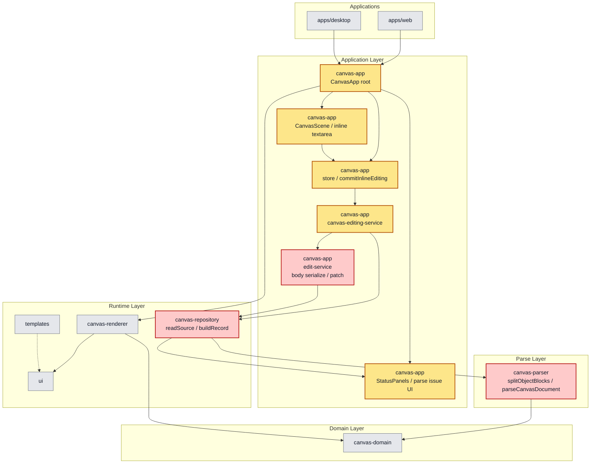

# PRD: Directive Boundary Recovery & Canonical Closing Fence
**Product Requirements Document + Implementation Plan**

| 항목 | 내용 |
|------|------|
| 문서 버전 | v0.1 (Draft) |
| 작성일 | 2026-04-03 |
| 상태 | 초안 |
| 작성자 | Codex |

---

## 1. Overview

### 1.1 Problem Statement

현재 Boardmark의 오브젝트 body 편집 저장 경로는 directive block 전체를 다시 쓰지 않고, `bodyRange`만 부분 교체한다.

이 방식 자체는 맞지만, body 끝에 남은 trailing whitespace 또는 공백만 있는 마지막 줄을 정규화하지 않기 때문에 closing fence 바로 앞에 들여쓰기 공백이 남을 수 있다.

그 결과 실제 파일에는 아래와 같은 형태가 저장될 수 있다.

```md
::: note { id: note-16, at: { x: 508, y: 3662, w: 458, h: 283 } }

## 개념

- PVC 요청 → 조건에 맞는 PV 연결
- "요청(PVC) ↔ 자원(PV) 매칭 단계"
    :::
```

문제는 이것이 단순 포맷팅 깨짐이 아니라는 점이다.

현재 parser는 closing fence를 사실상 `:::` 한 줄로만 인식한다. 따라서 `    :::`는 closing fence가 아니라 body text로 취급된다. 이 상태가 되면 원래 여기서 닫혀야 할 오브젝트가 닫히지 않고, 뒤에 오는 다음 오브젝트 헤더까지 앞 오브젝트의 본문으로 흡수될 수 있다.

즉 이 이슈는 다음 두 문제가 결합된 구조적 버그다.

- writer가 closing fence 앞의 trailing indentation을 제거하지 않는다.
- parser가 이미 깨진 closing fence를 복구적으로 읽지 못한다.

### 1.2 Product Goal

Boardmark는 directive block 경계를 사람이 쓰기 쉽고 AI가 수정하기 쉬운 수준으로 유지해야 한다.

이번 기능의 목표는 아래 두 가지를 동시에 만족하는 것이다.

- Boardmark가 저장하는 문서는 항상 canonical closing fence 형식을 유지한다.
- 이미 일부 손상된 문서도 parser가 가능한 범위에서 안정적으로 복구해 읽는다.

### 1.3 Success Criteria

- note/edge/body-bearing object 저장 후 closing fence는 항상 0열 `:::`로 기록된다.
- body 끝 trailing whitespace 때문에 `::: ` 경계가 손상되지 않는다.
- 이미 `    :::`처럼 들여쓰기된 closing fence가 들어 있는 문서도 가능한 범위에서 정상 파싱된다.
- 복구 파싱이 발생한 경우 parse issue 또는 diagnostic으로 원인을 추적할 수 있다.
- fenced code block 내부의 `:::`는 기존처럼 closing fence로 오인되지 않는다.

---

## 2. Goals & Non-Goals

### Goals

- closing fence 손상 문제를 포맷 안정성 이슈로 정의
- canonical body serialization 규칙을 명시
- tolerant parser recovery 범위를 명시
- writer와 parser의 책임을 분리해 정의
- parse issue / diagnostic 정책을 정의
- regression test 범위를 명시

### Non-Goals

- 이번 문서에서 실제 코드 구현 완료
- note 본문 편집 UX 전면 개편
- rich text editor 또는 WYSIWYG 도입
- directive 문법 전체 재설계
- nested directive 지원
- arbitrary whitespace normalization을 문서 전체에 강제 적용

---

## 3. Core User Stories

```text
AS  Boardmark 사용자
I WANT  note 본문을 수정해도 closing ::: 경계가 깨지지 않고
SO THAT 뒤 오브젝트가 본문으로 흡수되는 문제 없이 문서를 안전하게 저장할 수 있다

AS  기존 문서를 여는 사용자
I WANT  과거 버그로 들여쓰기된 closing :::가 있어도 문서가 최대한 복구되어 열리고
SO THAT 파일 전체가 갑자기 무효 문서가 되지 않도록 할 수 있다

AS  AI와 함께 작업하는 사용자
I WANT  Boardmark가 저장하는 출력 형식이 항상 안정적으로 정규화되고
SO THAT 자동 편집과 diff 리뷰가 예측 가능하게 유지된다
```

---

## 4. Root Cause Summary

### 4.1 Current Writer Behavior

- inline editing commit은 object 전체가 아니라 `bodyRange`만 교체한다.
- body serialization은 trailing newline만 일부 정리하고, trailing spaces와 공백-only 마지막 줄은 제거하지 않는다.
- 따라서 textarea 값 끝에 남은 공백이 closing fence 앞에 그대로 남을 수 있다.

### 4.2 Current Parser Behavior

- parser는 directive block이 열린 상태에서 정확한 closing fence line을 찾는다.
- closing fence 인식 규칙이 지나치게 엄격하면 `    :::`를 closing fence가 아니라 body line으로 본다.
- 이 경우 해당 오브젝트가 닫히지 않고, 이후 블록들이 연쇄적으로 잘못 해석된다.

### 4.3 Why This Is Structural

이 버그는 단순히 `:::`가 보기 싫게 들여쓰기되는 수준이 아니다.

- block boundary가 무너진다.
- source map이 틀어진다.
- 뒤 오브젝트의 시작 위치 감지가 깨진다.
- 특정 오브젝트가 본문 markdown으로 흡수된다.
- 편집기와 parser가 같은 source-of-truth를 바라본다는 Boardmark 핵심 모델이 흔들린다.

---

## 5. Product Requirements

### 5.1 Writer Must Be Canonical

Boardmark가 저장하는 문서는 항상 canonical directive closing 형식을 따라야 한다.

정규화 규칙:

- body는 내부 줄바꿈은 보존한다.
- body 끝의 trailing whitespace는 closing fence 앞에 남지 않도록 정리한다.
- body 끝의 공백-only 마지막 줄은 제거한다.
- body가 비어 있지 않으면 최종 결과는 `body + "\n" + ":::"` 형태가 된다.
- body가 비어 있으면 opening line 다음 줄에 바로 `:::`가 온다.
- closing fence는 항상 0열에서 시작해야 한다.

예시:

```md
::: note { id: idea, at: { x: 80, y: 72, w: 320, h: 220 } }

Text line
:::
```

### 5.2 Parser Must Be Recovery-Capable

parser는 canonical format만 쓰는 writer와 별개로, 이미 손상된 문서를 읽을 때 제한적인 복구 전략을 가져야 한다.

복구 규칙:

- closing fence는 canonical `:::`를 우선 인식한다.
- 추가로 제한된 범위의 leading indentation이 있는 `:::`를 recovery closing fence로 허용한다.
- trailing spaces가 붙은 closing fence도 recovery 대상으로 허용한다.
- fenced code block 내부에서는 recovery 규칙을 적용하지 않는다.

### 5.3 Recovery Scope Must Be Narrow

recovery는 문서를 살리는 목적이지, 모든 모호한 패턴을 허용하는 목적이 아니다.

따라서 아래 원칙을 따른다.

- closing fence recovery는 line 단위에서만 동작한다.
- 복구 허용 indent는 작고 제한된 범위여야 한다.
- literal body text와 충돌 가능성이 큰 과도한 허용은 피한다.
- parser는 "무조건 허용"보다 "예측 가능한 제한 복구"를 우선한다.

### 5.4 Diagnostics Must Explain Recovery

복구 파싱이 발생했다면 조용히 숨기지 않는다.

- parse issue 또는 diagnostic에 recovery 사실을 남긴다.
- 메시지는 어떤 line에서 indented closing fence를 복구했는지 드러내야 한다.
- 앱은 문서를 계속 열 수 있어야 하지만, 사용자는 파일이 canonical state가 아니었음을 알 수 있어야 한다.

### 5.5 Existing Valid Documents Must Not Change

- 이미 정상적인 `:::` closing fence를 가진 문서는 기존과 동일하게 동작해야 한다.
- fenced code block을 포함한 기존 valid 문서의 파싱 결과는 바뀌지 않아야 한다.
- recovery 기능 때문에 기존 valid source map 경계가 달라지면 안 된다.

---

## 6. Design Principles

### 6.1 Writer Strict, Reader Tolerant

이번 기능의 핵심 방향은 다음 한 줄로 정리한다.

**writer는 엄격하게 정규화하고, reader는 제한적으로 복구한다.**

이 방향을 택하는 이유:

- writer만 고치면 기존 손상 문서가 계속 남는다.
- reader만 고치면 Boardmark가 계속 비정규 출력을 만들 수 있다.
- 양쪽을 함께 설계해야 source-of-truth가 안정된다.

### 6.2 Preserve Body Content, Protect Boundaries First

body markdown의 의미 보존은 중요하지만, directive boundary 보존이 더 상위 제약이다.

- body 내부 줄바꿈과 prose는 최대한 보존한다.
- 그러나 closing fence 앞에 경계를 깨뜨리는 trailing whitespace는 보존 대상이 아니다.

### 6.3 Canonical Output Is a Product Contract

Boardmark가 저장한 문서는 사람과 AI가 믿고 수정할 수 있어야 한다.

따라서 canonical output은 내부 구현 디테일이 아니라 제품 계약으로 본다.

---

## 7. Format Contract

### 7.1 Canonical Closing Fence

canonical closing fence는 아래 한 줄이다.

```md
:::
```

허용 사항:

- 앞 공백 없음
- 뒤 공백 없음
- 단독 line

### 7.2 Recovery Closing Fence

recovery parser는 아래와 같은 비정규 line을 제한적으로 closing fence로 인식할 수 있다.

```md
    :::
:::   
```

단, 이들은 모두 non-canonical input으로 기록되어야 하며, 다음 Boardmark 저장 시 canonical form으로 정규화되어야 한다.

### 7.3 Fence-Aware Behavior

- fenced code block 내부의 `:::` 계열 line은 closing fence가 아니다.
- recovery는 open directive state + non-fenced context에서만 적용한다.
- opening directive detection과 closing directive recovery 규칙은 서로 섞이지 않아야 한다.

---

## 8. UX / Product Rules

### 8.1 Save Behavior

- 사용자가 note/edge body를 저장하면 결과 source는 즉시 canonical form이어야 한다.
- 사용자는 별도의 "정리" 액션 없이 안정적인 source를 얻어야 한다.

### 8.2 Open Behavior

- 과거 버그로 손상된 문서는 최대한 열린다.
- 문서를 열 수 있으면 열고, 복구 사실은 issue로 surface 한다.
- recovery 범위를 넘는 경우에만 invalid document로 처리한다.

### 8.3 Error Policy

- canonical 문서 생성 실패는 허용하지 않는다.
- recovery parsing이 발생해도 silent success처럼 숨기지 않는다.
- 진짜로 경계를 찾을 수 없는 경우에는 어느 line에서 실패했는지 구체적으로 보여야 한다.

---

## 9. 아키텍처 영향도

### 9.1 색상 범례

- `빨강`: 직접 수정 가능성이 높은 핵심 경로
- `노랑`: 결과 상태, parse issue, UI 노출 등 간접 영향 경로
- `회색`: 이번 수정과 직접 관련이 낮은 주변 레이어

### 9.2 레이어 관점



### 9.3 실행 경로 관점

```mermaid
flowchart LR
  TEXTAREA["CanvasScene<br/>textarea edit"] --> COMMIT["store<br/>commitInlineEditing"]
  COMMIT --> APPLY["canvas-editing-service<br/>applyIntent"]
  APPLY --> PATCH["edit-service<br/>serializeBodyFragment<br/>replaceBodyRange"]
  PATCH --> RECORD["canvas-repository<br/>readSource"]
  RECORD --> PARSE["canvas-parser<br/>splitObjectBlocks"]
  PARSE --> AST["CanvasDocumentRecord / AST"]
  AST --> ISSUES["parseIssues / invalidState"]
  ISSUES --> UIWARN["StatusPanels"]

  classDef direct fill:#fecaca,stroke:#b91c1c,color:#111827,stroke-width:2px;
  classDef indirect fill:#fde68a,stroke:#b45309,color:#111827,stroke-width:2px;

  class PATCH,RECORD,PARSE direct;
  class TEXTAREA,COMMIT,APPLY,AST,ISSUES,UIWARN indirect;
```



### 9.4 직접 영향 영역

- `packages/canvas-app/src/services/edit-service.ts`
- `packages/canvas-parser/src/index.ts`
- `packages/canvas-repository/src/index.ts`

### 9.5 간접 영향 영역

- `packages/canvas-app/src/services/canvas-editing-service.ts`
- `packages/canvas-app/src/store/canvas-store-slices.ts`
- `packages/canvas-app/src/components/scene/canvas-scene.tsx`
- `packages/canvas-app/src/components/controls/status-panels.tsx`

### 9.6 테스트 영향 범위

- `packages/canvas-app/src/services/edit-service.test.ts`
- `packages/canvas-parser/src/index.test.ts`
- `packages/canvas-app/src/store/canvas-store.test.ts`
- `packages/canvas-app/src/app/canvas-app.test.tsx`

---

## 10. Implementation Plan

### Phase 1. Writer Normalization

목표:

- body serialization 단계에서 closing fence 앞의 boundary-corrupting whitespace를 제거한다.

작업:

- `serializeBodyFragment(...)` 책임을 재정의한다.
- body 끝 trailing newline만 정리하는 현재 로직을, closing fence 안전성을 보장하는 정규화 로직으로 확장한다.
- 공백-only 마지막 줄과 trailing spaces 처리 규칙을 명시적으로 테스트한다.

완료 기준:

- body replacement 후 저장 결과에 `    :::`가 생기지 않는다.
- create note / create edge / create shape 경로도 같은 정규화 규칙을 공유한다.

### Phase 2. Parser Recovery

목표:

- 이미 손상된 closing fence를 제한적으로 복구해서 블록 경계를 다시 찾는다.

작업:

- `splitObjectBlocks(...)`의 closing fence 인식 조건을 recovery-aware 방식으로 조정한다.
- fenced code block 내부 무시 규칙은 그대로 유지한다.
- recovery closing fence를 source map에서 어떻게 기록할지 결정한다.

완료 기준:

- indented closing fence가 있는 기존 문서도 object boundary가 연쇄적으로 무너지지 않는다.
- valid 문서의 기존 parse 결과는 유지된다.

### Phase 3. Diagnostics & Issues

목표:

- recovery가 일어났을 때 사용자가 원인을 추적할 수 있게 만든다.

작업:

- parse issue kind 또는 warning message를 추가한다.
- line number와 object context가 드러나는 메시지를 만든다.
- 앱이 issue를 그대로 surface할 수 있는지 확인한다.

완료 기준:

- recovery parsing 발생 시 적어도 하나의 actionable warning이 남는다.

### Phase 4. Regression Test Coverage

목표:

- 이번 버그가 다시 들어오지 않게 저장 경로와 파싱 경로를 모두 잠근다.

필수 테스트:

- 리스트로 끝나는 note body 저장 후 closing fence가 0열인지
- body 끝에 trailing spaces가 있어도 canonical output이 유지되는지
- body 끝에 공백-only line이 있어도 closing fence가 손상되지 않는지
- `    :::`가 있는 문서를 recovery parse하는지
- recovery 상황에서 뒤 오브젝트가 body에 흡수되지 않는지
- fenced code block 내부 `:::`는 여전히 무시되는지

완료 기준:

- writer/parser 양쪽 regression test가 모두 존재한다.

### Phase 5. Optional Follow-Up

이번 문서 범위 밖이지만, 다음을 후속 후보로 둔다.

- save 시 전체 document canonicalization pass 도입 여부 검토
- parser recovery warning을 UI에서 더 명확히 보여줄지 검토
- opening fence 쪽 boundary robustness도 같은 방식으로 강화할지 검토

---

## 11. Affected Areas

예상 영향 범위:

- `packages/canvas-app/src/services/edit-service.ts`
- `packages/canvas-parser/src/index.ts`
- `packages/canvas-app/src/services/edit-service.test.ts`
- `packages/canvas-parser/src/index.test.ts`

필요 시 상태 반영 경로 검토:

- `packages/canvas-app/src/services/canvas-editing-service.ts`
- `packages/canvas-app/src/store/canvas-store-slices.ts`

---

## 12. Open Questions

### Q1. Recovery indent 허용 범위를 어디까지 둘 것인가?

후보:

- `0~3`칸만 허용
- 모든 leading whitespace 허용

권장:

- 첫 버전은 `0~3`칸처럼 제한된 범위가 안전하다.

이유:

- 너무 넓게 허용하면 literal body text와 경계가 모호해질 수 있다.

### Q2. Recovery를 parse issue로 남길 것인가, diagnostic만 남길 것인가?

권장:

- 사용자에게 보이는 parse issue warning으로 남기는 편이 좋다.

이유:

- 이 이슈는 실제 source integrity 문제이므로 개발자 로그만으로 숨기기엔 영향이 크다.

### Q3. Writer가 trailing spaces를 body 전체에서 제거해야 하는가?

권장:

- 첫 버전은 body 전체 reformatting이 아니라, closing fence 경계 안정성에 필요한 최소 정규화만 수행한다.

이유:

- 문서 diff를 과도하게 키우지 않으면서 root cause만 제거할 수 있다.

---

## 13. Decision Summary

이번 기능은 아래 방향으로 확정한다.

- Boardmark writer는 closing fence를 항상 canonical 0열 `:::`로 저장한다.
- parser는 일부 손상된 closing fence를 제한적으로 recovery한다.
- recovery는 warning/diagnostic으로 남긴다.
- valid 문서 동작은 유지하고, 손상 문서 복구성과 source boundary 안정성을 높인다.

이 방향이 Boardmark의 핵심 원칙인 **Markdown source-of-truth**, **사람이 읽고 AI가 수정 가능한 포맷**, **부분 patch 기반 편집**을 가장 안정적으로 지키는 방법이다.
