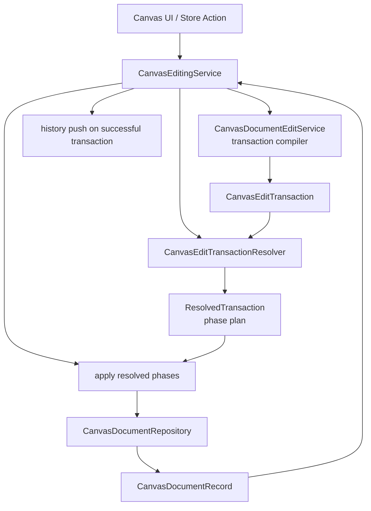

# TransactionResolver 구현 계획

## 1. 목적

이 문서는 `docs/features/edit-transaction-resolver/README.md`의 요구사항을 현재 Boardmark 구조에 맞춰 구현 작업으로 풀어낸다.

이번 단계는 edit service에 기능을 더 얹는 작업이 아니라,  
**edit 계획 생성, 실행 순서 해석, 실제 적용을 분리하는 새로운 application/service boundary**를 도입하는 작업이다.

핵심 변화는 아래와 같다.

- 기존:
  - `intent -> edit service apply -> next source -> repository reparse`
- 목표:
  - `intent -> edit service compile transaction -> transaction resolver resolve -> apply resolved phases -> repository reparse`

---

## 2. 현재 구조 요약

- `packages/canvas-app/src/store/canvas-store-slices.ts`
  - commit 진입점과 history push 경계
- `packages/canvas-app/src/services/canvas-editing-service.ts`
  - 현재 editing application service
  - edit service 호출 후 repository reparse 수행
- `packages/canvas-app/src/services/edit-service.ts`
  - intent별 patch 생성과 일부 multi-edit apply까지 함께 담당

현재 구조의 장점:

- 단일 intent 처리 경로가 짧다.
- source-of-truth와 repository reparse 경계가 명확하다.

현재 구조의 한계:

- multi-edit ordering 규칙이 intent handler 내부로 흩어진다.
- 줄 수 변화나 구조 변화가 이후 edit anchor에 미치는 영향을 공통 규칙으로 관리하기 어렵다.
- “apply 가능한 edit 묶음”이라는 개념이 타입과 서비스 경계에 드러나지 않는다.

---

## 3. 목표 구조

핵심 의미:

- `CanvasDocumentEditService`는 compiler에 더 가까워진다.
- resolver는 transaction phase plan 해석 전용 역할을 가진다.
- apply 단계는 resolved plan을 실제 source에 반영한다.
- repository reparse는 여전히 공식 재정규화 경계다.
- history는 개별 edit unit이 아니라 성공한 transaction을 기준으로 기록한다.

---

## 4. 새 타입과 엔티티

### 4.1 새 엔티티

신규 파일 기준안:

- `packages/canvas-app/src/services/edit-transaction-resolver.ts`

공개 계약 기준안:

- `TransactionResolver`
- `CanvasEditTransactionResolver`
- `createCanvasEditTransactionResolver(...)`

최소 public 메서드:

- `resolve(input): Result<ResolvedTransaction, TransactionResolveError>`

### 4.2 새 타입

최소 타입 기준안:

- `CanvasEditTransaction`
  - `label`
  - `edits`
  - `metadata`
- `CanvasEditUnit`
  - `kind`
  - `target`
  - `range`
  - `replacement`
  - `lineDeltaBehavior`
  - `structuralImpact`
- `CanvasEditPhase`
  - 같은 기준 source에서 안전하게 적용 가능한 edit unit 묶음
- `ResolvedTransaction`
  - `phases`
- `CanvasEditTransactionApplyResult`
  - `source`
  - `dirty`
- `TransactionResolveError`
  - `overlap`
  - `stale-anchor`
  - `invalid-phase`
- `TransactionApplyError`
  - `reparse-failed`
  - `invalid-phase-output`

### 4.3 책임 배치

`edit-service.ts`

- intent validation
- object/source map lookup
- edit unit 생성
- transaction 조립

`edit-transaction-resolver.ts`

- phase 분할
- overlap validation
- replacement ordering
- phase 사이 재기준화 요구 표시

apply 단계

- resolved phase 실행
- phase 사이 재기준화 수행
- 최종 source 산출

`canvas-editing-service.ts`

- 문서/충돌/invalid 상태 gate
- compiler + resolver + apply orchestration
- repository 결과를 store-friendly outcome으로 변환

---

## 5. 구현 변경점

### 5.1 Edit service를 compiler 중심으로 재구성

`packages/canvas-app/src/services/edit-service.ts`

목표:

- `apply(...)`가 직접 모든 patch를 끝내는 구조를 줄인다.
- intent별로 `CanvasEditTransaction` 또는 단일 phase transaction을 만들게 한다.

첫 단계의 현실적 접근:

- public API는 잠시 `apply(...)`를 유지해도 된다.
- 내부적으로는 `compileTransaction(...)` + resolver 해석 + apply 단계로 분리한다.
- migration이 끝나면 외부는 `applyIntent`가 아니라 `compileTransaction` 경로를 사용하도록 정리한다.

### 5.2 TransactionResolver 도입

신규 `packages/canvas-app/src/services/edit-transaction-resolver.ts`

첫 버전 알고리즘:

1. transaction의 edit unit을 검사한다.
2. 겹치는 range가 있는지 확인한다.
3. `lineDeltaBehavior`와 `structuralImpact`를 기준으로 phase를 나눈다.
4. 각 phase에 필요한 apply ordering과 rebase requirement를 기록한다.
5. 하나라도 실패하면 resolve를 중단하고 오류를 반환한다.

### 5.3 CanvasEditingService에 resolver를 임베드

`packages/canvas-app/src/services/canvas-editing-service.ts`

변경 방향:

- `CanvasEditingService`가 resolver를 소유한다.
- 이 계층은 이미 repository 접근 권한을 가지므로 phase 사이 재기준화 경계를 가장 자연스럽게 소유할 수 있다.
- 결과적으로 “edit service가 모든 해석과 적용을 직접 한다”는 문제가 사라진다.

의존성 예시:

- `editService?: CanvasDocumentEditService`
- `transactionResolver?: TransactionResolver`

적용 흐름:

1. state gate 검사
2. `editService.compileTransaction(...)`
3. `transactionResolver.resolve(...)`
4. resolved phase apply
5. 최종 source reparse
6. updated / invalid / blocked outcome 반환

### 5.4 History 단위를 transaction으로 고정

`packages/canvas-app/src/store/canvas-store-slices.ts`

변경 원칙:

- history capture는 transaction 시작 전 snapshot을 잡는다.
- resolve/apply가 성공하고 최종 source가 달라졌을 때만 history를 push한다.
- edit unit 단위의 history push는 만들지 않는다.

이는 기존 “성공한 commit 1회 = history 1회” 규칙을 유지하되, commit 내부 구조를 transaction으로 명시화하는 작업이다.

### 5.5 공통 patch 유틸 보호 강화

기존 `replaceRange`, `replaceRanges`, `removeObjectRanges` 주변에 아래 보호가 필요하다.

- overlapping replacement 사전 차단
- phase 단위 invariant 검사
- structural removal 이후 후속 range 재사용 금지 또는 재기준화 강제
- diagnostic message에 transaction label, phase index, target id 포함

---

## 6. 단계별 작업

### Phase 1. 타입과 경계 추가

- transaction/resolver 관련 타입 추가
- resolver 신규 파일 추가
- `canvas-editing-service.ts`에 resolver 의존성 주입 추가

완료 기준:

- compiler와 resolver라는 두 역할이 코드 경계에 드러난다.

### Phase 2. 단일 intent를 transaction으로 승격

- 기존 단일-object intent도 모두 transaction 형태로 컴파일
- 기존 apply 유틸을 resolved phase apply 단계에서 재사용 가능하게 이동 또는 정리

완료 기준:

- 기존 intent가 transaction wrapper 위에서 동일 동작을 유지한다.

### Phase 3. Multi-edit intent를 phase 기반 실행으로 전환

- `nudge-objects`
- `arrange-objects`
- `set-objects-locked`
- `delete-objects`

위 intent를 transaction edit unit 기반으로 바꾼다.

완료 기준:

- multi-object intent의 ordering 규칙이 intent handler 밖 resolver에 모인다.

### Phase 4. Line-changing / structural phase 처리

- body replacement
- create/delete
- group 관련 구조 변경

위 edit에 대해 line shift와 structural impact 기준을 도입한다.

완료 기준:

- 줄 수 변화 또는 구조 변화가 있는 edit가 후속 edit와 같은 안전도 수준으로 취급되지 않는다.

### Phase 5. 테스트와 문서

- resolver 단위 테스트 추가
- editing service integration test 추가
- history regression test 추가
- feature 문서 링크 정리

완료 기준:

- transaction 실패/성공/phase 분할 규칙이 자동 테스트로 검증된다.

---

## 7. 테스트 계획

### Resolver unit tests

- 비중첩 replacement가 offset 역순으로 적용된다.
- 겹치는 replacement는 명시적 오류를 반환한다.
- line-count-changing edit 뒤 후속 edit가 별도 phase로 분리된다.
- structural edit 뒤 stale range 재사용이 차단된다.

### Editing service integration tests

- 단일 intent가 transaction 1개로 실행된다.
- multi-object intent가 여러 edit unit을 포함한 transaction으로 실행된다.
- transaction 실패 시 partial patch가 store에 반영되지 않는다.
- transaction 성공 시 repository reparse를 통과한 결과만 updated로 반환된다.

### Store/history tests

- transaction 성공 시 history 1개가 쌓인다.
- transaction 내부 edit unit 수와 무관하게 undo 1회로 복원된다.
- undo 후 새 transaction이 실행되면 redo stack이 비워진다.

---

## 8. 리스크와 대응

### 리스크 1. 과한 추상화

- transaction/resolver를 너무 일반화하면 오히려 이해 비용이 커질 수 있다.

대응:

- public contract를 1개 resolve 메서드 중심으로 유지한다.
- 필요한 invariant만 타입으로 올리고, speculative abstraction은 피한다.

### 리스크 2. repository 호출 증가

- phase 사이 재기준화를 자주 하면 비용이 커질 수 있다.

대응:

- 첫 버전은 correctness 우선으로 간다.
- 성능 병목이 확인되면 geometry-only fast path와 연결해 최적화한다.

### 리스크 3. 기존 intent handler와의 중복

- migration 중 edit logic가 compiler와 resolver/apply 단계에 이중 존재할 수 있다.

대응:

- intent별로 순차 전환한다.
- 전환이 끝난 intent는 기존 직접 apply 경로를 바로 제거한다.

---

## 9. 결정 메모

이번 설계의 핵심 결정은 아래 두 가지다.

- patch를 “만드는 일”과 patch를 “안전하게 해석하는 일”, “실제로 적용하는 일”은 다른 책임으로 본다.
- history 최소 단위는 계속 commit이지만, 그 commit의 내부 실행 모델은 transaction으로 명시화한다.

즉, 이 작업은 undo/redo 정책을 바꾸는 것이 아니라  
**문서 편집 commit 내부의 실행 안전성을 구조적으로 끌어올리는 작업**이다.
