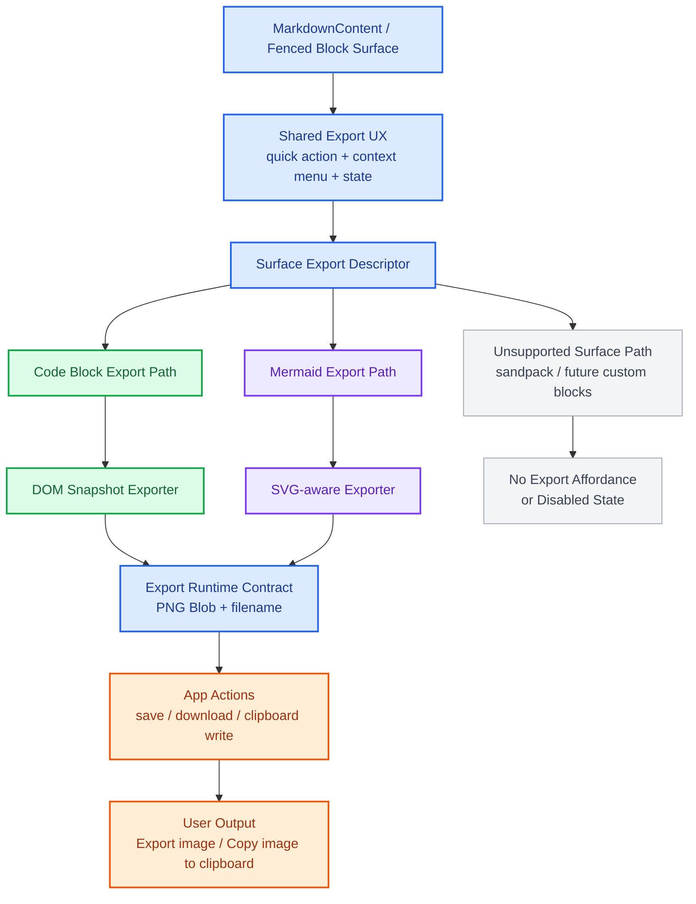

# PRD: Fenced Block Image Export
**Product Requirements Document**

| 항목 | 내용 |
|------|------|
| 문서 버전 | v0.1 (Draft) |
| 작성일 | 2026-04-06 |
| 상태 | 초안 |
| 작성자 | Codex |

---

## 1. Overview

### 1.1 Problem Statement

현재 Boardmark의 일반 fenced code block과 `mermaid` block은 preview 렌더링까지는 가능하지만, 렌더된 결과를 이미지로 가져가는 공통 제품 경로는 없다.

이 제약은 아래 문제를 만든다.

- 사용자는 코드 예제, 설정 파일, CLI 출력, diff 일부를 현재 보이는 스타일 그대로 공유하기 어렵다.
- 사용자는 Mermaid 다이어그램을 PNG 이미지로 옮기기 위해 별도 스크린샷이나 외부 도구에 의존해야 한다.
- 복사 가능한 것은 raw text뿐이라, syntax highlight와 block chrome을 포함한 시각 결과를 다른 문서나 메신저에 바로 붙여넣기 어렵다.
- `mermaid`, `sandpack`, 일반 code block처럼 fenced block surface가 이미 분기되어 있는데, export 진입점은 제품 계약으로 정리되어 있지 않다.

즉 지금 빠져 있는 것은 단순한 다운로드 버튼이 아니라, **fenced block preview를 제품 차원의 이미지 결과물로 다루는 최소한의 공통 진입점**이다.

### 1.2 Product Goal

첫 버전의 목표는 일반 fenced code block과 `mermaid` block에 한해, Boardmark 안에서 보이는 fenced block 결과를 PNG 이미지로 내보내거나 클립보드 이미지로 복사할 수 있게 만드는 것이다.

- 사용자는 지원되는 fenced block surface에서 image export 버튼을 볼 수 있어야 한다.
- 사용자는 지원되는 fenced block 위에서 컨텍스트 메뉴를 열고 `Copy image to clipboard`, `Export image` 액션을 실행할 수 있어야 한다.
- 일반 code block의 exported result는 현재 Boardmark code block chrome, language label, syntax highlight를 포함한 PNG여야 한다.
- Mermaid의 exported result는 현재 렌더된 다이어그램과 Boardmark diagram surface background를 포함한 PNG여야 한다.
- 같은 `MarkdownContent` 경로를 쓰는 preview surface에서는 같은 동작과 같은 결과를 가져야 한다.
- 실패나 미지원 환경에서는 조용히 무시하지 않고 명시적 disabled state 또는 error feedback을 보여야 한다.

### 1.3 Success Criteria

- 신규 사용자가 별도 설명 없이 지원되는 fenced block의 이미지 버튼을 눌러 PNG 파일을 얻을 수 있다.
- 지원 환경에서는 컨텍스트 메뉴의 `Copy image to clipboard`로 다른 앱에 이미지 붙여넣기가 가능하다.
- note preview, edge label preview, special fenced block view처럼 `MarkdownContent`를 공유하는 surface에서 같은 fenced block source는 실질적으로 같은 PNG 결과를 만든다.
- 일반 code copy UX와 code highlighting UX를 깨지 않고 기능이 추가된다.
- Mermaid rendering UX를 깨지 않고 다이어그램 export가 추가된다.

---

## 2. Goals & Non-Goals

### Goals

- 일반 fenced code block과 `mermaid` block에 이미지 export affordance 추가
- 지원되는 fenced block surface에 `Export image` quick action 추가
- 지원되는 fenced block 컨텍스트 메뉴에 `Copy image to clipboard`, `Export image` 추가
- export 결과를 PNG `Blob`으로 표준화
- export runtime과 app action을 분리해 저장/복사 경계를 명시
- `MarkdownContent`를 사용하는 preview surface에서 동일 동작 보장
- 실패 상태와 미지원 상태를 명시적으로 노출

### Non-Goals

- `sandpack` block export
- canvas object, selection, note 전체 export
- JPEG, SVG, PDF 같은 다중 포맷 사용자 옵션 지원
- block별 theme override, watermark, line number 추가
- 여러 block 일괄 export
- OS 네이티브 공유 시트나 외부 저장소 업로드

---

## 3. Users & Core Scenarios

### Target User

- 코드 스니펫을 문서, 메신저, 프레젠테이션에 자주 옮기는 개발자
- Mermaid 다이어그램을 설계 문서와 회의 자료에 자주 붙이는 개발자
- 기술 설계 문서에서 코드 예제를 시각 결과 그대로 공유하고 싶은 기획자
- AI가 만든 markdown code block을 바로 이미지로 재사용하려는 사용자

### Core User Stories

```text
AS  개발자
I WANT  code block header의 이미지 버튼을 눌러 PNG를 바로 저장하고
SO THAT 문서 밖에서도 같은 스타일의 코드 스니펫을 공유할 수 있다

AS  사용자
I WANT  code block를 우클릭해서 이미지로 클립보드에 복사하고
SO THAT 메신저나 문서 편집기에 즉시 붙여넣을 수 있다

AS  사용자
I WANT  Mermaid 다이어그램을 현재 렌더된 모양 그대로 PNG로 내보내고
SO THAT 설계 흐름도를 별도 스크린샷 없이 재사용할 수 있다

AS  사용자
I WANT  note preview와 edge preview에서 같은 fenced block를 같은 방식으로 export하고
SO THAT surface마다 다른 결과를 걱정하지 않아도 된다
```

---

## 4. Current Assumptions

- 현재 일반 fenced code block은 `packages/ui/src/components/markdown-content.tsx`의 `CodeBlockRenderer`가 렌더한다.
- `Copy code` 버튼과 header chrome은 이미 `CodeBlockRenderer` 안에 존재한다.
- `mermaid`와 `sandpack`은 `packages/ui/src/components/fenced-block/registry.ts`를 통해 별도 renderer로 분기된다.
- `packages/ui/src/components/mermaid-diagram.tsx`는 ready 상태에서 렌더된 SVG 문자열을 surface에 주입한다.
- 첫 버전의 제품 가치는 일반 code block과 `mermaid` export까지 닫는 데 있다. `sandpack`과 object export는 후속 단계로 둔다.

---

## 5. Interface Layers

아래 다이어그램은 이번 기능에서 공통화해야 하는 경계와 surface별로 분리해야 하는 구현을 보여준다.



레이어 해석은 아래와 같다.

- `MarkdownContent / Fenced Block Surface`
  - 일반 code block과 Mermaid의 공통 진입점
- `Shared Export UX`
  - 버튼, 컨텍스트 메뉴, exporting 상태 같은 제품 UX
- `Surface Export Descriptor`
  - 어떤 surface가 어떤 exporter를 쓰는지 결정하는 연결 지점
- `DOM Snapshot Exporter`
  - 일반 code block용 경로
- `SVG-aware Exporter`
  - Mermaid용 경로
- `Export Runtime Contract`
  - surface별 구현 결과를 PNG `Blob` 계약으로 수렴시키는 경계
- `App Actions`
  - 저장, 다운로드, clipboard write를 맡는 앱 레이어

---

## 6. Product Rules

### 6.1 Canonical Scope

- 첫 버전의 export 대상은 일반 fenced code block과 ready 상태의 `mermaid` block이다.
- `CodeBlockRenderer`와 ready 상태의 `MermaidDiagram` surface는 이미지 export affordance를 노출한다.
- `sandpack`과 그 외 custom fenced renderer는 첫 버전에서 이미지 export affordance를 노출하지 않는다.

### 6.2 Canonical Output

- 첫 버전의 canonical output format은 `PNG`다.
- export 결과는 `Blob`과 filename metadata를 함께 가진다.
- clipboard copy가 가능한 경우에도 내부 canonical binary는 PNG다.

### 6.3 Captured Surface

- export 대상은 fenced block 전체 surface다.
- 일반 code block은 언어 label이 있으면 이미지에 포함한다.
- 일반 code block은 syntax highlight 결과와 block background/chrome을 포함한다.
- Mermaid는 렌더된 SVG 결과와 diagram background/chrome을 포함한다.
- surrounding note card, selection ring, canvas zoom chrome은 포함하지 않는다.
- 현재 스크롤 위치에 따라 잘린 viewport가 아니라, fenced block의 전체 렌더 bounds를 기준으로 캡처해야 한다.

### 6.4 Entry Points

- 일반 code block header에는 `Copy code`와 별도로 `Export image` 버튼을 둔다.
- Mermaid surface에도 시각적으로 동등한 `Export image` quick action을 둔다.
- 버튼 클릭의 기본 동작은 `Export image`다.
- 지원되는 fenced block 컨텍스트 메뉴에는 아래 두 액션을 둔다.
  - `Copy image to clipboard`
  - `Export image`
- 첫 버전에서 `Copy code` 버튼과 의미를 섞지 않는다. text copy와 image export는 분리된 액션으로 유지한다.
- Mermaid loading/error state에서는 image export 액션을 노출하지 않거나 disabled state로 보여야 한다.

### 6.5 File Naming

- 기본 filename은 `boardmark-code-block.png`를 사용한다.
- language가 식별되면 `boardmark-code-block-{language}.png`를 우선 사용한다.
- Mermaid는 `boardmark-mermaid-diagram.png`를 기본 filename으로 사용한다.
- save target에서 동일 이름 충돌이 나면 저장 레이어가 기존 규칙에 따라 충돌을 해소한다.

### 6.6 Clipboard and Save Failure Rules

- 이미지 clipboard write를 지원하지 않는 런타임에서는 `Copy image to clipboard`를 disabled state로 보여주거나 실행 시 명시적 오류를 보여줘야 한다.
- export 실패 시 조용히 아무 일도 일어나지 않으면 안 된다.
- 실패 메시지는 최소한 `image export failed` 사실과 재시도 가능 여부를 전달해야 한다.

### 6.7 Consistency Rules

- `MarkdownContent`를 사용하는 모든 surface는 같은 export runtime을 공유해야 한다.
- 같은 source와 같은 width를 주면 web / desktop에서 실질적으로 같은 PNG 결과를 목표로 한다.
- export affordance는 지원되는 fenced block이 렌더되는 모든 `MarkdownContent` surface에서 같은 위치와 같은 wording을 유지한다.

---

## 7. Functional Requirements

### 7.1 Quick Action

- 지원되는 fenced block surface에 image export icon button을 추가한다.
- 일반 code block은 기존 header에 버튼을 추가한다.
- Mermaid는 diagram surface 상단 action chrome 또는 동등한 위치에 버튼을 추가한다.
- 버튼은 loading 중 중복 실행을 막아야 한다.
- export 성공 시 사용자는 파일 저장 또는 다운로드 결과를 확인할 수 있어야 한다.
- export 실패 시 button state 또는 toast 수준의 피드백을 보여야 한다.

### 7.2 Context Menu

- 지원되는 fenced block root에서 secondary click 또는 동등한 컨텍스트 메뉴 제스처를 지원한다.
- 메뉴에는 최소한 아래 두 항목이 있어야 한다.
  - `Copy image to clipboard`
  - `Export image`
- 메뉴 항목의 enabled/disabled state는 현재 런타임 capability를 반영해야 한다.
- 메뉴는 keyboard 접근 가능해야 하며, focus 이동과 dismiss가 기존 viewer menu 규칙과 충돌하지 않아야 한다.

### 7.3 Export Runtime Contract

첫 버전의 제품 계약은 아래 수준으로 고정한다.

```ts
type FencedBlockImageExportRequest = {
  kind: 'code' | 'mermaid'
  rootElement: HTMLElement
  language?: string
}

type FencedBlockImageExportResult = {
  blob: Blob
  mimeType: 'image/png'
  fileName: string
}
```

- runtime은 surface별 export와 PNG rasterize까지만 책임진다.
- file save, browser download, clipboard write는 app action 레이어가 책임진다.
- runtime은 성공 시 반드시 non-empty PNG `Blob`을 반환해야 한다.

### 7.4 Mermaid Export Rules

- Mermaid export는 ready 상태의 rendered diagram에 대해서만 허용한다.
- Mermaid exporter는 단순 DOM snapshot보다 SVG serialize 또는 동등한 SVG-aware 경로를 우선할 수 있다.
- loading/error Mermaid surface는 성공처럼 export하면 안 된다.
- Mermaid error surface의 source fallback 자체를 이미지로 export하는 동작은 첫 버전 범위에 포함하지 않는다.

### 7.5 App Actions

- `Export image`는 runtime 결과를 받아 파일 저장 또는 다운로드로 연결한다.
- `Copy image to clipboard`는 runtime 결과를 받아 clipboard image write로 연결한다.
- app action은 runtime이 실패하면 자체 fallback 이미지를 만들지 않는다.

### 7.6 Unsupported Surface Behavior

- `sandpack` 같은 unsupported custom fenced block에는 첫 버전 affordance를 붙이지 않는다.
- unsupported surface를 일반 code block처럼 보이게 속이지 않는다.
- 후속 확장 시 descriptor 단위로 export capability를 선언할 수 있게 경계를 남긴다.

### 7.7 Performance

- export 관련 라이브러리나 rasterize runtime은 실제 액션 실행 시점에만 로드하는 lazy path가 바람직하다.
- 일반 markdown 렌더링 경로는 이미지 export 기능 추가 전과 유사한 초기 렌더 성능을 유지해야 한다.
- export 중이라도 surrounding markdown layout이 다시 계산되거나 code highlight 결과, Mermaid SVG 결과가 흔들리면 안 된다.

### 7.8 Accessibility

- quick action button은 `Export image`에 해당하는 명시적 accessible name을 가져야 한다.
- context menu는 role과 keyboard navigation을 가져야 한다.
- disabled 이유가 있는 항목은 시각적으로만 숨기지 말고 상태가 드러나야 한다.

---

## 8. Technical Direction

### 7.1 Preferred Introduction Point

첫 구현 진입점은 `packages/ui/src/components/markdown-content.tsx`와 `packages/ui/src/components/mermaid-diagram.tsx`를 묶는 fenced block export surface가 적절하다.

- 기존 `CodeBlockRenderer` header에 quick action을 추가한다.
- `MermaidDiagram`에도 동등한 export action chrome을 추가한다.
- export 대상 DOM root ref는 각 surface가 소유하되, runtime 호출 계약은 공통으로 맞춘다.

### 7.2 Why This Stays Narrow in v1

backlog 방향은 fenced block 공통 export 레이어지만, 첫 제품 범위는 일반 code block과 `mermaid`까지만 닫는 편이 맞다.

- 현재 실제 quick win은 `Copy code`가 이미 있는 표준 code block surface다.
- `mermaid`는 제품 가치가 크고, 이미 전용 renderer가 있어 별도 exporter 경계를 붙이기 적절하다.
- `sandpack`은 iframe sandbox 제약 때문에 같은 캡처 경로를 바로 공유하기 어렵다.
- 따라서 v1은 code block과 `mermaid` 두 surface에서 runtime 계약과 app action 경계를 먼저 검증한다.

### 7.3 Future-Compatible Boundary

첫 구현은 좁게 가되, 후속 확장을 막지 않도록 descriptor 방향을 열어 둔다.

- 현재 `language -> renderer` registry는 장기적으로 `language -> descriptor`로 확장 가능해야 한다.
- descriptor는 최소한 `render`와 optional `imageExporter`를 가질 수 있다.
- v1에서는 일반 code block에는 기본 DOM snapshot exporter를 붙이고, `mermaid`에는 SVG-aware exporter를 붙이며, unsupported renderer는 exporter를 비워 둘 수 있다.

예시 방향은 아래와 같다.

```ts
type FencedBlockDescriptor = {
  render?: FencedBlockRenderer
  imageExporter?: BlockImageExporter
}
```

이 문서의 핵심은 미래 확장을 지금 구현하라는 뜻이 아니라, **v1을 일반 code block과 `mermaid`에 한정하되 export 경계가 이후 object export나 다른 fenced block export를 막지 않도록 둔다**는 점이다.

---

## 9. Codebase Impact Map

- `packages/ui/src/components/markdown-content.tsx`
  - 일반 code block header quick action
  - export target DOM root ref
  - block-level context menu trigger
- `packages/ui/src/components/fenced-block/registry.ts`
  - `mermaid` export capability를 포함한 descriptor 확장 가능성
- `packages/ui/src/components/fenced-block/`
  - image export runtime 또는 adapter 추가 후보 위치
- `packages/ui/src/components/mermaid-diagram.tsx`
  - Mermaid export action chrome
  - rendered SVG export context
- `packages/canvas-app`
  - file save / clipboard write 같은 app action 연결
- `packages/canvas-app/src/styles/canvas-app.css`
  - code block / Mermaid image export button, menu, exporting state style

---

## 10. Risks and Mitigations

### DOM Snapshot Fidelity

- syntax highlighted DOM이 브라우저와 런타임별로 미세하게 다를 수 있다.
- 첫 버전은 same-source same-width 기준의 실질적 일관성을 목표로 하고, pixel-perfect identical output은 보장 범위에서 뺀다.

### Mermaid SVG Fidelity

- Mermaid는 SVG 내부 스타일, 배경, font 처리에 따라 raster 결과가 달라질 수 있다.
- 첫 버전은 SVG-aware export 경로를 우선하고, 필요 시 Mermaid 전용 background 합성 규칙을 둔다.

### Clipboard API Variance

- image clipboard write는 런타임별 지원 편차가 있다.
- capability detection을 명시적으로 두고, 미지원이면 disabled state 또는 오류 메시지로 처리한다.

### Overflow Width

- 긴 한 줄 코드가 있는 block은 현재 UI에서 가로 스크롤을 사용한다.
- export는 visible viewport가 아니라 전체 bounds를 캡처해야 하므로 매우 넓은 이미지가 생성될 수 있다.
- 첫 버전은 렌더 결과의 충실도를 우선하고, width clamp 옵션은 후속 범위로 둔다.

---

## 11. Out of Scope Follow-Up

- `sandpack` block export 전략
- note / object / selection image export 공통화
- export format picker
- background theme 선택, padding preset, watermark

---

## 12. One-Line Decision

첫 버전은 **일반 fenced code block과 `mermaid` block에 PNG 기반 image export 경로를 추가하고, quick action과 block context menu를 통해 `Export image`와 `Copy image to clipboard`를 제공한다.** 저장/클립보드 액션은 app 레이어가 맡고, export runtime은 surface별 방식으로 PNG `Blob` 생성까지만 책임진다.

---

## 13. Implementation Plan

### 13.1 목적

이 구현 계획은 이 문서의 PRD를 현재 Boardmark 구조에 맞춰 실제 작업 단위로 푼 것이다.

이번 구현의 목표는 아래 두 가지를 동시에 닫는 것이다.

- 일반 fenced code block을 PNG로 export할 수 있게 만든다.
- ready 상태의 Mermaid diagram을 PNG로 export할 수 있게 만든다.

첫 단계는 단순히 버튼을 추가하는 것이 아니라 아래를 같이 만족해야 한다.

- `MarkdownContent` 기반 preview surface 공통 동작
- export runtime과 app action 책임 분리
- `Copy code`와 Mermaid rendering 기존 UX 보존
- web / desktop에서 같은 결과 계약 유지
- 실패와 미지원 상태를 진단 가능하게 노출

### 13.2 현재 구조 요약

이번 기능에 직접 연결되는 경계는 아래와 같다.

- `packages/ui/src/components/markdown-content.tsx`
  - 일반 fenced code block 렌더링
  - `Copy code` 버튼이 이미 존재하는 code block header
- `packages/ui/src/components/fenced-block/registry.ts`
  - `mermaid`, `sandpack` 등 custom fenced block 분기
- `packages/ui/src/components/mermaid-diagram.tsx`
  - Mermaid SVG 렌더 결과와 loading / error 상태 관리
- `packages/canvas-app/src/styles/canvas-app.css`
  - code block / Mermaid surface style
- `packages/canvas-app`
  - file save, clipboard write, 앱 피드백 연결 후보

핵심 의미는 아래다.

- 일반 code block과 Mermaid는 이미 렌더 surface가 분리되어 있다.
- 따라서 export UX는 공통 제품 규칙으로 맞추고, exporter 구현은 surface별로 나누는 편이 안전하다.

### 13.3 구현 원칙

#### Renderer와 Exporter를 분리한다

- 렌더러는 화면 표시만 책임진다.
- exporter는 현재 결과를 PNG `Blob`으로 바꾸는 일만 책임진다.
- 저장, 다운로드, clipboard write는 app action이 책임진다.

#### Shared UX, Split Implementation

- 일반 code block과 Mermaid는 같은 quick action / context menu wording을 쓴다.
- 일반 code block은 DOM snapshot exporter를 쓴다.
- Mermaid는 SVG-aware exporter를 쓴다.

#### 실패를 숨기지 않는다

- export 실패는 조용히 무시하지 않는다.
- loading/error Mermaid는 성공처럼 export하지 않는다.
- clipboard 미지원 환경은 disabled state 또는 명시적 오류로 처리한다.

#### 일반 렌더 성능을 지킨다

- export 라이브러리는 action 시점에 lazy load 한다.
- 일반 markdown 렌더 경로는 export 기능 추가 전과 비슷한 초기 비용을 유지한다.

### 13.4 제안 파일 경계

```text
packages/ui/src/
  components/
    markdown-content.tsx
    markdown-content.test.tsx
    mermaid-diagram.tsx
    mermaid-diagram.test.tsx
    fenced-block/
      registry.ts
      image-export.ts
      image-export.test.ts
  lib/
    ...

packages/canvas-app/src/
  services/
    fenced-block-image-actions.ts
  styles/
    canvas-app.css
```

권장 책임은 아래와 같다.

- `image-export.ts`
  - export request/result 타입
  - code block exporter
  - Mermaid exporter
  - capability detection
- `fenced-block-image-actions.ts`
  - file save / download
  - clipboard write
  - 앱 레벨 오류 전달

### 13.5 단계별 구현 계획

### Phase 1. Export Contract와 Descriptor 경계 준비

- `packages/ui/src/components/fenced-block/` 아래에 image export 계약을 추가한다.
- 현재 `language -> renderer` registry를 유지하되, 내부적으로 `renderer + optional imageExporter` 방향으로 확장 가능한 구조를 정리한다.
- v1에서는 최소한 Mermaid descriptor가 exporter를 가질 수 있는 경계를 만든다.
- 일반 code block은 registry 바깥 기본 exporter 경로를 둘 수 있다.

완료 기준:

- 코드상에서 `code`와 `mermaid` surface가 각각 어떤 exporter를 쓰는지 명시할 수 있다.
- export request/result 타입이 한 곳에 고정된다.

### Phase 2. Export Runtime 구현

- 일반 code block용 DOM snapshot exporter를 구현한다.
- Mermaid용 SVG-aware exporter를 구현한다.
- 두 exporter 모두 최종적으로 PNG `Blob`을 반환하게 맞춘다.
- export capability detection 함수를 추가한다.

완료 기준:

- 일반 code block DOM root를 주면 PNG `Blob`을 만들 수 있다.
- ready 상태 Mermaid root를 주면 PNG `Blob`을 만들 수 있다.
- 미지원 capability와 빈 root 같은 실패가 명시적 에러로 전달된다.

### Phase 3. UI Surface 연결

- `markdown-content.tsx`의 `CodeBlockRenderer`에 export quick action을 추가한다.
- code block root ref를 exporter에 넘길 수 있게 정리한다.
- `mermaid-diagram.tsx`에 동등한 export quick action chrome을 추가한다.
- Mermaid는 `ready` 상태에서만 export affordance를 활성화한다.

완료 기준:

- 일반 code block과 ready Mermaid에서 모두 `Export image` 버튼이 보인다.
- loading/error Mermaid에서는 affordance가 비활성 또는 비노출 상태로 일관된다.

### Phase 4. Context Menu 연결

- fenced block 단위의 context menu trigger를 추가한다.
- 메뉴 항목으로 `Copy image to clipboard`, `Export image`를 연결한다.
- keyboard dismiss, focus 이동, disabled state를 기존 메뉴 규칙과 맞춘다.
- `Copy code`는 기존 버튼 동작을 유지하고 context menu의 image action과 섞지 않는다.

완료 기준:

- 지원되는 fenced block에서 우클릭 시 image action menu가 열린다.
- clipboard 미지원이면 해당 항목 상태가 분명히 드러난다.

### Phase 5. App Action 연결

- export runtime 결과를 받아 다운로드/저장으로 연결하는 액션을 구현한다.
- PNG `Blob`을 받아 clipboard image write를 수행하는 액션을 구현한다.
- 실패 시 surface에 반환할 상태 또는 toast 경로를 정리한다.
- 저장 파일명은 PRD 규칙을 따른다.

완료 기준:

- `Export image`가 실제 파일 저장 또는 다운로드로 이어진다.
- `Copy image to clipboard`가 지원 환경에서 실제 이미지 write를 수행한다.
- 실패가 삼켜지지 않고 사용자에게 드러난다.

### Phase 6. Styling과 Micro UX 정리

- code block header에 새 버튼이 추가돼도 기존 visual rhythm이 깨지지 않게 정리한다.
- Mermaid action chrome이 diagram surface와 시각적으로 충돌하지 않게 정리한다.
- exporting, copied, error 상태의 아이콘/라벨/disabled 스타일을 정리한다.
- hover, focus-visible, keyboard 접근 상태를 맞춘다.

완료 기준:

- code block과 Mermaid 모두에서 action affordance가 기존 UI에 자연스럽게 녹아든다.
- focus-visible과 disabled 상태가 명확하다.

### Phase 7. 테스트와 검증

- `markdown-content.test.tsx`에 code block export affordance와 상태 테스트를 추가한다.
- `mermaid-diagram.test.tsx`에 ready/loading/error에 따른 affordance 테스트를 추가한다.
- exporter 단위 테스트를 추가한다.
- 앱 액션의 clipboard/save 연결 테스트를 추가한다.
- web / desktop 수동 검증 체크리스트를 수행한다.

완료 기준:

- 지원 surface, 실패 경로, capability 차이가 자동 테스트로 커버된다.
- 수동 검증에서 같은 source가 두 환경에서 실질적으로 같은 PNG 결과를 만든다.

### 13.6 테스트 계획

#### Unit / Component Test

- 일반 code block에 `Export image` 버튼이 렌더되는지 검증
- `Copy code` 버튼 동작이 회귀하지 않는지 검증
- ready Mermaid에서만 export affordance가 활성화되는지 검증
- loading/error Mermaid에서 export가 비활성 또는 비노출인지 검증
- exporter가 non-empty PNG `Blob`을 반환하는지 검증
- clipboard 미지원 시 disabled state 또는 명시적 오류가 노출되는지 검증

#### Manual Verification

- note preview에서 일반 code block export
- edge label preview에서 일반 code block export
- special fenced block view에서 Mermaid export
- 긴 한 줄 코드의 전체 width export
- Mermaid flowchart / sequence diagram export
- web에서 clipboard 미지원 또는 권한 실패 시 오류 피드백
- desktop에서 file save/download 연결 확인

### 13.7 구현 순서 요약

1. export contract와 exporter 경계를 추가한다.
2. code block exporter와 Mermaid exporter를 구현한다.
3. `markdown-content.tsx`와 `mermaid-diagram.tsx`에 quick action을 연결한다.
4. fenced block context menu를 연결한다.
5. app action과 오류 피드백을 연결한다.
6. 스타일과 접근성을 정리한다.
7. 자동 테스트와 수동 검증을 마무리한다.

### 13.8 후속 단계

- `sandpack` exporter 추가
- error Mermaid source fallback export 정책 정의
- note / object / selection export 공통화
- export format picker
