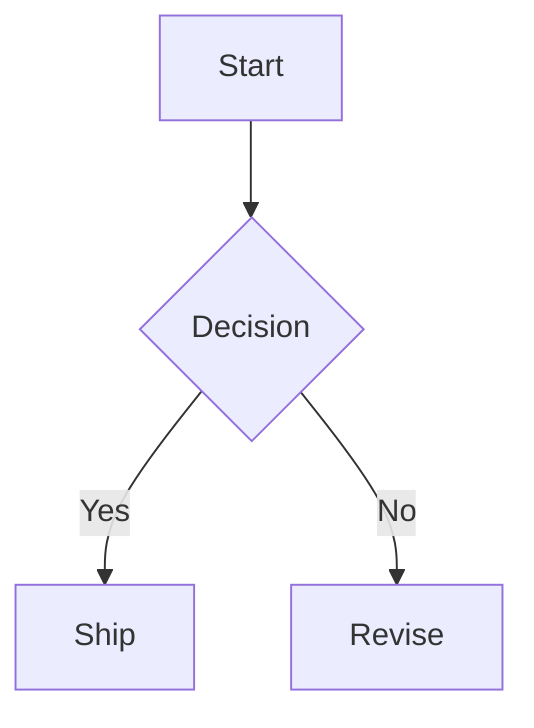

# PRD: Mermaid Markdown Support
**Product Requirements Document**

| 항목 | 내용 |
|------|------|
| 문서 버전 | v0.1 (Draft) |
| 작성일 | 2026-04-02 |
| 상태 | 초안 |
| 작성자 | Codex |

---

## 1. Overview

### 1.1 Problem Statement

현재 Boardmark의 markdown renderer는 `react-markdown + remark-gfm + rehype-highlight` 중심으로 구성되어 있고, ` ```mermaid ` fenced block은 일반 코드블럭처럼만 보인다.

이 상태는 아래 문제를 만든다.

- 사용자는 시스템 구조, 사용자 흐름, 상태 전이, 시퀀스 다이어그램을 텍스트가 아니라 시각 구조로 전달하고 싶다.
- 기술 문서와 아키텍처 문서는 이미 Mermaid 문법을 널리 사용하지만, Boardmark 안에서는 같은 문서가 “다이어그램”이 아니라 “코드”로만 보인다.
- 대안으로 이미지를 붙이거나 HTML sandbox를 쓰면 수정성, diff 가독성, AI 생성 난이도, 문서 휴대성이 모두 나빠진다.

즉 지금 빠져 있는 것은 “새 포맷”이 아니라, **이미 널리 쓰이는 markdown-adjacent diagram 문법을 Boardmark가 제품 기능으로 받아들이는 것**이다.

### 1.2 Why This Has High ROI

이 기능은 ROI가 높다.

- source-of-truth를 계속 plain text markdown로 유지한다.
- note body, edge label, built-in note renderer가 모두 공용 `MarkdownContent`를 쓰고 있어 도입 지점이 좁다.
- 시스템 설계, 제품 플로우, 운영 다이어그램 같은 고빈도 문서 시나리오를 바로 개선한다.
- 별도 노드 타입을 추가하지 않아도 기존 `.canvas.md` 안에서 즉시 가치를 낸다.

### 1.3 Product Goal

Boardmark는 ` ```mermaid ` fenced code block을 **제품 차원의 diagram block**으로 지원해야 한다.

- 사용자는 markdown 안에 Mermaid 문법을 적으면 preview surface에서 SVG 다이어그램으로 볼 수 있어야 한다.
- 같은 source는 web / desktop에서 실질적으로 같은 시각 결과를 가져야 한다.
- 렌더 실패 시 조용히 깨지지 않고, 원인과 원문을 확인할 수 있어야 한다.
- 일반 markdown 보안 경계를 약화시키지 않아야 한다.

### 1.4 Success Criteria

- 신규 사용자가 별도 설명 없이 ` ```mermaid ` block을 적고 preview에서 다이어그램을 확인할 수 있다.
- 아키텍처, 플로우차트, 시퀀스 다이어그램 같은 대표 Mermaid 문법이 web / desktop에서 일관되게 렌더링된다.
- Mermaid 미지원 또는 문법 오류가 있어도 note 전체 렌더링이 깨지지 않고, 문제 block만 진단 가능한 fallback UI로 표시된다.
- Mermaid 지원이 없는 문서와 일반 markdown 렌더링 성능을 눈에 띄게 악화시키지 않는다.

---

## 2. Goals & Non-Goals

### Goals

- fenced code block 언어가 `mermaid`일 때 diagram으로 렌더링
- `MarkdownContent`를 사용하는 모든 preview surface에서 동일 동작 보장
- Mermaid 렌더 실패 시 명시적 오류 UI와 source fallback 제공
- 보안 정책을 유지한 상태에서 SVG 결과만 삽입
- diagram block의 overflow, 확대된 문서 폭, 좁은 카드 폭에서 읽을 수 있는 기본 레이아웃 제공

### Non-Goals

- Mermaid 전용 WYSIWYG editor
- drag-based diagram editing
- per-block Mermaid init option 주입
- arbitrary HTML / JS 실행 허용
- note 외 별도 “diagram object type” 추가
- PNG export, copy-as-image, line animation 같은 부가 기능

---

## 3. Users & Core Scenarios

### Target User

- 아키텍처와 데이터 흐름을 자주 문서화하는 개발자
- 제품 흐름과 운영 절차를 시각적으로 정리하는 기획자
- AI에게 markdown로 다이어그램 초안을 만들게 하고 사람이 후편집하는 사용자

### Core User Stories

```text
AS  개발자
I WANT  note body 안에 Mermaid flowchart를 적고
SO THAT 시스템 구조를 이미지 없이 텍스트 기반으로 공유할 수 있다

AS  사용자
I WANT  sequence diagram과 state diagram을 Boardmark 안에서 바로 보고
SO THAT 문서와 보드를 오가며 구조를 설명할 수 있다

AS  AI-native 사용자
I WANT  AI가 작성한 Mermaid markdown를 그대로 열어 시각 결과를 확인하고
SO THAT 별도 변환 단계 없이 설계 초안을 빠르게 검토할 수 있다
```

---

## 4. Current Assumptions

- 첫 버전의 핵심 렌더 범위는 공용 `MarkdownContent`가 쓰이는 preview surface다.
- 현재 편집 UX는 `textarea` 교체형이므로, Mermaid block 편집은 계속 raw markdown editing으로 처리한다.
- parser는 note body raw text를 그대로 보존하므로, Mermaid 지원은 우선 parser 변경 없이 renderer 레벨에서 도입하는 편이 맞다.
- 별도 theme frontmatter를 추가하지 않아도 첫 버전 가치는 충분하다. 문서별 Mermaid theme override는 후속 범위로 둔다.

---

## 5. Product Rules

### 5.1 Canonical Syntax

첫 버전의 canonical syntax는 fenced code block이다.

````md

````

규칙은 아래와 같다.

- info string이 정확히 `mermaid`인 fenced block만 diagram rendering 대상으로 본다.
- 대소문자 alias, directive 문법, inline Mermaid는 첫 버전 범위에 포함하지 않는다.
- Mermaid source 원문은 문서 안에 그대로 저장되고 parser contract는 바뀌지 않는다.

### 5.2 Rendering Scope

- note body preview에서 Mermaid는 diagram으로 렌더링되어야 한다.
- edge label preview에서도 같은 `MarkdownContent` 경로를 타는 경우 같은 규칙을 적용해야 한다.
- built-in note renderer와 canvas scene inline preview는 같은 shared renderer contract를 써야 한다.

### 5.3 Failure Behavior

- Mermaid parse 또는 render가 실패해도 note 전체를 실패시키면 안 된다.
- 실패한 block은 오류 상태 card로 렌더한다.
- 오류 card는 최소한 아래 정보를 보여줘야 한다.
  - Mermaid 렌더 실패 사실
  - 가능한 원인 또는 에러 메시지
  - 원본 Mermaid source
- 실패를 조용히 plain paragraph로 바꾸거나 빈 영역으로 숨기면 안 된다.

### 5.4 Security Rules

- 일반 markdown renderer에 raw HTML 허용을 추가하지 않는다.
- Mermaid는 전용 renderer 안에서만 처리한다.
- Mermaid 설정은 보수적 기본값을 사용해야 한다.
- 사용자 source가 앱 DOM에 임의 HTML/JS를 직접 주입하게 하면 안 된다.
- click callback, script execution, unsafe HTML label 같은 기능은 첫 버전에서 비활성화한다.

### 5.5 Performance Rules

- Mermaid가 없는 일반 markdown 문서는 기존 대비 렌더 경로가 크게 무거워지면 안 된다.
- Mermaid 엔진은 실제 Mermaid block이 존재할 때만 로드하는 lazy path가 바람직하다.
- 동일 문서 안의 여러 Mermaid block이 반복 초기화 비용을 불필요하게 만들지 않아야 한다.

### 5.6 Layout Rules

- diagram block은 기본적으로 카드 너비에 맞춰 축소 또는 스크롤 가능한 방식으로 보여야 한다.
- 너무 넓은 SVG가 note 레이아웃을 깨면 안 된다.
- 배경, padding, radius는 코드블럭과 구분되는 diagram surface로 스타일링해야 한다.
- 좁은 edge label에서 diagram이 실질적으로 읽기 어려운 경우에도 overflow가 문서 바깥으로 무한 확장되면 안 된다.

### 5.7 Accessibility Rules

- diagram wrapper는 `img` 또는 동등한 역할 정보를 제공해야 한다.
- Mermaid source를 기반으로 한 접근 가능한 label 또는 대체 설명 경로를 제공해야 한다.
- 렌더 실패 상태는 색만으로 구분하지 않고 텍스트로도 드러나야 한다.

---

## 6. Functional Requirements

### 6.1 Supported Syntax Baseline

첫 버전은 번들된 Mermaid 버전이 공식 지원하는 문법을 따르되, 최소한 아래 범주의 다이어그램이 안정적으로 동작해야 한다.

- `flowchart`
- `sequenceDiagram`
- `stateDiagram-v2`
- `classDiagram`
- `erDiagram`
- `journey`
- `gantt`
- `pie`
- `gitGraph`

제품은 “Boardmark가 따로 임의 문법을 만든다”가 아니라, **번들된 Mermaid 버전의 공식 문법을 안정적으로 노출하는 것**을 목표로 한다.

### 6.2 Rendering Contract

- Mermaid block은 최종적으로 SVG 다이어그램으로 렌더링되어야 한다.
- 원본 fenced code source는 저장 포맷에 그대로 남는다.
- inline code와 일반 fenced code block 동작은 그대로 유지해야 한다.
- 비-`mermaid` 언어 block은 기존 code highlight 경로를 유지한다.

### 6.3 Consistency Contract

- web / desktop은 동일 Mermaid 버전과 동일 기본 설정을 사용해야 한다.
- 같은 source를 주면 실질적으로 같은 SVG 구조와 theme 결과를 가져야 한다.
- `MarkdownContent` 경계 밖에서 임의로 따로 Mermaid를 렌더하면 안 된다.

### 6.4 Error Contract

- Mermaid source 문법 오류는 recoverable error로 취급한다.
- 오류 block은 UI에서 진단 가능해야 한다.
- 오류가 발생해도 surrounding markdown tree는 정상 렌더링되어야 한다.

### 6.5 Theming Contract

첫 버전은 문서별 Mermaid theme 설정 없이, **Boardmark 기본 light editorial surface에 맞는 단일 기본 Mermaid theme**를 사용한다.

- default theme는 web / desktop 공통이어야 한다.
- Boardmark 색상 체계와 과하게 충돌하지 않아야 한다.
- 후속 단계에서 document frontmatter 기반 `mermaidTheme` 또는 동등한 설정을 추가할 수 있도록 내부 경계를 남긴다.

### 6.6 Save / Compatibility Contract

- 기존 `.canvas.md` 문서는 migration 없이 그대로 유효해야 한다.
- Mermaid 지원은 source schema version 증가 없이 도입 가능해야 한다.
- Mermaid가 없는 markdown 문서는 렌더링 결과가 바뀌지 않아야 한다.

---

## 7. Technical Direction

### 7.1 Preferred Introduction Point

첫 구현은 parser가 아니라 shared UI renderer에서 처리하는 편이 맞다.

- parser는 raw markdown body 보존 역할만 유지한다.
- `packages/ui/src/components/markdown-content.tsx`가 Mermaid detection의 1차 경계가 된다.
- Mermaid 전용 렌더링은 별도 `MermaidDiagram` 컴포넌트와 `mermaid-renderer` 유틸로 분리한다.

### 7.2 Why Not Raw HTML

Mermaid를 위해 일반 markdown에 raw HTML을 열어두는 것은 방향이 맞지 않다.

- markdown 전체 보안 경계를 불필요하게 넓힌다.
- HTML sandbox 문서가 이미 별도 기능으로 분리되어 있다.
- Mermaid는 “제한된 diagram DSL”이므로 전용 렌더 경계가 더 단순하고 안전하다.

### 7.3 Why Not New Object Type First

별도 `diagram` object type은 장기적으로 검토할 수 있지만, 첫 ROI는 markdown body 지원에서 나온다.

- 이미 사용자 문서에 Mermaid source가 존재할 가능성이 높다.
- 새 object type은 parser, edit service, creation UI, source patch contract까지 넓게 건드린다.
- 공용 markdown renderer에서 먼저 지원하면 변화 범위가 작고 가치 전달이 빠르다.

---

## 8. Risks and Mitigations

### Bundle Size

- Mermaid는 가벼운 라이브러리가 아니므로 lazy import를 기본 전략으로 둔다.

### Render Stability

- 복잡한 Mermaid source가 렌더를 지연시킬 수 있다.
- 초기에는 비동기 render + loading placeholder를 사용하고, 실패를 명시적으로 surface에 노출한다.

### Security Drift

- Mermaid option이 느슨해지면 HTML/링크/스크립트 경계가 흐려질 수 있다.
- 초기 설정을 중앙 모듈에서만 관리하고 각 호출부에서 임의 override를 막는다.

### Theme Mismatch

- Mermaid 기본 테마가 Boardmark 톤과 어긋날 수 있다.
- 첫 버전은 하나의 검증된 theme 조합만 쓰고, frontmatter theme 확장은 후속으로 미룬다.

---

## 9. Rollout Decision

첫 단계의 제품 결정은 아래로 고정한다.

- Mermaid는 ` ```mermaid ` fenced block만 지원한다.
- 도입 지점은 parser가 아니라 shared markdown renderer다.
- 기본값은 단일 공통 Mermaid theme다.
- 실패 UX와 보안 정책은 첫 버전 범위에 포함한다.
- 별도 diagram object type과 문서별 Mermaid theme override는 후속 단계로 미룬다.
