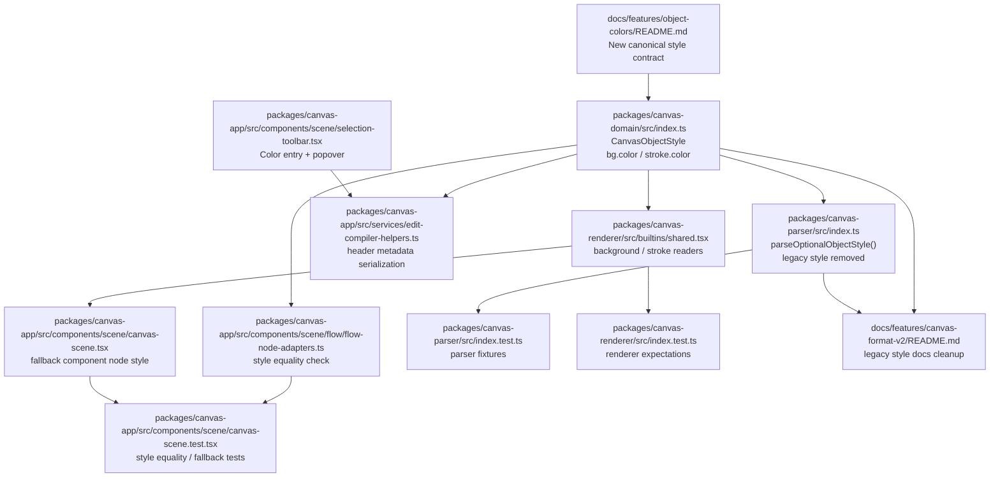

# PRD: Object Fill & Outline Colors
**Product Requirements Document**

| 항목 | 내용 |
|------|------|
| 문서 버전 | v0.1 (Draft) |
| 작성일 | 2026-04-13 |
| 상태 | 초안 |
| 작성자 | Codex |

---

## 1. Overview

### 1.1 Problem Statement

현재 Boardmark는 오브젝트의 이동, 리사이즈, 정렬 계열 명령을 확장하는 방향으로 발전하고 있지만, 사용자가 오브젝트의 시각적 구분을 빠르게 조정할 수 있는 색상 편집 기능은 제공하지 않는다.

코드 레벨에서는 기존에 `style.overrides.fill`, `style.overrides.stroke`를 파싱하고 렌더링하는 경로가 존재하지만, 이 기능은 사용자에게 `배경색`과 `아웃라인색`이라는 더 명확한 개념으로 노출되어야 한다. 또한 stroke는 이후 색상 외에 선 스타일 속성까지 확장될 가능성이 높으므로, generic override 모델이나 flat `fill` / `stroke` 문자열보다 의미가 드러나는 명시적 구조로 재정리할 필요가 있다. 이번 작업에서는 `overrides` 기반 스타일 모델과 `themeRef`를 제거하고, 더 짧고 명시적인 canonical 구조로 옮긴다.

이 제약 때문에 사용자는 다음을 할 수 없다.

- 특정 오브젝트를 배경색으로 강조하기
- 비슷한 오브젝트를 색상으로 구분하기
- 배경은 유지한 채 아웃라인만 바꿔 선택 영역이나 상태를 표현하기
- 다중 선택된 오브젝트에 동일한 색상 스타일을 일괄 적용하기

Boardmark는 문서 기반 캔버스이므로, 색상 변경도 임시 runtime state가 아니라 문서 소스에 직렬화되고 Undo/Redo와 저장 경로에 일관되게 통합되어야 한다.

### 1.2 Product Goal

사용자는 캔버스에서 선택한 오브젝트의 `배경 색상`과 `아웃라인 색상`을 변경할 수 있어야 한다.

v1 목표는 다음과 같다.

- 사용자는 지원 오브젝트에 대해 `배경 색상(fill)`을 변경할 수 있어야 한다.
- 사용자는 지원 오브젝트에 대해 `아웃라인 색상(stroke)`을 변경할 수 있어야 한다.
- 변경 결과는 문서 소스의 `style.bg.color` / `style.stroke.color`에 반영되어야 한다.
- 색상 변경은 Undo/Redo, 저장, 다시 열기 이후에도 유지되어야 한다.
- 사용자는 preset swatch와 자유 입력형 컬러피커를 모두 사용할 수 있어야 한다.
- UI에서 어떤 경로로 색을 선택하든 문서에는 명시적 hex 값으로 저장되어야 한다.
- 오브젝트 헤더에 `style.bg.color` / `style.stroke.color` 값이 없을 때의 표시 색상은 오브젝트 타입별 기본 스타일 계약을 따라야 한다.
- 기본 스타일은 오브젝트별로 다를 수 있으며, `note`의 기본 outline은 없음으로 간주해야 한다.

### 1.3 Assumptions

요구가 "오브젝트 색상 변경"으로 표현되어 있지만, 현재 렌더러 구현 차이를 고려하면 v1은 모든 오브젝트를 동일하게 다루기 어렵다. 이 PRD는 다음 가정을 기준으로 작성한다.

- v1 지원 대상은 `surface-bearing node`다.
- 구체적으로는 `note`, built-in shape 계열, 그리고 fallback frame을 사용하는 custom node를 포함한다.
- `image`, `edge`, `group`는 v1 지원 대상에서 제외한다.
- 텍스트 색상 변경은 이번 범위에 포함하지 않는다.

이 가정은 현재 렌더러가 `fill` / `stroke`를 소비하는 방식이 오브젝트 종류마다 다르기 때문이다. 구현 단계에서 범위를 넓히려면 각 렌더러 계약을 먼저 정리해야 한다.

### 1.4 Success Criteria

- 사용자는 지원 오브젝트를 선택한 뒤 배경색과 아웃라인색을 각각 변경할 수 있다.
- 색상 변경은 단일 선택과 다중 선택 모두에서 동작한다.
- 색상 변경 후 문서를 저장하고 다시 열어도 같은 색이 유지된다.
- 지원되지 않는 선택 상태에서는 `Color` 액션이 비활성화되거나 열리지 않는다.
- 기존 문서 중 색상 override가 없는 문서는 아무 변경 없이 그대로 동작한다.

---

## 2. Goals & Non-Goals

### Goals

- 오브젝트 색상 편집의 제품 범위 정의
- 배경색과 아웃라인색의 UX 흐름 정의
- 다중 선택 시 일괄 적용 규칙 정의
- `CanvasObjectStyle.bg.color` / `stroke.color`를 사용하는 저장 계약 정의
- 기존 `style.overrides` 스타일 모델 제거 범위 정의
- 기존 `themeRef` 제거 범위 정의
- preset swatch와 자유 입력형 입력의 공존 규칙 정의
- markdown source에서 지원하는 색상 리터럴 형식 정의
- 오브젝트별 기본 색상/아웃라인 계약, no-fill 규칙, mixed state, unsupported selection 처리 규칙 정의
- Undo/Redo 및 persistence 요구사항 정의

### Non-Goals

- 텍스트 색상 변경
- gradient, opacity, shadow, blur 같은 고급 스타일 편집
- edge 선 색상 변경
- image frame 색상 변경
- palette/theme 시스템 전체 재설계
- renderer별 독자적인 color model 도입
- HSL, named color, CSS variable, color-mix 같은 비-hex 저장 포맷 지원

---

## 3. Core User Stories

```text
AS  캔버스 사용자
I WANT  오브젝트 배경색을 바꿀 수 있고
SO THAT 중요도나 카테고리를 시각적으로 구분할 수 있다

AS  캔버스 사용자
I WANT  오브젝트 아웃라인 색을 바꿀 수 있고
SO THAT 배경은 유지한 채 경계나 상태를 강조할 수 있다

AS  여러 오브젝트를 정리하는 사용자
I WANT  다중 선택 후 같은 색을 한 번에 적용할 수 있고
SO THAT 반복 작업 없이 보드를 빠르게 정돈할 수 있다

AS  문서 기반 워크플로우를 쓰는 사용자
I WANT  색상 변경이 markdown source에 저장되고 유지되며
SO THAT Git diff와 재열기 이후 결과가 안정적으로 일치한다
```

---

## 4. Supported Scope

### 4.1 Supported Objects

- `note`
- built-in shape: `boardmark.shape.rect`, `boardmark.shape.roundRect`, `boardmark.shape.ellipse`, `boardmark.shape.circle`, `boardmark.shape.triangle`
- built-in renderer가 없을 때 fallback frame으로 렌더되는 custom node

### 4.2 Unsupported Objects

- `image`
- `edge`
- `group`

### 4.3 Selection Eligibility Rules

- 선택에 지원 오브젝트가 하나 이상 포함되면 `Color` 액션을 노출할 수 있어야 한다.
- 다중 선택에 지원 대상과 비지원 대상이 섞여 있어도, 색상 적용은 지원 대상에만 반영한다.
- 선택 전체가 비지원 대상뿐이면 `Color` 액션은 비활성화되거나 숨겨져야 한다.

---

## 5. UX Requirements

### 5.1 Entry Points

- `SelectionToolbar`의 `Color` 진입 버튼

v1의 유일한 진입점(entry point)은 오브젝트 선택 시 표시되는 `SelectionToolbar`다.

현재 `SelectionToolbar`는 `Auto height` 단일 액션을 가진 작은 floating control로 동작한다. 색상 기능은 이 surface를 대체하거나 재설계하지 않고, 동일한 시각 언어 안에 `Color` 액션을 추가하는 방식으로 도입해야 한다.
오브젝트 컨텍스트 메뉴는 이번 기능 범위에 포함하지 않으며, `Color` 액션을 추가하거나 수정하지 않는다.

### 5.2 Color Surface

- `Color` 액션을 선택하면 작은 popover 또는 panel이 열린다.
- 이 UI는 `Background`와 `Outline` 두 섹션으로 분리된다.
- `Background` 섹션은 preset swatch 목록, 자유 입력형 컬러 입력, `채우지 않음` 액션을 제공한다.
- `Outline` 섹션은 preset swatch 목록과 자유 입력형 컬러 입력을 제공한다.
- 사용자는 배경색만, 아웃라인색만, 혹은 둘 다 변경할 수 있어야 한다.
- popover는 선택 컨텍스트를 유지한 채 닫을 수 있어야 한다.

### 5.3 Surface Consistency Rules

- 색상 기능은 기존 `SelectionToolbar`의 배치, 밀도, radius, shadow, hover/focus 표현을 유지한 채 추가되어야 한다.
- v1은 toolbar 자체를 새로운 패널 시스템으로 교체하거나 전면 재디자인하지 않는다.
- `Auto height`와 `Color`는 동일 계열의 action item으로 보여야 하며, 새 기능 때문에 toolbar의 시각적 위계가 뒤바뀌면 안 된다.
- `Color`에서 열리는 popover도 현재 캔버스 floating UI의 톤과 spacing 규칙을 따라야 한다.
- 즉 v1의 목표는 "새 디자인"이 아니라 "기존 selection toolbar에 일관성 있게 메뉴를 추가"하는 것이다.

### 5.4 Reference Interaction Alignment

- v1의 사용자-facing 용어는 화이트보드/디자인 툴의 일반적인 색상 편집 패턴을 따른다.
- FigJam은 shape toolbar에서 `Fill`, `No Fill`, `Transparent`, custom color, border color 선택을 제공한다.
- Miro는 shape context UI에서 `Shape Fill Color`와 `Border Color`를 분리해 제공하고 custom color palette를 지원한다.
- 따라서 Boardmark는 사용자-facing 용어로 `기본값 사용`, `색상 제거`, `Reset`을 쓰지 않는다.
- Boardmark의 `Background`는 `특정 색상 지정` 또는 `채우지 않음`으로 표현하고, `Outline`은 `특정 색상 지정`으로 표현한다.

### 5.4 Preset Model

- preset은 현재 Boardmark 디자인 시스템과 built-in object palette에서 크게 벗어나지 않는 색상군으로 제한한다.
- 각 swatch는 충분한 대비와 일관된 미학을 보장해야 한다.
- preset은 UI 진입 경로일 뿐 저장 포맷이 아니다.
- 사용자가 preset을 선택해도 문서에는 대응되는 명시적 hex 값이 저장되어야 한다.

### 5.5 Free Input Model

- 사용자는 컬러피커 또는 hex 입력을 통해 임의의 색을 지정할 수 있어야 한다.
- 자유 입력은 `Background`와 `Outline` 모두에서 지원되어야 한다.
- UI는 사용자가 입력한 값이 유효한 hex 색상인지 즉시 검증해야 한다.
- 유효하지 않은 값은 저장하거나 적용하지 않아야 하며, 오류 상태를 명확히 보여줘야 한다.
- alpha가 포함된 값도 입력 가능해야 한다.

### 5.6 User Actions

- 사용자 관점의 `Background` 액션은 `특정 색상 지정` 또는 `채우지 않음` 두 가지다.
- 사용자 관점의 `Outline` 액션은 `특정 색상 지정`이다.
- v1은 사용자-facing 액션 이름으로 `Reset`, `기본값 사용`, `색상 제거`를 사용하지 않는다.
- 사용자는 툴바에서 항상 실제 표시 상태를 기준으로 색상을 고른다.
- 즉 `style.bg.color` / `style.stroke.color` 값이 없는 오브젝트는 각 타입의 기본 표시 색상 상태로 해석된다.

### 5.7 Mixed State

- 다중 선택에서 선택된 오브젝트들의 현재 fill 값이 서로 다르면 `Background`는 mixed state로 표시한다.
- 다중 선택에서 stroke 값이 서로 다르면 `Outline`도 mixed state로 표시한다.
- mixed state에서 새 swatch를 클릭하면 선택된 지원 오브젝트 전체에 동일 값으로 덮어쓴다.
- mixed state에서 자유 입력형 컬러를 적용해도 선택된 지원 오브젝트 전체에 동일 값으로 덮어쓴다.

### 5.8 Default and No-Fill Behavior

- 오브젝트 헤더에 `style.bg.color` / `style.stroke.color` 값이 없으면 전역 기본값이 아니라 오브젝트 타입별 기본 스타일을 사용한다.
- 기본 스타일은 현재 Boardmark의 renderer contract와 시각 언어를 보존하는 방향으로 정의해야 한다.
- `note`의 기본 outline은 없음이다.
- shape 계열과 fallback custom node는 타입별 기본 fill과 기본 outline을 가진다.
- 사용자가 `채우지 않음`을 선택하면, 이는 "기본 흰색"이 아니라 "명시적 투명 background color"를 의미한다.
- 따라서 `채우지 않음`은 `style.bg.color` 제거가 아니라 alpha 0의 hex 값으로 직렬화되어야 한다.

### 5.9 Object Default Style Matrix

v1은 지원 오브젝트별 기본 표시 스타일을 아래처럼 정의한다.

| 오브젝트 | 기본 fill | 기본 outline |
|------|------|------|
| `note` | `#FFF5BF` | 없음 |
| `boardmark.shape.rect` | `#FFFFFF` | `#6042D6` |
| `boardmark.shape.roundRect` | `#FFFFFF` | `#6042D6` |
| `boardmark.shape.ellipse` | `#FFFFFF` | `#6042D6` |
| `boardmark.shape.circle` | `#FFFFFF` | `#6042D6` |
| `boardmark.shape.triangle` | `#FFFFFF` | `#6042D6` |
| fallback custom node | `#FFFFFF` | `#6042D6` |

추가 규칙:

- 위 표의 "기본 fill"과 "기본 outline"은 제품이 소유하는 canonical default hex 값으로 정의한다.
- 기본 스타일 값은 renderer 구현마다 암묵적으로 흩어지지 않도록 하나의 계약 표면으로 정리해야 한다.
- `note`는 default stroke가 없으므로, `stroke` 필드가 없을 때 외곽선이 보이지 않아야 한다.
- shape 계열은 기본 배경색을 모두 `#FFFFFF`로 통일하고, 기본 outline도 모두 `#6042D6`로 통일한다.
- fallback custom node도 기본 배경색 `#FFFFFF`, 기본 outline `#6042D6`를 사용한다.

---

## 6. Data Contract Direction

### 6.1 Persistence Contract

v1은 generic `overrides` 맵을 canonical 저장 포맷으로 사용하지 않고, 배경과 stroke를 명시적으로 분리한 구조를 사용한다.

```ts
type CanvasObjectBgStyle = {
  color?: string
}

type CanvasObjectStrokeStyle = {
  color?: string
}

type CanvasObjectStyle = {
  bg?: CanvasObjectBgStyle
  stroke?: CanvasObjectStrokeStyle
}
```

색상 변경은 아래 key만 사용한다.

- `style.bg.color`
- `style.stroke.color`

이 PRD는 사용자 개념인 `background` / `outline`을 문서 모델에 대응시키되, 저장 키는 더 짧은 `bg` / `stroke`를 canonical 포맷으로 사용한다. 특히 stroke는 추후 `width`, `style`, `dash` 같은 속성을 추가할 수 있으므로 object 구조를 유지한다.

### 6.2 Serialization Rules

- 배경색 변경은 문서 소스에 `style.bg.color`로 직렬화되어야 한다.
- 아웃라인색 변경은 문서 소스에 `style.stroke.color`로 직렬화되어야 한다.
- 색상 값은 markdown source에서 명시적 hex 문자열로 저장되어야 한다.
- 지원 형식은 `#RRGGBB`와 `#RRGGBBAA`다.
- alpha가 없는 기본 색상은 `#RRGGBB`, alpha가 포함된 색상은 `#RRGGBBAA`를 사용한다.
- preset 선택도 내부적으로는 hex 문자열로 해석되어 저장되어야 한다.
- v1 UI는 `var(...)`, named color, `rgba(...)` 같은 다른 CSS 문자열을 새로 생성하지 않아야 한다.
- `채우지 않음`은 alpha 0 hex 값으로 저장되어야 하며 canonical 값은 `#00000000`로 고정한다.
- `style.bg` / `style.stroke`가 없거나 해당 object 안의 `color`가 없을 때는 직렬화 상의 "없음"이 오브젝트별 기본 스타일 적용을 의미한다.

예시:

```md
::: note { id: idea-a, at: { x: 120, y: 80, w: 320, h: 220 }, style: { bg: { color: "#D7E8FF" }, stroke: { color: "#6042D6CC" } } }
오브젝트 내용
:::
```

```md
::: note { id: idea-b, at: { x: 120, y: 80, w: 320, h: 220 }, style: { bg: { color: "#00000000" } } }
채우기 없음 예시
:::
```

### 6.3 Format Migration Policy

- 색상 override가 없는 기존 문서는 그대로 유효하다.
- 기존 문서에 hex 또는 hex+alpha 값이 있으면 그대로 유지되어야 한다.
- preset에 없는 hex 값이 문서에 이미 들어 있는 경우에도 렌더링은 유지되어야 한다.
- preset에 없는 hex 값은 UI에서 custom state로 보여줄 수 있다.
- `bg` / `stroke` 필드가 없는 문서는 새 계약에 따라 오브젝트별 기본 스타일로 렌더링되며, UI는 이를 실제 표시 색상 상태로 읽는다.
- 이번 작업 범위에는 기존 `style.overrides` 스타일 모델과 `style.themeRef` 제거가 포함된다.
- 이번 작업 이후 canonical 저장 포맷은 오직 `style.bg.color` / `style.stroke.color`다.
- 기존 `style.overrides.fill` / `style.overrides.stroke`, `style.fill` / `style.stroke`, `style.background.color`, `style.themeRef`는 모두 제거 대상이다.
- 레거시 스타일 포맷 읽기 호환은 이번 작업의 고려 대상이 아니다.

### 6.4 Validation Rules

- markdown source의 v1 정식 지원 포맷은 `#RRGGBB`와 `#RRGGBBAA`다.
- UI 자유 입력도 같은 포맷을 기준으로 검증해야 한다.
- `#RGB`, `#RGBA` 같은 shorthand는 v1 정식 입력 포맷에서 제외한다.
- 잘못된 값은 조용히 무시하지 않고 입력 오류로 보여줘야 한다.
- parser와 serializer는 새 canonical 포맷만 지원한다.
- `style.stroke`는 object여야 하며, v1에서 공식적으로 지원하는 필드는 `color`뿐이다.
- `style.bg` 역시 object를 사용하며, v1에서 공식적으로 지원하는 필드는 `color`뿐이다.

---

## 7. Product Rules

### 7.1 Background Color Rules

- 배경색은 오브젝트의 내부 surface에 적용되어야 한다.
- `style.bg.color`가 없으면 해당 오브젝트 타입의 기본 fill을 사용해야 한다.
- 배경색 변경은 텍스트 색상을 자동 변경하지 않는다.
- 따라서 preset은 현재 기본 텍스트 색상과 충돌하지 않는 범위로 제한해야 한다.
- 자유 입력형 값도 적용 가능하지만, 대비 부족 경고는 후속 개선 대상으로 남길 수 있다.
- `채우지 않음`은 명시적 transparent fill이며, 기본 흰색과는 다른 상태다.

### 7.2 Outline Color Rules

- 아웃라인색은 오브젝트 내부 경계선으로 적용되어야 한다.
- `style.stroke.color`가 없으면 해당 오브젝트 타입의 기본 outline을 사용해야 한다.
- `note`는 기본 outline이 없으므로 stroke color가 없을 때 outline을 렌더하지 않는다.
- v1에서 stroke object의 공식 지원 필드는 `color`뿐이다.
- 두께, dash, join 같은 다른 stroke 속성은 향후 추가될 수 있지만 이번 범위에 포함하지 않는다.
- outline은 selection ring이나 drag handle과 다른 레이어여야 한다.

### 7.3 Multi-Selection Rules

- 사용자가 여러 지원 오브젝트를 선택하면 같은 색상을 일괄 적용할 수 있어야 한다.
- 일괄 적용은 선택 순서와 무관하게 deterministic해야 한다.
- 비지원 오브젝트는 그대로 두고, 지원 오브젝트만 업데이트해야 한다.

### 7.4 Undo/Redo Rules

- 각 색상 변경은 Undo 가능한 명시적 편집 단위여야 한다.
- `Background`와 `Outline` 변경은 사용자가 각각 독립적으로 되돌릴 수 있어야 한다.
- 한 번의 swatch 클릭으로 여러 오브젝트가 바뀌는 경우도 하나의 coherent transaction으로 기록되어야 한다.

### 7.5 Save / Reload Rules

- 색상 변경 결과는 autosave 또는 명시적 save 경로에 포함되어야 한다.
- 문서를 다시 열면 같은 색상 override가 동일하게 복원되어야 한다.
- export 또는 preview surface가 style override를 사용하는 경우 동일한 결과를 보여야 한다.

---

## 8. Acceptance Criteria

- 사용자가 `note` 하나를 선택해 배경색을 바꾸면 즉시 캔버스에 반영되고 저장 후 재열기에도 유지된다.
- 사용자가 `shape` 하나를 선택해 아웃라인색을 바꾸면 즉시 캔버스에 반영되고 저장 후 재열기에도 유지된다.
- 사용자가 여러 `note`/`shape`를 함께 선택해 같은 배경색을 적용할 수 있다.
- 사용자가 mixed selection에서 배경색 또는 아웃라인색을 선택하면 지원 오브젝트 전체가 같은 값으로 통일된다.
- 사용자가 preset swatch를 선택하면 문서에는 대응되는 `#RRGGBB` 또는 `#RRGGBBAA` 값이 저장된다.
- 사용자가 자유 입력형 컬러피커로 alpha 포함 색상을 선택하면 문서에는 `#RRGGBBAA`로 저장된다.
- 사용자가 `채우지 않음`을 선택하면 문서에는 `bg.color: "#00000000"`이 저장된다.
- 사용자가 markdown source에 `#RRGGBB` 또는 `#RRGGBBAA` 값을 직접 작성한 문서를 다시 열면 같은 색이 유지된다.
- `bg.color` 값이 없는 오브젝트는 타입별 기본 fill로 렌더된다.
- `stroke.color` 값이 없는 오브젝트는 타입별 기본 outline으로 렌더된다.
- `note`는 `stroke.color` 값이 없을 때 outline이 렌더되지 않는다.
- `style.overrides`, `style.fill`, `style.background`, `style.themeRef`를 사용한 문서는 더 이상 유효한 스타일 포맷으로 간주하지 않는다.
- `image`만 선택했을 때는 `Color` 기능이 활성화되지 않는다.
- `edge`만 선택했을 때는 `Color` 기능이 활성화되지 않는다.
- 기존 문서에 색상 정보가 없어도 동작이 깨지지 않는다.

---

## 9. Open Questions

- `note`와 fallback custom node는 현재 계약상 적용이 자연스럽지만, `image`와 `edge`까지 같은 UI로 확장할지 별도 색상 모델을 둘지 결정이 필요하다.
- preset swatch의 정확한 개수와 색상군은 디자인 시스템 토큰에 맞춰 확정해야 한다.
- 텍스트 대비를 유지하기 위해 장기적으로 `text` override까지 함께 다룰지, 혹은 fill preset만 더 보수적으로 제한할지 결정이 필요하다.
- `SelectionToolbar`에서 `Color`를 아이콘 단일 버튼으로 둘지, label을 가진 액션으로 둘지 현재 툴바 밀도 안에서 결정이 필요하다.

---

## References

- FigJam Help: [Apply colors in FigJam](https://help.figma.com/hc/en-us/articles/1500004291341-Apply-colors-in-FigJam)
- Miro Help: [Shapes](https://help.miro.com/hc/en-us/articles/360017730713-Shapes)
- Miro Help: [Colors](https://help.miro.com/hc/en-us/articles/360017572374-Colors)

---

## 10. Implementation Plan

### 10.1 Phase 1: Toolbar Entry Integration

- 현재 floating object toolbar 구현인 `packages/canvas-app/src/components/scene/selection-toolbar.tsx`에 `Color` 액션을 추가한다.
- 기존 `Auto height` 액션 구조를 유지하면서 같은 컴포넌트 패턴으로 버튼을 하나 더 배치한다.
- `SelectionToolbar`가 노출되는 현재 selection 조건을 검토해, 지원 오브젝트 선택일 때만 `Color` 진입을 활성화한다.
- 기존 툴바 스타일은 유지하고, 색상 기능 때문에 toolbar layout system을 갈아엎지 않는다.
- 오브젝트 컨텍스트 메뉴(`packages/canvas-app/src/components/context-menu/object-context-menu.tsx`)는 이번 작업에서 수정하지 않는다.

### 10.2 Phase 2: Color Popover UI

- `SelectionToolbar`의 `Color` 액션에서 열리는 popover 컴포넌트를 추가한다.
- popover 안에는 `Background`, `Outline`, preset swatch, 자유 입력형 컬러피커, `채우지 않음` UI를 포함한다.
- mixed state, unsupported selection, `채우지 않음` 상태를 명확히 표시한다.
- 시각 디자인은 기존 floating control의 radius, outline, shadow, spacing과 맞춘다.

### 10.3 Phase 3: Editing Commands & Store Wiring

- 선택된 지원 오브젝트에 대해 `style.bg.color` / `style.stroke.color`를 갱신하는 편집 경로를 추가한다.
- 단일 선택과 다중 선택 모두 같은 명령 계열을 사용하도록 정리한다.
- `style.bg.color` / `style.stroke.color`를 canonical 쓰기 포맷으로 반영하고 hex 정규화 규칙을 store/service 레이어에 반영한다.
- 오브젝트 타입별 기본 fill / outline 계약을 코드 레벨의 한 곳에서 읽을 수 있도록 정리한다.
- 기존 `style.overrides`, `style.fill`, `style.background`, `style.themeRef` 기반 읽기/쓰기 경로와 관련 타입, parser, serializer, renderer 사용처를 제거한다.
- 한 번의 색상 적용이 하나의 coherent undo transaction으로 기록되도록 연결한다.

### 10.4 Phase 4: Persistence & Reload Verification

- 문서 저장 시 `style.bg.color` / `style.stroke.color`가 `#RRGGBB` 또는 `#RRGGBBAA`로 직렬화되는지 검증한다.
- `채우지 않음` 선택 시 `bg.color: "#00000000"`으로 저장되는지 검증한다.
- 기존 문서를 다시 열었을 때 색상이 동일하게 복원되는지 검증한다.
- 기존 테스트/fixture/문서에서 `style.overrides`, `style.fill`, `style.background`, `style.themeRef` 같은 이전 구조가 남아 있지 않은지 검증한다.
- `bg.color` / `stroke.color`가 없는 문서에서 각 오브젝트가 타입별 기본 스타일로 표시되는지 검증한다.

### 10.5 Phase 5: Tests

- selection toolbar에 `Color` 액션이 표시되는 조건 테스트를 추가한다.
- 단일 선택과 다중 선택에서 색상 적용이 store에 반영되는 테스트를 추가한다.
- `채우지 않음` 선택 시 transparent fill이 저장되는 테스트를 추가한다.
- parser/serializer round-trip에서 hex 및 hex+alpha 값이 유지되는 테스트를 추가한다.
- `note`의 default outline이 없다는 점과 shape 계열 default outline이 유지된다는 점을 검증하는 테스트를 추가한다.
- unsupported object selection에서 `Color`가 비활성화되는 테스트를 추가한다.

---

## 11. Code Impact Map

이번 작업은 단일 UI 컴포넌트 추가에 그치지 않고, 스타일 데이터 계약 변경이 함께 들어간다. 따라서 영향 범위는 `toolbar UI`보다 `style type -> parse -> serialize -> render -> test -> docs` 축이 더 크다.

### 11.1 Impact Summary

| 레이어 | 파일 | 영향도 | 변경 이유 |
|------|------|------|------|
| Domain contract | `packages/canvas-domain/src/index.ts` | High | `CanvasObjectStyle`를 `overrides`/`themeRef` 기반 구조에서 `bg` / `stroke` 구조로 교체 |
| Parser | `packages/canvas-parser/src/index.ts` | High | `parseOptionalObjectStyle()`가 `style.bg.color`, `style.stroke.color`만 파싱하도록 변경 |
| Serializer / header patch | `packages/canvas-app/src/services/edit-compiler-helpers.ts` | High | markdown header에 canonical `style.bg` / `style.stroke`를 쓰도록 변경 |
| Renderer shared style readers | `packages/canvas-renderer/src/builtins/shared.tsx` | High | `readObjectBackground()`, `readStrokeColor()`가 새 계약을 읽고 구형 style 경로 의존을 제거하도록 변경 |
| Fallback renderer | `packages/canvas-app/src/components/scene/canvas-scene.tsx` | Medium | built-in renderer가 없는 custom node fallback도 새 style 구조를 읽도록 변경 |
| Flow node equality | `packages/canvas-app/src/components/scene/flow/flow-node-adapters.ts` | Medium | `hasSameCanvasObjectStyle()` 비교 로직이 `overrides` 대신 `bg` / `stroke`를 비교하도록 변경 |
| Selection toolbar UI | `packages/canvas-app/src/components/scene/selection-toolbar.tsx` | High | `Color` 진입 버튼과 popover 추가 |
| Tests | `packages/canvas-parser/src/index.test.ts` | Medium | parser fixture를 새 style 구조로 갱신하고 구형 포맷 제거 |
| Tests | `packages/canvas-renderer/src/index.test.ts` | Medium | renderer helper expectation을 새 style 구조로 갱신 |
| Tests | `packages/canvas-app/src/components/scene/canvas-scene.test.tsx` | Medium | flow node style equality / fallback rendering expectation 갱신 |
| Spec docs | `docs/features/canvas-format-v2/README.md` | Medium | 구형 `style.overrides` / `themeRef` 예시와 계약 설명 제거 또는 개정 |

### 11.2 Mermaid Overview



### 11.3 Direct Code Touchpoints

- `packages/canvas-domain/src/index.ts`
  `CanvasObjectStyle` 타입 정의가 이번 작업의 루트 변경점이다.
- `packages/canvas-parser/src/index.ts`
  `parseOptionalObjectStyle()`가 현재 `style.overrides`를 검증하고 있어 직접 수정 대상이다. 이번 작업에서는 구형 포맷 분기 자체를 제거한다.
- `packages/canvas-renderer/src/builtins/shared.tsx`
  `readObjectBackground()`, `readStrokeColor()`, `readTextColor()`가 현재 `style.overrides`와 구형 style 구조에 묶여 있다.
- `packages/canvas-app/src/components/scene/canvas-scene.tsx`
  fallback renderer inline style이 현재 `style.overrides.fill` / `stroke`를 직접 읽는다.
- `packages/canvas-app/src/components/scene/selection-toolbar.tsx`
  이번 기능의 유일한 사용자 진입점이다.
- `packages/canvas-app/src/components/scene/flow/flow-node-adapters.ts`
  `hasSameCanvasObjectStyle()` / `hasSameStyleOverrides()`가 구조 변경 영향을 직접 받는다.
- `packages/canvas-app/src/services/edit-compiler-helpers.ts`
  node/edge metadata를 directive header로 다시 쓰는 경로라 canonical 직렬화 포맷 변경점이다.
- `packages/canvas-parser/src/index.test.ts`
  parser fixture와 expected AST shape를 새 계약으로 바꿔야 한다.
- `packages/canvas-renderer/src/index.test.ts`
  `toFlowNode()` 결과에서 `style` expectation이 바뀐다.
- `packages/canvas-app/src/components/scene/canvas-scene.test.tsx`
  style reference stability, fallback rendering expectation, selection-only update 케이스가 영향을 받는다.
- `docs/features/canvas-format-v2/README.md`
  `style.overrides`와 `themeRef`를 canonical format으로 설명하는 기존 문서가 남아 있어 정합성 정리가 필요하다.

### 11.4 Impact Interpretation

- 가장 큰 영향은 `packages/canvas-domain`, `packages/canvas-parser`, `packages/canvas-renderer`, `packages/canvas-app/src/services/edit-compiler-helpers.ts`다.
- `SelectionToolbar` UI 자체는 비교적 작지만, canonical style contract 교체가 함께 들어가므로 전체 영향도는 `Medium-High`다.
- 이번 작업을 안전하게 끝내려면 UI보다 먼저 style contract를 고정하고, parser/serializer/renderer를 한 세트로 바꿔야 한다.
