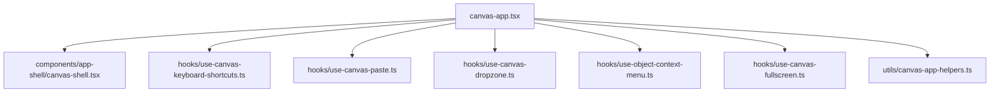
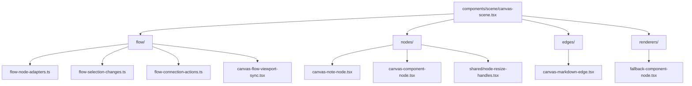
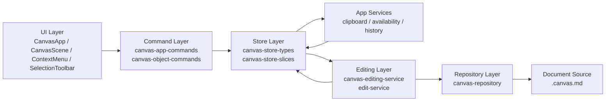
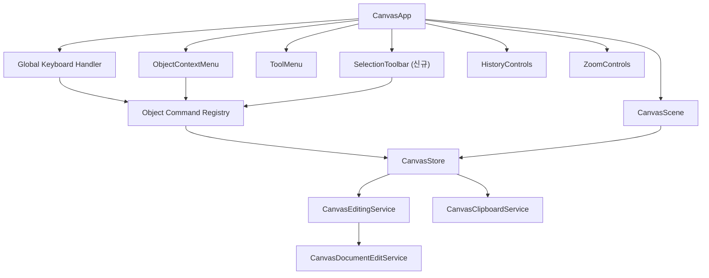
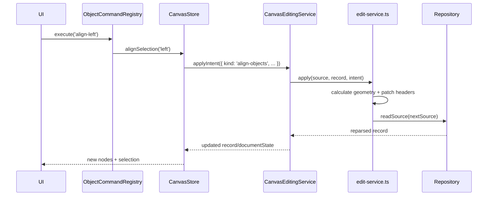
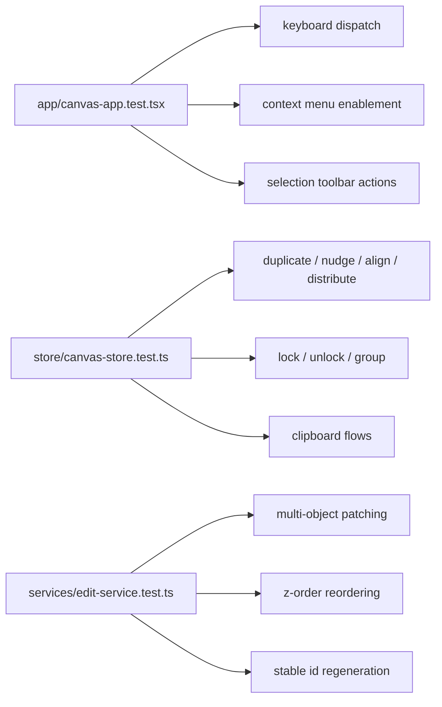

# Boardmark Object Commands PRD

> 후속 작업은 `docs/features/object-commands-followup/README.md`에서 별도 관리한다.

| 항목 | 내용 |
| --- | --- |
| 문서 버전 | v0.1 |
| 작성일 | 2026-04-03 |
| 상태 | Draft |
| 범위 | 캔버스 오브젝트 관련 커맨드 조작 |

## 1. 목적

Boardmark의 현재 캔버스는 텍스트 기반 편집과 기본 조작은 가능하지만, Excalidraw, FigJam, Miro 같은 화이트보드 도구에서 사용자가 기본으로 기대하는 오브젝트 커맨드 레이어가 비어 있다.

이번 PRD의 목적은 다음 두 가지다.

1. 오브젝트 조작 커맨드의 제품 요구사항을 정의한다.
2. 현재 Boardmark에 없는 기능을 우선순위별로 명확히 리스트업한다.

이 문서는 "Boardmark를 그래픽 화이트보드와 똑같이 만든다"가 아니라, Boardmark의 문서 기반 모델을 유지하면서도 사용자가 오브젝트를 다룰 때 기본적으로 기대하는 명령 체계를 확보하는 것을 목표로 한다.

## 2. 문제 정의

현재 Boardmark는 다음은 가능하다.

- 오브젝트 선택
- 노드 드래그 이동
- 노드 리사이즈
- 엣지 생성 및 재연결
- 선택 삭제
- 노트/셰이프/엣지 본문 편집
- 이미지 교체, alt 수정, 비율 잠금 토글
- 버튼 기반 zoom in / zoom out
- Space 기반 temporary pan
- Undo/Redo

하지만 실제 오브젝트 작업 흐름에서 자주 쓰는 다음 축이 빠져 있다.

- 복제
- 클립보드 기반 cut/copy/paste
- select all
- 키보드 nudging
- 정렬/분배
- z-order 변경
- 그룹/해제
- lock/unlock
- 회전/뒤집기
- 다중 선택 일관성
- 컨텍스트 메뉴와 단축키의 완결성
- 키보드 기반 zoom in / zoom out

결과적으로 Boardmark는 "오브젝트를 만들고 수정하는 뷰어형 편집기" 수준에는 도달했지만, "빠르게 배치하고 정리하는 캔버스 툴" 수준에는 아직 미달이다.

## 3. 현재 구현 상태

2026-04-03 기준 코드 기준 현재 범위는 다음과 같다.

### 3.1 현재 지원되는 조작

- 앱 커맨드는 `undo`, `redo`, `delete-selection`, `space-to-pan`, `dismiss menu` 정도만 존재한다.
- 키보드 매핑도 Space, Undo, Redo, Delete, Escape만 있다.
- 스토어 명령은 이동, 리사이즈, 엣지 생성/재연결, 오브젝트 생성, 삭제, 본문 편집, 이미지 전용 수정에 집중돼 있다.
- 장면 레벨에서는 드래그 이동, 박스 선택, 리사이즈 핸들, 컨텍터 연결이 동작한다.
- 웹은 다중 선택을 지원하지만 데스크톱은 `supportsMultiSelect: false`로 비활성화돼 있다.

### 3.2 현재 미지원이 코드에 드러나는 부분

- 오브젝트 컨텍스트 메뉴에 `Duplicate`, `Group`, `Align`, `Distribute`, `Arrange`, `Color`, `Lock`가 존재하지만 모두 disabled 상태다.
- 회전, 뒤집기, z-order, 그룹 구조, 잠금 상태를 표현하는 도메인 필드가 없다.
- 클립보드용 오브젝트 직렬화/역직렬화 계층이 없다.
- 선택 기반 일괄 편집 명령이 없다.

## 4. 비교 기준

이 PRD는 제품별 고유 기능이 아니라, Excalidraw / FigJam / Miro에서 공통적으로 보이는 "오브젝트 기본 명령"의 교집합을 기준선으로 삼는다.

Freeform도 방향성 참고 대상이지만, 이 문서는 우선 공식 자료와 코드 액션 표면이 비교적 명확한 제품들의 교집합을 기준으로 정의한다. 즉 "특정 제품 따라하기"가 아니라 "화이트보드 기본기 확보"가 목적이다.

기준선에 포함하는 범주는 다음이다.

- Selection: single, multi, box select, select all
- Clipboard: duplicate, cut, copy, paste
- Transform: move, nudge, resize, rotate/flip
- Layout: align, distribute, tidy/auto layout 수준의 정렬 보조
- Structure: group, ungroup, frame/section 관련 선택 보조
- Arrange: bring forward/backward/front/back
- Protection: lock/unlock
- Editing access: context menu, toolbar, keyboard shortcut, quick action

## 5. 기준선 대비 갭 분석

### 5.1 요약 표

| 커맨드 패밀리 | 현재 Boardmark | 기준선 기대치 | 상태 |
| --- | --- | --- | --- |
| 단일 선택 | 지원 | 필수 | 충족 |
| 다중 선택 | 웹만 부분 지원 | 웹/데스크톱 공통 필수 | 부분 충족 |
| 박스 선택 | 웹만 지원 | 필수 | 부분 충족 |
| Select all | 없음 | 필수 | 미지원 |
| Delete | 지원 | 필수 | 충족 |
| Duplicate | 없음 | 필수 | 미지원 |
| Cut / Copy / Paste | 이미지 붙여넣기만 부분 지원 | 필수 | 미지원 |
| Arrow-key nudge | 없음 | 필수 | 미지원 |
| Shift nudge | 없음 | 일반적 기대치 | 미지원 |
| Resize | 지원 | 필수 | 충족 |
| Rotate / Flip | 없음 | 일반적 기대치 | 미지원 |
| Align | 없음 | 필수 | 미지원 |
| Distribute / Tidy | 없음 | 필수 | 미지원 |
| Arrange (z-order) | 없음 | 필수 | 미지원 |
| Group / Ungroup | 없음 | 필수 | 미지원 |
| Lock / Unlock | 이미지 비율 잠금만 존재 | 필수 | 미지원 |
| Quick actions / command surface | 없음 | 일반적 기대치 | 미지원 |

### 5.2 현재 없는 기능 목록

아래는 현재 Boardmark에서 실제로 없는 기능이다.

#### P0. 반드시 필요한 기본 조작

- `Duplicate selection`
- `Cut / Copy / Paste selection`
- `Select all`
- `Keyboard zoom in / zoom out`
- `Arrow key nudge`
- `Shift + arrow` large nudge
- `Align left / center / right / top / middle / bottom`
- `Distribute horizontally / vertically`
- `Bring forward / send backward / bring to front / send to back`
- `Lock / unlock object`
- 데스크톱 다중 선택 지원

#### P1. 구조화와 생산성 향상

- `Group selection`
- `Ungroup selection`
- `Duplicate via Alt/Option-drag`
- `Paste in place`
- `Copy/Paste style`
- `Lock all selected`
- `Selection toolbar` 또는 `quick actions`
- 프레임 내부 오브젝트 일괄 선택

#### P2. 고급 변형

- `Rotate object`
- `Flip horizontal / vertical`
- `Wrap selection in frame`
- 정렬 이후 간격 유지 또는 tidy-up 보조

## 6. 제품 목표

### 6.1 목표

- 사용자가 마우스만으로도 기본 오브젝트 정리 작업을 끝낼 수 있어야 한다.
- 사용자가 키보드만으로도 핵심 조작을 반복 수행할 수 있어야 한다.
- 오브젝트 명령이 웹과 데스크톱에서 가능한 한 동일하게 동작해야 한다.
- 문서 기반 캔버스라는 Boardmark 특성을 해치지 않으면서, 명령 실행 결과가 명확하게 마크다운 소스에 반영되어야 한다.

### 6.2 비목표

- 실시간 협업 권한 모델
- 코멘트, 리액션, 멘션
- 자유 드로잉 브러시
- AI 자동 배치
- Figma/Miro 수준의 완전한 레이아웃 엔진

## 7. 제품 요구사항

### 7.1 Selection Commands

- 사용자는 `Cmd/Ctrl+A`로 현재 보드의 모든 selectable object를 선택할 수 있어야 한다.
- 사용자는 웹과 데스크톱 모두에서 shift-click 및 box selection으로 다중 선택할 수 있어야 한다.
- 잠긴 오브젝트는 선택 가능하지만 수정 불가 상태로 처리돼야 한다.
- 그룹에 속한 오브젝트를 클릭했을 때 첫 클릭은 그룹 전체를 선택해야 한다.
- 같은 그룹이 이미 선택된 상태에서 두 번째 클릭을 하면 그룹 내부 오브젝트를 drill-down 선택할 수 있어야 한다.
- 그룹이 선택된 상태에서 `Shift+Click`으로 다른 오브젝트를 선택하면, 단순히 "그룹 1개 + 다른 오브젝트 1개 이상"이 함께 선택된 상태로 확장한다.
- box selection은 top-level object 기준으로 동작한다. 즉 박스 안에 그룹 멤버 노드가 포함되어 있더라도, 기본 선택 결과는 내부 노드가 아니라 상위 `group` 오브젝트가 된다.
- `Select all` 역시 top-level object 기준으로 동작한다. 그룹 내부 노드는 개별 선택하지 않고 그룹 오브젝트를 선택한다.

### 7.2 Clipboard Commands

- 사용자는 선택한 노드/엣지를 `Duplicate` 할 수 있어야 한다.
- 사용자는 `Cut`, `Copy`, `Paste`를 사용할 수 있어야 한다.
- Paste는 원본과 ID 충돌 없이 새 오브젝트를 생성해야 한다.
- Paste는 기본 paste와 paste-in-place 두 모드를 지원한다.
- `copy / cut / duplicate`에서 edge는 양 끝 노드가 모두 selection에 포함된 경우에만 자동 포함한다.
- edge가 단독 selection 상태라면 해당 edge는 그대로 복사/잘라내기/복제 대상이 될 수 있다.
- group이 selection에 포함된 경우 copy/paste와 duplicate는 그룹 오브젝트와 그 멤버 노드들을 함께 복제하고, 새 `group id`를 발급해야 한다.

### 7.3 Transform Commands

- 사용자는 방향키로 선택 오브젝트를 미세 이동할 수 있어야 한다.
- `Shift + 방향키`는 더 큰 단위로 이동해야 한다.
- 다중 선택 이동은 selection bounding box 기준으로 일괄 적용돼야 한다.
- 회전/뒤집기는 P2로 미룰 수 있으나, 도메인 모델 충돌 가능성을 고려해 확장 가능한 구조여야 한다.

### 7.4 Layout Commands

- 다중 선택된 오브젝트에 대해 align 6종을 제공해야 한다.
- 다중 선택된 오브젝트에 대해 horizontal/vertical distribute를 제공해야 한다.
- P0 기준 `align / distribute / nudge`는 nodes-only로 동작하고, edges는 대상에서 제외한다.

### 7.5 Arrange Commands

- `align`은 2D 위치 정렬이고, `arrange`는 겹침 순서(stacking order) 제어다. 둘은 다른 명령 패밀리로 취급한다.
- 사용자는 선택 오브젝트의 쌓임 순서를 앞으로/뒤로 이동시킬 수 있어야 한다.
- 쌓임 순서는 문서 소스에 직렬화 가능한 방식이어야 하며, 명시적 `z` 필드로 관리한다.
- z-order 조작은 렌더링 순서와 hit-test 순서에 일관되게 반영돼야 한다.
- 신규 오브젝트와 신규 그룹의 기본 `z` 값은 `currentMaxZ + 1`로 부여한다.
- `bring to front`는 `currentMaxZ + 1`, `send to back`는 `currentMinZ - 1`을 기본 규칙으로 한다.
- `bring forward / send backward`는 전체 재번호 매기기보다 인접한 stacking slot 이동을 우선한다.

### 7.6 Protection Commands

- 사용자는 오브젝트를 lock/unlock 할 수 있어야 한다.
- lock된 오브젝트는 선택은 가능하지만 이동, 리사이즈, 본문 수정, 연결 생성의 대상이 되지 않아야 한다.
- lock된 오브젝트는 시각적으로 구분 가능해야 한다.
- lock된 edge는 선택 가능하지만 reconnect, delete, label edit, arrange 대상에서는 제외한다.
- 그룹 잠금은 그룹 오브젝트에만 적용한다. 멤버 node에 개별 `locked` 값을 전파하지 않는다.
- 다만 lock된 그룹의 멤버는 상위 그룹 lock에 의해 수정이 차단돼야 한다.

### 7.7 Group Commands

- 사용자는 선택한 오브젝트를 group/ungroup 할 수 있어야 한다.
- 그룹은 최소한 "함께 이동/선택되는 구조"를 제공해야 한다.
- 초기 버전에서는 시각적 group container 없이 논리 그룹만 허용한다.
- 그룹 소속은 각 node가 `groupId`를 가지는 방식이 아니라 `::: group` 오브젝트가 자신의 멤버를 정의하는 방식으로 관리한다.
- 그룹의 멤버십 정의는 `::: group` 헤더가 아니라 body content block 안에서 관리한다.
- 초기 버전의 group membership은 node id 목록만 관리한다.
- 그룹 잠금, 그룹 복제, 그룹 선택은 모두 `group` 오브젝트를 기준으로 처리한다.

예시:

~~~md
::: group { id: ideation-group, z: 40 }
~~~yaml members
nodes:
  - welcome
  - overview
  - image-1
~~~
:::
~~~

### 7.8 Command Access Surface

- 각 핵심 명령은 최소 두 경로 이상으로 접근 가능해야 한다.
  - 우클릭 컨텍스트 메뉴
  - 단축키
  - 필요 시 상단/하단 selection toolbar
- disabled 메뉴는 실제 구현 전까지 숨기거나, roadmap 배지와 함께 노출 정책을 다시 정해야 한다.

### 7.9 Viewport Navigation Commands

- viewport navigation은 object command와 별도의 앱 커맨드 축으로 관리한다.
- 사용자는 키보드로 `zoom in`과 `zoom out`을 수행할 수 있어야 한다.
- 기본 단축키는 `Cmd/Ctrl+=` for zoom in, `Cmd/Ctrl+-` for zoom out으로 둔다.
- 기존 우측 하단 `ZoomControls` 버튼과 키보드 shortcut은 같은 viewport state를 갱신해야 한다.
- inline editing 중에는 zoom shortcut이 텍스트 입력을 방해하지 않도록 editable target에서 가로채지 않아야 한다.

## 8. 기술 설계 원칙

### 8.1 문서 모델 우선

모든 명령은 일시적 React Flow 상태가 아니라 문서 소스 기준으로 커밋돼야 한다.

### 8.2 명령 단위의 edit intent

현재 `move-node`, `resize-node`, `delete-objects`처럼 개별 intent가 존재하므로, 신규 기능도 같은 패턴으로 추가한다.

예상 신규 intent 예시:

- `duplicate-objects`
- `copy-objects`
- `paste-objects`
- `nudge-objects`
- `align-objects`
- `distribute-objects`
- `arrange-objects`
- `set-objects-locked`
- `upsert-group`
- `delete-groups`

### 8.3 선택 기반 일괄 처리

- 모든 명령은 `selectedGroupIds`, `selectedNodeIds`, `selectedEdgeIds`를 기준으로 동작해야 한다.
- 다중 선택 명령은 순서 의존성을 명확히 정의해야 한다.
  - align/distribute 기준점
  - z-order 변경 순서
  - duplicate offset
- z-order는 가능한 한 전체 재정렬보다 국소 변경으로 처리한다.
- top-level selection 규칙을 유지하기 위해 box selection과 `Select all`은 group member를 직접 선택하지 않고 상위 group으로 승격해 정규화한다.

### 8.4 확장 가능한 도메인 필드

다음 필드는 중기적으로 필요하다.

- `locked?: boolean`
- `z?: number`
- 회전이 필요하다면 `rotation?: number`
- `CanvasGroup` 또는 동등한 group object 모델

## 9. 출시 단계 제안

### Phase 1

핵심 생산성 커맨드를 먼저 출시한다.

- Select all
- Duplicate
- Arrow-key nudge
- Align 6종
- Distribute 2종
- Arrange 4종
- Lock / unlock
- 데스크톱 multi-select parity

### Phase 2

클립보드와 구조화를 붙인다.

- Cut / Copy / Paste
- Paste in place
- Group / Ungroup
- Selection toolbar 또는 quick actions

### Phase 3

고급 변형과 프레임 보조 기능을 붙인다.

- Rotate
- Flip
- Wrap selection in frame
- Tidy-up 성격의 간격 재배치

## 10. 성공 기준

### 제품 지표

- 사용자가 노드 배치 정리 작업을 마우스 드래그 반복 없이 완료할 수 있다.
- 컨텍스트 메뉴의 disabled 항목이 P0 범위에서 제거된다.
- 웹과 데스크톱 간 선택/명령 동작 차이가 크게 줄어든다.

### 수용 기준

- 선택 오브젝트를 duplicate 했을 때 ID 충돌 없이 새 오브젝트가 생성된다.
- 3개 이상 노드 선택 후 align/distribute가 안정적으로 동작한다.
- locked object는 이동/편집/연결이 차단된다.
- arrange 후 렌더링 순서와 클릭 우선순위가 일치한다.
- 주요 단축키가 inline editing 중에는 캔버스 명령을 가로채지 않는다.

## 11. 구현 우선순위에 대한 판단

가장 먼저 해야 할 것은 "예쁘게 보이는 메뉴"가 아니라 "작업 속도를 바꾸는 커맨드"다.

우선순위는 다음 순서가 적절하다.

1. Duplicate
2. Select all
3. Nudge
4. Align / Distribute
5. Arrange
6. Lock / Unlock
7. Group / Ungroup
8. Clipboard

이 순서는 구현 난이도보다 사용 빈도와 사용자 체감 효용을 기준으로 잡는다.

## 12. 현재 코드 기준 근거

아래 파일들이 현재 상태 판단의 직접 근거다.

- `packages/canvas-app/src/app/canvas-app-commands.ts`
- `packages/canvas-app/src/app/canvas-app-keymap.ts`
- `packages/canvas-app/src/components/context-menu/object-context-menu.tsx`
- `packages/canvas-app/src/components/scene/canvas-scene.tsx`
- `packages/canvas-app/src/store/canvas-store-types.ts`
- `packages/canvas-app/src/store/canvas-store-slices.ts`
- `apps/web/src/App.tsx`
- `apps/desktop/src/renderer/app/App.tsx`

## 13. 외부 기준 자료

교차 제품 기준선은 아래 공식 자료를 참고했다.

- Excalidraw action strings: [UNPKG excalidraw collaboration locale bundle](https://app.unpkg.com/excalidraw-collaboration%400.17.15/files/dist/prod/assets/en-V6KXFSCK.json)
- FigJam selection / order: [Select, move, and order objects in FigJam](https://help.figma.com/hc/en-us/articles/1500004292221-Select-move-and-order-objects-in-FigJam)
- FigJam grouping / duplication: [Group objects in FigJam](https://help.figma.com/hc/en-us/articles/1500004414962-Group-objects-in-FigJam)
- FigJam locking: [Lock and unlock objects in FigJam](https://help.figma.com/hc/en-us/articles/1500004291361-Lock-and-unlock-objects-in-FigJam)
- Miro object selection / arrange / rotate: [Working with objects](https://help.miro.com/hc/en-us/articles/360017730953-How-to-select-and-move-multiple-objects)
- Miro grouping / align / distribute: [Structuring board content](https://help.miro.com/hc/en-us/articles/360017730973-Structuring-Board-Content)
- Miro shortcuts: [Shortcuts and hotkeys](https://help.miro.com/hc/en-us/articles/360017731033-Shortcuts-and-hotkeys)

## 14. 결론

Boardmark는 이미 "문서 기반 캔버스 편집"의 핵심은 갖췄다. 하지만 오브젝트를 빠르게 정리하는 명령 체계는 아직 빈 구간이 크다.

다음 단계의 핵심은 신규 오브젝트 타입을 늘리는 것이 아니라, 이미 있는 오브젝트를 빠르고 일관되게 다루게 만드는 것이다. 이 PRD의 P0를 채우면 Boardmark는 viewer-plus-editor에서 실제 canvas workflow 도구로 한 단계 올라간다.

## 15. 구현 설계

현재 구조는 아래 세 층으로 나뉜다.

- UI 레이어: `CanvasApp`, `CanvasScene`, `ObjectContextMenu`, `ToolMenu`
- Store 레이어: `CanvasStoreState`, `canvas-store-slices.ts`
- 편집 레이어: `canvas-editing-service.ts` -> `edit-service.ts`

신규 오브젝트 커맨드는 이 구조를 유지한 채 아래 원칙으로 붙인다.

1. 전역 앱 커맨드와 선택 기반 오브젝트 커맨드를 분리한다.
2. UI는 직접 문서를 고치지 않고 command registry 또는 store 메서드만 호출한다.
3. store 메서드는 selection/context 검증과 side effect를 담당한다.
4. 실제 소스 변경은 `CanvasDocumentEditIntent`를 통해 `edit-service.ts`에서 수행한다.

### 15.1 신규 커맨드와 store 매핑

| Command ID | 주요 진입점 | Store 메서드 | Edit intent / 처리 |
| --- | --- | --- | --- |
| `zoom-in` | 단축키, zoom controls | `setViewport()` / react-flow zoom | store-only |
| `zoom-out` | 단축키, zoom controls | `setViewport()` / react-flow zoom | store-only |
| `select-all` | 단축키, toolbar | `selectAllObjects()` | store-only |
| `duplicate-selection` | 단축키, 컨텍스트 메뉴 | `duplicateSelection()` | `duplicate-objects` |
| `cut-selection` | 단축키, 컨텍스트 메뉴 | `cutSelection()` | clipboard + `delete-objects` |
| `copy-selection` | 단축키, 컨텍스트 메뉴 | `copySelection()` | clipboard only |
| `paste-selection` | 단축키, 컨텍스트 메뉴 | `pasteClipboard()` | `paste-objects` |
| `paste-in-place` | 단축키 | `pasteClipboardInPlace()` | `paste-objects` |
| `nudge-left/right/up/down` | 방향키 | `nudgeSelection(dx, dy)` | `nudge-objects` |
| `align-left/right/top/bottom/center-x/center-y` | 메뉴, toolbar | `alignSelection(mode)` | `align-objects` |
| `distribute-x/y` | 메뉴, toolbar | `distributeSelection(axis)` | `distribute-objects` |
| `bring-forward` | 메뉴, toolbar | `arrangeSelection(mode)` | `arrange-objects` |
| `send-backward` | 메뉴, toolbar | `arrangeSelection(mode)` | `arrange-objects` |
| `bring-to-front` | 메뉴, toolbar | `arrangeSelection(mode)` | `arrange-objects` |
| `send-to-back` | 메뉴, toolbar | `arrangeSelection(mode)` | `arrange-objects` |
| `lock-selection` | 메뉴, toolbar | `setSelectionLocked(true)` | `set-objects-locked` |
| `unlock-selection` | 메뉴, toolbar | `setSelectionLocked(false)` | `set-objects-locked` |
| `group-selection` | 메뉴, toolbar | `groupSelection()` | `upsert-group` |
| `ungroup-selection` | 메뉴, toolbar | `ungroupSelection()` | `delete-groups` |

### 15.2 제안 파일 구조

현재 기준으로 `canvas-scene.tsx`는 797줄, `canvas-app.tsx`는 496줄이다. 신규 오브젝트 커맨드를 같은 파일에 계속 쌓는 방식은 중단하고, app shell과 scene 내부를 명시적으로 분리한다.

```mermaid
flowchart TD
  ROOT["packages/canvas-app/src"] --> APP["app/"]
  ROOT --> COMPONENTS["components/"]
  ROOT --> STORE["store/"]
  ROOT --> SERVICES["services/"]

  APP --> APP1["canvas-app.tsx (얇은 composition root)"]
  APP --> APP2["commands/canvas-app-commands.ts"]
  APP --> APP3["commands/canvas-object-commands.ts"]
  APP --> APP4["keyboard/canvas-app-keymap.ts"]
  APP --> APP5["keyboard/canvas-object-keymap.ts"]
  APP --> APP6["context/canvas-command-context.ts"]
  APP --> APP7["hooks/use-canvas-keyboard-shortcuts.ts"]
  APP --> APP8["hooks/use-canvas-paste.ts"]
  APP --> APP9["hooks/use-object-context-menu.ts"]
  APP --> APP10["utils/canvas-app-helpers.ts"]

  COMPONENTS --> SHELL["components/app-shell/"]
  COMPONENTS --> SCENE["components/scene/"]
  COMPONENTS --> MENU["components/context-menu/"]
  COMPONENTS --> CTRL["components/controls/"]

  SHELL --> SHELL1["canvas-shell.tsx"]
  SHELL --> SHELL2["canvas-overlay.tsx"]

  SCENE --> SCENE1["canvas-scene.tsx (scene root only)"]
  SCENE --> SCENE2["nodes/canvas-note-node.tsx"]
  SCENE --> SCENE3["nodes/canvas-component-node.tsx"]
  SCENE --> SCENE4["edges/canvas-markdown-edge.tsx"]
  SCENE --> SCENE5["flow/canvas-flow-viewport-sync.tsx"]
  SCENE --> SCENE6["flow/flow-node-adapters.ts"]
  SCENE --> SCENE7["flow/flow-selection-changes.ts"]
  SCENE --> SCENE8["flow/flow-connection-actions.ts"]
  SCENE --> SCENE9["renderers/fallback-component-node.tsx"]

  STORE --> STORE1["canvas-store-types.ts"]
  STORE --> STORE2["canvas-store-slices.ts"]
  STORE --> STORE3["canvas-selectors.ts"]
  STORE --> STORE4["canvas-object-selectors.ts"]

  SERVICES --> SVC1["canvas-editing-service.ts"]
  SERVICES --> SVC2["edit-service.ts"]
  SERVICES --> SVC3["canvas-clipboard-service.ts"]
  SERVICES --> SVC4["object-command-availability.ts"]
  SERVICES --> SVC5["edit-intents/object-geometry.ts"]
  SERVICES --> SVC6["edit-intents/object-arrange.ts"]
  SERVICES --> SVC7["edit-intents/object-serialize.ts"]
```



파일 분리의 핵심은 이렇다.

- `canvas-app.tsx`는 composition root만 담당하고, 이벤트 훅과 overlay 구성은 하위 파일로 내린다.
- viewport shortcut(`zoom-in`, `zoom-out`, `space-to-pan`)은 app command 레이어에 둔다.
- 선택 기반 명령은 `canvas-object-commands.ts`로 분리한다.
- `canvas-scene.tsx`는 ReactFlow 루트와 wiring만 남기고, node/edge/view-sync/change-adapter를 별도 파일로 분리한다.
- `edit-service.ts`는 intent dispatcher로 남기고, align/distribute/arrange 계산은 helper로 분리한다.

### 15.2.1 `CanvasApp` 분리 기준

현재 `canvas-app.tsx`에는 다음 책임이 같이 들어 있다.

- global keyboard dispatch
- viewport zoom shortcut 처리
- paste 처리
- fullscreen 상태 처리
- dropzone 처리
- object context menu 상태 처리
- file picker helper
- selection label 계산

신규 커맨드가 추가되면 이 파일이 계속 커지므로 아래처럼 쪼갠다.



분리 후 책임은 다음과 같이 둔다.

- `canvas-app.tsx`: store/capabilities를 조합하고 큰 구조만 렌더
- `use-canvas-keyboard-shortcuts.ts`: app command(`zoom-in`, `zoom-out`, `space-to-pan`) + object command 키 입력 처리
- `use-canvas-paste.ts`: clipboard image paste와 object paste 라우팅
- `use-canvas-dropzone.ts`: 문서/이미지 드롭 처리
- `use-object-context-menu.ts`: 우클릭 메뉴 위치와 선택 정렬 상태 관리
- `canvas-app-helpers.ts`: `isEditableTarget`, `readSelectionLabel`, `pickImageFileFromDocument` 같은 순수 helper

### 15.2.2 `CanvasScene` 분리 기준

현재 `canvas-scene.tsx` 안에는 아래가 한 파일에 공존한다.

- ReactFlow scene root
- viewport sync
- note node component
- generic component node
- edge renderer
- fallback renderer
- selection change adapter
- connection helper
- flow node merge logic

이 구조는 object command가 늘어날수록 lock/group/arrange 정책이 계속 한 파일로 몰리게 된다. 따라서 scene은 아래 구조로 분리한다.



분리 후 책임은 다음과 같이 둔다.

- `canvas-scene.tsx`: ReactFlow props wiring, store selector 연결, scene-level event only
- `canvas-note-node.tsx`: note 편집과 resize UI
- `canvas-component-node.tsx`: shape/image 렌더와 inline editing
- `canvas-markdown-edge.tsx`: edge 렌더링과 edge label 편집 진입
- `flow-selection-changes.ts`: `applyNodeChangesToStore`, `applyEdgeChangesToStore`, selection filtering
- `flow-connection-actions.ts`: edge create/reconnect helper
- `flow-node-adapters.ts`: `readFlowNodes`, `mergeFlowNodes` 같은 ReactFlow 변환 로직
- `canvas-flow-viewport-sync.tsx`: viewport 동기화만 담당
- `fallback-component-node.tsx`: built-in renderer 없을 때 fallback 렌더만 담당

### 15.3 레이어 구조



레이어별 책임은 다음과 같다.

- UI Layer: 단축키/메뉴/버튼 이벤트 수집, selection 상태와 command availability 표시
- Command Layer: 실행 가능 여부 판정, store 메서드 라우팅, label/shortcut/disabled 메타데이터 제공
- Store Layer: selection/context 검증, clipboard와 temporary state 관리, `commitCanvasIntent()` 호출
- Services Layer: clipboard 직렬화, align/distribute/arrange 가능 여부 계산, history 보조
- Editing Layer: intent를 `.canvas.md` patch로 변환하고 reparse 결과 반환

### 15.4 컴포넌트 구조



컴포넌트별 역할은 다음과 같다.

- `CanvasApp`: 키보드 이벤트 수집, `objectCommandContext` 구성, context menu와 selection toolbar 렌더
- `CanvasScene`: 드래그/박스 선택/노드 선택 반영, 이후 lock/group 정책 반영
- `ObjectContextMenu`: disabled placeholder 메뉴를 command-driven 메뉴로 교체
- `SelectionToolbar`: 다중 선택 시 align/distribute/arrange/group/lock 빠른 액션 제공

### 15.5 Store 구현 상세

신규 상태와 메서드는 아래 형태를 기준으로 본다.

```ts
type CanvasClipboardPayload = {
  nodes: CanvasClipboardNode[]
  edges: CanvasClipboardEdge[]
  origin: { x: number; y: number }
}

type CanvasClipboardState =
  | { status: 'empty' }
  | { status: 'ready'; payload: CanvasClipboardPayload }

type CanvasGroupSelectionState =
  | { status: 'idle' }
  | { status: 'group-selected'; groupId: string }
  | { status: 'drilldown'; groupId: string; nodeId: string }

type CanvasStoreState = {
  groups: CanvasGroup[]
  selectedGroupIds: string[]
  selectedNodeIds: string[]
  selectedEdgeIds: string[]
  operationError: string | null
  clipboardState: CanvasClipboardState
  groupSelectionState: CanvasGroupSelectionState

  selectAllObjects: () => void
  copySelection: () => Promise<void>
  cutSelection: () => Promise<void>
  pasteClipboard: () => Promise<void>
  pasteClipboardInPlace: () => Promise<void>
  duplicateSelection: () => Promise<void>
  nudgeSelection: (dx: number, dy: number) => Promise<void>
  alignSelection: (mode: CanvasObjectAlignMode) => Promise<void>
  distributeSelection: (axis: 'x' | 'y') => Promise<void>
  arrangeSelection: (mode: CanvasObjectArrangeMode) => Promise<void>
  setSelectionLocked: (locked: boolean) => Promise<void>
  groupSelection: () => Promise<void>
  ungroupSelection: () => Promise<void>
}
```

메서드 책임은 다음과 같이 둔다.

- `selectAllObjects()`: selectable group/node/edge 전체 선택, patch 없는 store-only 동작
- `selectAllObjects()`: top-level object만 선택한다. group이 있으면 member node 대신 group을 선택한다.
- `copySelection()`: 현재 선택을 clipboard payload로 직렬화하되, edge는 양 끝 노드가 모두 포함된 경우만 자동 포함
- `copySelection()`: group이 선택된 경우 group object와 멤버 node를 함께 직렬화하고 새 paste 시 새 `group id`를 발급할 수 있는 payload를 만든다.
- `cutSelection()`: `copySelection()` 후 `deleteSelection()` 수행
- `pasteClipboard()`: 마지막 포인터나 anchor 기준으로 붙여넣고 새 selection으로 교체
- `duplicateSelection()`: `duplicate-objects` intent 또는 `copy + paste` 재사용
- `nudgeSelection(dx, dy)`: 선택 node 좌표만 일괄 이동하고 edge는 직접 이동시키지 않음
- `alignSelection(mode)`: selection bounds 기준으로 목표 좌표 계산 후 단일 intent 전달
- `distributeSelection(axis)`: 3개 이상 node 간격 재계산
- `arrangeSelection(mode)`: 명시적 `z` 값을 변경하고 렌더 순서와 hit-test 순서를 함께 갱신
- 신규 오브젝트 생성과 그룹 생성의 기본 `z`는 항상 `currentMaxZ + 1`
- `setSelectionLocked(locked)`: 선택 오브젝트 `locked` 값 일괄 갱신하되, lock된 오브젝트는 선택만 가능하고 수정은 차단
- `setSelectionLocked(locked)`: group이 선택된 경우 group object만 lock/unlock 하고 멤버 node에는 개별 lock을 전파하지 않는다.
- `groupSelection()` / `ungroupSelection()`: `::: group` 오브젝트를 생성/수정/삭제하고 body membership을 단일 오브젝트로 관리
- `groupSelectionState`: 첫 클릭 group 선택, 두 번째 클릭 drill-down 선택 상태를 기억

### 15.6 Edit Intent 설계

```ts
type CanvasDocumentEditIntent =
  | { kind: 'duplicate-objects'; nodeIds: string[]; edgeIds: string[]; offsetX: number; offsetY: number }
  | { kind: 'paste-objects'; payload: CanvasClipboardPayload; anchorX: number; anchorY: number; inPlace: boolean }
  | { kind: 'nudge-objects'; nodeIds: string[]; dx: number; dy: number }
  | { kind: 'align-objects'; nodeIds: string[]; mode: CanvasObjectAlignMode }
  | { kind: 'distribute-objects'; nodeIds: string[]; axis: 'x' | 'y' }
  | { kind: 'arrange-objects'; nodeIds: string[]; edgeIds: string[]; mode: CanvasObjectArrangeMode }
  | { kind: 'set-objects-locked'; nodeIds: string[]; edgeIds: string[]; locked: boolean }
  | { kind: 'upsert-group'; groupId: string; nodeIds: string[]; z: number }
  | { kind: 'delete-groups'; groupIds: string[] }
```

intent 처리 흐름은 아래와 같다.



### 15.7 Command Registry 설계

`canvas-app-commands.ts` 패턴을 유지하되, 오브젝트 명령용 context를 별도로 둔다.

```ts
type CanvasObjectCommandContext = {
  editingState: CanvasEditingState
  selectedGroupIds: string[]
  selectedNodeIds: string[]
  selectedEdgeIds: string[]
  clipboardState: CanvasClipboardState
  duplicateSelection: () => Promise<void>
  copySelection: () => Promise<void>
  cutSelection: () => Promise<void>
  pasteClipboard: () => Promise<void>
  pasteClipboardInPlace: () => Promise<void>
  alignSelection: (mode: CanvasObjectAlignMode) => Promise<void>
  distributeSelection: (axis: 'x' | 'y') => Promise<void>
  arrangeSelection: (mode: CanvasObjectArrangeMode) => Promise<void>
  nudgeSelection: (dx: number, dy: number) => Promise<void>
  setSelectionLocked: (locked: boolean) => Promise<void>
  groupSelection: () => Promise<void>
  ungroupSelection: () => Promise<void>
  selectAllObjects: () => void
}
```

registry가 필요한 이유는 다음과 같다.

- 키보드, 우클릭 메뉴, selection toolbar가 같은 판단 로직을 재사용할 수 있다.
- disabled/hidden 상태를 한 곳에서 계산할 수 있다.
- 웹과 데스크톱의 command surface 차이를 줄일 수 있다.
- group selected 상태와 drill-down 상태도 command enablement 계산에 함께 반영할 수 있다.

### 15.8 구현 순서

가장 안전한 구현 순서는 아래다.

1. `canvas-object-commands.ts`와 store 메서드 계약을 만든다.
2. `select-all`, `duplicate-selection`, `nudge-selection`으로 파이프라인을 먼저 검증한다.
3. `align-selection`, `distribute-selection`, `arrange-selection`을 붙인다.
4. 마지막에 `lock/unlock`, `group/ungroup`, `clipboard cut/copy/paste`를 붙인다.

### 15.9 테스트 추가 위치


