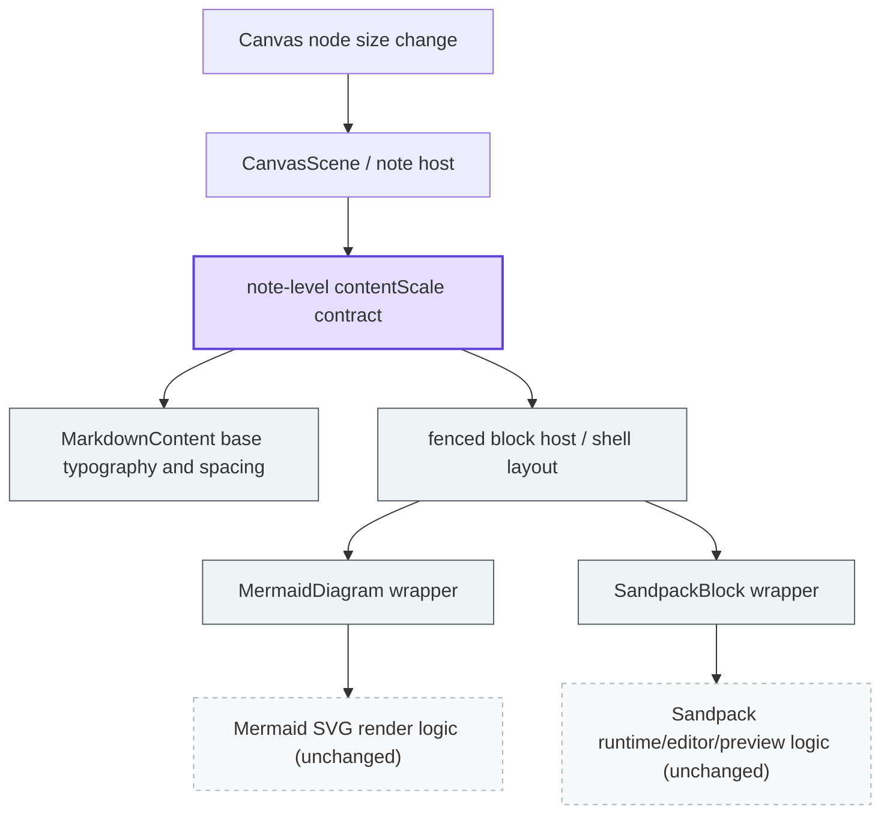

# Boardmark Object Content Scaling PRD & Implementation Plan

| 항목 | 내용 |
| --- | --- |
| 문서 버전 | v0.1 |
| 작성일 | 2026-04-10 |
| 상태 | Draft |
| 범위 | note 오브젝트 크기 기반 body content scaling |

## 1. 목적

이 문서는 note 오브젝트 크기에 따라 body content 전체가 비례적으로 커지거나 작아지는 기능을, PRD와 구현 계획을 한 파일에 함께 정리한 문서다.

핵심은 `mermaid`나 `sandpack` 같은 개별 블록을 각각 튜닝하는 것이 아니다.  
핵심은 **note body 전체에 공통 scale contract를 도입해, 텍스트와 rich content가 같은 규칙 아래에서 리사이즈되게 만드는 것**이다.

1차 목표는 아래 세 가지다.

1. note-level `contentScale` contract를 정의한다.
2. content body typography / spacing / media shell이 그 contract를 읽게 만든다.
3. `mermaid`, `sandpack`은 renderer 내부를 건드리지 않고 host/shell 레이어에서만 수용한다.

---

## 2. 제품 요구사항

### 2.1 Object-size-driven body scaling

사용자가 note 오브젝트를 리사이즈하면 body content 전체가 같은 규칙으로 커지거나 작아져야 한다.

핵심 요구사항:

- note width/height 변화가 body 전체 scale 변화로 이어져야 한다.
- 텍스트, 리스트, blockquote, code block, image, table, fenced block shell이 같은 scale contract를 따라야 한다.
- 특정 블록만 먼저 ceiling에 걸려 멈추는 상태를 피해야 한다.
- 스케일링은 body-level layout feature여야 하며, 개별 블록 기능 개선으로 흩어지면 안 된다.

### 2.2 Typographic scaling model first

1차 구현은 wrapper transform이 아니라 typographic scaling model을 사용해야 한다.

핵심 요구사항:

- body 각 요소는 `--note-scale` 같은 공통 contract를 읽어 font size, line height, spacing, shell bounds를 계산해야 한다.
- 단, 텍스트 계열(paragraph, heading, list, blockquote text, code text)은 기본 크기 상한을 넘어서 커지면 안 된다.
- text selection, caret, scroll, pointer hit area가 깨지는 구조는 피해야 한다.
- 편집 및 interaction surface와의 충돌을 최소화해야 한다.

### 2.3 Renderer internals stay stable

1차 구현은 body scaling feature이며, `mermaid` / `sandpack` 자체 기능 변경이 아니어야 한다.

핵심 요구사항:

- `renderMermaidDiagram(...)` 같은 Mermaid 렌더 로직은 수정하지 않는다.
- Sandpack runtime/editor/preview 내부 동작은 수정하지 않는다.
- fenced block 쪽 변경이 필요하면 host/shell 레이어에서만 해결한다.
- renderer 내부 의미를 바꾸는 heuristic은 1차 범위에서 제외한다.

### 2.4 Predictable behavior across content types

사용자는 콘텐츠 타입에 따라 전혀 다른 resize behavior를 겪지 않아야 한다.

핵심 요구사항:

- 텍스트와 미디어가 서로 다른 scaling universe에 있으면 안 된다.
- image는 고정 `max-height`에 갇히지 않아야 한다.
- table은 scale 또는 overflow 정책이 일관돼야 한다.
- fenced block은 body 안에서 주변 typography와 shell scale을 공유해야 한다.

---

## 3. 문제 정의

현재 note body 안의 rich content는 "각 블록이 자기 방식대로 렌더되고, 일부 블록만 개별 상한을 갖는" 구조에 가깝다.

- `mermaid`, `sandpack`, 이미지, 테이블이 서로 다른 레이아웃 규칙을 가진다.
- `max-width`, `max-height`, `editorHeight` 같은 개별 상한이 note 리사이즈와 독립적으로 존재한다.
- note를 크게 키워도 body 전체가 비례해서 커지지 않고, 어떤 블록은 중간에서 더 이상 안 커진다.
- note를 작게 줄일 때도 본문 전체가 하나의 비율로 축소되는 것이 아니라, 텍스트/블록/미디어가 서로 다른 방식으로 무너진다.

즉 현재 문제는 `mermaid`나 `sandpack` 개별 컴포넌트의 스타일 문제가 아니라, **note body 전체에 공통 스케일 모델이 없다는 것**이다.

---

## 4. 범위

### 이번 문서에 포함

- note-level `contentScale` contract
- typographic scaling model
- markdown base typography / spacing scale
- image / table / blockquote / code block shell scale
- fenced block host/shell scale
- `mermaid`를 이용한 레이어 영향도 분석
- 단계별 구현 계획

### 이번 문서에서 제외

- Mermaid renderer 기능 자체 개선
- Sandpack runtime/editor/preview 기능 자체 개선
- wrapper-level `transform: scale(...)` 기반 interaction overhaul
- print/export baked scale 정책
- canvas zoom와 content scale의 최종 결합 규칙
- full E2E verification plan

---

## 5. 구현 원칙

### 5.1 Body-level contract를 우선한다

- 이 기능은 block별 sizing patch가 아니라 body-level contract여야 한다.
- note는 design size를 가진 content surface로 간주한다.
- 실제 note size와 design size의 비율로 `contentScale`을 계산한다.

예시:

```ts
type NoteContentScale = {
  baseWidth: number
  baseHeight: number
  scaleX: number
  scaleY: number
  uniformScale: number
}
```

### 5.2 Typographic scaling model을 채택한다

- `transform: scale(...)`보다 CSS variable 기반 scale을 우선한다.
- font size, line height, spacing, padding, radius, media bounds는 `--note-scale`을 읽는다.
- 텍스트는 `raw scale`을 그대로 쓰지 않고 `text scale = min(raw scale, 1)`로 clamp 한다.
- selection, caret, scroll, pointer hit area 안정성을 우선한다.

예:

```css
.note-markdown {
  --note-scale-raw: 1;
  --note-text-scale: min(var(--note-scale-raw), 1);
}
```

즉 1차 규칙은 아래와 같다.

- 텍스트: 줄어드는 것은 허용, 기본 크기보다 커지는 것은 금지
- media / shell: 필요하면 note 크기에 따라 더 커질 수 있음

### 5.3 Renderer internals는 1차에서 보호한다

- `mermaid`, `sandpack` renderer 내부 의미는 바꾸지 않는다.
- fenced block은 body 안에 보이는 결과물일 뿐, 1차 scale의 primary ownership은 아니다.
- 필요한 경우 wrapper class, host-level prop 같은 표면적 연결만 허용한다.

### 5.4 Shell에서 해결한다

- 가능한 한 `CanvasScene -> MarkdownContent -> CSS shell` 경로에서 해결한다.
- 개별 widget 내부 수정은 마지막 수단이다.

### 5.5 note-height-auto와 정책 충돌을 피한다

- fixed-height note와 auto-height note의 정책을 분리해야 한다.
- 최소한 1차 문서 수준에서 아래 모드를 가정한다.
  - fixed-height note: scale 우선
  - auto-height note: reflow 우선, scale는 보조

---

## 6. 코드베이스 레이어와 영향도

### 6.1 1차 레이어 영향도

`mermaid`는 1차 설계에서 좋은 프로브다. renderer 내부(`renderMermaidDiagram`, SVG 생성)와 외부 shell/header/layout을 구분하기 쉽기 때문이다.

목적은 Mermaid를 먼저 고치는 것이 아니라, **어느 레이어까지 영향을 주고 멈춰야 하는지**를 명확히 하는 것이다.



요약:

- 변경 허용 레이어: note host, `contentScale` contract, `MarkdownContent`, fenced block shell
- 1차 비변경 레이어: Mermaid SVG 생성 로직, Sandpack runtime/editor/preview 로직

### 6.2 1차 변경 가능 레이어

- `packages/canvas-app/src/components/scene/canvas-scene.tsx`
- `packages/ui/src/components/markdown-content.tsx`
- `packages/canvas-app/src/styles/canvas-app.css`
- fenced block host/wrapper에 해당하는 최소 shell

### 6.3 1차 비변경 레이어

- `packages/ui/src/lib/mermaid-renderer.ts`
- Mermaid source parsing / SVG 생성 로직
- Sandpack source parsing / runtime configuration의 의미적 동작
- Sandpack editor/preview 내부 UI 동작

예외:

- wrapper class 추가
- host-level prop 주입
- CSS hook 추가

이 정도의 표면적 변경은 허용 가능하다. 그래도 원칙은 shell 우선이다.

---

## 7. 사용자 경험 정의

### 7.1 공통 기대 동작

- note를 키우면 body content 전체가 같은 규칙으로 커진다.
- note를 줄이면 body content 전체가 같은 규칙으로 작아진다.
- 특정 블록만 중간에서 ceiling에 걸려 멈추지 않는다.
- overflow는 기본 동작이 아니라 마지막 fallback이다.

### 7.2 콘텐츠 타입별 기대 동작

#### 텍스트 / 리스트 / 인용문 / code block

- 글자 크기와 줄간격이 note 크기에 따라 비례한다.
- 단, 기본 크기 상한을 넘어서 확대되지는 않는다.
- paragraph/list 간격도 함께 비례한다.
- code block header, badge, action button 크기도 함께 비례한다.

#### 이미지

- 고정 `28rem` 같은 ceiling을 두지 않는다.
- 최대 크기는 note body viewport와 `contentScale`에 의해 결정된다.
- intrinsic aspect ratio는 유지한다.

#### 테이블

- 작은 note에서는 scale 또는 제한적 overflow 정책을 따른다.
- 큰 note에서는 더 많은 면적을 차지할 수 있어야 한다.
- table만 따로 `max-content`, 텍스트는 fixed scale인 구조를 줄인다.

#### Mermaid

- 1차에서 Mermaid는 renderer가 아니라 shell 쪽에서 body scale contract를 읽는다.
- shell header, status text, export affordance가 함께 비례해야 한다.
- SVG viewport sizing은 shell contract에 종속되되, SVG 생성 로직 자체는 바꾸지 않는다.

#### Sandpack

- 외부 runtime이라 내부 editor/preview의 모든 세부 요소를 통제하지 않는다.
- shell height, panel bounds, host width, surrounding spacing만 note scale contract를 따른다.
- 1차에서는 Sandpack runtime 자체를 scale-aware하게 고치지 않는다.

---

## 8. 구현 방향

### 8.1 Note-level scale contract

예시:

```css
.note-markdown {
  --note-base-width: 420;
  --note-base-height: 280;
  --note-scale-raw: 1;
  --note-text-scale: min(var(--note-scale-raw), 1);
}
```

계산 주체:

- note host 또는 scene layer에서 실제 bounds를 읽는다.
- `uniformScale` 계산 규칙을 정한다.
- CSS custom property로 body root에 주입한다.

권장 분리:

- `--note-scale-raw`: note 크기 기반 실제 scale
- `--note-text-scale`: 텍스트 전용 scale, 항상 `<= 1`
- 필요 시 media / shell은 `--note-scale-raw`를 사용

### 8.2 Markdown base scale

`MarkdownContent` 및 공용 CSS에서 아래를 `--note-scale` 기반으로 전환한다.

- font size
- line height
- margin / gap
- padding
- radius
- shell sizing

### 8.3 Media and block shell scale

renderer 내부를 건드리지 않고 아래 shell을 scale-aware하게 만든다.

- image frame
- table wrapper
- blockquote shell
- code block shell
- fenced block host shell

### 8.4 Bounded embedded runtimes

`mermaid`, `sandpack`은 body 안에서 보이지만 1차 ownership은 shell에 있다.

- Mermaid: SVG 생성은 그대로 두고 shell/viewport만 contract를 읽게 한다.
- Sandpack: runtime 자체는 그대로 두고 host bounds와 surrounding spacing만 contract를 읽게 한다.

---

## 9. 구현 계획

### Phase 1. Contract 정의

목표:

- note-level `contentScale` 계산 규칙을 고정한다.
- fixed-height / auto-height note 정책을 구분한다.
- 텍스트 상한 정책을 고정한다.

작업:

- design size 기준값 정의
- `uniformScale` 계산 공식 정의
- `raw scale`과 `text scale` 분리 규칙 정의
- `CanvasScene` 또는 note host에서 scale 주입 위치 결정
- CSS custom property naming 확정

완료 조건:

- scale 계산 ownership이 한 레이어로 고정된다.
- 문서상 fixed-height / auto-height 정책이 정리된다.

### Phase 2. Markdown base scaling

목표:

- markdown base typography와 spacing이 `--note-scale`을 읽게 만든다.

작업:

- `.markdown-content` 기본 typography를 `--note-text-scale` 기반으로 전환
- paragraph/list/blockquote/code block spacing scale 전환
- 공통 radius / padding scale 전환

완료 조건:

- plain text note에서 리사이즈 시 body 전체가 일관되게 작아지며, 텍스트는 기본 크기보다 커지지 않는다.

### Phase 3. Media shell scaling

목표:

- 이미지, 테이블, code block, blockquote가 같은 scaling universe에 들어오게 만든다.

작업:

- image wrapper scale-aware bounds
- table wrapper scale/overflow policy 정리
- code block shell sizing 정리
- blockquote shell sizing 정리

완료 조건:

- media와 text가 서로 다른 ceiling 모델로 움직이지 않는다.

### Phase 4. Fenced block host integration

목표:

- `mermaid`, `sandpack`을 renderer 내부 수정 없이 host/shell 레이어에 편입한다.

작업:

- fenced block host/wrapper hook 정리
- Mermaid shell scale 적용
- Sandpack host bounds scale 적용
- 필요 시 최소 CSS hook 추가

완료 조건:

- `mermaid`, `sandpack`이 body 안에서 시각적으로 scale contract를 공유한다.
- renderer 내부 의미적 변경은 없다.

### Phase 5. Interaction verification

목표:

- scaling 적용 후 편집과 상호작용이 깨지지 않는지 확인한다.

작업:

- note resize 중 scroll behavior 확인
- selection / context menu / export affordance 확인
- web/desktop shell에서 smoke verification

완료 조건:

- scaling이 interaction regression 없이 동작한다.

---

## 10. 리스크와 열린 질문

### 리스크

- scale-aware 스타일 누락 시 콘텐츠 타입별 일관성이 깨질 수 있다.
- Sandpack 같은 embedded runtime은 shell만으로 완전히 자연스러운 scaling을 만들기 어려울 수 있다.
- auto-height note와 결합 시 정책 충돌이 생길 수 있다.

### 열린 질문

- `contentScale`은 width 기준인가, `min(widthRatio, heightRatio)` 인가?
- unreadable threshold 아래로 내려가면 최소 scale을 둘 것인가?
- table은 scale 우선인가, overflow 우선인가?
- Sandpack은 bounded exception으로 남길 것인가?
- serialized document에 scale 관련 필드를 둘 것인가, runtime 계산만 사용할 것인가?

---

## 11. 한 줄 결론

이 기능은 `mermaid`와 `sandpack`의 상한을 더 푸는 작업이 아니라, **note body 전체에 오브젝트 크기 기반 scale contract를 도입하는 PRD**로 다뤄야 한다. 1차 구현은 **Typographic scaling model**을 사용하고, `mermaid` / `sandpack` 내부 코드는 건드리지 않은 채 host/shell 레이어에서 수용하는 방향이 가장 안전하다.
