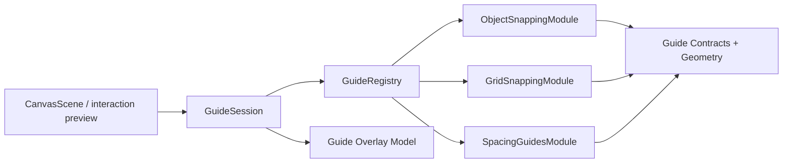

# PRD: Smart Guides and Snapping
**Product Requirements Document**

| 항목 | 내용 |
|------|------|
| 문서 버전 | v0.1 (Draft) |
| 작성일 | 2026-04-23 |
| 상태 | 초안 |
| 작성자 | Codex |

---

## 1. Overview

### 1.1 Problem Statement

Boardmark는 현재 오브젝트를 선택하고 드래그 이동하고 리사이즈할 수 있다. 하지만 사용자가 오브젝트를 배치할 때 아래 문제를 직접 손으로 해결해야 한다.

- 두 오브젝트의 좌우/상하 기준선을 맞추려면 눈대중으로 맞춰야 한다.
- 비슷한 간격으로 정렬하고 싶어도 간격이 같은지 알 수 없다.
- 캔버스가 커질수록 “거의 맞았지만 미세하게 어긋난 상태”가 누적된다.
- 빠르게 정리하려고 할수록 오히려 더 많은 수동 미세조정이 필요해진다.

즉 현재 Boardmark는 오브젝트를 **움직일 수는 있지만, 정확하게 놓기 위한 배치 보조 레이어**는 아직 없다.

### 1.2 What This Feature Means

`Smart Guides and Snapping`은 하나의 단일 기능이 아니라, 배치 보조 계열 기능을 묶는 상위 패밀리다.

이 패밀리에는 보통 아래가 포함된다.

- `Grid snapping`
- `Object snapping`
- `Alignment guides`
- `Spacing guides`
- `Center/edge snapping`

이번 문서는 이들을 Boardmark에 맞는 한 기능군으로 정의한다.

### 1.3 Product Goal

사용자가 오브젝트를 이동하거나 리사이즈할 때, 캔버스가 배치 기준선을 시각적으로 보여주고 필요 시 해당 기준에 snap되도록 하여, 눈대중 정렬 비용을 크게 줄여야 한다.

### 1.4 Success Criteria

- 사용자는 오브젝트를 드래그할 때 정렬 가능한 축이 시각적으로 보인다.
- 사용자는 다른 오브젝트의 edge, center, 동일 간격에 맞춰 오브젝트를 쉽게 정렬할 수 있다.
- snap은 도움이 되어야 하며, 사용자가 제어를 잃었다고 느껴지면 안 된다.
- preview는 부드럽고, interaction 성능을 눈에 띄게 악화시키지 않아야 한다.

---

## 2. Goals & Non-Goals

### Goals

- drag/resize 중 alignment guide를 보여주는 UX 정의
- grid/object/spacing snapping의 제품 용어와 범위 정의
- preview와 commit 경계에서 snapping 적용 규칙 정의
- 캔버스 편집 성능과 충돌하지 않는 구현 방향 제약 정의

### Non-Goals

- Figma 수준의 완전한 auto-layout 엔진
- constraint system
- frame 내부의 advanced layout solver
- 회전된 오브젝트의 복잡한 기하학 snapping v1
- AI 자동 배치

---

## 3. Target User & Core Scenarios

### Target User

- 아이디어 보드를 반복해서 정리하는 사용자
- 여러 note/shape를 깔끔하게 정렬하고 싶은 사용자
- flowchart, architecture diagram, retrospective board를 만드는 사용자

### Core User Stories

```text
AS  사용자
I WANT  오브젝트를 드래그할 때 주변 오브젝트 기준선이 보이고 거기에 맞춰 붙게 하여
SO THAT 눈대중 미세조정 없이 빠르게 정렬할 수 있다

AS  사용자
I WANT  여러 카드 사이 간격이 같아질 때 이를 시각적으로 확인하고 snap할 수 있어
SO THAT 보드가 더 빠르게 정돈된 형태가 된다

AS  사용자
I WANT  필요할 때는 snapping을 신뢰하고, 필요 없을 때는 방해받지 않으며
SO THAT 배치 보조가 창작 흐름을 끊지 않는다
```

---

## 4. Current State

현재 Boardmark는 다음은 이미 지원한다.

- node drag preview
- node resize preview
- multi-select drag
- selection toolbar
- align / distribute / arrange 같은 selection command family의 기반

하지만 아래는 아직 없다.

- drag 중 정렬 가이드 표시
- 중심선/경계선/간격 기준 snapping
- grid snapping
- snap indicator와 threshold 규칙

즉 현재는 이동은 가능하지만, **정밀 배치 보조 레이어는 없는 상태**다.

---

## 5. Product Vocabulary

이 기능군에서는 용어를 아래처럼 고정한다.

### 5.1 Smart Guides

드래그 또는 리사이즈 중 나타나는 시각적 기준선.

예:

- 좌측 edge 정렬선
- 중심선 정렬선
- 상단/하단 정렬선

### 5.2 Snapping

오브젝트가 특정 기준점이나 기준선 근처에 왔을 때 위치가 그 기준에 자동 보정되는 동작.

### 5.3 Grid Snapping

캔버스의 보이지 않거나 약하게 보이는 grid 단위에 맞춰 위치가 정렬되는 snapping.

### 5.4 Object Snapping

주변 오브젝트의 edge나 center를 기준으로 snap되는 동작.

### 5.5 Spacing Guides

오브젝트 사이 간격이 같아지는 순간 이를 시각적으로 보여주는 가이드.

필요하면 snap까지 포함할 수 있다.

---

## 6. Product Rules

### 6.1 Interaction Timing Rule

guides와 snapping은 commit 이후가 아니라 **preview 단계에서 체감**되어야 한다.

- drag preview 중 guide가 나타난다.
- 사용자는 놓기 전부터 어디에 맞춰질지 볼 수 있다.
- drop 시 최종 위치는 preview에서 본 결과와 일치해야 한다.

### 6.2 Trust Rule

snapping은 도움이 되어야지, 제어를 빼앗으면 안 된다.

- snap threshold는 좁고 예측 가능해야 한다.
- 기준선이 너무 많아 시야를 어지럽히면 안 된다.
- guide가 보였는데 실제로는 snap되지 않거나, snap됐는데 guide가 안 보이는 상태가 있으면 안 된다.

### 6.3 Preview/Commit Consistency Rule

- preview 위치와 commit 위치는 의미론적으로 일치해야 한다.
- multi-select drag에서도 selection 전체가 같은 snapping 결과를 가져야 한다.
- drag 중 보인 guide 결과가 drop 후 source/document에 반영된 좌표와 어긋나면 안 된다.

### 6.4 Scope Rule

v1은 회전 없는 axis-aligned object를 기준으로 한다.

- note
- built-in shape
- image
- group의 bounding box

edge label, connector routing, rotated object geometry는 후속 범위다.

### 6.5 Clutter Rule

모든 가능한 guide를 다 보여주면 안 된다.

v1은 아래 우선순위만 노출한다.

1. center alignment
2. edge alignment
3. equal spacing

동시에 너무 많은 guide가 후보가 되면 가장 가까운 기준 위주로 제한한다.

### 6.6 Performance Rule

guide 계산은 drag/resize preview의 frame budget을 해치면 안 된다.

- local preview state 위에서 계산해야 한다.
- store write를 frame마다 늘리는 방식이면 안 된다.
- 큰 캔버스에서도 계산 후보를 제한해야 한다.

---

## 7. Functional Requirements

### 7.1 Alignment Guides

드래그 중 아래 경우에 guide를 보여야 한다.

- left edge aligns with another object left edge
- horizontal center aligns with another object center
- right edge aligns with another object right edge
- top edge aligns with another object top edge
- vertical center aligns with another object center
- bottom edge aligns with another object bottom edge

guide는 canvas 위에 얇고 명확한 overlay line으로 표시한다.

### 7.2 Object Snapping

사용자가 오브젝트를 drag할 때 현재 오브젝트의 edge 또는 center가 다른 오브젝트의 대응 edge/center에 threshold 이내로 접근하면 snap되어야 한다.

v1 기본 대상:

- edge-to-edge
- center-to-center

### 7.3 Grid Snapping

v1에서는 아래 두 가지 중 하나를 선택해야 한다.

- `Option A`: grid snapping은 제공하되 기본 off
- `Option B`: grid snapping은 후속으로 미루고 object snapping 먼저 제공

권장 방향:

- v1은 object-based smart guides 먼저
- grid snapping은 v1.1 또는 v2

이유:

- Boardmark는 자유 배치 성향이 강하고
- object-to-object alignment가 체감 ROI가 더 크다.

### 7.4 Spacing Guides

3개 이상 오브젝트가 관련될 때 아래 상황을 표시할 수 있어야 한다.

- A-B 간격과 B-C 간격이 같아짐
- 좌우 또는 상하 spacing이 equal 상태가 됨

v1에서는 spacing guide를 **시각적 표시만** 먼저 제공하고, spacing snap까지는 후속 단계로 미룰 수 있다.

### 7.5 Multi-Selection Behavior

- 여러 오브젝트를 함께 drag할 때 selection bounding box 기준으로 guide/snapping을 계산한다.
- 개별 내부 오브젝트가 따로따로 snap되면 안 된다.
- selection 전체가 하나의 이동 단위처럼 동작해야 한다.

### 7.6 Resize Behavior

resize 중에도 가이드를 제공할 수 있다.

다만 v1 우선순위는 drag다.

권장:

- Phase 1: drag guides + snapping
- Phase 2: resize guides + snapping

---

## 8. UX Requirements

### 8.1 Visual Style

- guide line은 얇고 선명해야 한다.
- selection box보다 약간 높은 우선순위로 보이되, 본문을 가리면 안 된다.
- 색상은 Boardmark selection chrome과 충돌하지 않는 accent를 써야 한다.

### 8.2 Snap Feedback

사용자는 아래를 즉시 인지할 수 있어야 한다.

- 어떤 기준에 맞춰지고 있는지
- 지금 snap 상태인지
- spacing equality가 성립했는지

이를 위해 guide line만이 아니라, 필요하면 작은 거리 marker 또는 equal-spacing marker를 둘 수 있다.

### 8.3 Override / Escape

후속 단계에서 아래 중 하나를 고려할 수 있다.

- modifier key로 snap temporarily disable
- settings에서 grid snap on/off

하지만 v1에서는 복잡도를 늘리지 않기 위해 기본 상호작용을 먼저 안정화한다.

---

## 9. Recommended Rollout

### Phase 1

- drag 중 alignment guides
- object edge/center snapping
- multi-selection bounding-box snapping

### Phase 2

- spacing guides
- resize guides
- guide prioritization polish

### Phase 3

- optional grid snapping
- snap disable modifier
- frame-aware / group-aware advanced snapping

---

## 10. Open Questions

- grid snapping을 v1에 넣을지, object snapping 이후로 미룰지
- spacing은 guide-only로 시작할지, snap까지 같이 넣을지
- guide 후보 계산을 viewport 근처 object로 제한할지, selection 주변 최근접 object로 제한할지
- locked object를 snap target으로 포함할지

---

## 11. Verification Expectations

- 단일 오브젝트 drag 중 center/edge alignment guide가 나타난다.
- drop 후 최종 위치가 preview guide 결과와 일치한다.
- multi-selection drag도 selection 전체 기준으로 같은 규칙이 적용된다.
- guide overlay가 과도하게 깜빡이지 않는다.
- 큰 보드에서도 drag responsiveness가 눈에 띄게 나빠지지 않는다.

---

## 12. Implementation Plan

이 구현 계획의 핵심은 `Smart Guides and Snapping`을 하나의 큰 manager로 만들지 않는 것이다.

사용자가 말한 대로, 아래 세 축은 **수평 분할된 peer 모듈**로 다뤄야 한다.

- `Object Snapping`
- `Grid Snapping`
- `Spacing Guides`

이 셋은 공통 drag/resize preview 문맥을 읽을 수는 있지만, 서로를 직접 호출하거나 서로의 내부 정책을 알아서는 안 된다.

### 12.1 Planning Principles

- 각 기능은 독립적인 peer 모듈로 둔다.
- 공통 입력은 shared contract로 받고, 결과는 공통 result contract로 돌려준다.
- 조합 책임은 scene/component가 아니라 composition root가 가진다.
- guide 계산과 snapping 보정은 같은 모듈 안에 둘 수 있어도, 다른 모듈과 섞어 한 번에 판단하지 않는다.
- 이후 기능 추가가 필요해도 "기존 모듈에 조건문 추가"보다 "새 peer 모듈 추가"가 되도록 설계한다.

### 12.2 Proposed Module Split

권장 모듈 분할은 아래와 같다.

```text
packages/canvas-app/src/features/smart-guides/
  contracts.ts
  guide-session.ts
  guide-registry.ts
  guide-overlay-model.ts
  snapping/
    object-snapping.ts
    grid-snapping.ts
    spacing-guides.ts
  geometry/
    guide-geometry.ts
    guide-candidates.ts
```

핵심은 `object-snapping.ts`, `grid-snapping.ts`, `spacing-guides.ts`가 **동등한 레벨의 peer**라는 점이다.

### 12.3 Interface Shape

세 peer 모듈은 아래 공통 인터페이스를 구현하는 방향이 적합하다.

```ts
type GuideModule = {
  id: 'object-snapping' | 'grid-snapping' | 'spacing-guides'
  evaluate(input: GuideEvaluationInput): GuideEvaluationResult | null
}
```

여기서 중요한 것은 인터페이스가 아주 좁아야 한다는 점이다.

- 입력: 현재 drag/resize preview 문맥
- 출력: guide 표시와 snap 보정 후보

모듈이 알면 안 되는 것:

- store mutation 방법
- React Flow 렌더링 디테일
- 다른 guide 모듈의 내부 규칙
- 최종 우선순위 결합 정책

### 12.4 Shared Contracts

공통 입력 contract는 아래 정도로 제한하는 것이 좋다.

- 현재 interaction kind
  - `drag`
  - `resize`
- active selection frame
- moving object frame 또는 selection bounding box
- nearby candidate frames
- viewport 정보
- feature flags

예시 shape:

```ts
type GuideEvaluationInput = {
  interaction: 'drag' | 'resize'
  activeFrame: GuideFrame
  candidateFrames: GuideFrame[]
  viewport: GuideViewport
  options: GuideFeatureOptions
}
```

출력 contract는 아래 두 축으로 나눈다.

- `visual guides`
- `snap adjustment`

예시 shape:

```ts
type GuideEvaluationResult = {
  guides: GuideVisual[]
  adjustment: GuideAdjustment | null
}
```

이렇게 나누면 "guide만 제공"하는 모듈과 "guide + snap"을 같이 제공하는 모듈이 같은 표면을 공유할 수 있다.

### 12.5 Role Boundaries

각 모듈의 역할은 아래처럼 고정하는 것이 좋다.

#### `object-snapping`

- 다른 오브젝트의 edge / center와의 관계만 계산한다.
- object-to-object alignment candidate를 만든다.
- 간격 equality나 grid 단위는 신경 쓰지 않는다.

#### `grid-snapping`

- grid spacing 규칙만 계산한다.
- 다른 오브젝트 존재 여부를 몰라도 된다.
- `grid on/off`, `grid size`, `sub-grid` 같은 설정 확장 지점을 갖는다.

#### `spacing-guides`

- 세 개 이상 frame 관계에서 equal spacing 상태를 계산한다.
- 초기 단계에서는 `guide-only`여도 된다.
- object snapping이나 grid snapping의 adjustment 규칙을 재사용하지 않는다.

### 12.6 Composition Root

세 peer 모듈을 합치는 책임은 별도 registry/composer가 가진다.

권장 이름:

- `GuideRegistry`
- `GuideComposer`
- `GuideSession`

이 레이어의 책임:

- peer 모듈 목록 보유
- 같은 입력을 각 모듈에 전달
- 결과를 수집
- 최종 표시할 guide와 적용할 adjustment를 선택

이 레이어는 **정책 조합만** 담당해야지, 직접 geometry 계산을 가지면 안 된다.

### 12.7 Dependency Direction

의존성 방향은 아래처럼 고정하는 것이 좋다.



중요한 제약:

- `CanvasScene`은 개별 모듈을 직접 import하지 않는다.
- `ObjectSnappingModule`은 `GridSnappingModule`을 모른다.
- `SpacingGuidesModule`은 object snapping 결과를 입력으로 받지 않는다.
- 공통 하위 의존성은 `contracts`와 `geometry`까지만 허용한다.

### 12.8 Scene Integration Boundary

`CanvasScene`은 아래 역할만 가져야 한다.

- drag/resize preview frame 준비
- guide session 호출
- 결과 overlay 렌더
- 최종 preview position에 snap adjustment 반영

`CanvasScene`이 가져서는 안 되는 것:

- "어떤 guide가 더 우선인가" 정책
- equal spacing 계산
- grid size 계산
- object edge alignment 판정

즉 scene은 **호출자이자 적용자**일 뿐, guide 엔진이 아니어야 한다.

### 12.9 Overlay Boundary

guide line 시각화는 별도 overlay model로 분리하는 것이 좋다.

예를 들면:

- `GuideVisualLine`
- `GuideVisualMarker`
- `GuideVisualSpacing`

이렇게 두면 각 snapping 모듈은 DOM/React를 몰라도 되고, 단순히 시각 모델만 돌려줄 수 있다.

권장 규칙:

- 계산 모듈은 React node를 만들지 않는다.
- overlay component가 model을 받아 실제 선을 그린다.

### 12.10 Priority and Conflict Resolution

세 peer 모듈이 동시에 결과를 낼 수 있으므로, 최종 조합 정책은 별도 contract로 분리해야 한다.

권장 우선순위 정책:

1. object snapping
2. grid snapping
3. spacing guides

하지만 이 순서도 각 모듈 내부가 아니라 composer가 가져야 한다.

즉 이런 식의 분리가 필요하다.

- peer 모듈: "나는 이런 candidate를 발견했다"
- composer: "이번 frame에서는 이 candidate를 채택한다"

### 12.11 Future Extensibility

이 구조를 택하면 이후 확장은 옆으로 붙일 수 있다.

예:

- `frame-aware-snapping`
- `connector-anchor-guides`
- `resize-edge-guides`
- `locked-object-as-passive-target`

중요한 점은 확장이 기존 모듈 안의 `if` 추가가 아니라, **새 peer 모듈 추가 + registry 등록**이 되게 만드는 것이다.

### 12.12 Recommended Rollout Order

구현 순서도 수평 모듈 기준으로 나누는 것이 맞다.

#### Step 1. Common Contracts

- `GuideFrame`
- `GuideEvaluationInput`
- `GuideEvaluationResult`
- `GuideVisual`
- `GuideAdjustment`
- `GuideModule`

이 단계에서는 구현보다 vocabulary를 먼저 고정한다.

#### Step 2. Guide Session / Registry

- peer 모듈을 호출하는 조합 경계 추가
- scene과 모듈 사이의 유일한 진입점 확보

#### Step 3. `object-snapping`

- center / edge alignment
- 가장 ROI 높은 모듈부터 연결

#### Step 4. `grid-snapping`

- 독립 peer로 추가
- object snapping과 별도 candidate source 유지

#### Step 5. `spacing-guides`

- guide-only로 시작 가능
- adjustment까지 포함할지 후속 결정 가능

### 12.13 What To Avoid

- `smartGuidesManager.ts` 하나에 모든 계산을 몰아넣는 구조
- object/grid/spacing을 한 함수에서 분기 처리하는 구조
- scene component가 개별 snapping 규칙을 직접 구현하는 구조
- 모듈 출력이 React element인 구조
- 모듈끼리 결과를 주고받는 구조

핵심은 이것이다.

**Object Snapping, Grid Snapping, Spacing Guides는 하나의 복합 기능이지만, 구현 구조에서는 하나의 단위로 관리하면 안 된다. 수평 peer 모듈 + 공통 contract + 별도 composition 경계가 맞다.**
