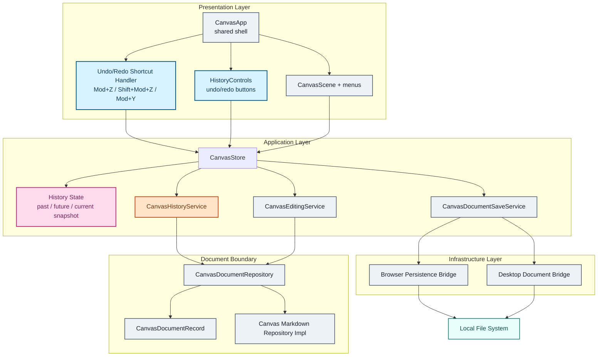

# Undo/Redo 구현 계획

## 1. 목적

이 문서는 `docs/features/undo-redo/README.md`의 요구사항을 현재 Boardmark 구조에 맞춰 구현 작업으로 풀어낸다.

이번 단계는 새로운 persistence 계층을 만드는 작업이 아니라, 기존의

`UI -> edit intent -> editing service -> repository reparse -> store patch`

흐름 위에 **history state + restore service**를 얹는 작업이다.

---

## 2. 현재 구조 요약

- `packages/canvas-app/src/store/canvas-store-slices.ts`
  - 문서 커밋 액션과 store patch의 중심 경계
- `packages/canvas-app/src/services/canvas-editing-service.ts`
  - edit intent를 source patch로 바꾸고 repository로 재정규화
- `packages/canvas-app/src/store/canvas-store-projection.ts`
  - `CanvasDocumentRecord`를 runtime store snapshot으로 투영
- `packages/canvas-app/src/app/canvas-app.tsx`
  - global keyboard handling과 control layout
- `packages/canvas-app/src/components/controls/zoom-controls.tsx`
  - control cluster 스타일 기준점

핵심 의미:

- Undo/Redo는 parser나 renderer가 아니라 `canvas-app` application layer에 추가하는 것이 맞다.
- 성공한 document commit 직후에만 history를 적재하면 현재 source-of-truth 구조를 그대로 유지할 수 있다.

---

## 3. 아키텍처 레이어

아래 다이어그램은 구현 레이어와 새로 추가되는 컴포넌트를 색상으로 구분한다.

- 파란색: 신규 presentation 컴포넌트
- 주황색: 신규 application service
- 분홍색: 신규 state 레이어
- 회색: 기존 레이어
- 민트색: 외부 시스템

---

## 4. 구현 변경점

### 4.1 Store contract

`CanvasStoreState`에 아래를 추가한다.

- `history: { past: CanvasHistoryEntry[]; future: CanvasHistoryEntry[] }`
- `undo(): Promise<void>`
- `redo(): Promise<void>`

`CanvasHistoryEntry`는 아래 필드만 가진다.

- `source`
- `selectedNodeIds`
- `selectedEdgeIds`
- `label`

### 4.2 History service

신규 `packages/canvas-app/src/services/canvas-history-service.ts`

책임:

- 현재 store snapshot에서 history entry를 생성
- 성공한 commit 전 snapshot을 `past`에 push
- 새 commit 시 `future` clear
- `undo/redo` 대상 snapshot을 선택
- snapshot source를 `documentRepository.readSource(...)`로 재정규화

제약:

- 최대 history 길이는 100
- stack 초과 시 가장 오래된 `past`부터 제거

### 4.3 Commit integration

`commitCanvasIntent(...)` 성공 경로에서만 history를 기록한다.

- commit 전 `draftSource + selection snapshot` capture
- editing service 성공 후 새 source와 다를 때만 `past` push
- `saveCurrentDocument`와 autosave는 history 미기록

### 4.4 Session reset

아래 경로는 history를 비운다.

- `hydrateTemplate`
- `openDocument`
- `openDroppedDocument`
- `resetToTemplate`
- `reloadFromDisk`
- external source reload 성공 경로

### 4.5 Batch delete

`deleteSelection()`의 N회 순차 commit을 유지하지 않는다.

- `CanvasDocumentEditIntent`에 batch delete intent를 추가한다.
- node/edge 삭제를 한 transaction으로 source patch한다.
- 결과적으로 multi-delete는 history entry 1개만 만든다.

### 4.6 UI integration

신규 `packages/canvas-app/src/components/controls/history-controls.tsx`

- 기존 control 스타일 재사용
- Undo / Redo 버튼 추가
- editing 중에는 버튼 disabled

`packages/canvas-app/src/app/canvas-app.tsx`

- global keydown에 `Mod+Z`, `Shift+Mod+Z`, `Mod+Y` 연결
- editable target 또는 inline editing 중에는 shortcut을 가로채지 않음
- history controls를 zoom controls와 같은 bottom-right cluster에 배치

---

## 5. 단계별 작업

### Phase 1. History state와 service 추가

- history entry/state 타입 추가
- history service 추가
- document projection reset 경로에 history 초기화 연결

완료 기준:

- store가 history stack을 보유하고, 별도 service가 entry push/restore를 담당한다.

### Phase 2. Commit 경로 통합

- `commitCanvasIntent(...)` 성공 시에만 history push
- save/autosave는 history untouched 유지
- undo/redo action 추가

완료 기준:

- 문서 커밋 1회가 history entry 1개를 만든다.
- undo/redo가 repository reparse를 통해 source snapshot을 복원한다.

### Phase 3. Batch delete

- multi-delete를 단일 edit intent로 전환
- delete action 1회가 history 1회가 되도록 보장

완료 기준:

- 여러 object를 한 번에 지워도 undo 1회로 복구된다.

### Phase 4. UI와 shortcut 연결

- history controls 추가
- global shortcut 연결
- editing surface와 shortcut 우선순위 정리

완료 기준:

- idle canvas에서는 shortcut과 버튼이 동작한다.
- inline editing 중에는 canvas undo/redo가 비활성이다.

### Phase 5. 테스트와 문서

- store regression test 추가
- CanvasApp shortcut/control test 추가
- PRD/implementation-plan 문서 추가

완료 기준:

- 주요 history 시나리오가 자동 테스트로 검증된다.

---

## 6. 테스트 계획

### Store

- 단일 edit commit 후 `past`가 1개 쌓인다.
- undo 후 `future`가 1개 생기고 source가 이전 snapshot으로 복원된다.
- redo 후 source가 다시 최신 snapshot으로 복원된다.
- undo 뒤 새 edit를 하면 `future`가 비워진다.
- save/autosave는 history stack을 바꾸지 않는다.
- open/reset/reload-from-disk는 history를 초기화한다.
- multi-delete는 history 1 step으로 기록된다.
- conflict/invalid 상태에서는 undo/redo가 차단된다.

### App/UI

- history controls의 disabled/enabled 상태가 stack과 editing 상태를 반영한다.
- `Mod+Z`, `Shift+Mod+Z`, `Mod+Y`가 idle canvas에서 동작한다.
- inline editing 중에는 canvas undo/redo shortcut이 호출되지 않는다.

---

## 7. 기본 가정

- Undo/Redo는 `@boardmark/canvas-app` 한 곳에 구현하고 web/desktop은 동일 구현을 사용한다.
- selection은 독립적인 history 대상이 아니지만, 문서 변경과 함께 저장된 selection snapshot은 restore에 사용한다.
- label은 현재 UI에 노출하지 않더라도 future command metadata로 유지한다.
