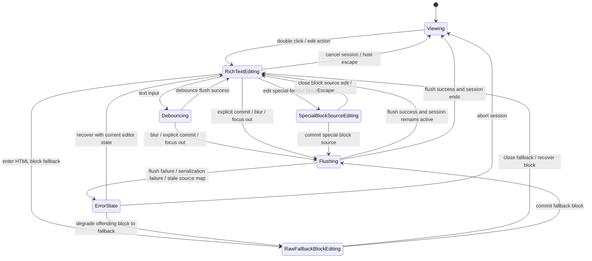
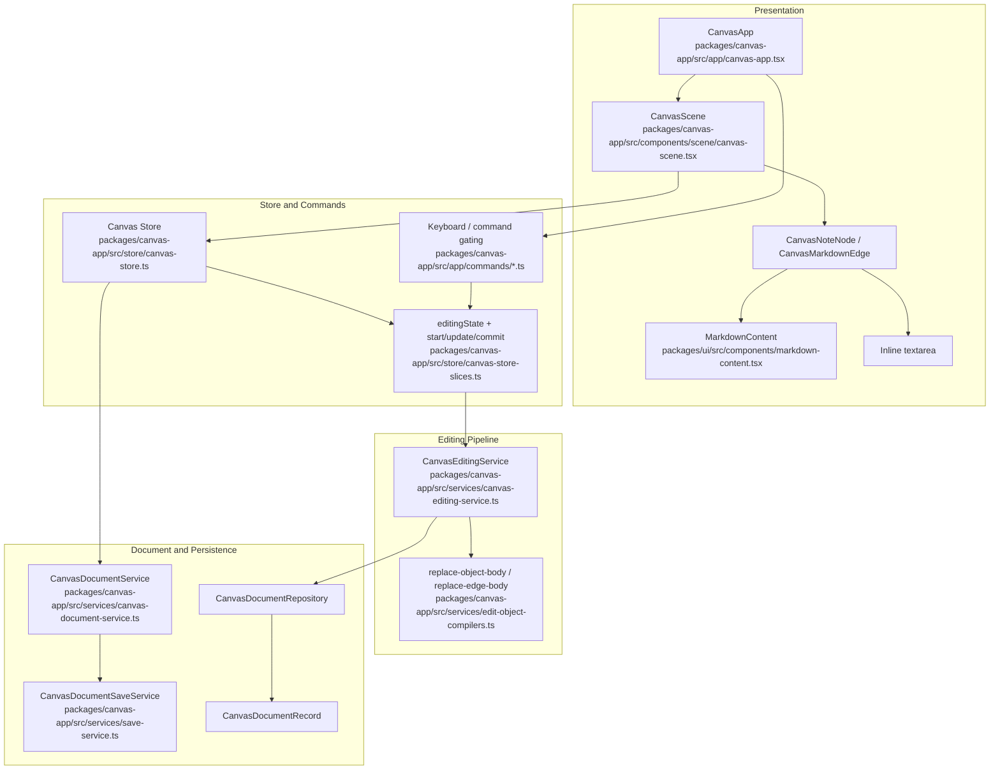
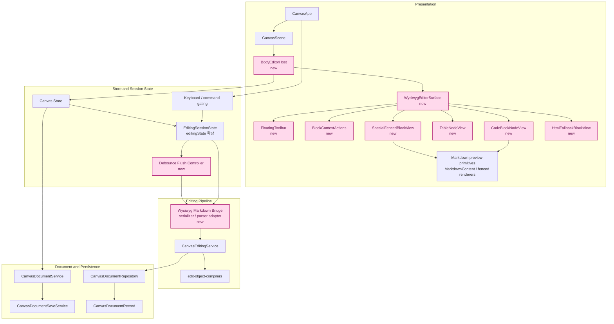

# PRD: Seamless Markdown WYSIWYG
**Product Requirements Document**

| 항목 | 내용 |
|------|------|
| 문서 버전 | v0.3 (Draft) |
| 작성일 | 2026-04-06 |
| 상태 | 초안 |
| 작성자 | Codex |

---

## 1. Overview

### 1.1 Problem Statement

현재 Boardmark의 markdown body 편집은 preview surface 위에서 이어지지 않는다.

- note, edge label, body-bearing object는 평소에는 `MarkdownContent` 기반 preview로 보인다.
- 사용자가 편집에 진입하면 같은 surface를 유지하지 않고, object 내부 UI가 별도 `textarea` 편집기로 교체된다.
- 이 전환 때문에 사용자는 "렌더된 결과를 보며 바로 고치는 경험"이 아니라 "보기 UI와 수정 UI를 오가는 경험"을 겪는다.

이 구조는 다음 제품 문제를 만든다.

- 편집 진입 순간 레이아웃, 타이포그래피, 줄바꿈 감각이 바뀐다.
- code block, link, inline formatting을 preview 상태 그대로 다루지 못한다.
- 텍스트 선택, caret 이동, 복사, 드래그 같은 기본 텍스트 상호작용과 canvas pan/drag 규칙이 같은 surface에서 정리되지 않는다.
- object type마다 편집 진입 UI가 따로 보이기 쉬워 공용 editing capability로 확장하기 어렵다.

즉 이번 작업의 본질은 "rich text editor 하나를 붙이는 일"이 아니라,  
**preview와 editing이 분리된 현재 모델을 preview-continuous editing 모델로 교체하는 일**이다.

### 1.2 Product Goal

Boardmark 안의 markdown body 편집을 preview와 끊기지 않는 자연스러운 rich text 경험으로 바꾼다.

- 사용자는 렌더된 markdown preview와 거의 같은 surface에서 바로 편집을 시작할 수 있어야 한다.
- 편집 중에도 body가 별도 `textarea` shell로 통째로 바뀌지 않아야 한다.
- WYSIWYG 세션의 canonical truth는 markdown string이 아니라 block document여야 한다.
- markdown 파일은 WYSIWYG의 정본이 아니라 import/export 포맷으로 다뤄야 한다.
- 이 capability는 특정 object type 전용이 아니라 markdown body를 가지는 모든 object가 공용으로 host해야 한다.
- 일반 문단/리스트/표/인라인 포맷은 자연스러운 rich text 편집을 따르고, `mermaid` / `sandpack` 같은 special fenced block은 별도 규칙을 가진다.

### 1.3 Success Criteria

- 편집 진입 시 note body, edge label, body-bearing object content가 전체 `textarea`로 교체되지 않는다.
- 사용자는 렌더된 markdown에 가까운 surface에서 caret 배치, 타이핑, 선택, 복사, 붙여넣기를 할 수 있다.
- code block 안에서도 텍스트 선택, caret 이동, 편집, 복사가 가능하다.
- canvas pan/drag와 text interaction의 우선순위가 사용자 입장에서 예측 가능하다.
- note, edge, 향후 body-bearing object가 같은 editor host contract를 사용한다.
- 지원 범위 내 block document는 canonical markdown export로 저장 가능해야 한다.
- WYSIWYG 저장 후 markdown source가 canonicalize되는 것은 허용한다.

---

## 2. Goals & Non-Goals

### Goals

- preview와 edit의 시각적/구조적 단절을 제거하는 seamless editing surface 정의
- markdown body 편집을 object type 비의존 공용 capability로 재정의
- 텍스트 선택, caret, copy/paste, IME 입력, undo/redo 우선순위 규칙 정의
- code block, table, special fenced block을 포함한 semantic markdown subset의 인라인 편집 요구사항 정의
- source patch 기반 bi-editing 파이프라인과 양립 가능한 host contract 정의
- 현재 `textarea` 교체형 편집 흐름을 대체할 v1 제품 범위와 수용 기준 정의
- floating toolbar와 block-context action이 어떤 범위까지 v1에 들어가는지 명시

### Non-Goals

- Boardmark 내부 raw markdown 전체 편집기 추가
- 모든 GitHub Flavored Markdown 문법의 1차 릴리즈 지원
- collaboration, presence, multi-writer real-time sync
- AI rewrite, slash command, suggestion UI
- 최종 toolbar / floating menu / block handle UX 확정
- 특정 라이브러리 선택을 PRD 단계에서 irrevocable decision으로 고정

---

## 3. Core User Stories

```text
AS  캔버스 사용자
I WANT  렌더된 markdown를 보던 자리에서 바로 타이핑을 시작하고
SO THAT 보기와 편집 사이를 오가며 맥락을 잃지 않고 수정할 수 있다

AS  기술 문서를 다루는 사용자
I WANT  code block 안에서도 직접 선택, 복사, 수정하고
SO THAT 코드와 설명을 캔버스 위에서 끊김 없이 다룰 수 있다

AS  edge와 note를 함께 편집하는 사용자
I WANT  object 종류가 달라도 비슷한 편집 규칙을 경험하고
SO THAT 어떤 body surface에서도 학습 비용 없이 작업할 수 있다

AS  markdown 파일을 source-of-truth로 관리하는 사용자
I WANT  WYSIWYG 편집 결과가 예측 가능한 canonical markdown로 export 되고
SO THAT raw editing, Git diff, repository 기반 파이프라인을 계속 사용할 수 있다
```

---

## 4. Current State

### 4.1 Current Product Behavior

현재 canvas에서는 preview와 edit가 서로 다른 UI 트리로 동작한다.

- note body는 평소 `MarkdownContent` preview를 렌더하다가 편집 시 `textarea`로 교체된다.
- edge label도 동일하게 preview 렌더와 `textarea` 편집 UI가 분리되어 있다.
- 일부 body-bearing component도 비슷한 패턴을 따른다.
- 편집 진입은 double click 중심이고, blur 또는 shortcut에 의해 commit되는 흐름이다.

### 4.2 Why This Is Not Enough

현재 구조는 구현은 단순하지만 제품 경험은 부족하다.

- preview 상태에서 보던 구조와 편집 상태의 구조가 달라 WYSIWYG 체감이 없다.
- 줄바꿈, inline mark, code block의 실제 결과를 보며 미세 수정하기 어렵다.
- canvas interaction과 text interaction 경계가 `textarea` 기준 임시 처리에 머물러 있다.
- 이후 code block interaction, link editing, richer markdown subset 지원이 계속 ad-hoc해질 위험이 크다.

---

## 5. Product Principles

### 5.1 Preview-Edit Continuity

- 사용자는 "보기 화면을 떠나서 편집기 모달로 이동했다"고 느끼면 안 된다.
- edit mode는 존재할 수 있지만, 시각적 맥락과 레이아웃은 최대한 유지되어야 한다.
- 편집 진입은 shell 교체가 아니라 같은 content surface의 interaction mode 전환이어야 한다.

### 5.2 Block-First, Markdown Import/Export

- WYSIWYG 세션의 canonical truth는 markdown source fragment가 아니라 block document다.
- markdown는 editor state를 저장하고 교환하기 위한 import/export 포맷이다.
- hard break, list marker, fenced block marker 같은 source 표기는 canonical export로 정규화될 수 있다.
- unsupported or unstable syntax는 조용히 손실시키지 말고 block-local fallback 또는 raw editing 경로로 보내야 한다.

### 5.3 Object-Agnostic Editor Core

- WYSIWYG core는 `note`, `edge`, `shape` 같은 object 이름을 알면 안 된다.
- 각 object는 markdown body host로서 editor를 연결해야 한다.
- 새 body-bearing object가 추가되어도 editor core는 수정 없이 재사용 가능해야 한다.

### 5.4 Explicit Interaction Boundaries

- text interaction과 canvas interaction은 경쟁 관계를 숨기지 않고 명시적으로 정리해야 한다.
- 사용자는 언제 drag가 되고, 언제 text selection이 되고, 언제 shortcut이 editor로 가는지 예측할 수 있어야 한다.

---

## 6. Scope

### 6.1 V1 In Scope

- note body seamless editing
- edge label seamless editing
- markdown body를 가지는 공용 object host contract
- 아래 semantic subset의 rich text editing
  - paragraph
  - heading
  - bullet list / ordered list
  - blockquote
  - fenced code block
  - table
  - inline code
  - bold / italic
  - link
  - hard line break / paragraph split
- special fenced block
  - ` ```mermaid `
  - ` ```sandpack `
- selection, copy, paste, caret move, IME composition, local undo/redo
- debounced persistence + explicit commit/cancel을 포함한 mixed edit session 규칙
- 최소 floating toolbar + block-context action
- blur / escape / selection change / canvas focus change에 대한 edit session 규칙

### 6.2 Out of Scope for V1

- footnote, task list, callout, nested directive editing의 full fidelity authoring
- block drag-and-drop reordering
- markdown raw/source split view
- markdown 원문 blank-line layout의 완전 보존
- comment, suggestion, review mode
- collaborative cursors
- mobile-specific touch-first editing UX 최적화

---

## 7. UX Requirements

### 7.1 Entry and Exit

- single click은 기존처럼 object selection을 담당한다.
- double click 또는 명시적 edit action으로 편집에 진입할 수 있어야 한다.
- 편집 진입 시 사용자가 클릭한 위치 또는 가장 근접한 텍스트 위치에 caret이 배치되어야 한다.
- 편집 종료는 blur, explicit commit action, object focus 이탈 등으로 가능해야 한다.
- `Escape`는 전역적으로 한 가지 의미만 가지지 않는다.
- 일반 rich text body에서는 session 종료 또는 host-level cancel로 연결될 수 있다.
- code block 또는 special fenced block 내부에서는 먼저 현재 block 편집 상태를 종료하고, 그 다음에 host-level session 종료로 이어질 수 있다.

### 7.2 Surface Continuity

- 편집 진입 시 object body 전체를 다른 chrome으로 바꾸지 않는다.
- 기본 여백, 폭, 줄바꿈 감각, code block container, typography rhythm은 preview와 큰 차이가 없어야 한다.
- "지금 preview를 보고 있는가, editing surface를 보고 있는가"가 사용자에게 중요한 판단 포인트가 되면 안 된다.

### 7.3 Editing Model

- 기본 편집 모델은 Notion과 유사한 block-first document editing이다.
- 사용자는 raw markdown punctuation 자체를 항상 직접 다루지 않아도 된다.
- 편집의 기본 단위는 semantic block / inline mark다.
- 일반 문단에서 `Enter`는 새 block을 만들고, `Shift+Enter`는 같은 block 안 hard break를 만든다.
- WYSIWYG는 연속 empty paragraph를 spacing 수단으로 지원하지 않는다.
- 일반 paragraph, heading, list, blockquote, table cell은 preview와 가까운 rich text surface에서 직접 편집한다.
- 단, fenced code content, special fenced block source, unsupported syntax fallback 등 source visibility가 필요한 경우에는 국소적인 source-oriented control을 허용한다.

### 7.4 Code Block Requirements

- code block은 read mode와 edit mode 모두에서 같은 위치와 유사한 box model을 유지해야 한다.
- 사용자는 code block 내부 텍스트를 드래그 선택하고 복사할 수 있어야 한다.
- 사용자는 code block 내부에 caret을 두고 수정할 수 있어야 한다.
- code block horizontal scroll, line wrapping policy, monospace typography는 preview와 일관되어야 한다.
- 일반 fenced code block은 syntax highlight를 유지해야 한다.
- 일반 fenced code block은 line number, tab indentation, Enter new line 같은 code-editor 기대를 충족해야 한다.
- `Tab`은 focus 이동보다 code indentation을 우선한다.
- `Enter`는 새 코드 줄 생성으로 동작한다.

### 7.5 Special Fenced Block Requirements

- `mermaid`, `sandpack` 같은 special fenced block은 일반 code block과 같은 편집 규칙을 따르지 않는다.
- read mode에서는 기존 preview renderer를 유지한다.
- edit mode에서도 block shell은 preview를 유지한다.
- 사용자가 special block을 직접 편집하려고 할 때는 block이 통째로 일반 rich text block으로 변하지 않는다.
- special block 더블클릭 또는 명시적 edit action은 해당 block의 source-edit mode로 전환한다.
- source-edit mode는 같은 body surface 안에서 인라인으로 열리고, block preview를 완전히 분리된 별도 패널로 이동시키지 않는다.
- special block은 preview와 source를 동시에 항상 보여주지 않는다.
- 사용자는 preview와 source-edit mode 사이를 명시적으로 토글할 수 있어야 한다.
- source-edit mode에서 `Escape`는 우선 block-local edit mode 종료를 의미한다.

### 7.6 Table Requirements

- table은 v1 범위에 포함한다.
- 사용자는 cell 안 텍스트를 rich text처럼 직접 편집할 수 있어야 한다.
- 사용자는 행/열 추가를 할 수 있어야 한다.
- 사용자는 정렬을 변경할 수 있어야 한다.
- 사용자는 header row 또는 header cell 성격을 토글할 수 있어야 한다.
- table selection 및 keyboard navigation은 일반 문단 selection 규칙을 깨지 않는 범위에서 동작해야 한다.
- table serializer는 GitHub markdown 표 정렬 마커를 사용할 수 있어야 한다.
- table 편집 모델은 첫 줄 header row와 cell-level header 성격 토글 모두를 수용해야 한다.
- body 내부 header 성격 토글도 제품 요구사항에 포함한다.
- 단, body 내부 header semantics를 canonical markdown로 어떻게 고정할지는 별도 serialization spike에서 검증한다.

### 7.7 Link and Inline Mark Behavior

- edit mode에서 링크 클릭 기본 동작은 navigation보다 caret placement가 우선이어야 한다.
- `Cmd/Ctrl+Click` 또는 명시적 affordance가 있을 때만 링크 이동을 허용한다.
- bold, italic, inline code 등은 결과 표현이 preview와 크게 다르지 않아야 한다.

### 7.8 Toolbar and Context Actions

- v1은 toolbar가 없는 제품이 아니다.
- selection 상태에 따라 최소 floating toolbar를 제공해야 한다.
- floating toolbar는 우선 `bold`, `italic`, `link`만 지원한다.
- table, code block, special fenced block에는 block-context action을 제공할 수 있어야 한다.
- toolbar는 편집 surface를 덮어쓰는 주 UI가 아니라, 보조 조작 장치여야 한다.

### 7.9 Canvas Interaction Arbitration

- editor surface 안에서 시작한 drag는 기본적으로 text selection 또는 editor-local interaction으로 처리해야 한다.
- edit mode 동안 object drag, edge connect, resize handle은 충돌하지 않도록 비활성화되거나 우선순위에서 밀려야 한다.
- canvas pan은 editor 바깥 pointer 시작 또는 명시적 modifier 규칙으로만 개입해야 한다.
- undo/redo, delete, copy/paste 같은 단축키는 edit mode일 때 editor가 우선 소비해야 한다.
- edit mode 중 object-level destructive shortcut이 오작동하면 안 된다.
- 현재 v1 정책은 editor-first다. 편집 중에는 canvas gesture보다 텍스트 편집이 우선한다.

---

## 8. Product Rules

### 8.1 Host Contract

WYSIWYG core는 아래 수준의 공용 contract 위에서 동작해야 한다.

- 입력
  - 현재 markdown body string
  - editable / read-only 상태
  - focus 요청 여부
  - body surface layout constraints
  - host가 전달하는 selection / activation 상태
- 출력
  - markdown body 변경 이벤트
  - edit session commit
  - edit session cancel
  - editor interaction active/inactive 신호
  - block-local fallback 또는 special edit mode 진입 요청

이 contract는 object type 이름 없이 정의되어야 한다.

### 8.2 Source Pipeline Compatibility

- WYSIWYG는 source patch pipeline 위에 올라가는 편집 surface여야 한다.
- 편집 결과는 최종적으로 markdown fragment 변경으로 표현되어야 한다.
- repository 재정규화와 save/conflict 규칙은 기존 bi-editing 방향을 존중해야 한다.
- unsupported syntax를 조용히 제거하거나 reformatting으로 의미를 바꾸면 안 된다.
- persistence 모델은 mixed mode로 둔다.
- 일반 텍스트 타이핑은 짧은 debounce 간격으로 patch candidate를 만든다.
- explicit commit, blur, block-local edit 종료는 debounce 대기 중 변경을 즉시 flush할 수 있어야 한다.

### 8.3 Failure Handling

- round-trip 불가능한 content는 조용히 손실시키지 않는다.
- serialization 실패, unsupported node 변환 실패, stale source range 문제는 명시적 오류로 surface해야 한다.
- WYSIWYG session failure가 문서 전체를 unusable 상태로 만들면 안 된다.
- unsupported markdown는 object 전체 실패로 확대하지 않는다.
- 기본 정책은 해당 block만 inline raw fallback editor로 전환하는 것이다.
- 첫 fallback 대상은 `HTML block`으로 둔다.

### 8.4 Backward Compatibility

- 기존 `.canvas.md` 문서는 변경 없이 계속 열려야 한다.
- WYSIWYG 미적용 object나 unsupported markdown subset은 기존 fallback 편집 경로를 유지할 수 있다.
- v1 도입이 raw markdown 편집 가능성 자체를 없애면 안 된다.

---

## 9. Functional Requirements

### 9.1 Supported Body Surfaces

- note body
- edge label body
- 향후 markdown body를 가지는 built-in/custom object

### 9.2 Session Semantics

- edit session은 명시적 진입/종료 경계를 가져야 한다.
- session 시작 시 revert 가능한 entry snapshot이 있어야 한다.
- session 중 로컬 editor state와 host/source patch commit 경계는 분리될 수 있지만, 사용자에게는 연속적인 편집으로 보여야 한다.
- session persistence는 debounce + explicit flush의 혼합형으로 동작한다.
- debounce 간격은 짧게 유지한다. 첫 기준은 `300~500ms`다.
- 일반 typing은 debounce flush를 사용한다.
- blur, explicit commit, block-local source edit 종료, object focus 이탈은 pending change를 즉시 flush한다.

### 9.3 Selection Semantics

- caret selection과 range selection을 지원해야 한다.
- triple click, shift selection, keyboard extend selection 같은 브라우저 기본 기대를 크게 깨지 않아야 한다.
- selection이 있는 상태에서 copy/cut/paste가 자연스럽게 동작해야 한다.
- code block과 table도 가능한 범위에서 일관된 keyboard selection semantics를 유지해야 한다.

### 9.4 IME and International Input

- 한국어/일본어/중국어 등 IME composition 중 shortcut 충돌로 commit/cancel이 발생하면 안 된다.
- composition 중 visual jitter나 unexpected markdown rewrite가 없어야 한다.

### 9.5 Accessibility Baseline

- keyboard-only로 edit 진입, caret 이동, selection, 종료가 가능해야 한다.
- focused editing surface는 명확한 접근성 이름과 focus indication을 가져야 한다.
- 읽기 전용 상태와 편집 가능 상태가 스크린 리더 관점에서 구분되어야 한다.

### 9.6 Fallback Semantics

- unsupported markdown는 object 전체 fallback이 아니라 block-local fallback을 기본으로 한다.
- fallback block은 같은 body surface 안에서 inline raw editor로 열린다.
- fallback block 주변의 나머지 rich text block은 계속 normal editing state를 유지할 수 있어야 한다.
- fallback block에서 빠져나오면 가능한 경우 다시 normal surface로 복귀할 수 있어야 한다.
- v1에서 명시적으로 block-local fallback 대상에 포함하는 첫 사례는 `HTML block`이다.

### 9.7 Edit Session State Machine

아래 상태도는 v1 WYSIWYG 편집 세션의 기준 상태를 정의한다.



보조 규칙:

- `Viewing`은 preview 상태이며 object selection은 가능하지만 editor-local shortcut 우선권은 없다.
- `RichTextEditing`은 일반 문단, 리스트, 링크, table cell, 일반 code block을 포함한 기본 편집 상태다.
- `Debouncing`은 사용자가 타이핑을 계속하는 동안 짧은 간격으로 patch candidate를 준비하는 상태다.
- `Flushing`은 debounce 대기 중 변경을 즉시 반영하거나 explicit commit을 처리하는 상태다.
- `SpecialBlockSourceEditing`은 `mermaid`, `sandpack` source를 편집하는 block-local mode다.
- `RawFallbackBlockEditing`은 v1 기준 `HTML block`에 대한 inline raw fallback mode다.
- `ErrorState`는 silent failure로 숨기지 않고, 복구 또는 fallback 경로를 명시적으로 선택하게 하는 상태다.

### 9.8 Code Layer and Component Impact

WYSIWYG는 단일 컴포넌트 교체가 아니라, scene, store, command gating, markdown renderer, edit service, save pipeline까지 걸치는 변경이다.

현재 textarea 교체형 경로는 아래처럼 흐른다.



WYSIWYG 도입 후 예상 코드 레이어와 신규 컴포넌트는 아래처럼 정리할 수 있다.



주요 영향 파일과 레이어:

- `packages/canvas-app/src/components/scene/canvas-scene.tsx`
  - note/edge의 `textarea` swap 제거, `BodyEditorHost` 연결, pan/drag gating 재정의
- `packages/canvas-app/src/app/canvas-app.tsx`
  - editor 세션과 앱 단축키/컨텍스트 메뉴의 우선순위 재조정
- `packages/canvas-app/src/app/commands/canvas-app-commands.ts`
  - undo/redo/zoom/delete 같은 앱 레벨 command의 edit-session aware gating 강화
- `packages/canvas-app/src/store/canvas-store.ts`
  - WYSIWYG session state와 debounce flush controller를 store/service 조합으로 연결
- `packages/canvas-app/src/store/canvas-store-slices.ts`
  - 현재 `startNoteEditing`, `updateEditingMarkdown`, `commitInlineEditing` 중심의 단순 상태를 richer session state로 확장
- `packages/canvas-app/src/store/canvas-store-types.ts`
  - editing state 타입을 block-local mode, fallback mode, flush state까지 표현하도록 확장
- `packages/ui/src/components/markdown-content.tsx`
  - preview primitive 재사용 범위 정의, special fenced block preview와 code/table visual parity 기준 확보
- `packages/canvas-app/src/services/canvas-editing-service.ts`
  - debounce flush, explicit commit, fallback recover 경로가 기존 intent pipeline과 맞물리도록 조정
- `packages/canvas-app/src/services/edit-object-compilers.ts`
  - 최종 출력이 계속 `replace-object-body` / `replace-edge-body` markdown fragment patch로 귀결되도록 유지
- `packages/canvas-app/src/services/save-service.ts`
  - mixed persistence 모델에서 WYSIWYG debounce flush와 save debounce의 경계 검증

이 섹션의 의도는 구현 범위를 미리 넓혀 보자는 것이 아니라, WYSIWYG가 `scene UI 한 파일` 문제가 아니라는 점을 명시하는 것이다.

---

## 10. Acceptance Criteria

- note와 edge에서 편집 진입 시 더 이상 full-body `textarea` swap이 일어나지 않는다.
- 사용자는 렌더된 markdown와 유사한 rich text surface에서 직접 타이핑해 내용을 수정할 수 있다.
- code block 내부 텍스트 선택/복사/수정이 가능하고 syntax highlight, line number, tab indentation이 유지된다.
- `mermaid`, `sandpack` special block은 preview shell을 유지한 채 block-local source edit로 전환된다.
- `mermaid`, `sandpack` special block은 preview/source 동시 노출이 아니라 명시적 토글 모델을 사용한다.
- table에서 cell editing, row/column 추가, 정렬, header 토글이 가능하다.
- edit mode에서 링크 클릭은 caret 우선이고 `Cmd/Ctrl+Click`만 navigation을 수행한다.
- `HTML block`은 해당 block만 inline raw fallback editor로 내려간다.
- 일반 typing은 짧은 debounce로 반영되고 blur/explicit exit는 pending change를 flush한다.
- edit mode 중 undo/redo와 copy/paste는 editor가 우선 처리한다.
- canvas pan/drag와 text selection 충돌이 재현 가능한 규칙으로 정리된다.
- editor core는 object-specific branching 없이 공용 host contract로 연결된다.
- 지원 subset에 대한 markdown round-trip 테스트가 존재하거나, 최소한 명시적 verification matrix가 존재한다.
- edit session 구현이 위 상태도와 모순되지 않는다.
- 코드 변경 계획이 위 레이어 다이어그램과 모순되지 않는다.

---

## 11. Delivery Plan

### Phase 1. Contract and Fallback Boundary

- 공용 markdown body editor host contract를 정의한다.
- 현재 `textarea` 편집 경로를 host boundary 뒤로 정리한다.
- object type별 ad-hoc 진입 분기를 줄이고 fallback path를 명시한다.

### Phase 2. Seamless Surface for Note and Edge

- note body와 edge label에 preview-continuous editing surface를 도입한다.
- 편집 진입, selection, copy/paste, blur/escape, debounce flush, canvas arbitration 규칙을 닫는다.
- code block, table, special fenced block interaction을 포함한 핵심 subset을 검증한다.

### Phase 3. Expand to All Body Hosts

- 다른 body-bearing object에 같은 host contract를 적용한다.
- unsupported syntax/fallback handling을 정리한다.
- round-trip, save/conflict, undo 경계를 제품 수준에서 검증한다.

---

## 12. Open Questions

- body 내부 header semantics를 canonical markdown로 어떻게 lossless하게 serialize 할 것인가
- special fenced block preview/source 토글 affordance를 어떤 UI로 둘 것인가
- block-context action의 최종 command set을 어디까지 둘 것인가

현재 기준의 결론은 명확하다.

- 문제의 핵심은 editor library 부재가 아니라 preview/edit 분리다.
- v1의 제품 성공 기준은 "노션처럼 보이는가"가 아니라, **preview 상태를 떠나지 않고 자연스러운 rich text editing으로 markdown body를 안정적으로 수정할 수 있는가**다.
- 구현 선택은 ADR에서 Tiptap으로 좁혔고, 이제 남은 핵심은 markdown fidelity와 block별 interaction을 spike로 검증하는 일이다.
