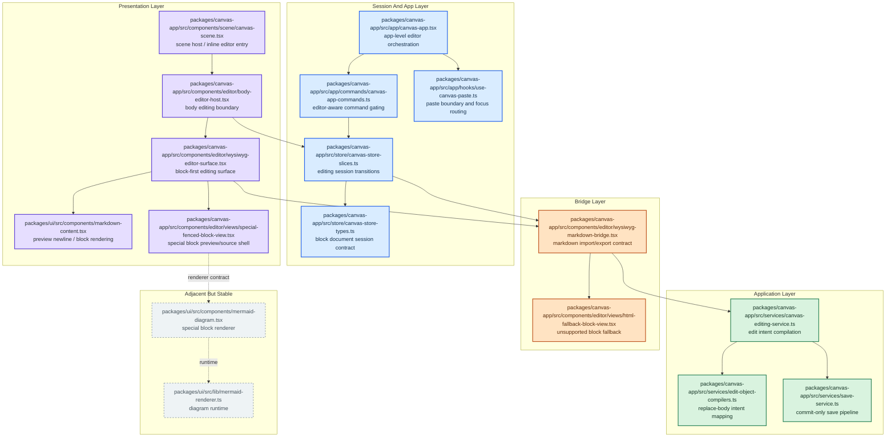

# WYSIWYG Block-First 정리

## 문제

현재 WYSIWYG 줄개행 문제의 핵심은 markdown 문자열을 편집의 중심으로 두고 있다는 점이다.

- editor는 실제로는 문단, code block, hard break, empty paragraph 같은 구조를 다룬다
- 저장 포맷은 markdown string이다
- preview와 WYSIWYG가 newline을 다르게 해석한다
- blur/save 시점마다 serializer가 구조를 다시 markdown로 억지 변환한다

이 구조에서는 아래 문제가 반복된다.

- `&nbsp;` 같은 보존용 토큰이 사용자 source로 샌다
- fenced code block 뒤 blank line이 누적된다
- single newline, hard break, paragraph split 의미가 섞인다
- blur만 해도 source가 canonicalize되거나 변형된다
- 브라우저 상의 block 편집 의미와 markdown 원문 보존 요구가 충돌한다

즉 문제의 본질은 "줄바꿈 버그"가 아니라
**block editor 상태를 markdown string에 무손실로 계속 맞추려는 구조**다.

## 이번 단계 대상

이번 단계는 WYSIWYG 전체 재구성이 아니라, 일반 문단에서의 줄개행 의미를 바로잡는 작업만 다룬다.

직접 개선 대상은 아래 두 가지다.

- 일반 문단에서 `Enter`
- 일반 문단에서 `Shift+Enter`

이번 단계에서 확인하고 정리해야 하는 markdown 대상은 아래에 한정한다.

- 일반 문단의 paragraph split
- 일반 문단 내부 hard break
- 일반 문단 내부 legacy single newline
- 일반 문단 내부 hard break 표기법
  - `two spaces + newline`
  - `backslash + newline`
  - `<br>`
- 일반 문단 주변의 blur/save round-trip 안정성

즉 이번 단계는 "문단과 줄개행의 의미를 분리하는 것"이 목표이며,
그 외의 편집 규칙은 기존 동작을 유지하는 것이 원칙이다.

이번 단계에서 이미 고정된 전제는 아래와 같다.

- WYSIWYG는 Notion과 같은 block-first editor다
- 일반 문단에서 `Enter`는 항상 새 문단이다
- 일반 문단에서 `Shift+Enter`는 항상 hard break다
- hard break export는 `<br>`로 고정한다
- repeated empty paragraph는 WYSIWYG에서 지원하지 않는다
- legacy multiline blank line은 import 과정에서 보존 대상이 아니다
- `&nbsp;`는 사용자 visible export에 남기지 않는다
- blur-only 세션은 저장하지 않는다
- 실제 사용자 편집이 있었을 때만 canonical markdown export를 저장한다

## 이번 단계 비대상

아래 항목은 이번 작업에서 의미를 바꾸지 않는다.

- fenced code block 내부의 `Enter`
- fenced code block 내부의 `Shift+Enter`
- `mermaid`, `sandpack` 같은 special block 편집 규칙
- special block preview/source 토글
- HTML block fallback 정책
- 기타 unsupported syntax fallback 정책
- raw markdown editor의 역할 변경
- broad migration 정책 전반

아래 항목은 영향 감시 대상이지만, 이번 단계에서 동작을 새로 정의하지 않는다.

- fenced code block 앞뒤 blank line
- special block 앞뒤 blank line
- 기존 `&nbsp;` 데이터의 장기 처리 정책
- repeated empty paragraph의 장기 제품 정책

## 해결 방향

장기적으로는 WYSIWYG를 Notion과 유사한 block-first editor로 본다.

- 편집 중 진실은 markdown string이 아니라 block document다
- `Enter`는 새 block이다
- `Shift+Enter`는 같은 block 안 hard break다
- preview와 WYSIWYG는 같은 block 의미 체계를 따라야 한다
- markdown는 import/export 포맷으로만 다룬다

이 방향에서 중요한 것은 "newline을 보존하는 것"이 아니라
"문단과 줄개행을 서로 다른 구조로 명확히 분리하는 것"이다.

## 무엇이 단순해지는가

block-first로 가면 의미 체계가 단순해진다.

- paragraph split은 block 생성으로만 처리된다
- hard break는 inline break로만 처리된다
- empty paragraph는 editor 내부 block 상태다
- spacing은 markdown token이 아니라 block layout 규칙으로 다룬다

그 결과 아래 복잡도가 줄어든다.

- `&nbsp;` 같은 placeholder 보존 로직
- blur 시 markdown 재직렬화 차이
- preview와 WYSIWYG의 newline 해석 차이
- bare newline과 hard break를 구분하기 위한 임시 규칙
- fenced code block 주변 blank line edge case

## markdown와의 경계

block-first로 가면 markdown는 "정본"이 아니라 import/export 경계가 된다.

### import에서 할 일

- 외부 markdown를 가능한 한 관대하게 읽는다
- `two spaces`, `\\`, `<br>`는 모두 hard break로 읽는다
- legacy `&nbsp;`는 import 호환용으로만 읽는다
- 애매한 blank line 패턴은 가능한 범위에서 paragraph 구조로 받아들인다

### export에서 할 일

- editor block document를 canonical markdown로 직렬화한다
- hard break는 `<br>`로 고정한다
- empty paragraph는 사용자 visible token으로 쓰지 않는다
- markdown로 자연스럽게 표현되지 않는 spacing은 drop하거나 축약한다
- repeated empty paragraph와 legacy multiline blank line은 export에서 복원하지 않는다

이 경계가 명확해야 WYSIWYG 내부 의미와 markdown 파일이 서로 덜 흔들린다.

## 무엇을 보존하지 않는가

block-first 방식에서는 아래를 WYSIWYG의 보존 목표로 두지 않는다.

- 연속 empty paragraph 개수
- blank line layout 원문 형태
- hard break의 원래 표기법 차이
- single newline에 의존한 preview 의미
- markdown로 표현되지 않는 block-local UI 상태

대표적으로 아래는 완전 보존 대상이 아니다.

```md
문단 A


문단 B
```

```md
문단 A

&nbsp;

문단 B
```

이런 표현은 WYSIWYG 내부에서는 대체로 아래 둘 중 하나로 축약된다.

- `paragraph A + paragraph B`
- `paragraph A + empty paragraph + paragraph B`

즉 "빈 줄 여러 개를 쌓아 여백을 만든 원문"은 block-first와 잘 맞지 않는다.

이번 단계에서는 이런 legacy multiline 정보도 import 후 block 모델에서 축약되며, 다시 export에서 복원하지 않는다.

## 왜 `&nbsp;`를 버려야 하나

`&nbsp;`는 본문 의미가 아니라 빈 문단을 markdown에 남기기 위한 보존 토큰에 가깝다.

이 토큰을 export에 남기면 다음 문제가 생긴다.

- 사용자에게 이해 불가능한 source가 생긴다
- blur/save 때 round-trip이 흔들린다
- code block 뒤 spacing 버그가 늘어난다
- WYSIWYG가 아니라 markdown serializer의 제약을 사용자가 떠안게 된다

그래서 장기 방향에서는 `&nbsp;`를 사용자 visible export에서 제거한다.

## 호환 가능한 영역

아래는 block-first로 가도 비교적 안정적으로 import/export 가능한 범위다.

- paragraph
- heading
- bullet / ordered list
- blockquote
- fenced code block
- inline code
- bold / italic / link
- table 기본 구조
- hard break를 `<br>`로 본 경우

이 범위는 markdown 원문 fidelity보다 block 의미 보존이 중요하다.

## 호환성이 낮은 영역

아래는 block-first editor와 markdown export가 본질적으로 긴장하는 영역이다.

- repeated empty paragraph
- non-semantic blank line spacing
- parser마다 의미가 갈리는 single newline
- bullet/list marker의 원문 스타일
- fenced block marker의 원문 스타일
- partially supported custom syntax 원문

이 영역에서 WYSIWYG는 원문 보존보다는 canonical export를 우선한다.

## 구현 원칙

### 1. block document가 편집 중 진실이다

- WYSIWYG session state는 markdown string이 아니라 block document snapshot을 가진다
- dirty 판단도 string diff가 아니라 document 변경 기준으로 한다
- hydration과 commit 시점에만 markdown import/export를 수행한다

### 2. preview와 WYSIWYG 의미를 맞춘다

- preview도 block-first 의미 체계를 따라야 한다
- single newline을 `<br>`처럼 보이게 하는 규칙은 제거한다
- visible break는 hard break만 담당한다

### 3. raw markdown와 WYSIWYG의 역할을 분리한다

- raw markdown는 원문 유지가 필요한 경우를 담당한다
- WYSIWYG는 stable subset 편집기로 역할을 좁힌다
- unsupported syntax는 조용히 깨지지 말고 raw editing 또는 block-local fallback으로 보낸다

### 4. empty paragraph를 spacing 기능으로 다루지 않는다

- 연속 empty paragraph를 export에서 보존하려 하지 않는다
- 여백은 block layout 책임으로 돌린다
- 문서 의미와 시각 spacing을 같은 레이어에서 처리하지 않는다

## 이번 단계 구현 계획

### 코드 영향도

아래 다이어그램은 block-first 전환에서 실제로 손대게 되는 주요 레이어와 컴포넌트를 보여준다.

- 보라: 이번 단계 핵심 편집 surface
- 파랑: session state, command gating, app orchestration
- 주황: markdown import/export bridge와 fallback 경계
- 초록: commit, compiler, save pipeline
- 회색: 이번 단계에서는 유지가 원칙인 주변 surface



### 레이어별 영향 포인트

- Presentation Layer
  - `body-editor-host.tsx`, `wysiwyg-editor-surface.tsx`는 일반 문단의 `Enter` / `Shift+Enter` 의미를 고정하는 핵심 지점이다
  - `canvas-scene.tsx`는 편집 진입 contract가 흔들리지 않는지 확인하는 연결 지점이다
  - `markdown-content.tsx`는 preview가 일반 문단 newline을 WYSIWYG 의미와 다르게 해석하지 않도록 맞추는 범위까지만 본다
- Session And App Layer
  - store는 이번 단계에서 `Enter` / `Shift+Enter` 관련 dirty, hydration, blur commit 안정성만 본다
  - app command와 paste 경로는 줄개행 의미 변경에 직접 부딪히는 경우만 점검한다
- Bridge Layer
  - `wysiwyg-markdown-bridge.tsx`는 일반 문단 newline, paragraph split, hard break import/export 규칙만 우선 다룬다
  - fallback view는 이번 단계에서 새 규칙을 추가하지 않고 현행 유지다
- Application Layer
  - commit 경로는 일반 문단 줄개행 의미가 blur/save에서 뒤집히지 않는지 확인하는 범위만 우선 본다
  - save는 줄개행 관련 round-trip 안정성 확인 대상이다

### Phase 1. 의미 체계 고정

- WYSIWYG 입력 모델을 `Enter = 새 block`, `Shift+Enter = hard break`로 통일한다
- preview의 legacy newline 해석을 block-first 기준으로 맞춘다
- hard break canonical export를 `<br>`로 고정한다
- `&nbsp;`를 export에서 제거한다
- repeated empty paragraph와 legacy multiline blank line은 import 후 block 모델에서 축약되는 것을 전제로 한다

완료 기준:

- paragraph split과 hard break가 더 이상 같은 newline 규칙을 공유하지 않는다
- preview와 WYSIWYG가 같은 줄개행 의미를 가진다

### Phase 2. session state를 block-first로 전환

- WYSIWYG session state에서 줄개행 관련 hydration과 user edit를 분리한다
- live editing 중 markdown string 비교가 `Enter` / `Shift+Enter` 의미를 흔들지 않게 한다
- dirty 판단은 최소한 줄개행 관련 blur-only 세션을 구분할 수 있어야 한다
- hydration은 dirty를 만들지 않게 분리한다
- blur-only 세션에서는 canonicalization도 저장도 하지 않는다

완료 기준:

- blur-only 세션에서 source가 바뀌지 않는다
- programmatic `setContent`와 user edit가 서로 다른 경로로 관리된다

### Phase 3. markdown bridge를 import/export 경계로 축소

- bridge는 editing truth를 들고 있지 않게 한다
- markdown import는 hydration 전용으로, export는 commit 전용으로 사용한다
- 일반 문단의 legacy hard break, single newline, paragraph split 처리 정책을 bridge에 고정한다
- 이번 단계에서 unsupported syntax fallback 규칙은 바꾸지 않는다
- legacy multiline blank line과 repeated empty paragraph는 import 시 block 의미로 축약되고, export에서 다시 만들지 않는다

완료 기준:

- blur 시 임의 canonicalization이 아니라 commit 시 export만 발생한다
- markdown serializer가 live editing semantics를 좌우하지 않는다

### Phase 4. host/store/commit 경로 재정렬

- `BodyEditorHost` 중심으로 note/edge/shape 편집 경계를 통합한다
- store는 WYSIWYG와 textarea 경로를 분리해 관리한다
- `replace-object-body` / `replace-edge-body` intent는 유지하되 입력을 canonical export 결과로 제한한다
- save pipeline은 commit 시점 export만 받도록 정리한다

완료 기준:

- object type마다 편집 의미가 달라지지 않는다
- 저장 경로가 live markdown sync 없이 동작한다

### Phase 5. 브라우저 검증 추가

- 브라우저 상호작용 테스트를 추가한다
- 최소 회귀 시나리오를 고정한다

검증 시나리오:

- paragraph에서 `Enter`는 새 block
- paragraph에서 `Shift+Enter`는 같은 block 안 줄개행
- 일반 문단을 열기만 하고 blur하면 source unchanged
- 일반 문단 편집 후 blur/save해도 paragraph split과 hard break 의미가 뒤집히지 않음
- fenced code block 앞뒤 편집 후 blur해도 `&nbsp;`나 extra blank line이 새로 생기지 않음
- WYSIWYG를 열기만 하고 blur하면 source unchanged
- raw markdown의 일반 문단 hard break를 읽고 canonical `<br>`로 export 가능
- legacy multiline blank line note를 import해도 repeated empty paragraph를 다시 만들지 않음

## 현재 기준

이 문서의 현재 기준은 아래와 같다.

- WYSIWYG는 block-first editor다
- markdown는 import/export 포맷이다
- `Enter`는 새 block이다
- `Shift+Enter`는 hard break다
- hard break export는 `<br>`다
- repeated empty paragraph는 WYSIWYG export에서 보존하지 않는다
- legacy multiline blank line은 block import 과정에서 축약되고 export에서 복원하지 않는다
- `&nbsp;`는 사용자 visible export에 쓰지 않는다
