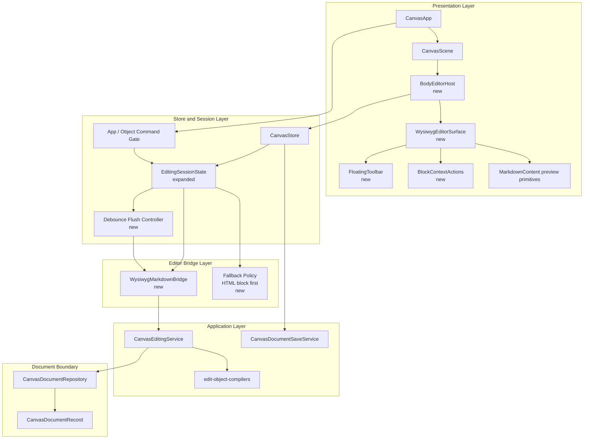

# WYSIWYG 구현 계획

## 1. 목적

이 문서는 `docs/features/wysiwyg/README.md`의 요구사항을 현재 Boardmark 구조에 맞춰 실제 구현 작업으로 풀어낸다.

이번 작업의 목표는 단순히 `textarea`를 rich text editor로 바꾸는 것이 아니다.

핵심은 아래를 동시에 만족하는 공용 markdown body editing capability를 도입하는 것이다.

- preview와 edit가 분리되지 않는 seamless editing surface
- note / edge / 향후 body-bearing object가 재사용하는 공용 host contract
- markdown source patch pipeline과 계속 호환되는 round-trip
- canvas pan/drag보다 text editing을 우선하는 interaction boundary
- code block, table, special fenced block, HTML block fallback까지 포함한 block-local editing

즉 이번 단계는 UI 교체 작업이 아니라,  
**scene, store, editing service, command gating, persistence 경계를 함께 재정렬하는 작업**이다.

---

## 2. 현재 구조 요약

현재 WYSIWYG 도입에 직접 관련된 경계는 아래와 같다.

- `packages/canvas-app/src/components/scene/canvas-scene.tsx`
  - note / shape / edge preview와 `textarea` 편집 UI를 함께 가지고 있다.
  - `editingState.status === 'idle'` 여부로 drag/connect/reconnect 가능 여부를 gating 한다.
- `packages/canvas-app/src/app/canvas-app.tsx`
  - 앱 전역 shortcut, paste, context menu, command context를 조립한다.
- `packages/canvas-app/src/app/commands/canvas-app-commands.ts`
  - undo/redo/zoom/delete 같은 앱 레벨 명령을 `editingState`로 gating 한다.
- `packages/canvas-app/src/store/canvas-store-slices.ts`
  - `startNoteEditing`, `startEdgeEditing`, `updateEditingMarkdown`, `commitInlineEditing`가 있다.
  - 현재 편집 상태는 `idle | note | shape | edge` 수준의 얕은 상태다.
- `packages/ui/src/components/markdown-content.tsx`
  - 현재 preview markdown renderer다.
  - table, fenced code, `mermaid`, `sandpack` preview primitive를 이미 가지고 있다.
- `packages/canvas-app/src/services/canvas-editing-service.ts`
  - intent를 source patch로 바꾸고 repository reparse를 수행한다.
- `packages/canvas-app/src/services/edit-object-compilers.ts`
  - note / edge body 변경은 최종적으로 `replace-object-body`, `replace-edge-body` intent로 처리한다.
- `packages/canvas-app/src/services/save-service.ts`
  - `explicit`, `debounced`, `batched` save를 이미 지원한다.

핵심 의미는 아래와 같다.

- 현재 구조에는 preview와 source patch pipeline이 이미 있다.
- 부족한 것은 그 중간의 **shared editing surface와 richer session state**다.
- 첫 구현은 source-of-truth를 바꿀 필요 없이, `editingState + scene host + markdown bridge`를 새로 도입하는 방향이 가장 안전하다.

---

## 3. 구현 원칙

### 3.1 Host First, Editor Second

- 첫 단계는 editor framework를 깊게 붙이기보다 `BodyEditorHost` 경계를 먼저 만드는 것이다.
- note/edge가 직접 editor 구현을 가지면 이후 object 확장이 다시 막힌다.

### 3.2 Markdown Bridge를 명시적으로 둔다

- editor 내부 문서 모델과 markdown source patch를 바로 섞지 않는다.
- editor state ↔ markdown fragment 변환은 별도 bridge 책임으로 둔다.
- 실패는 bridge에서 조용히 삼키지 않고 명시적으로 surface 한다.

### 3.3 Preview Primitive 재사용

- `MarkdownContent`가 가진 preview primitive를 버리지 않는다.
- code block style, table wrapper, `mermaid`, `sandpack` preview는 가능한 한 재사용한다.
- 목표는 preview와 완전히 다른 WYSIWYG skin이 아니라 visual parity다.

### 3.4 Session State를 정규화한다

- 현재 `editingState.status`만으로는 rich text / special block / fallback / debouncing을 표현할 수 없다.
- store는 최소한 다음을 식별할 수 있어야 한다.
  - host target
  - session mode
  - active block-local mode
  - dirty 여부
  - debounce flush 상태
  - pending error / fallback 대상

### 3.5 Canvas 명령은 Editor-Aware여야 한다

- WYSIWYG 도입 후에도 `editingState.status !== 'idle'` 수준의 단순 gating으로는 부족하다.
- undo/redo/delete/zoom/pan shortcut은 editor-local 우선순위와 host-level 우선순위를 구분해야 한다.

### 3.6 Replace-Body Intent는 유지한다

- 최종 source commit 경로는 계속 `replace-object-body` / `replace-edge-body`로 유지하는 편이 단순하다.
- WYSIWYG가 도입되어도 첫 단계에서는 body 전체 fragment patch를 유지하고, block-local patch 최적화는 후속 단계로 둔다.

---

## 4. 목표 구조

---

## 5. 신규 파일과 변경 파일 기준안

### 5.1 신규 파일 후보

첫 구현 기준안:

- `packages/canvas-app/src/components/editor/body-editor-host.tsx`
- `packages/canvas-app/src/components/editor/wysiwyg-editor-surface.tsx`
- `packages/canvas-app/src/components/editor/floating-toolbar.tsx`
- `packages/canvas-app/src/components/editor/block-context-actions.tsx`
- `packages/canvas-app/src/components/editor/views/code-block-node-view.tsx`
- `packages/canvas-app/src/components/editor/views/table-node-view.tsx`
- `packages/canvas-app/src/components/editor/views/special-fenced-block-view.tsx`
- `packages/canvas-app/src/components/editor/views/html-fallback-block-view.tsx`
- `packages/canvas-app/src/components/editor/wysiwyg-markdown-bridge.ts`
- `packages/canvas-app/src/components/editor/wysiwyg-editor-state.ts`

이 파일 구조는 확정안이 아니라, 책임 분리를 위한 기준안이다.

### 5.2 주요 변경 파일

- `packages/canvas-app/src/components/scene/canvas-scene.tsx`
- `packages/canvas-app/src/app/canvas-app.tsx`
- `packages/canvas-app/src/app/commands/canvas-app-commands.ts`
- `packages/canvas-app/src/app/commands/canvas-object-commands.ts`
- `packages/canvas-app/src/app/hooks/use-canvas-paste.ts`
- `packages/canvas-app/src/store/canvas-store.ts`
- `packages/canvas-app/src/store/canvas-store-slices.ts`
- `packages/canvas-app/src/store/canvas-store-types.ts`
- `packages/canvas-app/src/store/canvas-store-projection.ts`
- `packages/ui/src/components/markdown-content.tsx`
- `packages/canvas-app/src/services/canvas-editing-service.ts`
- `packages/canvas-app/src/services/save-service.ts`

---

## 6. 단계별 구현 계획

### Phase 0. Tiptap Spike와 기술 검증

목표:

- Tiptap이 PRD에서 정의한 최소 요구사항을 기술적으로 만족할 수 있는지 확인한다.
- 구현 전에 막히는 지점을 editor layer에서 먼저 격리한다.

작업:

- isolated editor sandbox에서 아래만 검증한다.
  - paragraph / heading / list / blockquote
  - inline bold / italic / link
  - 일반 fenced code block의 selection, tab, line number, syntax highlight
  - table cell editing, row/column insert, alignment, header toggle
  - `mermaid` / `sandpack` special block preview ↔ source toggle
  - `HTML block` fallback
- markdown serialize 결과가 현재 repository가 읽을 수 있는 fragment인지 확인한다.
- selection / IME / clipboard 기본 동작을 수동 검증한다.

완료 기준:

- Tiptap으로 note body subset을 구현 가능한지 예/아니오 수준 결론이 나온다.
- 막히는 항목이 있으면 Tiptap extension으로 해결 가능한지, ProseMirror fallback이 필요한지 문서화된다.

### Phase 1. Host Boundary와 Store Contract 도입

목표:

- 현재 `textarea` 편집 경로를 공용 body editor host 뒤로 숨긴다.
- editor framework 도입 전에도 경계가 먼저 고정되게 한다.

작업:

- `BodyEditorHost` 도입
- note / edge / shape가 직접 `textarea`를 렌더하지 않도록 정리
- `CanvasEditingState`를 richer session state로 확장
- 최소 상태 추가
  - host target
  - mode
  - markdown snapshot
  - dirty
  - flush status
  - active block-local mode
- `commitInlineEditing`, `cancelInlineEditing`를 host 중심 action으로 재정의

완료 기준:

- scene 컴포넌트는 “어떤 body host를 여는가”만 알고, 편집 구현 상세는 host가 가진다.
- 아직 fallback이 `textarea`여도 구조가 WYSIWYG 주입 가능 형태로 바뀐다.

### Phase 2. Command Gating과 Session State Machine 정리

목표:

- editor-first interaction 원칙을 store와 command 계층에 반영한다.

작업:

- `canvas-app-commands.ts`, `canvas-object-commands.ts`의 gating 조건 확장
- undo/redo/delete/zoom/pan shortcut의 editor-local 우선순위 재정의
- `use-canvas-paste.ts`가 `HTMLTextAreaElement` 전용으로 판단하는 경로 정리
- PRD의 state machine과 일치하도록 session transition helper 추가

완료 기준:

- 편집 세션 중 canvas destructive command가 오작동하지 않는다.
- editor-local undo/redo와 app-level undo/redo가 충돌하지 않는다.

### Phase 3. WysiwygEditorSurface 최소 통합

목표:

- note body와 edge label에 preview-continuous rich text surface를 실제 연결한다.

작업:

- `WysiwygEditorSurface` 도입
- note / edge host에 연결
- 기존 `MarkdownContent` preview와 최대한 같은 typography / spacing / block shell 적용
- 최소 floating toolbar 연결
  - `bold`
  - `italic`
  - `link`
- 링크 클릭 규칙
  - 기본 click: caret
  - `Cmd/Ctrl+Click`: open

완료 기준:

- note body와 edge label이 더 이상 full-body `textarea`로 교체되지 않는다.
- paragraph, heading, list, blockquote, link, inline formatting이 편집 가능하다.

### Phase 4. Mixed Persistence와 Flush 경계 연결

목표:

- 일반 typing은 짧은 debounce로 반영하고, blur/explicit exit는 즉시 flush한다.

작업:

- host 또는 store에 debounce flush controller 추가
- `300~500ms` 기준 debounce 정책 적용
- blur / explicit commit / block-local mode 종료 / focus out 시 flush
- `save-service.ts`의 existing debounced save와 경계 검증

주의:

- editor debounce와 save debounce를 같은 타이머로 섞지 않는다.
- 첫 단계에서는 “editor flush -> store draft 갱신 -> 기존 save policy” 흐름을 유지하는 편이 안전하다.

완료 기준:

- 빠른 타이핑 중에도 commit churn이 과도하지 않다.
- blur 또는 명시적 종료 시 pending change가 남지 않는다.

### Phase 5. Code Block / Table / Special Block 확장

목표:

- PRD의 핵심 differentiated UX를 실제 surface에 얹는다.

작업:

- 일반 fenced code block node view 추가
  - syntax highlight
  - line number
  - tab indentation
  - Enter new line
- table node view 추가
  - cell editing
  - row/column insert
  - alignment
  - header row / header cell toggle
- `SpecialFencedBlockView` 추가
  - `mermaid`
  - `sandpack`
  - preview ↔ source toggle
  - `Escape` block-local exit
- `HtmlFallbackBlockView` 추가
  - `HTML block` inline raw fallback

완료 기준:

- differentiated block UX가 note/edge에서 실제 동작한다.
- special block이 preview와 source를 동시에 강제 노출하지 않는다.

### Phase 6. Markdown Bridge와 Round-Trip 보호

목표:

- editor 내부 문서 모델과 markdown source fragment 사이의 경계를 안정화한다.

작업:

- `WysiwygMarkdownBridge` 구현
- supported subset serializer / parser 규칙 정리
- unsupported block detection과 fallback policy 연결
- `replace-object-body`, `replace-edge-body` intent로 최종 연결
- table serialization spike 반영

완료 기준:

- supported subset은 repository reparse까지 통과한다.
- unsupported subset은 조용히 손실되지 않고 block-local fallback으로 내려간다.

### Phase 7. Expand to All Body Hosts

목표:

- note / edge 외 body-bearing object에 host contract를 확장한다.

작업:

- shape/component body path 정리
- built-in/custom object의 body host 연결
- object별 chrome 차이를 host 바깥으로 밀어낸다.

완료 기준:

- WYSIWYG는 특정 object type 전용 기능이 아니라 공용 capability가 된다.

### Phase 8. 테스트와 안정화

목표:

- regression risk를 줄이고, state machine과 code layer 다이어그램이 실제 코드와 어긋나지 않게 한다.

작업:

- store/session state 테스트
- scene interaction 테스트
- markdown bridge round-trip 테스트
- code block / table / special block view 테스트
- app shortcut gating 테스트
- note / edge 수동 검증 체크리스트 수행

완료 기준:

- PRD acceptance criteria에 매핑되는 자동/수동 검증 표가 존재한다.

---

## 7. 파일별 작업 메모

### `packages/canvas-app/src/components/scene/canvas-scene.tsx`

- note/edge/shape 내부 `textarea` 렌더 제거
- `BodyEditorHost` 삽입
- `nodesDraggable`, `nodesConnectable`, `edgesReconnectable` 조건을 richer editing session state와 정렬

### `packages/canvas-app/src/store/canvas-store-slices.ts`

- `startNoteEditing`, `startEdgeEditing`, `updateEditingMarkdown`, `commitInlineEditing` 재구성
- block-local mode, debounce flush, error/fallback 상태 추가
- `cancelInlineEditing()`를 host-level cancel semantics와 맞춤

### `packages/ui/src/components/markdown-content.tsx`

- preview primitive 재사용 범위 확인
- code block / special fenced renderer 스타일을 editor surface와 시각적으로 맞춤
- 필요 시 preview primitive 일부를 shared utility로 추출

### `packages/canvas-app/src/services/canvas-editing-service.ts`

- WYSIWYG flush 결과를 기존 intent pipeline으로 연결
- stale source / invalid reparse 시 WYSIWYG error state에 필요한 정보 surface

### `packages/canvas-app/src/services/save-service.ts`

- editor flush와 save debounce 상호작용 점검
- flush 직후 explicit save / autosave race가 없는지 확인

---

## 8. 리스크와 대응

### 리스크 1. Markdown fidelity가 Tiptap 계층에서 충분히 제어되지 않음

대응:

- Phase 0 spike에서 먼저 검증
- bridge를 명시적 계층으로 두고, 실패 시 block-local fallback 또는 ProseMirror fallback 검토

### 리스크 2. Canvas shortcut과 editor shortcut 충돌

대응:

- Phase 2에서 command gating을 먼저 정리
- presentation 구현 전에 state machine과 shortcut matrix를 테스트로 고정

### 리스크 3. Code block / table UX가 preview parity를 깨뜨림

대응:

- preview primitive 재사용
- note/edge에서만 먼저 적용하고 built-in object 확장은 후행

### 리스크 4. Debounced editing과 save debounce가 서로 간섭

대응:

- editor flush와 save debounce를 별도 계층으로 분리
- explicit flush boundary를 테스트로 고정

### 리스크 5. 구현 범위가 한 번에 너무 커짐

대응:

- `Host boundary -> command gating -> minimal surface -> block 확장` 순서로 자른다.
- special block, table, HTML fallback은 minimal surface가 안정화된 뒤 붙인다.

---

## 9. 테스트 계획

### Store / Session

- note body 편집 진입 시 host target이 올바르게 설정된다.
- typing 중 debounce 상태가 생기고 flush 후 안정 상태로 복귀한다.
- `Escape`가 일반 body와 special block에서 다른 의미로 동작한다.
- error 발생 시 offending block을 fallback으로 강등할 수 있다.

### Scene / Interaction

- edit mode 중 drag/connect/reconnect가 비활성 또는 우선순위에서 밀린다.
- 일반 click은 caret placement, `Cmd/Ctrl+Click`은 링크 open으로 동작한다.
- blur / focus out 시 pending change가 flush된다.

### Markdown Bridge

- paragraph / heading / list / blockquote / inline formatting round-trip이 유지된다.
- code block markdown가 손실 없이 유지된다.
- table alignment / header toggle serialization이 기대 shape를 만족한다.
- `HTML block`은 fallback으로 내려간다.

### Block Views

- code block에서 tab, enter, copy/paste, line number가 동작한다.
- `mermaid`, `sandpack`는 preview ↔ source toggle이 동작한다.
- special block에서 `Escape`는 먼저 block-local mode를 닫는다.

### App / Commands

- edit session 중 app-level undo/redo/delete/zoom이 차단되거나 editor-local로 위임된다.
- idle 상태에서는 기존 canvas shortcut이 그대로 동작한다.

---

## 10. 구현 시작 순서 제안

실제 착수 순서는 아래가 가장 안전하다.

1. Phase 0 spike
2. Phase 1 host boundary
3. Phase 2 command gating
4. Phase 3 minimal rich text surface
5. Phase 4 mixed persistence
6. Phase 5 differentiated block UX
7. Phase 6 markdown bridge hardening
8. Phase 8 테스트 안정화
9. Phase 7 host 확대

이 순서를 권장하는 이유는, object host 확대보다 note/edge 최소 동작을 먼저 닫는 편이 회귀 반경을 더 좁게 유지하기 때문이다.
