::: note { id: flowchart, at: { x: -789, y: -264, w: 618, h: 671 } }

# Flowchart

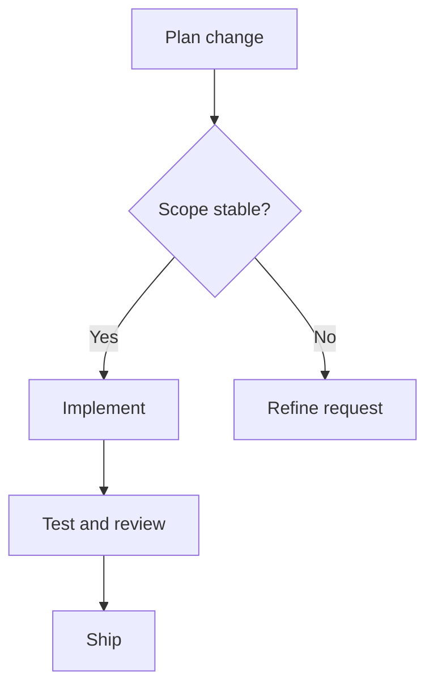

:::

::: note { id: sequence, at: { x: -48, y: -256, w: 813, h: 633 } }

# Sequence Diagram

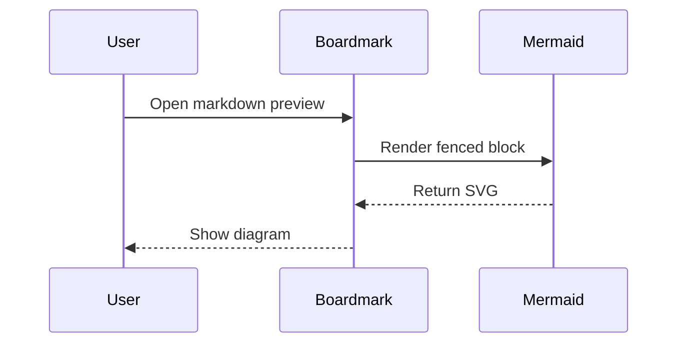

:::

::: note { id: state, at: { x: 889, y: -202, w: 359, h: 497 } }

# State Diagram

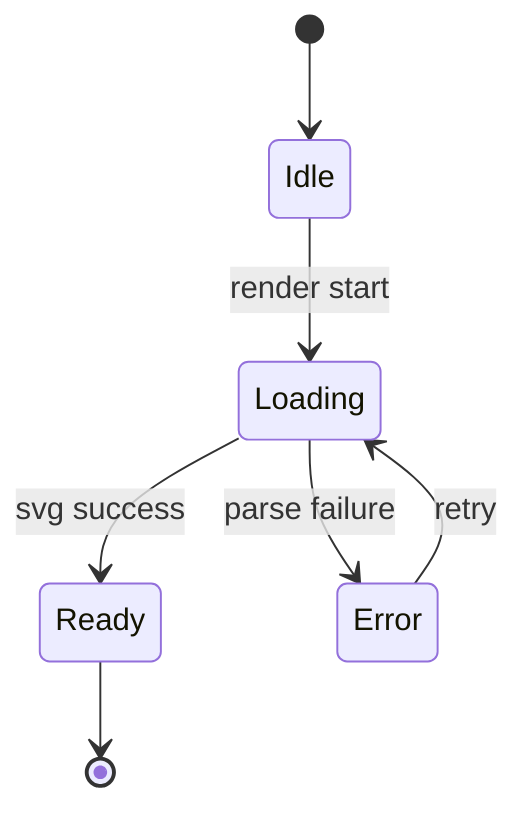

:::

::: note { id: er, at: { x: -690, y: 446, w: 585, h: 734 } }

# ER Diagram

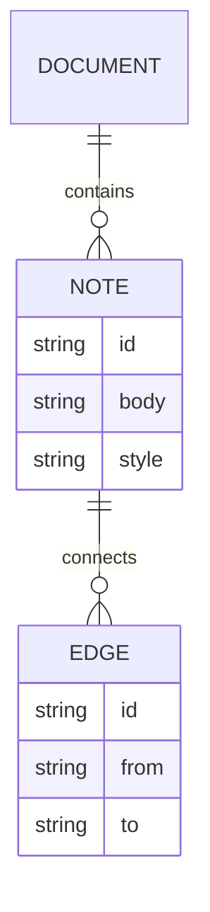

:::

::: note { id: journey, at: { x: 225, y: 306, w: 1525, h: 675 } }

# User Journey

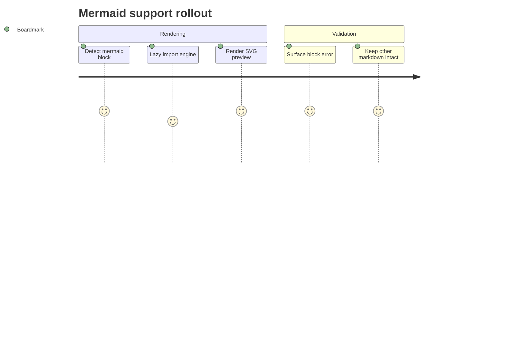

:::

::: note { id: gantt, at: { x: -1599, y: 1197, w: 1668, h: 357 } }

# Gantt Chart

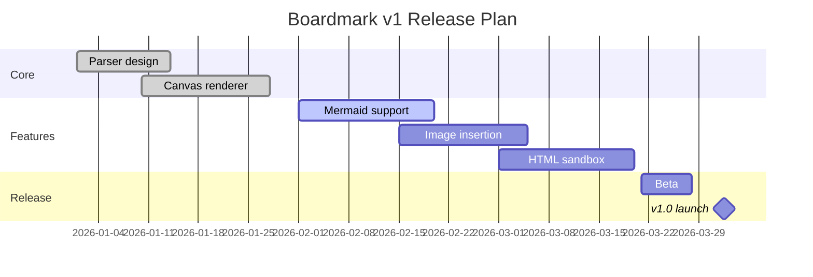

:::

::: note { id: pie, at: { x: 100, y: 1050, w: 600, h: 480 } }

# Pie Chart

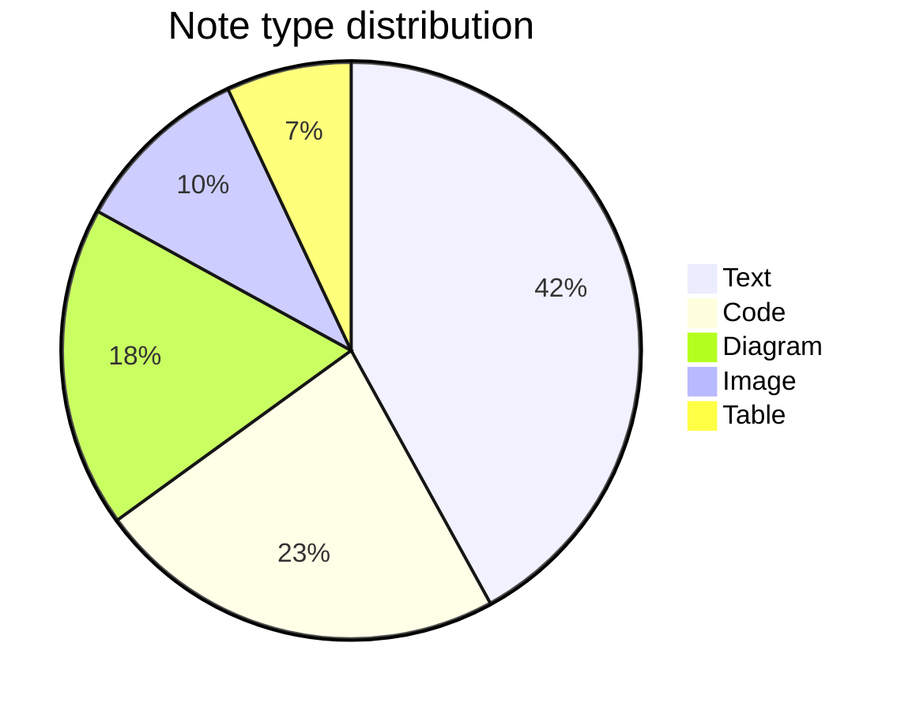

:::

::: note { id: gitgraph, at: { x: 800, y: 1050, w: 1000, h: 480 } }

# Git Graph

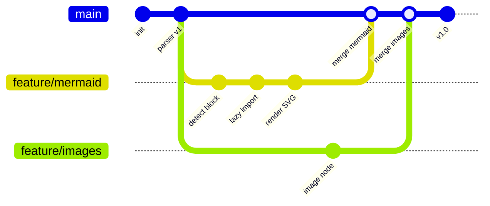

:::

::: note { id: mindmap, at: { x: -1318, y: 1618, w: 1009, h: 767 } }

# Mind Map

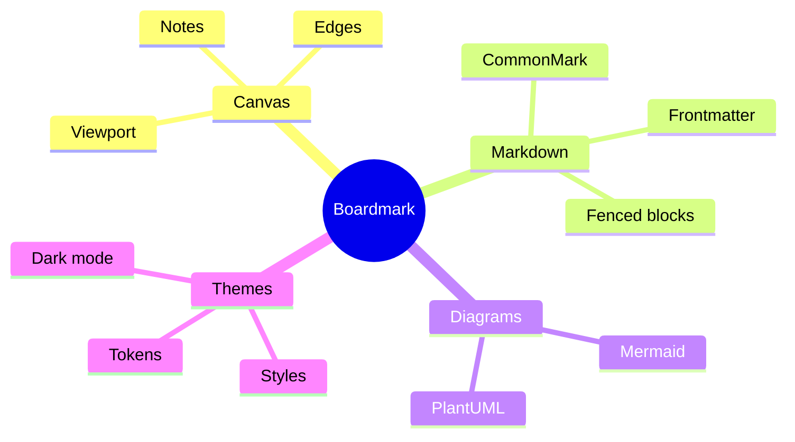

:::

::: note { id: timeline, at: { x: -220, y: 1650, w: 1000, h: 620 } }

# Timeline

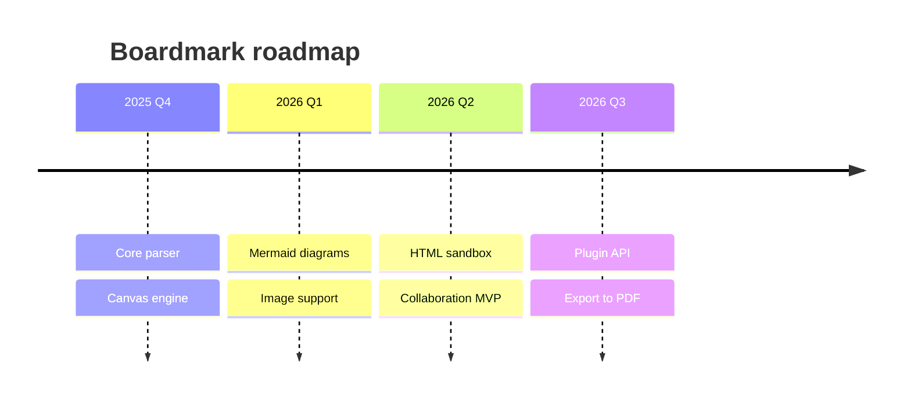

:::

::: note { id: xychart, at: { x: 880, y: 1650, w: 920, h: 620 } }

# XY Chart

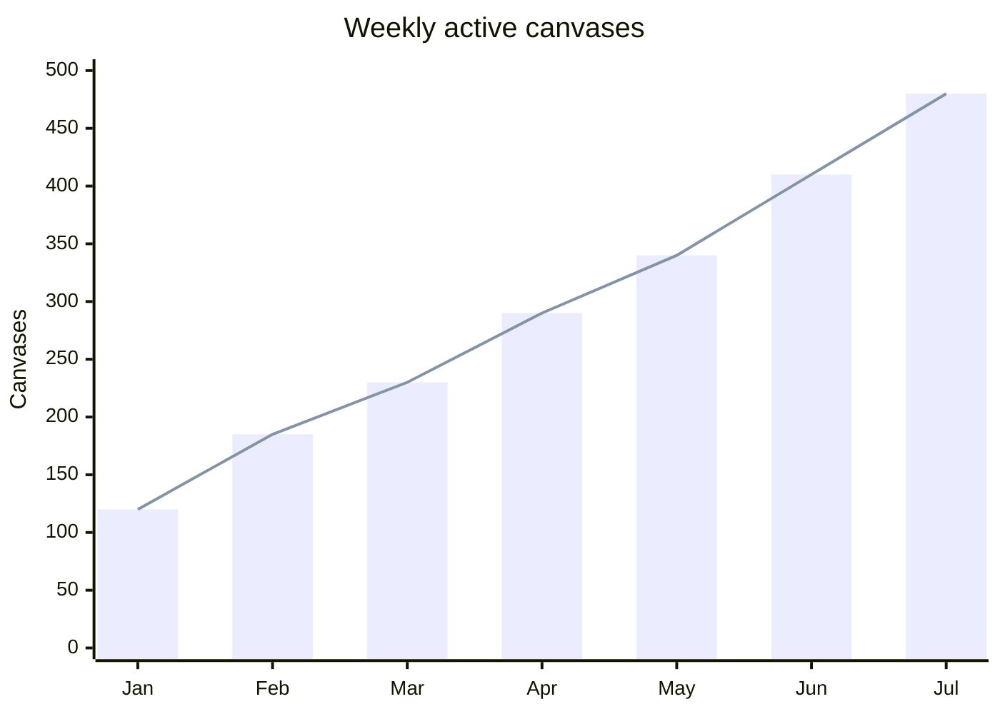

:::

::: note { id: quadrant, at: { x: -1104, y: 2400, w: 840, h: 720 } }

# Quadrant Chart

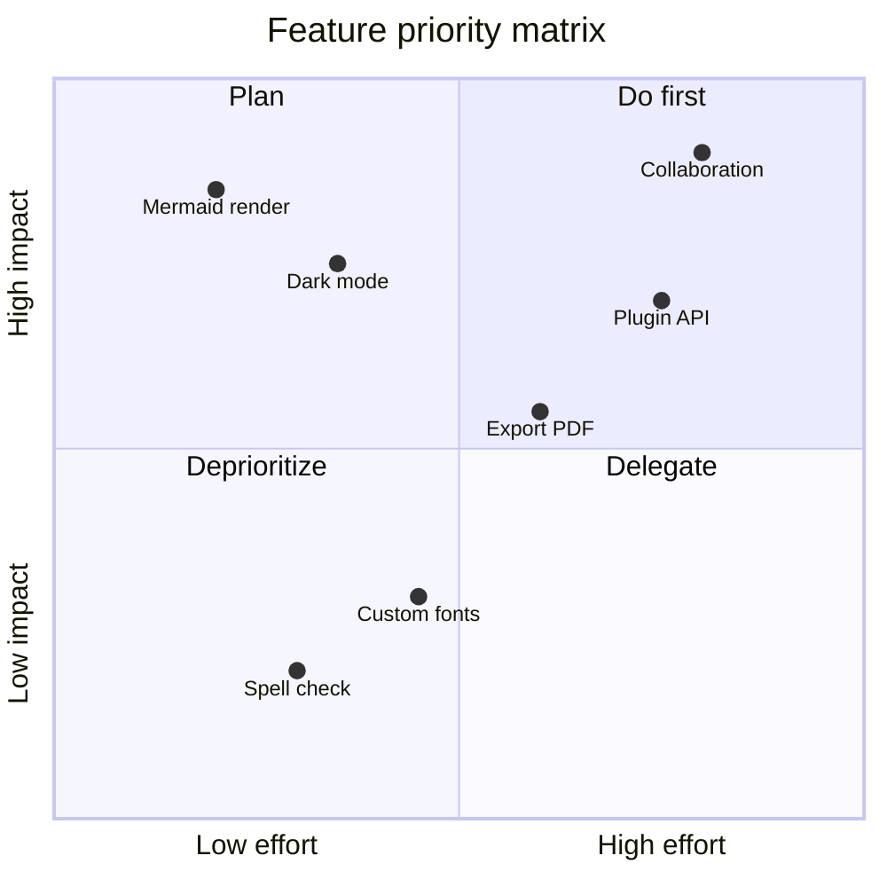

:::

::: note { id: classDiagram, at: { x: -160, y: 2400, w: 1054, h: 1013 } }

# Class Diagram

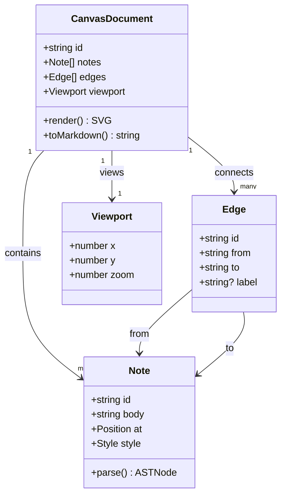

:::
