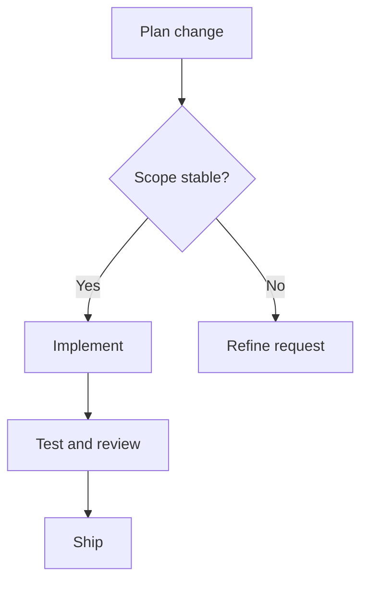
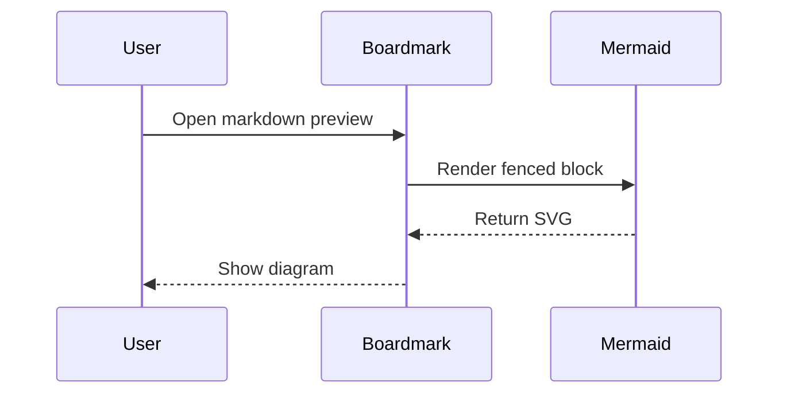
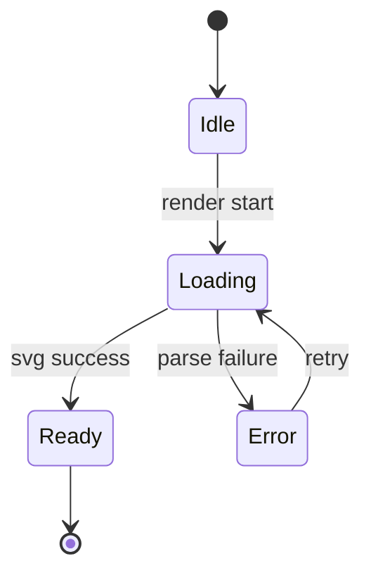
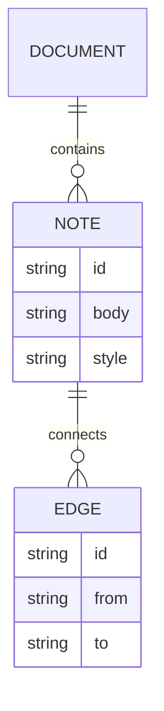
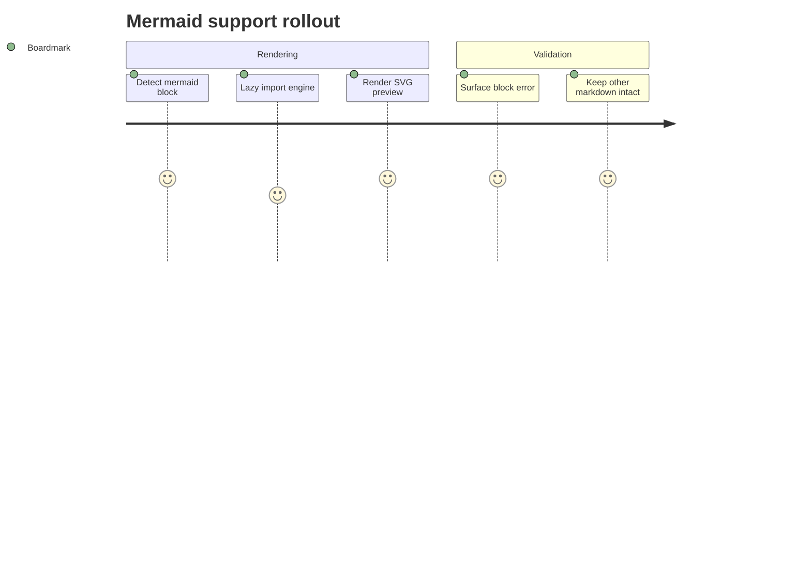

::: note { id: flowchart, at: { x: -640, y: -380, w: 420, h: 320 } }

:::

::: note { id: sequence, at: { x: -110, y: -420, w: 470, h: 360 } }

:::

::: note { id: state, at: { x: 470, y: -390, w: 420, h: 320 } }

:::

::: note { id: er, at: { x: -390, y: 90, w: 520, h: 360 } }

:::

::: note { id: journey, at: { x: 260, y: 80, w: 520, h: 360 } }

:::
