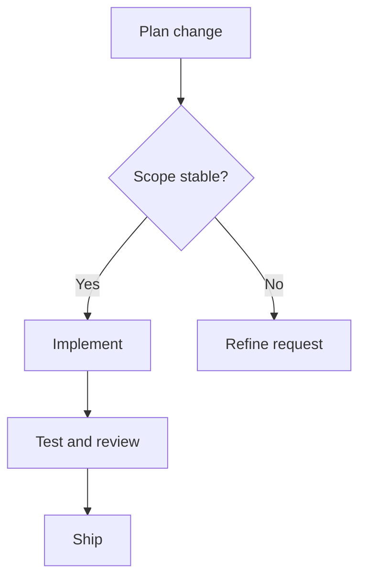
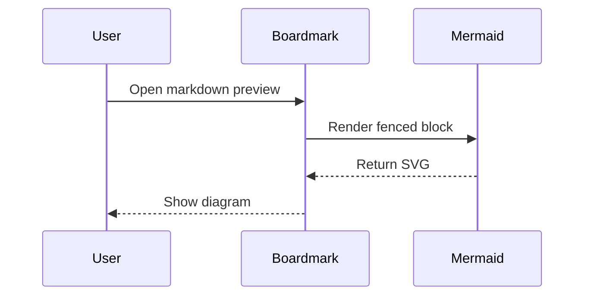
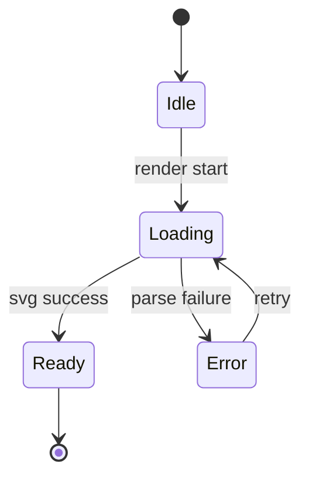
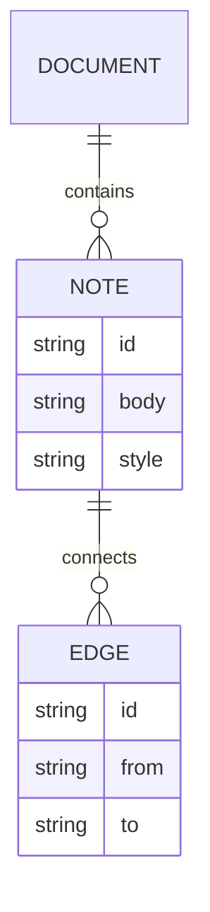
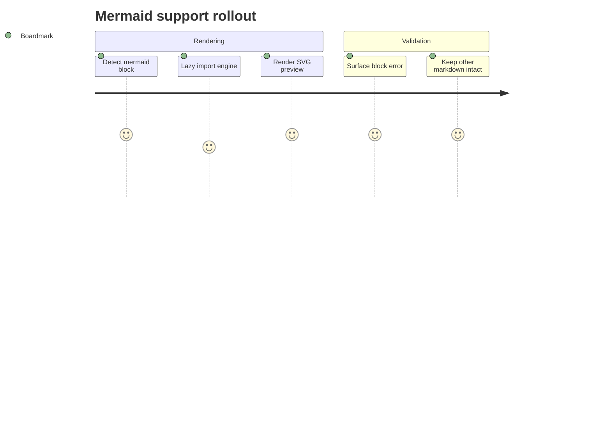

::: note { id: flowchart, at: { x: -1104, y: -740, w: 618, h: 671 } }

:::

::: note { id: sequence, at: { x: -411, y: -691, w: 813, h: 633 } }

:::

::: note { id: state, at: { x: 513, y: -702, w: 359, h: 497 } }

:::

::: note { id: er, at: { x: -561, y: 211, w: 585, h: 734 } }

:::

::: note { id: journey, at: { x: 260, y: 80, w: 1525, h: 675 } }

:::
