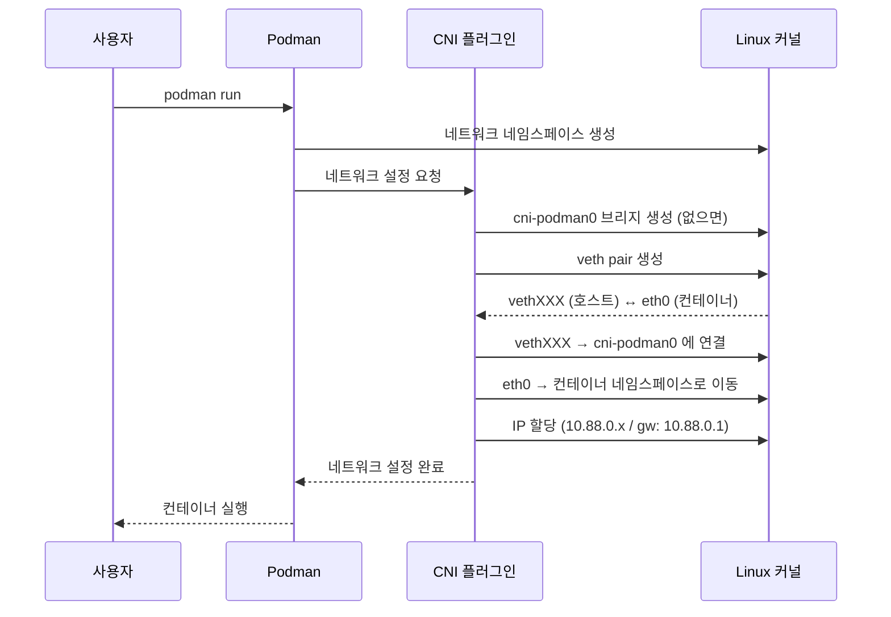
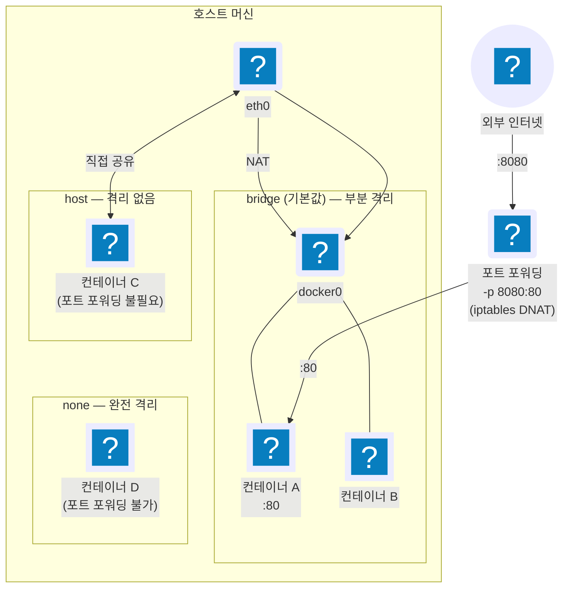
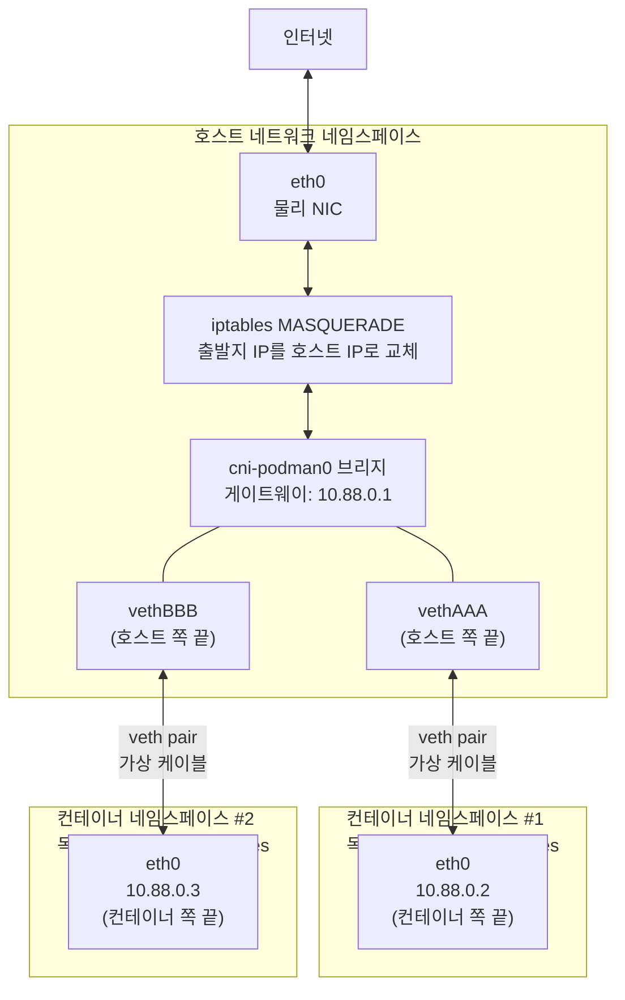
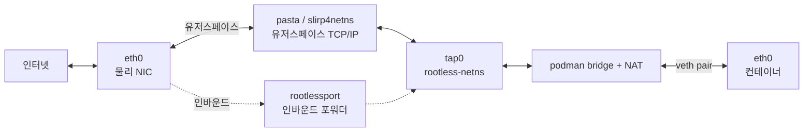

::: note { id: docker-network-overview, at: { x: 0, y: 0, w: 580 } }

## Docker 네트워크란 무엇인가?

Docker가 컨테이너 간 통신과 외부 연결을 어떻게 처리하는지 이해하려면, Docker 네트워크가 **리눅스 커널 네트워크 스택 위에서 어떻게 동작하는지**부터 알아야 한다.

---

### 핵심 개념

- **Docker network = Linux network**
  Docker network는 커널의 네트워크 스택 하위 계층에 위치하며, 그 위에 네트워크 드라이버를 생성한다. 즉, Docker의 네트워킹은 결국 리눅스 네트워크 그 자체다.

- **CNM(Container Networking Model) 아키텍처**
  Docker network는 CNM이라 불리는 인터페이스 집합 위에 구축된다. OS와 인프라에 종속되지 않기 때문에, 어떤 인프라 스택에서도 애플리케이션이 동일한 네트워크 환경을 가질 수 있다.

- **리눅스 네트워킹 빌딩 블록**
  Docker는 다음 4가지 리눅스 기본 요소를 조합해 네트워크를 구성한다:
  - **리눅스 브리지**: 컨테이너 간 L2 스위칭 역할
  - **네트워크 네임스페이스**: 컨테이너마다 독립된 네트워크 환경 격리
  - **veth pair**: 네임스페이스 간 가상 이더넷 연결
  - **iptables**: 패킷 전달 규칙, 포트 포워딩, 접근 제어 등 네트워크 정책 관리

:::

::: note { id: docker-network-architecture-viz, at: { x: 3, y: 547, w: 578 } }

```sandpack
{
  "template": "react",
  "files": {
    "App.js": "const layers = [\n  { label: \"애플리케이션\", color: \"#64748b\", bg: \"#f8fafc\", tags: [\"웹 서버\", \"DB\", \"마이크로서비스\"] },\n  { label: \"네트워크 드라이버\", color: \"#7c6fcd\", bg: \"#f5f3ff\", tags: [\"bridge\", \"host\", \"none\", \"overlay\"] },\n  { label: \"CNM\", color: \"#0e7490\", bg: \"#f0fdff\", tags: [\"Sandbox\", \"Endpoint\", \"Network\"] },\n  { label: \"Linux 빌딩 블록\", color: \"#15803d\", bg: \"#f0fdf4\", tags: [\"브리지\", \"네임스페이스\", \"veth pair\", \"iptables\"] },\n  { label: \"Linux 커널\", color: \"#b45309\", bg: \"#fffbeb\", tags: [\"eth0\", \"lo\"] }\n];\n\nexport default function App() {\n  return (\n    <div style={{ fontFamily: \"system-ui, sans-serif\", padding: \"20px 24px\" }}>\n      <div style={{ fontSize: \"10px\", color: \"#9ca3af\", letterSpacing: \"0.1em\", textTransform: \"uppercase\", marginBottom: \"16px\" }}>\n        Docker 네트워크 아키텍처\n      </div>\n      <div style={{ display: \"flex\", flexDirection: \"column\" }}>\n        {layers.map((layer, i) => (\n          <div key={layer.label}>\n            <div style={{\n              display: \"flex\",\n              alignItems: \"center\",\n              gap: \"12px\",\n              padding: \"9px 12px\",\n              borderRadius: \"6px\",\n              background: layer.bg,\n              borderLeft: `3px solid ${layer.color}`\n            }}>\n              <span style={{ fontSize: \"12px\", fontWeight: \"600\", color: layer.color, minWidth: \"130px\", flexShrink: 0 }}>\n                {layer.label}\n              </span>\n              <div style={{ display: \"flex\", gap: \"5px\", flexWrap: \"wrap\" }}>\n                {layer.tags.map(tag => (\n                  <span key={tag} style={{\n                    fontSize: \"11px\",\n                    padding: \"2px 7px\",\n                    borderRadius: \"3px\",\n                    background: \"white\",\n                    color: \"#4b5563\",\n                    border: \"1px solid #e5e7eb\",\n                    fontFamily: \"ui-monospace, monospace\"\n                  }}>\n                    {tag}\n                  </span>\n                ))}\n              </div>\n            </div>\n            {i < layers.length - 1 && (\n              <div style={{ color: \"#d1d5db\", padding: \"1px 0 1px 22px\", fontSize: \"13px\", lineHeight: \"1.4\" }}>↓</div>\n            )}\n          </div>\n        ))}\n      </div>\n      <div style={{ marginTop: \"14px\", fontSize: \"10px\", color: \"#9ca3af\", borderTop: \"1px solid #f3f4f6\", paddingTop: \"10px\" }}>\n        Docker network = Linux network\n      </div>\n    </div>\n  );\n}"
  }
}
```

:::

::: note { id: container-network-isolation, at: { x: 620, y: 0, w: 580 } }

## 격리가 기본값, 통신은 명시적으로

컨테이너는 생성 시 **네임스페이스 수준에서 격리**되며, **네트워크 수준의 통신은 같은 네트워크에 속할 때만 허용**된다.

---

### 격리의 기본 단위: 네트워크 네임스페이스

컨테이너가 생성되면 각자 독립된 네트워크 네임스페이스를 가진다. 즉, 각 컨테이너는 별도의 인터페이스, IP, 라우팅 테이블을 가지므로 호스트나 다른 컨테이너와 기본적으로 분리된다.

---

### Docker 기본 네트워크 3종

**`bridge` — 부분 격리 (기본값)**
컨테이너마다 독립된 네임스페이스를 가지지만, 같은 bridge 네트워크 안에서는 서로 통신할 수 있다. NAT를 통해 외부와도 연결된다.

**`host` — 격리 없음**
컨테이너가 호스트의 네트워크 스택을 직접 공유한다. 포트 충돌 위험이 있지만 네트워크 오버헤드가 없다.

**`none` — 완전 격리**
루프백 인터페이스(`lo`)만 존재한다. 외부 및 다른 컨테이너와 어떤 통신도 불가능하다.

---

### 핵심 정리

- 같은 Docker 네트워크에 있으면 컨테이너 간 통신 가능
- **다른 네트워크에 속한 컨테이너끼리는 기본적으로 차단**됨
- 외부 접근은 포트 포워딩(`-p`)으로 명시적으로 허용해야 함

:::

::: note { id: container-port-forwarding, at: { x: 617, y: 746, w: 580 } }

## 포트 포워딩 — 외부와 연결하는 방법

컨테이너는 기본적으로 외부에서 접근할 수 없다. `-p` 플래그로 포트를 명시적으로 열어야 한다.

```
-p 8080:80  →  호스트:8080 으로 들어온 트래픽을 컨테이너:80 으로 전달
```

Docker는 이 규칙을 **iptables DNAT**로 자동 등록한다. "포트를 연다", "포트 퍼블리싱", "포트 포워딩"은 모두 같은 동작을 가리키는 다른 표현이다.

---

### 네트워크 타입별 적용 여부

**`bridge`** — 적용 가능
NAT를 통해 외부 트래픽을 컨테이너로 전달한다.

**`host`** — 불필요
컨테이너가 이미 호스트 포트를 직접 점유하므로 별도 설정이 없어도 외부 접근이 가능하다.

**`none`** — 불가
네트워크 자체가 없으므로 포트 포워딩을 설정할 수 없다.

:::

::: note { id: cni-podman0-explanation, at: { x: 2120, y: 3, w: 640 } }

## `cni-podman0`는 왜 생기는가?

`podman run`으로 컨테이너를 시작하면 `ip a`에 `cni-podman0`라는 인터페이스가 새로 나타난다. 이것은 **Linux 브리지**다. Docker의 `docker0`와 동일한 역할을 하지만, Podman은 네트워크 설정을 **CNI(Container Network Interface)** 플러그인 체인에 위임한다.

---

### 동작 순서

**1. 네트워크 네임스페이스 생성**
Podman이 새 컨테이너를 위한 독립된 네트워크 네임스페이스를 커널에 요청한다.

**2. CNI 플러그인 호출**
Podman은 `/etc/cni/net.d/` 설정을 읽어 플러그인 체인을 순서대로 실행한다.

**3. bridge 플러그인 → `cni-podman0` 생성**
브리지가 없으면 이 시점에 `cni-podman0`가 생성된다. 이미 있으면 재사용한다.

**4. veth pair 생성**
가상 이더넷 케이블의 양 끝:

- `vethXXXXXX` → 호스트에 남아 `cni-podman0`에 연결
- `eth0` → 컨테이너 네임스페이스로 이동

**5. IPAM 플러그인 → IP 할당**
`10.88.0.x`를 컨테이너에 부여하고, 게이트웨이를 `10.88.0.1`(= `cni-podman0`)로 설정한다.

---

### 핵심 정리

| 항목             | 값                                          |
| ---------------- | ------------------------------------------- |
| 브리지 IP        | `10.88.0.1/16` (모든 컨테이너의 게이트웨이) |
| 컨테이너 IP 범위 | `10.88.0.2` ~ `10.88.255.254`               |
| 생성 시점        | 첫 컨테이너 시작 시                         |
| 제거 시점        | 마지막 컨테이너 종료 후                     |
| 설정 파일        | `/etc/cni/net.d/87-podman.conflist`         |

:::

::: note { id: cni-podman0-sequence, at: { x: 2122, y: 883, w: 627, h: 559 } }

### `podman run` 시 네트워크 설정 흐름



:::

::: note { id: container-network-isolation-diagram, at: { x: 1250, y: 3, w: 819, h: 875 } }

### 네트워크 타입별 연결 구조



:::

::: note { id: netns-kernel-deepdive, at: { x: 2820, y: 3, w: 700 } }

## 네트워크 네임스페이스 — 전체 그림부터

**한 줄 요약:** 커널이 프로세스에게 "자신만의 네트워크 세계"를 부여하는 메커니즘이다.

---

### 왜 필요한가?

격리가 없다면, 같은 호스트의 모든 프로세스는 하나의 네트워크 스택을 공유한다. 컨테이너 A가 `:80`을 열면, 컨테이너 B는 `:80`을 쓸 수 없다. 라우팅 테이블과 방화벽 규칙도 뒤섞인다. 컨테이너가 진정한 독립성을 가지려면 **네트워크 스택 자체를 분리**해야 한다.

네트워크 네임스페이스는 이 문제를 커널 수준에서 해결한다. 각 네임스페이스는 완전히 독립된 네트워크 스택을 갖는다. 프로세스는 자신이 속한 네임스페이스의 스택만 보고 사용할 수 있다.

---

### 무엇이 격리되는가?

| 격리 대상           | 결과                                                       |
| ------------------- | ---------------------------------------------------------- |
| 네트워크 인터페이스 | `ip link`로 보이는 인터페이스 목록이 네임스페이스마다 별개 |
| 라우팅 테이블       | `ip route`의 경로가 네임스페이스마다 독립                  |
| 포트 공간           | 컨테이너 A와 B가 동시에 `:80`을 사용할 수 있는 이유        |
| iptables 규칙       | 방화벽·NAT 규칙이 네임스페이스 단위로 분리                 |
| `/proc/net/`        | 프로세스는 자신의 네임스페이스에 해당하는 정보만 읽음      |

---

### 격리의 한계: 물리 NIC는 하나의 네임스페이스에만

물리 네트워크 카드(`eth0`)는 특정 하나의 네임스페이스에 귀속된다. 기본적으로 호스트 네임스페이스가 물리 NIC를 소유한다. 컨테이너는 물리 NIC를 직접 볼 수 없다. 그래서 컨테이너가 외부와 통신하려면 반드시 호스트 네임스페이스를 경유해야 하며, 이 경유 통로가 **veth pair**다.

---

### 생애주기: 컨테이너와 함께 태어나고 사라진다

컨테이너 런타임이 컨테이너를 시작할 때, 커널에 새 네트워크 네임스페이스 생성을 요청한다. 이 순간 새 네임스페이스에는 `lo`(루프백) 인터페이스만 존재하며, 심지어 **down 상태**다. 태어나자마자 완전히 고립된 상태다.

네임스페이스는 그것을 참조하는 대상이 하나라도 있으면 살아있다:

- 해당 네임스페이스에 속한 프로세스
- `/proc/<pid>/ns/net` 파일 디스크립터를 열어둔 프로세스
- `ip netns add`로 명시적으로 유지된 바인딩

**컨테이너 프로세스가 종료되면** 참조가 사라지고, 커널이 네임스페이스와 그 안의 모든 인터페이스를 자동으로 정리한다. 네임스페이스를 `ip netns add`로 명시적으로 붙잡아두면, 프로세스가 없어도 네임스페이스는 유지된다. `ip netns exec`가 이 특성을 활용한다.

:::

::: note { id: netns-veth-internals, at: { x: 2819, y: 1068, w: 700 } }

## veth pair — 고립된 세계를 연결하는 통로

**한 줄 요약:** 서로 다른 네트워크 네임스페이스를 연결하는 가상 이더넷 케이블이다. 한쪽에 넣으면 반대쪽에서 나온다.

---

### 왜 필요한가?

새로 생성된 네임스페이스는 `lo`만 있는 완전 고립 상태다. 외부와 통신하려면 호스트 네임스페이스와 연결하는 통로가 있어야 한다. 그런데 일반적인 네트워크 인터페이스는 하나의 네임스페이스에만 속할 수 있다. **veth pair는 이 제약을 우회하기 위해 설계된 특수한 인터페이스 쌍이다.**

---

### 동작 원리: 한쪽에 넣으면 반대쪽에서 나온다

veth pair는 두 끝을 가진 가상 케이블이다.

- **호스트 끝 (`vethAAA`)** — 호스트 네임스페이스에 위치
- **컨테이너 끝 (`eth0`)** — 컨테이너 네임스페이스로 이동

생성 시점에는 두 끝 모두 호스트 네임스페이스에 있다. 그 후 컨테이너 끝을 컨테이너 네임스페이스로 옮기면, 두 끝이 서로 다른 네트워크 세계에 속하게 된다. 하지만 커널 내부에서 이 둘은 여전히 하나의 쌍으로 묶여 있다. 한쪽에서 패킷을 전송하면, 실제 네트워크 장비나 물리적 전송 없이 커널 메모리 안에서 직접 반대편으로 전달된다. **이것이 컨테이너가 자신만의 `eth0`을 갖는 동시에 외부와 통신할 수 있는 이유다.**

---

### 컨테이너가 여러 개라면: 브리지가 필요해지는 이유

veth pair 하나는 1:1 연결이다. 컨테이너가 두 개라면 veth pair도 두 쌍이 된다. 이때 두 쌍의 호스트 쪽 끝을 **Linux 브리지**(`docker0`, `cni-podman0`)에 연결한다.

브리지는 L2 스위치처럼 동작한다. 프레임이 들어오면 목적지 MAC 주소를 보고, 해당 MAC을 가진 veth 끝으로 전달한다. 결과적으로:

```
컨테이너 A → vethAAA → 브리지 → vethBBB → 컨테이너 B
```

브리지가 없다면 컨테이너 간 통신을 위해 각 쌍을 수동으로 연결해야 하며, 컨테이너가 늘어날수록 연결이 기하급수적으로 복잡해진다. 브리지는 이 문제를 중앙화로 해결한다.

---

### 외부 인터넷으로 나가는 경로

컨테이너에서 인터넷으로 나가는 패킷은 다음 경로를 따른다:

**컨테이너 `eth0`** → 게이트웨이(`cni-podman0`, `10.88.0.1`)로 전송
→ **브리지**를 통해 호스트 네트워크 스택에 도달
→ **iptables MASQUERADE** 가 출발지 IP를 컨테이너 사설 IP(`10.88.0.x`)에서 호스트 IP로 교체 (SNAT)
→ **물리 NIC**(`eth0`)를 통해 외부로 전송

외부에서는 컨테이너의 사설 IP가 보이지 않는다. 호스트 IP만 보인다. 컨테이너가 공인 IP 없이 인터넷에 접근할 수 있는 것은 이 MASQUERADE 덕분이다.

:::

::: note { id: netns-arch-diagram, at: { x: 3560, y: 3, w: 760 } }

### 전체 구조: 네임스페이스 + veth pair + 브리지



:::

::: note { id: rootful-networking, at: { x: 4400, y: 3, w: 640 } }

## rootful — 커널에 직접 손대는 방식

**한 줄 요약:** root 권한으로 컨테이너를 실행할 때의 네트워크 구성. 커널 네트워크 스택에 직접 접근해 브리지와 veth pair를 호스트 네임스페이스에 만든다.

---

### 무엇인가?

rootful 모드는 Podman(또는 Docker)이 **root 권한**으로 실행되는 경우다. root이기 때문에 커널 네트워크 스택에 직접 개입할 수 있다. 브리지(`cni-podman0`, `docker0`)를 **호스트 네임스페이스에** 직접 만들고, iptables 규칙을 추가하고, veth pair의 호스트 끝을 브리지에 붙이는 모든 작업을 커널 수준에서 수행한다. 추가적인 추상 레이어가 없으므로 패킷이 커널 안에서만 이동한다.

---

### 왜 root가 필요한가?

Linux에서 네트워크 인터페이스 생성, iptables 조작, 네트워크 네임스페이스 간 인터페이스 이전은 모두 **커널 특권 연산**이다. 일반 사용자는 호스트 네임스페이스를 직접 건드릴 수 없기 때문에, 이 모든 작업을 수행하려면 root 권한이 필요하다.

---

### 동작 흐름

**컨테이너 시작 시:**
컨테이너 런타임이 CNI/Netavark 플러그인을 호출 → 호스트 네임스페이스에 브리지 생성 → veth pair 생성 후 컨테이너 끝을 컨테이너 네임스페이스로 이전 → iptables에 MASQUERADE 규칙 등록

**아웃바운드 (컨테이너 → 인터넷):**
컨테이너 eth0 → veth pair → 브리지 → iptables MASQUERADE(SNAT) → 물리 NIC → 인터넷

**인바운드 (`-p 8080:80` 시):**
인터넷 → 물리 NIC → iptables DNAT(:8080 → :80) → 브리지 → veth pair → 컨테이너

---

### 트레이드오프

**장점**

- 유저스페이스 경유 없음 — 커널 내 직접 패킷 전달로 성능 최적
- overlay, macvlan 등 고급 네트워크 드라이버 제약 없음
- 구조가 단순하고 디버깅이 쉬움

**단점**

- root 실행 = 컨테이너 탈출 시 호스트 전체가 위험
- 멀티테넌트·공유 서버 환경에서 보안상 부적합
- 최소 권한 원칙에 위배

:::

::: note { id: rootless-networking, at: { x: 5080, y: 3, w: 640 } }

## rootless — 유저스페이스에서 네트워크를 흉내내는 방식

**한 줄 요약:** root 없이 컨테이너를 실행하기 위해, 커널 대신 유저스페이스 TCP/IP 스택으로 네트워크를 구현하는 방식.

---

### 무엇인가?

rootless 모드는 **일반 사용자(non-root)** 로 Podman을 실행하는 경우다. 일반 사용자는 호스트 네임스페이스에 인터페이스를 만들거나 iptables 규칙을 추가할 수 없다. Podman은 이 제약을 우회하기 위해 두 가지 전략을 사용한다:

1. **`rootless-netns`** 생성 — 사용자 소유의 독립 네트워크 네임스페이스. 이 안에서는 브리지·veth pair를 자유롭게 구성할 수 있다.
2. **`pasta` / `slirp4netns`** — 호스트 네트워크와 `rootless-netns`를 연결하는 유저스페이스 TCP/IP 스택. TAP 디바이스(`tap0`)를 통해 두 세계를 이어준다.

---

### 왜 필요한가?

root로 실행되는 모든 프로세스는 잠재적 위협이다. 컨테이너 런타임에 취약점이 생기거나 컨테이너가 탈출하면, root 권한으로 호스트 전체에 접근할 수 있다. rootless는 이 위험을 근본적으로 차단한다. **최악의 탈출 시나리오에서도 피해 범위가 해당 사용자의 권한으로 제한된다.** CI/CD 파이프라인, 공유 서버, 멀티테넌트 환경에서 특히 중요하다.

---

### 동작 흐름

**컨테이너 시작 시:**
`rootless-netns` 생성 → pasta/slirp4netns가 호스트 ↔ rootless-netns 연결(tap0 경유) → rootless-netns 안에서 브리지·veth pair 구성

**아웃바운드 (컨테이너 → 인터넷):**
컨테이너 eth0 → veth pair → 브리지 → NAT → tap0 → **pasta/slirp4netns(유저스페이스)** → 호스트 eth0 → 인터넷

**인바운드 (`-p 8080:80` 시):**
인터넷 → 호스트 eth0 → **rootlessport(유저스페이스 포트 포워더)** → tap0 → 브리지 → veth pair → 컨테이너

---

### 트레이드오프

**장점**

- root 불필요 — 최소 권한 원칙 준수
- 컨테이너 탈출해도 일반 사용자 권한으로 피해 제한
- 멀티테넌트·공유 환경에서 안전

**단점**

- 유저스페이스 경유로 rootful 대비 네트워크 성능 오버헤드
- overlay 네트워크 등 일부 고급 기능 제한
- 구조가 복잡해 문제 추적이 어려움

:::

::: note { id: rootful-and-rootless-diagram, at: { x: 4370, y: 1184, w: 1420, h: 501 } }

## rootful


## rootless



:::
