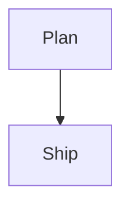

Use this skill for user-facing Boardmark authoring help.

Keep answers focused on pasteable Boardmark syntax.

Boardmark is a canvas-style document format that places markdown notes and connections on a 2D board.

## Boardmark Shape

A Boardmark canvas document is plain text with:
- YAML frontmatter
- `note` blocks
- optional `edge` blocks

Minimal shape:

````md
---
type: canvas
version: 2
defaultStyle: boardmark.editorial.soft
viewport:
  x: 0
  y: 0
  zoom: 1
---

::: note { id: intro, at: { x: 0, y: 0, w: 420, h: 280 } }

Hello Boardmark

:::
````

## Object Header Syntax

Boardmark objects start with a header line like this:

```md
::: object-type { key: value, key2: value2 }
```

Common object types:
- `note`
- `edge`

Common header fields:
- `id`
- `at` for note position and size
- `from` for edge source
- `to` for edge target

## Notes

Put normal markdown inside a `note` block.

````md
::: note { id: idea, at: { x: 120, y: 80, w: 520, h: 320 } }

## Idea

- First point
- Second point

:::
````

## Edges

Use `edge` blocks to connect notes.

````md
::: edge { id: a-b, from: note-a, to: note-b }
Review flow
:::
````

## Mermaid In Boardmark

Mermaid is written inside a note body as a fenced block with language `mermaid`.

````md
::: note { id: flow, at: { x: -300, y: -120, w: 520, h: 360 } }

# Flow



:::
````

Supported Mermaid families to mention when useful:
- `flowchart`
- `sequenceDiagram`
- `stateDiagram-v2`
- `classDiagram`
- `erDiagram`
- `journey`
- `gantt`
- `pie`
- `gitGraph`

## Sandpack In Boardmark

Sandpack is written inside a note body as a fenced block with language `sandpack`.

The block body must be JSON.

````md
::: note { id: react-demo, at: { x: -120, y: 80, w: 700, h: 500 } }

# Live Demo

```sandpack
{
  "template": "react",
  "files": {
    "App.js": "export default function App() { return <button>Hello</button>; }"
  }
}
```

:::
````

Useful Sandpack fields:
- `template`
- `files`
- `dependencies`
- `options`

## Guidance

When helping:
- prefer complete `note` blocks over isolated inner snippets
- keep Mermaid and Sandpack blocks inside note bodies
- preserve plain markdown as the source of truth
- keep explanations short unless the user asks for more
