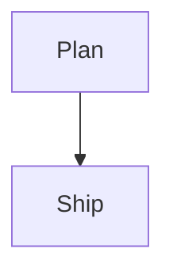

Use this skill for user-facing Boardmark authoring help.

Keep answers focused on pasteable Boardmark syntax.

Boardmark is a canvas-style document format that places markdown notes and connections on a 2D board.

## Currently Supported Syntax

Useful Boardmark syntax to mention:
- document frontmatter
- `note` objects
- `edge` objects
- `image` objects
- normal markdown inside note bodies
- markdown images with ``
- fenced `mermaid` blocks inside notes
- fenced `sandpack` blocks inside notes

## Boardmark Shape

A Boardmark canvas document is plain text with:
- YAML frontmatter
- `note` blocks
- optional `edge` blocks

Minimal shape:

````md
---
type: canvas
version: 2
defaultStyle: boardmark.editorial.soft
viewport:
  x: 0
  y: 0
  zoom: 1
---

::: note {"id":"intro","at":{"x":0,"y":0,"w":420,"h":280}}

Hello Boardmark

:::
````

## Object Header Syntax

Boardmark objects start with a header line like this:

```md
::: object-type {"key":"value","key2":"value2"}
```

Canonical write format uses JSON object syntax in the header.

Legacy unquoted-key headers may still parse, but when authoring new content prefer JSON keys and JSON string values.

Common object types:
- `note`
- `edge`

Common header fields:
- `id`
- `at` for note position and size
- `from` for edge source
- `to` for edge target

## Notes

Put normal markdown inside a `note` block.

````md
::: note {"id":"idea","at":{"x":120,"y":80,"w":520,"h":320}}

## Idea

- First point
- Second point

:::
````

## Edges

Use `edge` blocks to connect notes.

````md
::: edge {"id":"a-b","from":"note-a","to":"note-b"}
Review flow
:::
````

## Mermaid In Boardmark

Mermaid is written inside a note body as a fenced block with language `mermaid`.

````md
::: note {"id":"flow","at":{"x":-300,"y":-120,"w":520,"h":360}}

# Flow



:::
````

Supported Mermaid families to mention when useful:
- `flowchart`
- `sequenceDiagram`
- `stateDiagram-v2`
- `classDiagram`
- `erDiagram`
- `journey`
- `gantt`
- `pie`
- `gitGraph`

## Sandpack In Boardmark

Sandpack is written inside a note body as a fenced block with language `sandpack`.

Canonical sandpack syntax uses:
- an outer `sandpack` fenced block with 4 backticks
- an optional JSON options object
- one or more inner file fenced blocks with 3 backticks

Prefer this format for new content.

````md
::: note {"id":"react-demo","at":{"x":-120,"y":80,"w":700,"h":500}}

# Live Demo

````sandpack
{
  "template": "react",
  "dependencies": {
    "lucide-react": "^0.511.0"
  }
}

```App.js
import { Sparkles } from "lucide-react";

export default function App() {
  return (
    <button style={{ display: "inline-flex", gap: 8, alignItems: "center" }}>
      <Sparkles size={16} />
      Hello
    </button>
  );
}
```
````

:::
````

Useful Sandpack fields:
- `template`
- `dependencies`
- `layout`
- `readOnly`

If `layout` is omitted, preview is the default.

When authoring UI demos in sandpack:
- there is usually no need to set a minimum height
- let the content determine its own height unless a full-viewport interaction is truly required
- note height already constrains the visible preview area, so extra forced minimum height is usually unnecessary

## Guidance

When helping:
- prefer complete `note` blocks over isolated inner snippets
- keep Mermaid and Sandpack blocks inside note bodies
- prefer JSON object headers for `note`, `edge`, and other object blocks
- prefer nested fenced sandpack syntax over legacy JSON-body sandpack blocks
- preserve plain markdown as the source of truth
- keep explanations short unless the user asks for more
