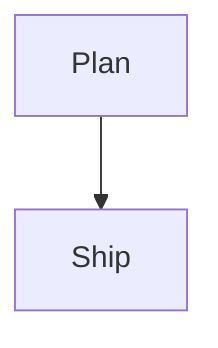

# Boardmark

Use this skill for user-facing Boardmark authoring and AI-assisted document operations.

Keep answers practical and pasteable. Prefer the current CLI workflow for document changes. Treat the database-stored Markdown as the document source of truth; `.md` files are import/export artifacts and are not automatically synchronized with the server.

## Current document model

Boardmark is a Markdown-backed canvas. A document contains YAML frontmatter and directive blocks for canvas objects.

- The server stores the original Markdown string in SQLite.
- The web GUI and AI CLI use the same API and revision/conflict rules.
- The AST, search model, and rendered canvas are derived from the Markdown when it is read.
- `.md` files are used for import and export; editing an external file does not update the server automatically.
- Desktop and VS Code file mode are separate compatibility modes and do not write server documents.

## Choose the right workflow

Use direct authoring when the user wants a new Boardmark document or a pasteable note/object block.

Use the CLI when the user wants to inspect or change a document already stored by the Boardmark API:

1. Read the document or list documents to obtain real IDs and the current `revision`.
2. Prepare a proposal from that exact revision.
3. Submit the proposal with the same `baseRevision`; never silently replace it with a newer number.
4. If the server reports a conflict, reread the affected object and review the proposal before retrying.

For normal note-body editing, prefer `checkout → edit the note file → diff → apply`. Use `command` for geometry, object creation, grouping, images, edges, locking, arranging, and other structured edits.

## Connection

Assume the `boardmark` CLI is already installed and available on `PATH`. Do not include installation or repository-local build steps in normal usage.

The default local API connection is:

- Web: `http://127.0.0.1:5173`
- API: `http://127.0.0.1:4317/api`
- Data directory: `.boardmark`
- Access token: `.boardmark/access-token`
- SQLite database: `.boardmark/boardmark.sqlite`

CLI connection options can be supplied as flags or environment variables:

- `--api` / `BOARDMARK_API_URL`
- `--token-file` / `BOARDMARK_TOKEN_FILE`
- `BOARDMARK_TOKEN`
- `BOARDMARK_SESSION`
- `--journal-dir` for the request journal

The CLI defaults to `.boardmark/access-token`, creates a per-process session when `BOARDMARK_SESSION` is not set, and defaults to `.boardmark/requests` for journaled edits. Never put the access token in Markdown, command output, logs, or the repository.

## CLI

Use the installed executable directly. Add `--json` for automation and machine-readable output:

```powershell
boardmark COMMAND --json
```

### Read and manage documents

```powershell
boardmark document list --json
boardmark document read DOCUMENT_ID --json
boardmark document create --name "New board" --json
boardmark document import --input board.md --json
boardmark document export DOCUMENT_ID --output backup.boardmark.json --json
boardmark document rename DOCUMENT_ID --name "Renamed" --base-revision REVISION --json
```

`document read` without `--json` prints the raw Markdown only. With `--json`, its value includes the document ID, name, revision, and Markdown.

### Read and edit a node

```powershell
boardmark node read DOCUMENT_ID NODE_ID --json
boardmark node update DOCUMENT_ID NODE_ID `
  --body-file note.md --base-revision REVISION --request-id REQUEST_ID --json
```

`--body-file -` reads UTF-8 Markdown from stdin. The `revision` returned by the read is the revision to submit as `--base-revision`.

### Use a structured command

```powershell
boardmark command DOCUMENT_ID `
  --input command.json --base-revision REVISION --request-id REQUEST_ID --json
```

The command JSON must contain a supported `kind` and only the fields required by that intent. Validate the object shape at the API boundary; do not invent a parallel command format.

## Safe note editing: checkout, diff, apply

Use this workflow when an existing file-editing tool should modify a note body.

```powershell
boardmark checkout DOCUMENT_ID `
  --node NODE_ID --output note.md --json

# Edit note.md. Keep its contents as the note body only.

boardmark diff DOCUMENT_ID `
  --node NODE_ID --input note.md --json

boardmark apply DOCUMENT_ID `
  --node NODE_ID --input note.md --json
```

Rules:

- `checkout` targets an existing `note` object, not an arbitrary object.
- The checkout file contains only the note body. Do not add the object header, ID, coordinates, or frontmatter to it.
- Checkout creates `<output>.boardmark-checkout.json` beside the work file. Do not edit this metadata.
- The metadata records the API URL, document ID, node ID, checkout ID, original body, and base revision; it does not record the token.
- `diff` compares the work file with the checkout-time body, not with the current server body.
- `apply` does not write when the work file is unchanged.
- Existing work files and checkout metadata are never overwritten.
- After a successful apply, start the next proposal with a new checkout path. Do not manually advance the old base revision.
- `checkout`, `diff`, and `apply` manage their own request ID and base revision. Do not pass `--base-revision` or `--request-id` to them.

## Revisions, leases, conflicts, and retries

The CLI acquires short-lived object edit leases internally for mutating commands. A normal structured edit is planned, acquires the affected objects, submits the edit against the requested base revision, and releases the lease.

- `--wait-ms 5000` waits up to five seconds for a conflicting lease. The maximum is 60,000 ms.
- Waiting does not update the proposal's base revision.
- Ctrl+C cancels the wait.
- A change to an unrelated object may be applied, but a change to the target or related structure may return `stale-base`.
- Do not resolve `stale-base` by changing only the number. Read the latest target, reconsider the proposal, and submit a new request ID.
- If a response is unclear because of a connection failure, preserve the work file or journal and retry the exact same request before creating a new proposal.
- The request journal is written before transmission. Its default directory is `.boardmark/requests`; use `--journal-dir` to change it.
- Reusing a request ID with different content is an error (`request-reused`).

Common error meanings:

- `locked`: another session currently owns an affected object; retry may be possible after waiting.
- `lease-expired`: preserve the draft and retry from the original proposal base.
- `stale-base`: the proposal was based on an old document state; reread and review.
- `request-reused`: distinguish an exact retry from a new proposal.
- `unauthorized`: check the token and API URL.
- `connection-failed` or `internal-error`: the commit may be unknown; retry the same request ID and journal.
- `invalid-request`, `invalid-document`, or `not-found`: correct the command, IDs, or document format.

CLI exit codes:

- `0` success
- `2` invalid request, invalid document, or not found
- `3` conflict, lock, expired lease, or reused request
- `4` authentication failure
- `5` connection or server failure

JSON output is wrapped as:

```json
{"ok":true,"value":{}}
```

Errors are wrapped as:

```json
{"ok":false,"error":{"code":"stale-base","message":"...","retryable":false}}
```

## Direct API contract

Prefer the CLI for AI workflows. If direct HTTP access is required, use the API base URL with these headers:

```http
Authorization: Bearer ACCESS_TOKEN
X-Boardmark-Session: SESSION_ID
Content-Type: application/json
```

The session ID must be a 16–128 character alphanumeric, `_`, or `-` value. Direct mutation follows this shape:

```text
read → plan → acquire → edit → release
```

Important routes include:

- `GET /api/documents`
- `GET /api/documents/:id`
- `GET /api/documents/:id/bundle`
- `GET /api/documents/:id/changes`
- `GET /api/documents/:id/presence`
- `GET /api/documents/:id/attachments`
- `POST /api/documents`
- `POST /api/documents/:id/plan`
- `POST /api/documents/:id/acquire`
- `POST /api/documents/:id/renew`
- `POST /api/documents/:id/edit`
- `POST /api/documents/:id/release`
- `POST /api/documents/:id/rename`
- `POST /api/documents/:id/replace`
- `POST /api/documents/:id/delete`
- `POST /api/documents/:id/revert`
- `GET /api/assets/:id`
- `POST /api/assets`

Successful and failed responses use the same `{ ok, value }` / `{ ok, error }` envelope as the CLI. Never replace a caller-provided `baseRevision` with a fresh read inside a mutation helper.

## Boardmark document syntax

### Frontmatter

The minimum valid document is:

````md
---
type: canvas
version: 2
---
````

Supported optional frontmatter fields include:

```yaml
style:
  - boardmark.editorial.soft
components:
  - note
preset: default
defaultStyle: boardmark.editorial.soft
assetPolicy: document-adjacent
viewport:
  x: 0
  y: 0
  zoom: 1
```

`type: canvas` and a numeric `version` are required. Keep the frontmatter as YAML. `viewport` is a document viewport default; the current browser camera may be stored separately by the app.

### Directive headers

Use JSON object syntax for new content:

```md
::: note {"id":"intro","at":{"x":0,"y":0,"w":420,"h":280}}
```

Legacy unquoted-key headers can still parse in supported cases, but new authoring should use quoted JSON keys and JSON string values.

Common metadata:

- `id`: unique object ID
- `at`: `{ x, y, w?, h? }`
- `z`: stacking order
- `locked`: persistent object lock
- `style`: optional `bg.color` and `stroke.color`

Unknown metadata is preserved in the Markdown source but is not interpreted by the parser. Invalid known metadata should be fixed rather than hidden with a fallback.

### Notes

Put ordinary Markdown, Mermaid, or Sandpack inside a note body:

````md
::: note {"id":"idea","at":{"x":120,"y":80,"w":520,"h":320}}

## Idea

- First point
- Second point

:::
````

### Shape/component nodes

Non-image node directives use their directive name as the component name and may contain a Markdown body:

````md
::: card {"id":"card-1","at":{"x":80,"y":80,"w":300,"h":180},"style":{"bg":{"color":"#ffffff"}}}

Card content

:::
````

Use a known renderer/component when one is required. Do not assume every arbitrary component name has a built-in visual renderer.

### Images

Image objects carry their source and accessibility metadata in the header and must not have a body:

```md
::: image {"id":"hero","src":"./assets/hero.png","alt":"Product preview","title":"Hero image","lockAspectRatio":true,"at":{"x":0,"y":0,"w":640,"h":360}}
:::
```

`src`, `alt`, and `at` are required. `title` and `lockAspectRatio` are optional; aspect-ratio locking defaults to true for parsed image objects.

### Edges

Edges connect object IDs with `from` and `to`:

````md
::: edge {"id":"intro-idea","from":"intro","to":"idea"}
Review flow
:::
````

An edge may have `z`, `locked`, `style`, and a Markdown label body.

### Groups

Groups use a `yaml members` fenced block in their body. Membership is a list of node IDs, not a header attribute:

````md
::: group {"id":"ideation-group","z":40}

```yaml members
nodes:
  - intro
  - idea
```

:::
````

Groups may also have `locked` and `z`. Group membership is structural, so changes to a group can affect conflict scope.

## Mermaid in Boardmark

Mermaid is a fenced `mermaid` block inside a note body:

````md
::: note {"id":"flow","at":{"x":-300,"y":-120,"w":520,"h":360}}


```mermaid
flowchart TD
    Start[Plan] --> Finish[Ship]
```

:::
````

Use Mermaid syntax supported by the installed renderer. Repository examples cover flowcharts, sequence diagrams, state diagrams, class diagrams, ER diagrams, journeys, Gantt charts, pie charts, git graphs, mindmaps, timelines, XY charts, and quadrant charts. Keep the Mermaid source inside the note body.

## Sandpack in Boardmark

The canonical authoring format is an outer `sandpack` fence with inner file fences. Put it inside a note body:

`````md
::: note {"id":"react-demo","at":{"x":-120,"y":80,"w":700,"h":500}}

````sandpack
{
  "template": "react",
  "dependencies": {
    "lucide-react": "^0.511.0"
  },
  "layout": "preview",
  "readOnly": false
}

```App.js
import { Sparkles } from "lucide-react";

export default function App() {
  return <button><Sparkles size={16} />Hello</button>;
}
```
````

:::
`````

Supported options:

- `template`: recommended Sandpack template; defaults to `react`
- `dependencies`: package/version map
- `layout`: `preview` or `code`; omitted means `preview`
- `readOnly`: editor lock; defaults to false

An options object may also appear inline after the opening fence:

`````md
````sandpack { template: react, layout: code }

```App.js
export default function App() { return <div>Hello</div>; }
```
````
`````

Inner file fences use the first token after the fence as the path, for example `App.js`, `src/components/Button.tsx`, or `styles.css`. The older single JSON-body Sandpack format remains readable for compatibility, but new content should use nested fences.

Avoid forcing unnecessary minimum heights in Sandpack demos. The note geometry already constrains the visible preview area.

## Import, export, and attachments

```powershell
boardmark document import --input board.md --json
boardmark document export DOCUMENT_ID --output backup.boardmark.json --json
boardmark document import --input backup.boardmark.json --name "Restored board" --json
```

Rules:

- Import creates a new document ID and leaves the source file untouched.
- A Markdown import collects local image references from image objects and ordinary `` images when they are inside the document directory.
- HTTP(S) resources remain external and are not included in the bundle.
- `asset:` references require a `.boardmark.json` bundle for restoration.
- A bundle has format `boardmark-bundle-v1` and contains the Markdown, attachment paths, MIME types, and base64 bytes.
- Exporting Markdown with attachments writes a companion `<file>.boardmark.json` sidecar.
- Existing output files are not overwritten.
- Do not rely on a copy of a live SQLite file as a backup. Stop the API and copy the complete `.boardmark` data directory.

## What not to assume

- There is currently no separate `boardmark validate` command in the CLI.
- Do not edit the SQLite database directly.
- Do not expect external Markdown edits to synchronize with a server document.
- Do not put frontmatter or object headers into a note checkout file.
- Do not turn a stale revision into a current revision by changing only the number.
- Do not present draft-only syntax such as the proposed shared `files` object or `widget` object as a settled current feature unless the implementation and user-facing contract have been updated.

When helping a user, prefer a complete object block or a complete CLI command over an isolated fragment. Keep explanations short, preserve the user's Markdown as the source of truth for the current operation, and make failure recovery explicit.
